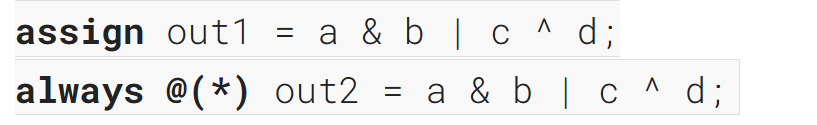
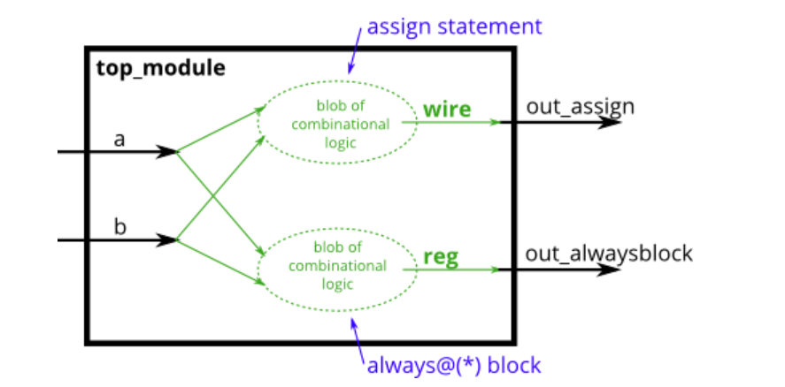
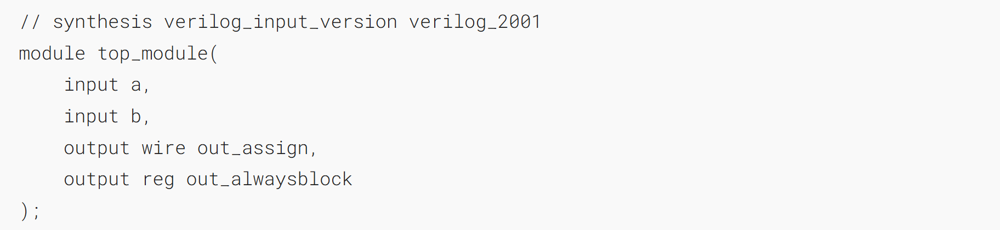
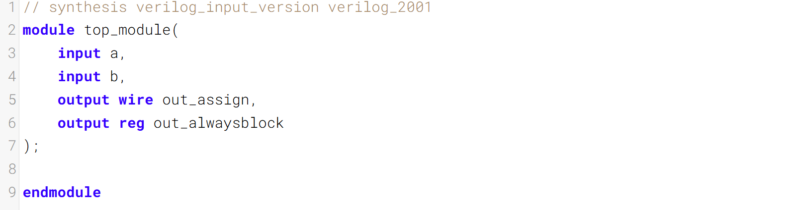

Since digital circuits are composed of logic gates connected with wires, any circuit can be expressed as some combination of modules and assign statements. However, sometimes this is not the most convenient way to describe the circuit.  _Procedures_   (of which always blocks are one example) provide an alternative syntax for describing circuits.
由于数字电路由通过导线连接的逻辑门构成，任何电路都可表示为模块与赋值语句的某种组合。不过，有时这并非描述电路最便捷的方式。过程（其中 always 块是其一种形式）提供了另一种用于描述电路的语法。

For synthesizing hardware, two types of always blocks are relevant:
在硬件综合中，有两种类型的 always 块适用：


Combinational always blocks are equivalent to assign statements, thus there is always a way to express a combinational circuit both ways. The choice between which to use is mainly an issue of which syntax is more convenient. **The syntax for code inside a procedural block is different from code that is outside.** Procedural blocks have a richer set of statements (e.g., if-then, case), cannot contain continuous assignments*, but also introduces many new non-intuitive ways of making errors. (*_Procedural continuous assignments_ do exist, but are somewhat different from _continuous assignments_, and are not synthesizable.)
组合型always块与assign语句等效，因此总有两种方式来表达组合电路。选择使用哪种方式主要取决于哪种语法更便捷。过程块内部的代码语法与块外部的代码语法不同。过程块包含更丰富的语句集（例如if-then、case语句），不能包含连续赋值*，但也会产生许多新的、不符合直觉的错误写法。（*过程型连续赋值确实存在，但与普通连续赋值存在一定差异，且不可综合。）

For example, the assign and combinational always block describe the same circuit. Both create the same blob of combinational logic. Both will recompute the output whenever any of the inputs (right side) changes value.
例如，assign 语句和组合型 always 块描述的是同一个电路。两者都会生成相同的组合逻辑模块，且只要任意输入（等号右侧）的值发生变化，就会重新计算输出



For combinational always blocks, always use a sensitivity list of (*). Explicitly listing out the signals is error-prone (if you miss one), and is ignored for hardware synthesis. If you explicitly specify the sensitivity list and miss a signal, the synthesized hardware will still behave as though (*) was specified, but the simulation will not and not match the hardware's behaviour. (In SystemVerilog, use always_comb.)
对于组合型 always 块，始终使用 (*) 作为敏感列表。显式列出信号不仅容易出错（若遗漏一个信号），而且在硬件综合时会被忽略。若你显式指定敏感列表却遗漏了某个信号，综合后的硬件行为仍会如同指定了 (*) 一般，但仿真行为却不会与之匹配。（在 SystemVerilog 中，应使用 always_comb。）

A note on wire vs. reg: The left-hand-side of an assign statement must be a _net_ type (e.g., wire), while the left-hand-side of a procedural assignment (in an always block) must be a _variable_ type (e.g., reg). These types (wire vs. reg) have nothing to do with what hardware is synthesized, and is just syntax left over from Verilog's use as a hardware _simulation_ language.
<font color="#ff0000">关于 wire 与 reg 的说明：赋值语句的左侧必须是线网类型（例如 wire），而过程赋值（位于 always 块中）的左侧必须是变量类型（例如 reg）。这些类型（wire 与 reg）与综合出的硬件无关，仅是 Verilog 作为硬件仿真语言遗留的语法。</font>

### A bit of practice 一点练习

Build an AND gate using both an assign statement and a combinational always block. (Since assign statements and combinational always blocks function identically, there is no way to enforce that you're using both methods. But you're here for practice, right?...)
使用赋值语句和组合型 always 块分别构建一个与门。（由于赋值语句和组合型 always 块的功能相同，无法强制要求你同时使用这两种方法。但你就是来练习的，对吧？）

### Module Declaration

### Write your solution here


### Solution
```verilog
// synthesis verilog_input_version verilog_2001
module top_module(
    input a, 
    input b,
    output wire out_assign,
    output reg out_alwaysblock
);
assign out_assign = a & b;
always @(*) begin
    out_alwaysblock = a & b;
end
endmodule
```

<font color="#ff0000">要注意</font>
<font color="#ff0000">这里的always是组合逻辑</font>
<font color="#ff0000">所以内部的赋值要用非阻塞赋值 =</font>
而不是阻塞赋值 <= 