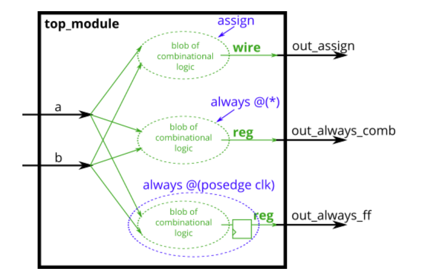
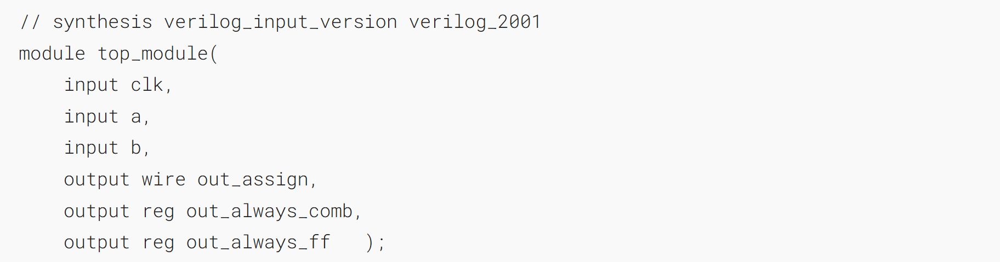
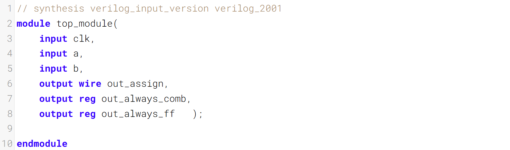
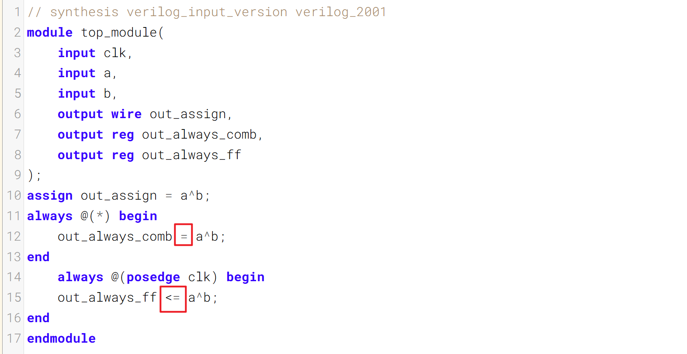

For hardware synthesis, there are two types of always blocks that are relevant:
在硬件综合中，有两种相关的 always 块：

- Combinational: always @(*) 
- 组合逻辑
- Clocked: always @(posedge clk) 
- 时钟型

Clocked always blocks create a blob of combinational logic just like combinational always blocks, but also creates a set of flip-flops (or "registers") at the output of the blob of combinational logic. Instead of the outputs of the blob of logic being visible immediately, the outputs are visible only immediately after the next (posedge clk).
时序敏感型 always 块会生成一团组合逻辑，这一点与组合型 always 块类似，同时还会在这团组合逻辑的输出端生成一组触发器（或称“寄存器”）。这团逻辑的输出不会立即可见，而是仅在**下一个时钟上升沿（posedge clk）**到来之后的瞬间才会可见。

#### Blocking vs. Non-Blocking Assignment 
阻塞赋值与非阻塞赋值

There are three types of assignments in Verilog:
Verilog 中有三种赋值方式：

- **Continuous** assignments (assign x = y;). Can only be used when **not** inside a procedure ("always block").
- 连续赋值（assign x = y;）。仅可在过程外部（“always 块”）使用。

- Procedural **blocking** assignment: (x = y;). Can only be used inside a procedure.
- 过程性阻塞赋值：(x = y;)。仅能在过程块中使用。

- Procedural **non-blocking** assignment: (x <= y;). Can only be used inside a procedure.
- 过程性非阻塞赋值：(x <= y;)。仅可在过程块内使用。

In a **combinational** always block, use **blocking** assignments. In a **clocked** always block, use **non-blocking** assignments. A full understanding of why is not particularly useful for hardware design and requires a good understanding of how Verilog simulators keep track of events. Not following this rule results in extremely hard to find errors that are both non-deterministic and differ between simulation and synthesized hardware.
在组合逻辑的 always 块中使用阻塞赋值。在时序逻辑的 always 块中使用非阻塞赋值。完全理解这一规则的原因对硬件设计并无特别帮助，且需要深入了解 Verilog 模拟器如何跟踪事件。不遵守该规则会导致极难排查的错误，这类错误既具有不确定性，在仿真结果与综合后的硬件表现上也会存在差异。

### A bit of practice 一点练习

Build an XOR gate three ways, using an assign statement, a combinational always block, and a clocked always block. Note that the clocked always block produces a different circuit from the other two: There is a flip-flop so the output is delayed.
用三种方法构建异或门，分别使用赋值语句、组合逻辑 always 块和时序逻辑 always 块。需注意，时序逻辑 always 块所生成的电路与另外两种方法有所不同：该电路中包含触发器，因此输出会存在延迟。

### Module Declaration

### Write your solution here

### Solution

