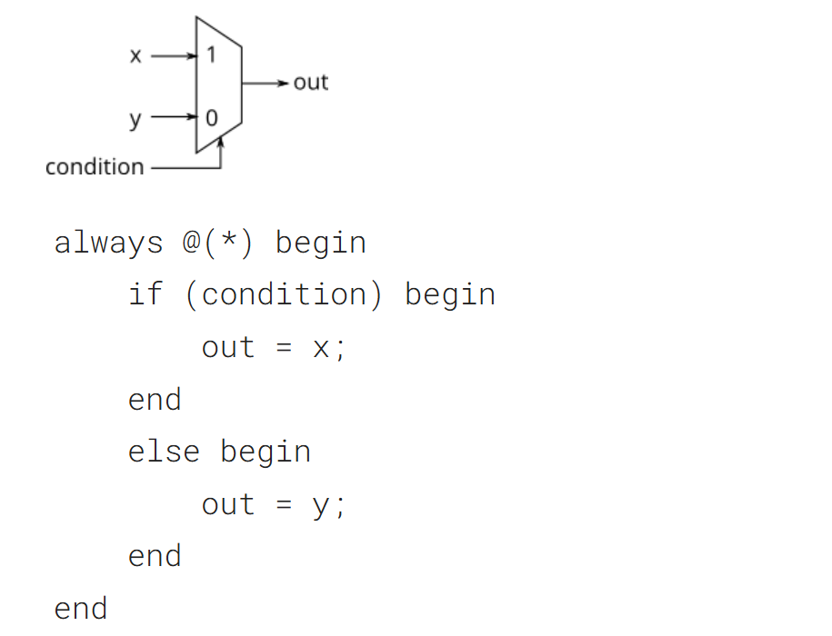
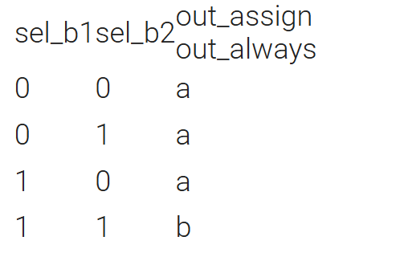
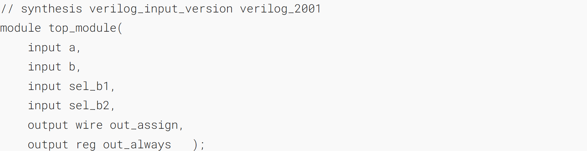
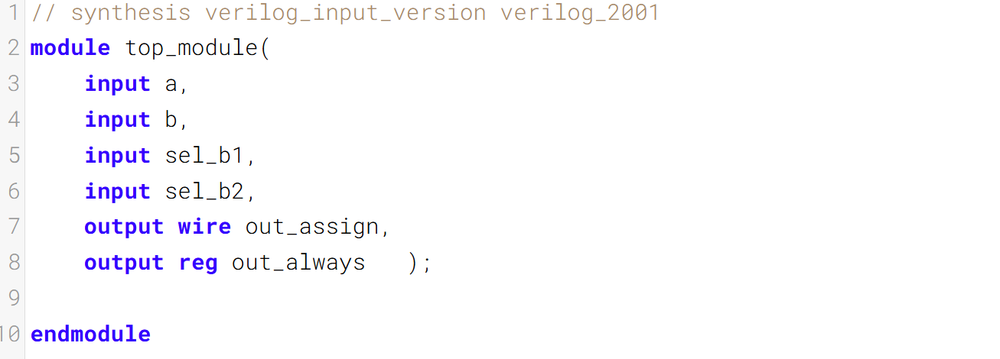

An if statement usually creates a 2-to-1 multiplexer, selecting one input if the condition is true, and the other input if the condition is false.
if 语句通常会生成一个 2 选 1 多路复用器，条件为真时选择一个输入，条件为假时选择另一个输入。

This is equivalent to using a continuous assignment with a conditional operator:
这等效于使用带条件运算符的连续赋值语句：

However, the procedural if statement provides a new way to make mistakes. The circuit is combinational only if out is always assigned a value.
然而，过程性if语句提供了一种新的犯错方式。只有当out始终被赋值时，该电路才是组合逻辑的。


### A bit of practice 一点练习

Build a 2-to-1 mux that chooses between a and b. Choose b if _both_ sel_b1 and sel_b2 are true. Otherwise, choose a. Do the same twice, once using assign statements and once using a procedural if statement.
构建一个二选一多路选择器（2-to-1 mux），用于在信号a和信号b之间进行选择。当选择信号sel_b1和sel_b2均为高电平时，选择信号b；否则选择信号a。分两种方式实现：一次使用assign赋值语句，一次使用过程化的if语句。

### Module Declaration



### Write your solution here



### Solution
```verilog
// synthesis verilog_input_version verilog_2001
module top_module(
    input a,
    input b,
    input sel_b1,
    input sel_b2,
    output wire out_assign,
    output reg out_always   
); 
assign out_assign = (sel_b1 & sel_b2) ? b : a;
always @(*) begin
    if (sel_b1 & sel_b2) begin
    	out_always = b;
    end
    else begin
        out_always = a;
    end
end
endmodule
```

