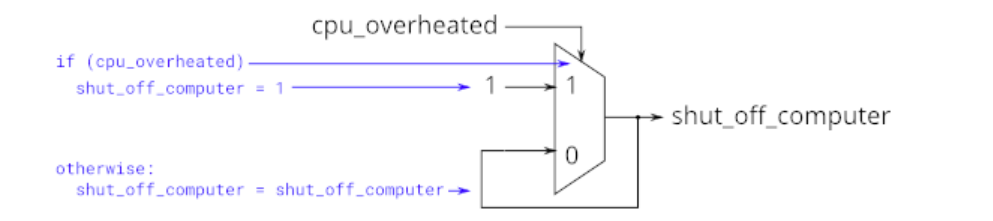
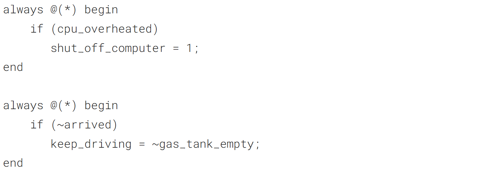
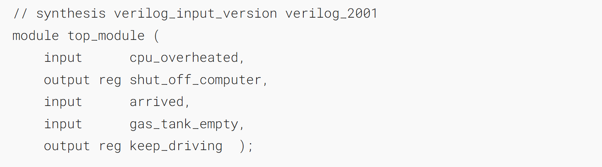
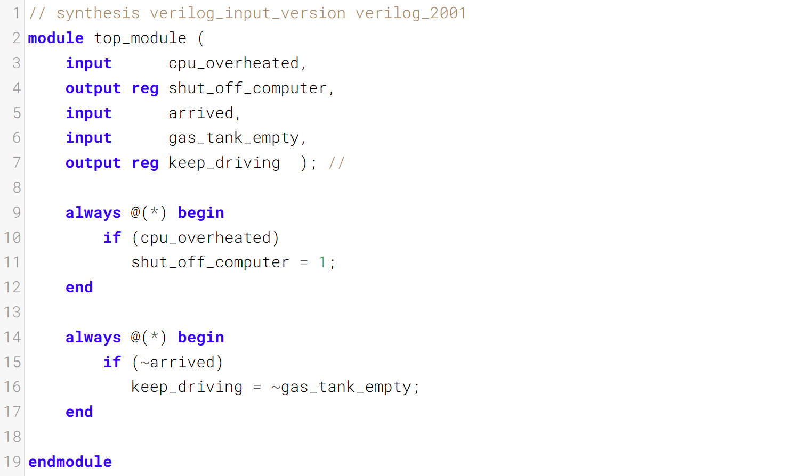

### A common source of errors: How to avoid making latches常见错误来源：如何避免生成锁存器

When designing circuits, you _must_ think first in terms of circuits:
在设计电路时，你必须首先从电路的角度去思考：

- I want this logic gate 
- 我想要这个逻辑门

- I want a _combinational_ blob of logic that has these inputs and produces these outputs
- 我需要一个组合逻辑模块，该模块包含这些输入并生成这些输出

- I want a combinational blob of logic followed by a set of flip-flops
- 我需要一个组合逻辑块，后面跟着一组触发器

What you _must not_ do is write the code first, then hope it generates a proper circuit.
你绝不能做的是先编写代码，然后寄希望它能生成一个合适的电路。

- If (cpu_overheated) then shut_off_computer = 1;
- 如果（cpu_overheated）则 shut_off_computer = 1；

- If (~arrived) then keep_driving = ~gas_tank_empty;
- 如果（未到达）则保持行驶 = 油箱未空；

Syntactically-correct code does not necessarily result in a reasonable circuit (combinational logic + flip-flops). The usual reason is: "What happens in the cases other than those you specified?". Verilog's answer is: Keep the outputs unchanged.Syntactically-correct
代码并不一定会产生合理的电路（组合逻辑+触发器），通常的理由是：“在你指定的情况以外的情况下会发生什么？”。Verilog的答案是：保持输出不变。

This behaviour of "keep outputs unchanged" means the current state needs to be _remembered_, and thus produces a _latch_. Combinational logic (e.g., logic gates) cannot remember any state. Watch out for Warning (10240): ... inferring latch(es)" messages. Unless the latch was intentional, it almost always indicates a bug. Combinational circuits must have a value assigned to all outputs under all conditions. This usually means you always need else clauses or a default value assigned to the outputs.
这种“保持输出不变”的行为意味着需要记住当前状态，因此会生成锁存器。组合逻辑（例如逻辑门）无法记住任何状态。请注意出现“警告 (10240)：正在推断锁存器”的提示。除非是有意设计锁存器，否则这几乎总是表示存在错误。组合电路必须在所有条件下为所有输出赋值。这通常意味着始终需要添加 else 子句，或为输出赋予默认值。

### Demonstration 示例演示

The following code contains incorrect behaviour that creates a latch. Fix the bugs so that you will shut off the computer only if it's really overheated, and stop driving if you've arrived at your destination or you need to refuel.
以下代码存在会生成锁存器的错误行为。请修复漏洞，确保仅在电脑真的过热时才关闭它，并且在抵达目的地或需要加油时停止行驶。



This is the circuit described by the code, not the circuit you want to build.
这是代码所描述的电路，而非你想要搭建的电路。



### Module Declaration


### Write your solution here


### Solution
```verilog
// synthesis verilog_input_version verilog_2001
module top_module (
    input      cpu_overheated,
    output reg shut_off_computer,
    input      arrived,
    input      gas_tank_empty,
    output reg keep_driving  ); //

    always @(*) begin
        if (cpu_overheated)
            shut_off_computer = 1;
        else
        	shut_off_computer = 0;
    end

    always @(*) begin
        if (~arrived)
            keep_driving = ~gas_tank_empty;
        else 
            keep_driving = 1'b0;
    end
endmodule
```


