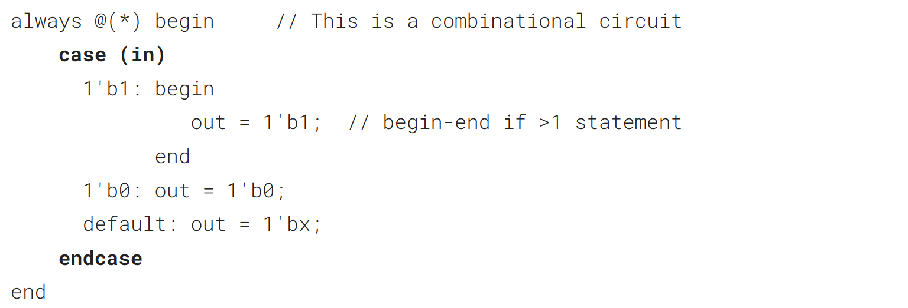
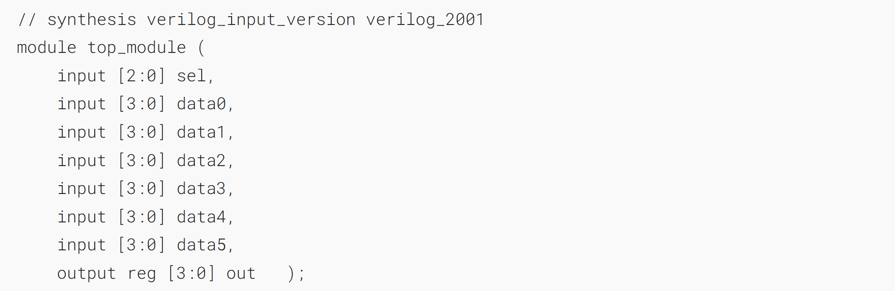
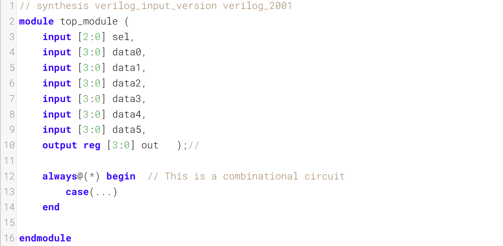

Case statements in Verilog are nearly equivalent to a sequence of if-elseif-else that compares one expression to a list of others. Its syntax and functionality differs from the switch statement in C.
Verilog 中的 case 语句几乎等同于一系列将一个表达式与其他多个表达式进行比较的 if-elseif-else 结构。其语法和功能与 C 语言中的 switch 语句不同。



- The case statement begins with case and each "case item" ends with a colon. There is no "switch".
- case语句以case开头，每个“case项”都以冒号结尾。这里没有“switch”。

- Each case item can execute _exactly one_ statement. This makes the "break" used in C unnecessary. But this means that if you need more than one statement, you must use begin ... end.
- 每个 case 项只能执行一条语句。这使得 C 语言中使用的 break 变得多余。但这也意味着，若需要执行多条语句，就必须使用 begin ... end 结构。

- Duplicate (and partially overlapping) case items are permitted. The first one that matches is used. C does not allow duplicate case items.
- 允许重复（且部分重叠）的 case 项。将使用第一个匹配的项。C 语言不允许重复的 case 项。

### A bit of practice 一点练习

Case statements are more convenient than if statements if there are a large number of cases. So, in this exercise, create a 6-to-1 multiplexer. When sel is between 0 and 5, choose the corresponding data input. Otherwise, output 0. The data inputs and outputs are all 4 bits wide.
当情况数量较多时，Case 语句比 if 语句更便捷。因此，在本练习中，需创建一个 6 选 1 多路复用器。当选择信号 sel 处于 0 到 5 之间时，选择对应的数据输入；否则输出 0。所有数据输入和输出均为 4 位宽。

Be careful of inferring latches (See.[always_if2](https://hdlbits.01xz.net/wiki/always_if2 "always_if2"))
注意避免推断出锁存器（参见[always_if2](https://hdlbits.01xz.net/wiki/always_if2 "always_if2")）

### Module Declaration


### Write your solution here


### Solution

```verilog
// synthesis verilog_input_version verilog_2001
module top_module ( 
    input [2:0] sel, 
    input [3:0] data0,
    input [3:0] data1,
    input [3:0] data2,
    input [3:0] data3,
    input [3:0] data4,
    input [3:0] data5,
    output reg [3:0] out   
);//

always@(*) begin  // This is a combinational circuit
    case(sel)
        3'b000: out = data0 ;
        3'b001: out = data1 ;
        3'b010: out = data2 ;
        3'b011: out = data3 ;
        3'b100: out = data4 ;
        3'b101: out = data5 ;
        default: out = 4'b0000 ;
    endcase
end
endmodule
```
