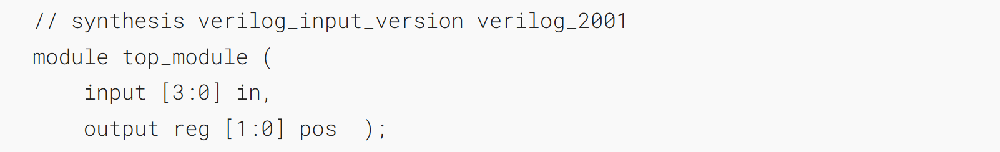
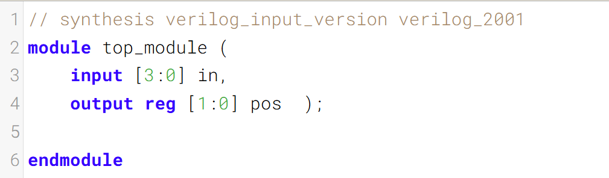
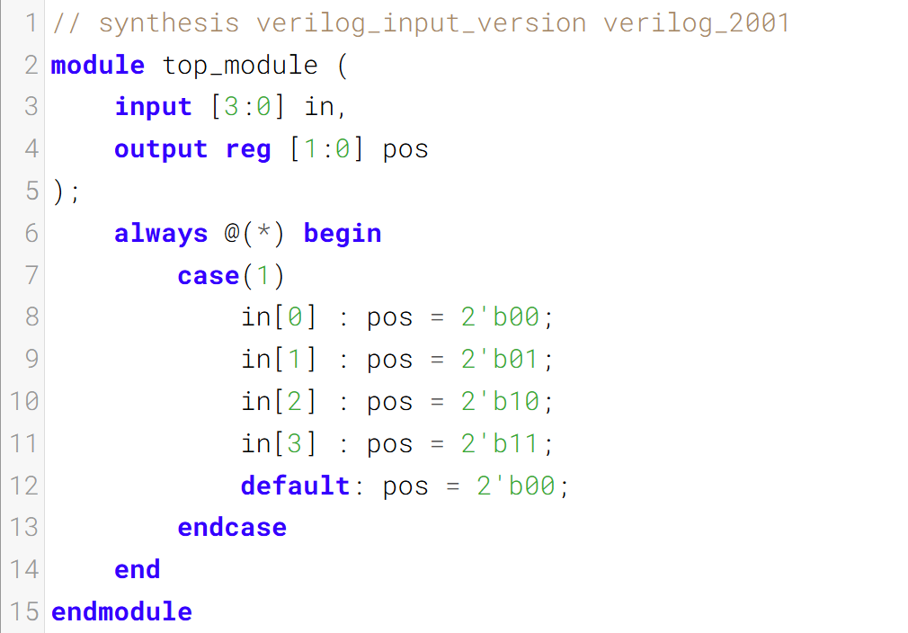
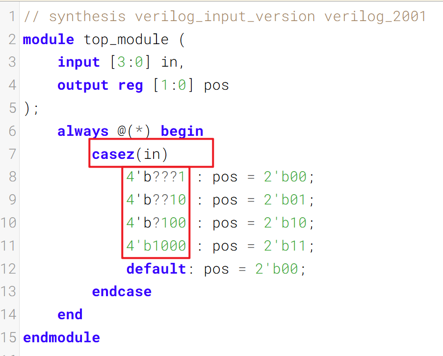

A _priority encoder_ is a combinational circuit that, when given an input bit vector, outputs the position of the first 1 bit in the vector. For example, a 8-bit priority encoder given the input 8'b10010000 would output 3'd4, because bit[4] is first bit that is high.
优先编码器是一种组合逻辑电路，当给定一个输入位向量时，它会输出该向量中第一个为1的位的位置。例如，一个8位优先编码器在输入为8'b10010000时，输出为3'd4，因为位[4]是第一个高电平的位。

Build a 4-bit priority encoder. For this problem, if none of the input bits are high (i.e., input is zero), output zero. Note that a 4-bit number has 16 possible combinations.
构建一个4位优先编码器。针对本题，若所有输入位均为低电平（即输入值为0），则输出0。需注意，一个4位数字共有16种可能的组合。

### Module Declaration

### Write your solution here

### Solution

