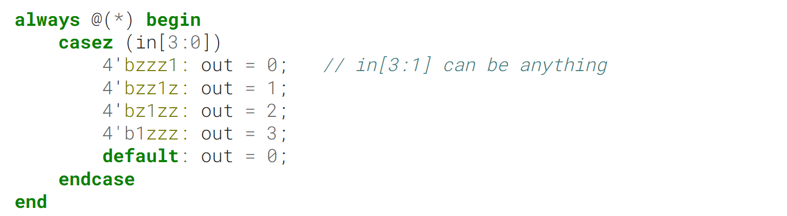
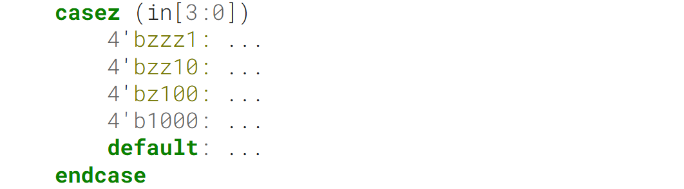
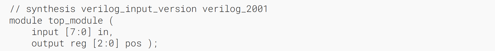
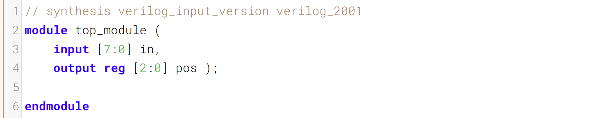
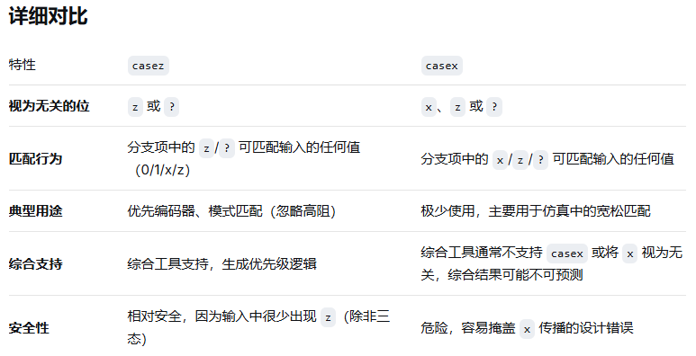

Build a priority encoder for 8-bit inputs. Given an 8-bit vector, the output should report the first (least significant) bit in the vector that is 1. Report zero if the input vector has no bits that are high. For example, the input 8'b10010000 should output 3'd4, because bit[4] is first bit that is high.
构建一个8位输入的优先编码器。给定一个8位向量，输出应报告向量中第一个（最低有效位）为1的位。若输入向量中没有高位为1，则输出零。例如，输入8'b10010000应输出3'd4，因为位[4]是第一个为高电平的位。

From the previous exercise ([always_case2](https://hdlbits.01xz.net/wiki/always_case2 "always_case2")), there would be 256 cases in the case statement. We can reduce this (down to 9 cases) if the case items in the case statement supported don't-care bits. This is what case**z** is for: It treats bits that have the value z as don't-care in the comparison.
从之前的练习（[always_case2](https://hdlbits.01xz.net/wiki/always_case2 "always_case2")）来看，case 语句中会有 256 种情况。如果 case 语句中的 case 项支持无关位，我们就可以将其减少（降至 9 种情况）。这正是 casez 的作用：它在比较时将值为 z 的位视为无关位。

For example, this would implement the 4-input priority encoder from the previous exercise:
例如，这可以实现上一个练习中的4输入优先编码器：



A case statement behaves as though each item is checked sequentially (in reality, a big combinational logic function). Notice how there are certain inputs (e.g., 4'b1111) that will match more than one case item. The first match is chosen (so 4'b1111 matches the first item, out = 0, but not any of the later ones).
case 语句的行为表现为每个项会被依次检查（实际上，这是一个大型组合逻辑函数）。请注意，存在某些输入（例如 4'b1111）会匹配多个 case 项的情况。此时会选择第一个匹配的项（因此 4'b1111 会匹配第一个项，输出为 0，而不会匹配后续的任何项）。

- There is also a similar casex that treats both x and z as don't-care. I don't see much purpose to using it over casez.
- 还有一个类似的 casex 语句，它将 x 和 z 都视为无关项。我认为使用它并不比 casez 有多大优势。

- The digit ? is a synonym for z. so 2'bz0 is the same as 2'b?0
- 数字 `?` 是 `z` 的同义词。因此 `2'bz0` 与 `2'b?0` 是相同的。

It may be less error-prone to explicitly specify the priority behaviour rather than rely on the ordering of the case items. For example, the following will still behave the same way if some of the case items were reordered, because any bit pattern can only match at most one case item:
显式指定优先级行为可能比依赖 case 项的顺序更不容易出错。例如，如果某些 case 项被重新排序，以下代码的行为仍将保持不变，因为任何位模式最多只能匹配一个 case 项：



### Module Declaration


### Write your solution here


### Solution


casex和casez有啥区别:
`casex` 和 `casez` 的区别在于：**`casex` 将 `x`（不定态）、`z`（高阻态）和 `?` 都视为无关位（don't care），而 `casez` 只将 `z` 和 `?` 视为无关，`x` 仍参与精确比较。**


```verilog
module top_module (
    input [7:0] in,
    output reg [2:0] pos 
);
    always @(*) begin
        casez(in)
            8'bzzzzzzz1: pos = 3'b000;
            8'bzzzzzz10: pos = 3'b001;
            8'bzzzzz100: pos = 3'b010;
            8'bzzzz1000: pos = 3'b011;
            8'bzzz10000: pos = 3'b100;
            8'bzz100000: pos = 3'b101;
            8'bz1000000: pos = 3'b110;
            8'b10000000: pos = 3'b111;
            default : pos = 3'b000;
        endcase
    end
endmodule
```

```verilog
module top_module (
    input [7:0] in,
    output reg [2:0] pos 
);
    always @(*) begin
        casez(1)
            in[0]: pos = 3'b000;
            in[1]: pos = 3'b001;
            in[2]: pos = 3'b010;
            in[3]: pos = 3'b011;
            in[4]: pos = 3'b100;
            in[5]: pos = 3'b101;
            in[6]: pos = 3'b110;
            in[7]: pos = 3'b111;
            default : pos = 3'b000;
        endcase
    end
endmodule
```


