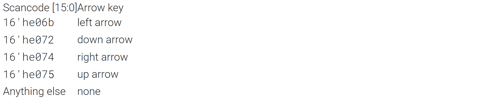
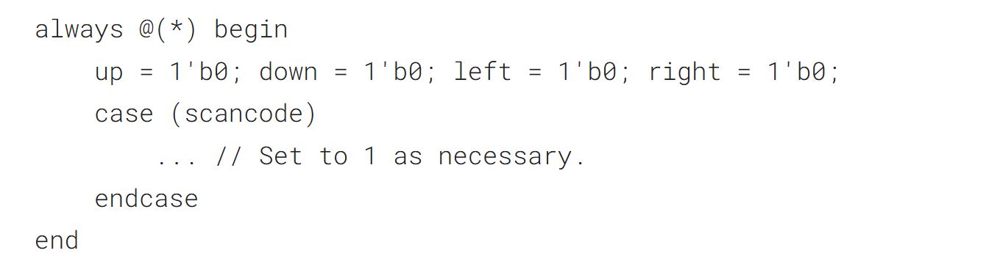
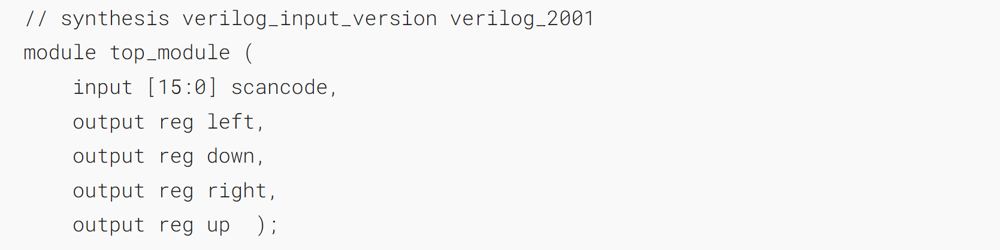
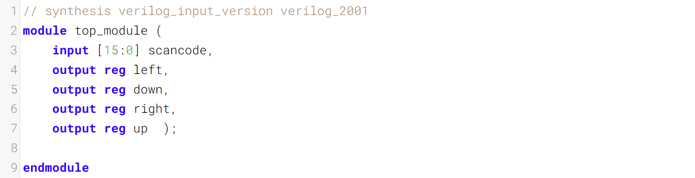

Suppose you're building a circuit to process scancodes from a PS/2 keyboard for a game. Given the last two bytes of scancodes received, you need to indicate whether one of the arrow keys on the keyboard have been pressed. This involves a fairly simple mapping, which can be implemented as a case statement (or if-elseif) with four cases.
假设你正在为一款游戏构建一个电路，用于处理来自 PS/2 键盘的扫描码。已知接收到的扫描码的最后两个字节，你需要判断键盘上的某个方向键是否被按下。这涉及一个相当简单的映射，可通过一个包含四种情况的 case 语句（或 if-elseif 语句）来实现



Your circuit has one 16-bit input, and four outputs. Build this circuit that recognizes these four scancodes and asserts the correct output.
你的电路有一个16位输入和四个输出。构建一个能够识别这四个扫描码并输出对应正确信号的电路。

To avoid creating latches, all outputs must be assigned a value in all possible conditions (See also [always_if2](https://hdlbits.01xz.net/wiki/always_if2 "always_if2")). Simply having a default case is not enough. You must assign a value to all four outputs in all four cases and the default case. This can involve a lot of unnecessary typing. One easy way around this is to assign a "default value" to the outputs _before_ the case statement:
为了避免产生锁存器，所有输出在所有可能的条件下都必须被赋值（另见 [always_if2](https://hdlbits.01xz.net/wiki/always_if2 "always_if2")）。仅设置一个默认情况是不够的。你必须在全部四种情况和默认情况中为所有四个输出赋值。这可能需要大量不必要的输入。一个简单的解决方法是在 case 语句之前为输出分配一个“默认值”：



This style of code ensures the outputs are assigned a value (of 0) in all possible cases unless the case statement overrides the assignment. This also means that a default: case item becomes unnecessary.
这种代码风格确保在所有可能的情况下，输出都会被赋值为 0，除非 case 语句覆盖了该赋值。这也意味着 default: 分支项变得没有必要。

**Reminder:** The logic synthesizer generates a combinational circuit that _behaves_ equivalently to what the code describes. Hardware does not "execute" the lines of code in sequence.
提醒：逻辑综合器会生成一个与代码描述行为等效的组合电路。硬件不会按顺序“执行”代码行。

### Module Declaration


### Write your solution here


### Solution
```verilog
module top_module (
    input [15:0] scancode,
    output reg left,
    output reg down,
    output reg right,
    output reg up  
); 
    always @(*) begin
        up 		= 1'b0;
        down 	= 1'b0;
        left 	= 1'b0;
        right 	= 1'b0;
        case (scancode)
            16'he06b : left  = 1'b1;
            16'he072 : down  = 1'b1;
            16'he074 : right = 1'b1;
            16'he075 : up 	 = 1'b1;
        endcase
    end
endmodule
```

