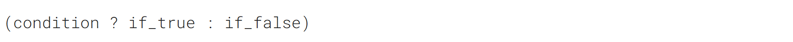
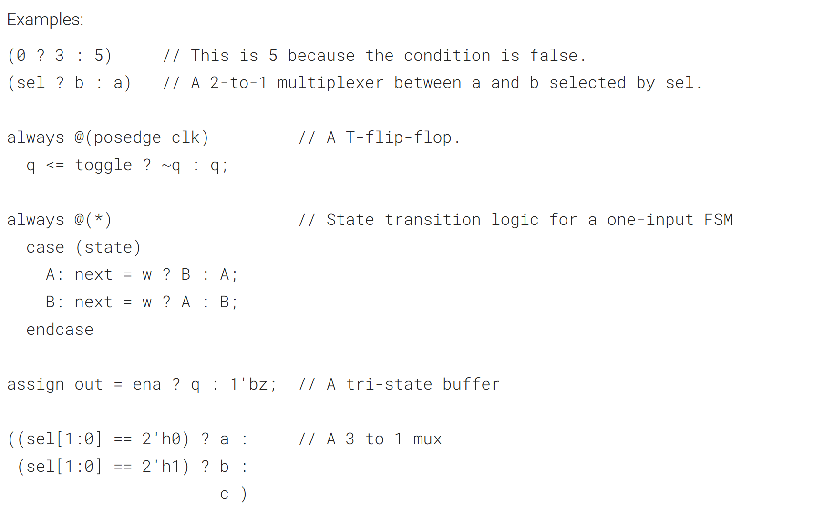
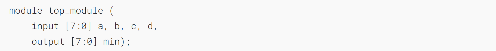
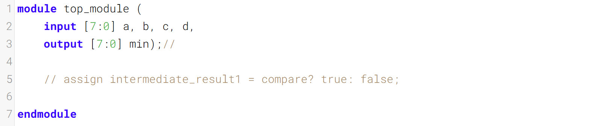

三元条件运算符

Verilog has a ternary conditional operator ( ? : ) much like C:
Verilog 有一个三元条件运算符（? :），与 C 语言中的类似：


This can be used to choose one of two values based on _condition_ (a mux!) on one line, without using an if-then inside a combinational always block.
这可用于在一行代码中根据条件（一个多路选择器！）选择两个值之一，且无需在组合型 always 块中使用 if-then 语句。


## A Bit of Practice 一点练习

Given four unsigned numbers, find the minimum. Unsigned numbers can be compared with standard comparison operators (a < b). Use the conditional operator to make two-way _min_ circuits, then compose a few of them to create a 4-way _min_ circuit. You'll probably want some wire vectors for the intermediate results.
给定四个无符号数，找出其中的最小值。无符号数可以通过标准比较运算符（a < b）进行比较。使用条件运算符构建双向取最小值电路，再将若干个此类电路组合成四向取最小值电路。你可能需要一些线向量来存储中间结果。

_**Expected solution length:** Around 5 lines.
预期的代码长度约为5行。_

### Module Declaration


### Write your solution here


### Solution
```verilog
module top_module (
    input [7:0] a, b, c, d,
    output [7:0] min
);//
    wire [7:0] min_ab;
    wire [7:0] min_cd;
    assign min_ab = a<b ? a : b;
    assign min_cd = c<d ? c : d;
    assign min = min_ab<min_cd ? min_ab : min_cd;
endmodule
```


