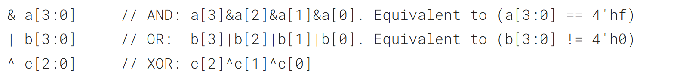
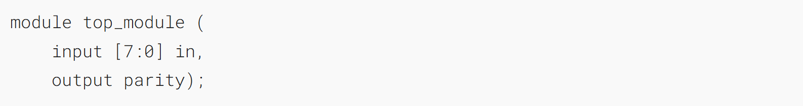
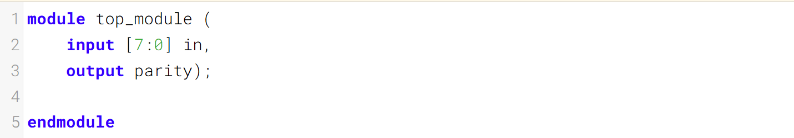
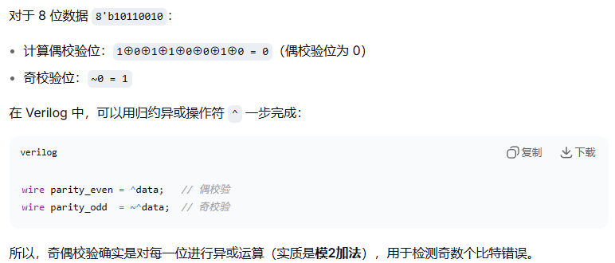

You're already familiar with bitwise operations between two values, e.g., a & b or a ^ b. Sometimes, you want to create a wide gate that operates on all of the bits of _one_ vector, like (a[0] & a[1] & a[2] & a[3] ... ), which gets tedious if the vector is long.
你已经熟悉两个值之间的按位运算，例如 `a & b` 或 `a ^ b`。有时你需要创建一个宽门电路，对一个向量的所有位进行运算，比如 `(a[0] & a[1] & a[2] & a[3] ... )`，如果向量很长，这种写法会非常繁琐。

The _reduction_ operators can do AND, OR, and XOR of the bits of a vector, producing one bit of output:
归约运算符可对向量的各位进行与、或和异或运算，输出一位结果：



These are _unary_ operators that have only one operand (similar to the NOT operators ! and ~). You can also invert the outputs of these to create NAND, NOR, and XNOR gates, e.g., (~& d[7:0]).
这些是仅带有一个操作数的一元运算符（类似于非运算符! 和 ~）。你也可以对这些运算符的输出取反，以构建与非门、或非门和异或非门，例如 (~& d[7:0])。

Now you can revisit [4-input gates](https://hdlbits.01xz.net/wiki/gates4 "gates4") and [100-input gates](https://hdlbits.01xz.net/wiki/gates100 "gates100").
现在你可以重新回顾[4输入门](https://hdlbits.01xz.net/wiki/gates4 "gates4")和[100输入门](https://hdlbits.01xz.net/wiki/gates100 "gates100")。

## A Bit of Practice 一点练习

Parity checking is often used as a simple method of detecting errors when transmitting data through an imperfect channel. Create a circuit that will compute a parity bit for a 8-bit byte (which will add a 9th bit to the byte). We will use "even" parity, where the parity bit is just the XOR of all 8 data bits.
奇偶校验常被用作在非理想信道中传输数据时检测错误的简单方法。请设计一个电路，用于计算8位字节的奇偶校验位（这会为该字节增加第9位）。我们将使用“偶”校验，其中校验位就是全部8个数据位的异或结果。

_**Expected solution length:** Around 1 line.
预期的解决方案长度：大约一行。_

### Module Declaration


### Write your solution here


### Solution
```verilog
module top_module (
    input [7:0] in,
    output parity
); 
    assign parity = ^ in[7:0];
endmodule
```


<font color="#ff0000">奇偶校验原理</font>




