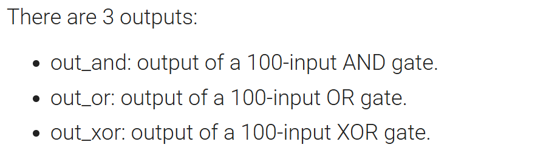
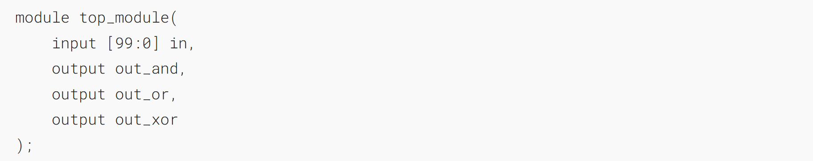
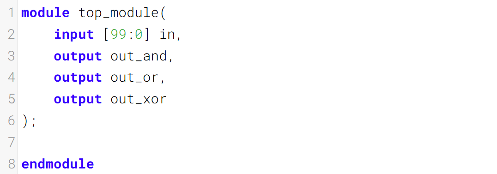

归约运算符：更宽的门

Build a combinational circuit with 100 inputs, in[99:0].
构建一个具有100个输入in[99:0]的组合电路。



### Module Declaration


### Write your solution here


### Solution
```verilog
module top_module( 
    input [99:0] in,
    output out_and,
    output out_or,
    output out_xor 
);
    assign out_and = & in[99:0];
    assign out_or  = | in[99:0];
    assign out_xor = ^ in[99:0];
endmodule
```

