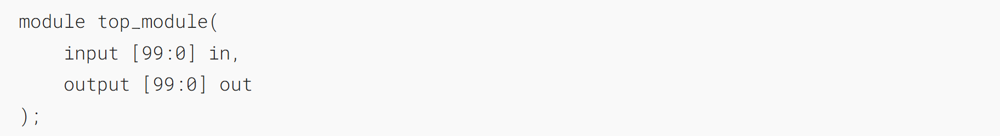
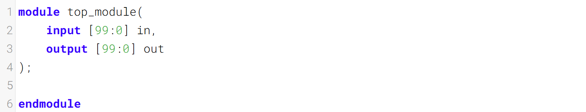

组合for循环：向量反转2

Given a 100-bit input vector [99:0], reverse its bit ordering.
给定一个 100 位的输入向量 [99:0]，将其位序反转。

### Module Declaration


### Write your solution here


### Solution
```verilog
module top_module( 
    input [99:0] in,
    output [99:0] out
);
	integer i;
    always @(*) begin
        for(i=0; i<100; i=i+1) begin
            out[i] = in[99-i];
        end
    end
endmodule
```
