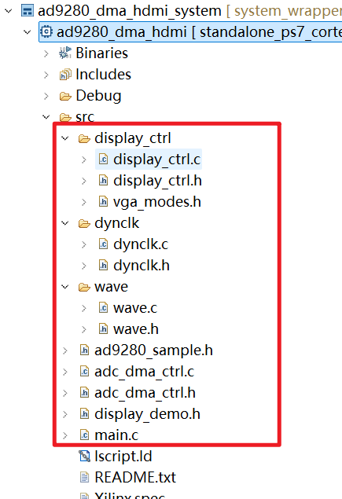

- [display_ctrl](03_AD9208_DMA_VDMA_HDMI(源码参考).md#display_ctrl)
	- [display_ctrl.c](03_AD9208_DMA_VDMA_HDMI(源码参考).md#display_ctrl#display_ctrl.c)
	- [display_ctrl.h](03_AD9208_DMA_VDMA_HDMI(源码参考).md#display_ctrl#display_ctrl.h)
	- [vga_modes.h](03_AD9208_DMA_VDMA_HDMI(源码参考).md#display_ctrl#vga_modes.h)
- [dynclk](03_AD9208_DMA_VDMA_HDMI(源码参考).md#dynclk)
	- [dynclk.c](03_AD9208_DMA_VDMA_HDMI(源码参考).md#dynclk#dynclk.c)
	- [dynclk.h](03_AD9208_DMA_VDMA_HDMI(源码参考).md#dynclk#dynclk.h)
- [wave](03_AD9208_DMA_VDMA_HDMI(源码参考).md#wave)
	- [wave.c](03_AD9208_DMA_VDMA_HDMI(源码参考).md#wave#wave.c)
	- [wave.h](03_AD9208_DMA_VDMA_HDMI(源码参考).md#wave#wave.h)
- [ad9280_sample.h](03_AD9208_DMA_VDMA_HDMI(源码参考).md#ad9280_sample.h)
- [adc_dma_ctrl.c](03_AD9208_DMA_VDMA_HDMI(源码参考).md#adc_dma_ctrl.c)
- [adc_dma_ctrl.h](03_AD9208_DMA_VDMA_HDMI(源码参考).md#adc_dma_ctrl.h)
- [display_demo.h](03_AD9208_DMA_VDMA_HDMI(源码参考).md#display_demo.h)
- [main.c](03_AD9208_DMA_VDMA_HDMI(源码参考).md#main.c)


##### display_ctrl
###### display_ctrl.c
```c
#include "display_ctrl.h"
#include "xdebug.h"
#include "xil_io.h"


int DisplayStop(DisplayCtrl *dispPtr)
{
	//If already stopped, do nothing
	if (dispPtr->state == DISPLAY_STOPPED)
	{
		return XST_SUCCESS;
	}

	//Disable the disp_ctrl core, and wait for the current frame to finish (the core cannot stop mid-frame)
	XVtc_DisableGenerator(&dispPtr->vtc);

	// Stop the VDMA core
	XAxiVdma_DmaStop(dispPtr->vdma, XAXIVDMA_READ);
	while(XAxiVdma_IsBusy(dispPtr->vdma, XAXIVDMA_READ));

	//Update Struct state
	dispPtr->state = DISPLAY_STOPPED;

	//TODO: consider stopping the clock here, perhaps after a check to see if the VTC is finished
	if (XAxiVdma_GetDmaChannelErrors(dispPtr->vdma, XAXIVDMA_READ))
	{
		xdbg_printf(XDBG_DEBUG_GENERAL, "Clearing DMA errors...\r\n");
		XAxiVdma_ClearDmaChannelErrors(dispPtr->vdma, XAXIVDMA_READ, 0xFFFFFFFF);
		return XST_DMA_ERROR;
	}

	return XST_SUCCESS;
}

int DisplayStart(DisplayCtrl *dispPtr)
{
	int Status;
	ClkConfig clkReg;
	ClkMode clkMode;
	int i;
	XVtc_Timing vtcTiming;
	XVtc_SourceSelect SourceSelect;

	xdbg_printf(XDBG_DEBUG_GENERAL, "display start entered\n\r");
	/*
	 * If already started, do nothing
	 */
	if (dispPtr->state == DISPLAY_RUNNING)
	{
		return XST_SUCCESS;
	}


	//Calculate the PLL divider parameters based on the required pixel clock frequency
	ClkFindParams(dispPtr->vMode.freq, &clkMode);

	//Store the obtained frequency to pxlFreq. It is possible that the PLL was not able to exactly generate the desired pixel clock, so this may differ from vMode.freq.
	dispPtr->pxlFreq = clkMode.freq;

	//Write to the PLL dynamic configuration registers to configure it with the calculated parameters.
	if (!ClkFindReg(&clkReg, &clkMode))
	{
		xdbg_printf(XDBG_DEBUG_GENERAL, "Error calculating CLK register values\n\r");
		return XST_FAILURE;
	}
	ClkWriteReg(&clkReg, dispPtr->dynClkAddr);

	//Enable the dynamically generated clock
	ClkStop(dispPtr->dynClkAddr);
	ClkStart(dispPtr->dynClkAddr);

	//Configure the vtc core with the display mode timing parameters
	vtcTiming.HActiveVideo = dispPtr->vMode.width;	/**< Horizontal Active Video Size */
	vtcTiming.HFrontPorch = dispPtr->vMode.hps - dispPtr->vMode.width;	/**< Horizontal Front Porch Size */
	vtcTiming.HSyncWidth = dispPtr->vMode.hpe - dispPtr->vMode.hps;		/**< Horizontal Sync Width */
	vtcTiming.HBackPorch = dispPtr->vMode.hmax - dispPtr->vMode.hpe + 1;		/**< Horizontal Back Porch Size */
	vtcTiming.HSyncPolarity = dispPtr->vMode.hpol;	/**< Horizontal Sync Polarity */
	vtcTiming.VActiveVideo = dispPtr->vMode.height;	/**< Vertical Active Video Size */
	vtcTiming.V0FrontPorch = dispPtr->vMode.vps - dispPtr->vMode.height;	/**< Vertical Front Porch Size */
	vtcTiming.V0SyncWidth = dispPtr->vMode.vpe - dispPtr->vMode.vps;	/**< Vertical Sync Width */
	vtcTiming.V0BackPorch = dispPtr->vMode.vmax - dispPtr->vMode.vpe + 1;;	/**< Horizontal Back Porch Size */
	vtcTiming.V1FrontPorch = dispPtr->vMode.vps - dispPtr->vMode.height;	/**< Vertical Front Porch Size */
	vtcTiming.V1SyncWidth = dispPtr->vMode.vpe - dispPtr->vMode.vps;	/**< Vertical Sync Width */
	vtcTiming.V1BackPorch = dispPtr->vMode.vmax - dispPtr->vMode.vpe + 1;;	/**< Horizontal Back Porch Size */
	vtcTiming.VSyncPolarity = dispPtr->vMode.vpol;	/**< Vertical Sync Polarity */
	vtcTiming.Interlaced = 0;		/**< Interlaced / Progressive video */


	/* Setup the VTC Source Select config structure. */
	/* 1=Generator registers are source */
	/* 0=Detector registers are source */
	memset((void *)&SourceSelect, 0, sizeof(SourceSelect));
	SourceSelect.VBlankPolSrc = 1;
	SourceSelect.VSyncPolSrc = 1;
	SourceSelect.HBlankPolSrc = 1;
	SourceSelect.HSyncPolSrc = 1;
	SourceSelect.ActiveVideoPolSrc = 1;
	SourceSelect.ActiveChromaPolSrc= 1;
	SourceSelect.VChromaSrc = 1;
	SourceSelect.VActiveSrc = 1;
	SourceSelect.VBackPorchSrc = 1;
	SourceSelect.VSyncSrc = 1;
	SourceSelect.VFrontPorchSrc = 1;
	SourceSelect.VTotalSrc = 1;
	SourceSelect.HActiveSrc = 1;
	SourceSelect.HBackPorchSrc = 1;
	SourceSelect.HSyncSrc = 1;
	SourceSelect.HFrontPorchSrc = 1;
	SourceSelect.HTotalSrc = 1;

	XVtc_SelfTest(&(dispPtr->vtc));

	XVtc_RegUpdateEnable(&(dispPtr->vtc));
	XVtc_SetGeneratorTiming(&(dispPtr->vtc), &vtcTiming);
	XVtc_SetSource(&(dispPtr->vtc), &SourceSelect);
    /*
	 * Enable VTC core, releasing backpressure on VDMA
	 */
	XVtc_EnableGenerator(&dispPtr->vtc);

	/*
	 * Configure the VDMA to access a frame with the same dimensions as the
	 * current mode
	 */
	dispPtr->vdmaConfig.VertSizeInput = dispPtr->vMode.height;
	dispPtr->vdmaConfig.HoriSizeInput = (dispPtr->vMode.width) * 3;
	dispPtr->vdmaConfig.FixedFrameStoreAddr = dispPtr->curFrame;
	/*
	 *Also reset the stride and address values, in case the user manually changed them
	 */
	dispPtr->vdmaConfig.Stride = dispPtr->stride;
	for (i = 0; i < DISPLAY_NUM_FRAMES; i++)
	{
		dispPtr->vdmaConfig.FrameStoreStartAddr[i] = (u32)  dispPtr->framePtr[i];
	}

	/*
	 * Perform the VDMA driver calls required to start a transfer. Note that no data is actually
	 * transferred until the disp_ctrl core signals the VDMA core by pulsing fsync.
	 */

	Status = XAxiVdma_DmaConfig(dispPtr->vdma, XAXIVDMA_READ, &(dispPtr->vdmaConfig));
	if (Status != XST_SUCCESS)
	{
		xdbg_printf(XDBG_DEBUG_GENERAL, "Read channel config failed %d\r\n", Status);
		return XST_FAILURE;
	}
	Status = XAxiVdma_DmaSetBufferAddr(dispPtr->vdma, XAXIVDMA_READ, dispPtr->vdmaConfig.FrameStoreStartAddr);
	if (Status != XST_SUCCESS)
	{
		xdbg_printf(XDBG_DEBUG_GENERAL, "Read channel set buffer address failed %d\r\n", Status);
		return XST_FAILURE;
	}
	Status = XAxiVdma_DmaStart(dispPtr->vdma, XAXIVDMA_READ);
	if (Status != XST_SUCCESS)
	{
		xdbg_printf(XDBG_DEBUG_GENERAL, "Start read transfer failed %d\r\n", Status);
		return XST_FAILURE;
	}
	Status = XAxiVdma_StartParking(dispPtr->vdma, dispPtr->curFrame, XAXIVDMA_READ);
	if (Status != XST_SUCCESS)
	{
		xdbg_printf(XDBG_DEBUG_GENERAL, "Unable to park the channel %d\r\n", Status);
		return XST_FAILURE;
	}

	dispPtr->state = DISPLAY_RUNNING;

	return XST_SUCCESS;
}


int DisplayInitialize(DisplayCtrl *dispPtr, XAxiVdma *vdma, u16 vtcId, u32 dynClkAddr, u8 *framePtr[DISPLAY_NUM_FRAMES], u32 stride)
{
	int Status;
	int i;
	XVtc_Config *vtcConfig;
	ClkConfig clkReg;
	ClkMode clkMode;


	/*
	 * Initialize all the fields in the DisplayCtrl struct
	 */
	dispPtr->curFrame = 0;
	dispPtr->dynClkAddr = dynClkAddr;
	for (i = 0; i < DISPLAY_NUM_FRAMES; i++)
	{
		dispPtr->framePtr[i] = framePtr[i];
	}
	dispPtr->state = DISPLAY_STOPPED;
	dispPtr->stride = stride;
	dispPtr->vMode = VMODE_1920x1080;

	ClkFindParams(dispPtr->vMode.freq, &clkMode);

	/*
	 * Store the obtained frequency to pxlFreq. It is possible that the PLL was not able to
	 * exactly generate the desired pixel clock, so this may differ from vMode.freq.
	 */
	dispPtr->pxlFreq = clkMode.freq;

	/*
	 * Write to the PLL dynamic configuration registers to configure it with the calculated
	 * parameters.
	 */
	if (!ClkFindReg(&clkReg, &clkMode))
	{
		xdbg_printf(XDBG_DEBUG_GENERAL, "Error calculating CLK register values\n\r");
		return XST_FAILURE;
	}
	ClkWriteReg(&clkReg, dispPtr->dynClkAddr);

	/*
	 * Enable the dynamically generated clock
    */
	ClkStart(dispPtr->dynClkAddr);

	/* Initialize the VTC driver so that it's ready to use look up
	 * configuration in the config table, then initialize it.
	 */
	vtcConfig = XVtc_LookupConfig(vtcId);
	/* Checking Config variable */
	if (NULL == vtcConfig) {
		return (XST_FAILURE);
	}
	Status = XVtc_CfgInitialize(&(dispPtr->vtc), vtcConfig, vtcConfig->BaseAddress);
	/* Checking status */
	if (Status != (XST_SUCCESS)) {
		return (XST_FAILURE);
	}

	dispPtr->vdma = vdma;


	/*
	 * Initialize the VDMA Read configuration struct
	 */
	dispPtr->vdmaConfig.FrameDelay = 0;
	dispPtr->vdmaConfig.EnableCircularBuf = 1;
	dispPtr->vdmaConfig.EnableSync = 0;
	dispPtr->vdmaConfig.PointNum = 0;
	dispPtr->vdmaConfig.EnableFrameCounter = 0;

	return XST_SUCCESS;
}
/* ------------------------------------------------------------ */

/***	DisplaySetMode(DisplayCtrl *dispPtr, const VideoMode *newMode)
**
**	Parameters:
**		dispPtr - Pointer to the initialized DisplayCtrl struct
**		newMode - The VideoMode struct describing the new mode.
**
**	Return Value: int
**		XST_SUCCESS if successful, XST_FAILURE otherwise
**
**	Errors:
**
**	Description:
**		Changes the resolution being output to the display. If the display
**		is currently started, it is automatically stopped (DisplayStart must
**		be called again).
**
*/
int DisplaySetMode(DisplayCtrl *dispPtr, const VideoMode *newMode)
{
	int Status;

	/*
	 * If currently running, stop
	 */
	if (dispPtr->state == DISPLAY_RUNNING)
	{
		Status = DisplayStop(dispPtr);
		if (Status != XST_SUCCESS)
		{
			xdbg_printf(XDBG_DEBUG_GENERAL, "Cannot change mode, unable to stop display %d\r\n", Status);
			return XST_FAILURE;
		}
	}

	dispPtr->vMode = *newMode;

	return XST_SUCCESS;
}
/* ------------------------------------------------------------ */

/***	DisplayChangeFrame(DisplayCtrl *dispPtr, u32 frameIndex)
**
**	Parameters:
**		dispPtr - Pointer to the initialized DisplayCtrl struct
**		frameIndex - Index of the framebuffer to change to (must
**				be between 0 and (DISPLAY_NUM_FRAMES - 1))
**
**	Return Value: int
**		XST_SUCCESS if successful, XST_FAILURE otherwise
**
**	Errors:
**
**	Description:
**		Changes the frame currently being displayed.
**
*/

int DisplayChangeFrame(DisplayCtrl *dispPtr, u32 frameIndex)
{
	int Status;

	dispPtr->curFrame = frameIndex;
	/*
	 * If currently running, then the DMA needs to be told to start reading from the desired frame
	 * at the end of the current frame
	 */
	if (dispPtr->state == DISPLAY_RUNNING)
	{
		Status = XAxiVdma_StartParking(dispPtr->vdma, dispPtr->curFrame, XAXIVDMA_READ);
		if (Status != XST_SUCCESS)
		{
			xdbg_printf(XDBG_DEBUG_GENERAL, "Cannot change frame, unable to start parking %d\r\n", Status);
			return XST_FAILURE;
		}
	}

	return XST_SUCCESS;
}

```
###### display_ctrl.h
```c
#ifndef DISPLAY_CTRL_H_
#define DISPLAY_CTRL_H_

/* ------------------------------------------------------------ */
/*				Include File Definitions						*/
/* ------------------------------------------------------------ */

#include "xil_types.h"
#include "vga_modes.h"
#include "xaxivdma.h"
#include "xvtc.h"
#include "../dynclk/dynclk.h"

/* ------------------------------------------------------------ */
/*					Miscellaneous Declarations					*/
/* ------------------------------------------------------------ */

#define BIT_DISPLAY_RED 16
#define BIT_DISPLAY_BLUE 8
#define BIT_DISPLAY_GREEN 0

/*
 * This driver currently supports 3 frames.
 */
#define DISPLAY_NUM_FRAMES 1

/* ------------------------------------------------------------ */
/*					General Type Declarations					*/
/* ------------------------------------------------------------ */

typedef enum {
	DISPLAY_STOPPED = 0,
	DISPLAY_RUNNING = 1
} DisplayState;

typedef struct {
		u32 dynClkAddr; /*Physical Base address of the dynclk core*/
		XAxiVdma *vdma; /*VDMA driver struct*/
		XAxiVdma_DmaSetup vdmaConfig; /*VDMA channel configuration*/
		XVtc vtc; /*VTC driver struct*/
		VideoMode vMode; /*Current Video mode*/
		u8 *framePtr[DISPLAY_NUM_FRAMES]; /* Array of pointers to the framebuffers */
		u32 stride; /* The line stride of the framebuffers, in bytes */
		double pxlFreq; /* Frequency of clock currently being generated */
		u32 curFrame; /* Current frame being displayed */
		DisplayState state; /* Indicates if the Display is currently running */
} DisplayCtrl;

/* ------------------------------------------------------------ */
/*					Procedure Declarations						*/
/* ------------------------------------------------------------ */

int DisplayStop(DisplayCtrl *dispPtr);
int DisplayStart(DisplayCtrl *dispPtr);
int DisplayInitialize(DisplayCtrl *dispPtr, XAxiVdma *vdma, u16 vtcId, u32 dynClkAddr, u8 *framePtr[DISPLAY_NUM_FRAMES], u32 stride);
int DisplaySetMode(DisplayCtrl *dispPtr, const VideoMode *newMode);
int DisplayChangeFrame(DisplayCtrl *dispPtr, u32 frameIndex);

/* ------------------------------------------------------------ */

/************************************************************************/

#endif /* DISPLAY_CTRL_H_ */


```

###### vga_modes.h
```c
/************************************************************************/
/*																		*/
/*	vga_modes.h	--	VideoMode definitions		 						*/
/*																		*/
/************************************************************************/
/*	Author: Sam Bobrowicz												*/
/*	Copyright 2014, Digilent Inc.										*/
/************************************************************************/
/*  Module Description: 												*/
/*																		*/
/*		This file contains the definition of the VideoMode type, and	*/
/*		also defines several common video modes							*/
/*																		*/
/************************************************************************/
/*  Revision History:													*/
/* 																		*/
/*		2/17/2014(SamB): Created										*/
/*																		*/
/************************************************************************/

#ifndef VGA_MODES_H_
#define VGA_MODES_H_

typedef struct {
	char label[64]; /* Label describing the resolution */
	u32 width; /*Width of the active video frame*/
	u32 height; /*Height of the active video frame*/
	u32 hps; /*Start time of Horizontal sync pulse, in pixel clocks (active width + H. front porch)*/
	u32 hpe; /*End time of Horizontal sync pulse, in pixel clocks (active width + H. front porch + H. sync width)*/
	u32 hmax; /*Total number of pixel clocks per line (active width + H. front porch + H. sync width + H. back porch) */
	u32 hpol; /*hsync pulse polarity*/
	u32 vps; /*Start time of Vertical sync pulse, in lines (active height + V. front porch)*/
	u32 vpe; /*End time of Vertical sync pulse, in lines (active height + V. front porch + V. sync width)*/
	u32 vmax; /*Total number of lines per frame (active height + V. front porch + V. sync width + V. back porch) */
	u32 vpol; /*vsync pulse polarity*/
	double freq; /*Pixel Clock frequency*/
} VideoMode;

static const VideoMode VMODE_640x480 = {
	.label = "640x480@60Hz",
	.width = 640,
	.height = 480,
	.hps = 656,
	.hpe = 752,
	.hmax = 799,
	.hpol = 0,
	.vps = 490,
	.vpe = 492,
	.vmax = 524,
	.vpol = 0,
	.freq = 25.0
};


static const VideoMode VMODE_800x600 = {
	.label = "800x600@60Hz",
	.width = 800,
	.height = 600,
	.hps = 840,
	.hpe = 968,
	.hmax = 1055,
	.hpol = 1,
	.vps = 601,
	.vpe = 605,
	.vmax = 627,
	.vpol = 1,
	.freq = 40.0
};

static const VideoMode VMODE_1280x1024 = {
	.label = "1280x1024@60Hz",
	.width = 1280,
	.height = 1024,
	.hps = 1328,
	.hpe = 1440,
	.hmax = 1687,
	.hpol = 1,
	.vps = 1025,
	.vpe = 1028,
	.vmax = 1065,
	.vpol = 1,
	.freq = 108.0
};

static const VideoMode VMODE_1280x720 = {
	.label = "1280x720@60Hz",
	.width = 1280,
	.height = 720,
	.hps = 1390,
	.hpe = 1430,
	.hmax = 1649,
	.hpol = 1,
	.vps = 725,
	.vpe = 730,
	.vmax = 749,
	.vpol = 1,
	.freq = 74.25, //74.2424 is close enough
};

static const VideoMode VMODE_1920x1080 = {
	.label = "1920x1080@60Hz",
	.width = 1920,
	.height = 1080,
	.hps = 2008,
	.hpe = 2052,
	.hmax = 2199,
	.hpol = 1,
	.vps = 1084,
	.vpe = 1089,
	.vmax = 1124,
	.vpol = 1,
	.freq = 148.5 //148.57 is close enough
};


#endif /* VGA_MODES_H_ */

```
##### dynclk
###### dynclk.c
```c
#include "dynclk.h"
#include "xil_io.h"
#include "math.h"

u32 ClkCountCalc(u32 divide)
{
	u32 output = 0;
	u32 divCalc = 0;

	divCalc = ClkDivider(divide);
	if (divCalc == ERR_CLKDIVIDER)
		output = ERR_CLKCOUNTCALC;
	else
		output = (0xFFF & divCalc) | ((divCalc << 10) & 0x00C00000);
	return output;
}

u32 ClkDivider(u32 divide)
{
	u32 output = 0;
	u32 highTime = 0;
	u32 lowTime = 0;

	if ((divide < 1) || (divide > 128))
		return ERR_CLKDIVIDER;

	if (divide == 1)
		return 0x1041;

	highTime = divide / 2;
	if (divide & 0b1) //if divide is odd
	{
		lowTime = highTime + 1;
		output = 1 << CLK_BIT_WEDGE;
	}
	else
	{
		lowTime = highTime;
	}

	output |= 0x03F & lowTime;
	output |= 0xFC0 & (highTime << 6);
	return output;
}

u32 ClkFindReg (ClkConfig *regValues, ClkMode *clkParams)
{
	if ((clkParams->fbmult < 2) || clkParams->fbmult > 64 )
		return 0;

	regValues->clk0L = ClkCountCalc(clkParams->clkdiv);
	if (regValues->clk0L == ERR_CLKCOUNTCALC)
		return 0;

	regValues->clkFBL = ClkCountCalc(clkParams->fbmult);
	if (regValues->clkFBL == ERR_CLKCOUNTCALC)
		return 0;

	regValues->clkFBH_clk0H = 0;

	regValues->divclk = ClkDivider(clkParams->maindiv);
	if (regValues->divclk == ERR_CLKDIVIDER)
		return 0;

	regValues->lockL = (u32) (lock_lookup[clkParams->fbmult - 1] & 0xFFFFFFFF);

	regValues->fltr_lockH = (u32) ((lock_lookup[clkParams->fbmult - 1] >> 32) & 0x000000FF);
	regValues->fltr_lockH |= ((filter_lookup_low[clkParams->fbmult - 1] << 16) & 0x03FF0000);

	return 1;
}

void ClkWriteReg (ClkConfig *regValues, u32 dynClkAddr)
{
	Xil_Out32(dynClkAddr + OFST_DYNCLK_CLK_L, regValues->clk0L);
	Xil_Out32(dynClkAddr + OFST_DYNCLK_FB_L, regValues->clkFBL);
	Xil_Out32(dynClkAddr + OFST_DYNCLK_FB_H_CLK_H, regValues->clkFBH_clk0H);
	Xil_Out32(dynClkAddr + OFST_DYNCLK_DIV, regValues->divclk);
	Xil_Out32(dynClkAddr + OFST_DYNCLK_LOCK_L, regValues->lockL);
	Xil_Out32(dynClkAddr + OFST_DYNCLK_FLTR_LOCK_H, regValues->fltr_lockH);
}

/*
 * TODO:This function currently requires that the reference clock is 100MHz.
 * 		This should be changed so that the ref. clock can be specified, or read directly
 * 		out of hardware. This has been done in the linux driver, it just needs to be
 * 		ported here.
 */
double ClkFindParams(double freq, ClkMode *bestPick)
{
	double bestError = 2000.0;
	double curError;
	double curClkMult;
	double curFreq;
	u32 curDiv, curFb, curClkDiv;
	u32 minFb = 0;
	u32 maxFb = 0;

	/*
	 * This is necessary because the MMCM actual is generating 5x the desired pixel clock, and that
	 * clock is then run through a BUFR that divides it by 5 to generate the pixel clock. Note this
	 * means the pixel clock is on the Regional clock network, not the global clock network. In the
	 * future if options like these are parameterized in the axi_dynclk core, then this function will
	 * need to change.
	 */
	freq = freq * 5.0;

	bestPick->freq = 0.0;
/*
 * TODO: replace with a smarter algorithm that doesn't doesn't check every possible combination
 */
	for (curDiv = 1; curDiv <= 10; curDiv++)
	{
		minFb = curDiv * 6; //This accounts for the 100MHz input and the 600MHz minimum VCO
		maxFb = curDiv * 12; //This accounts for the 100MHz input and the 1200MHz maximum VCO
		if (maxFb > 64)
			maxFb = 64;

		curClkMult = (100.0 / (double) curDiv) / freq; //This multiplier is used to find the best clkDiv value for each FB value

		curFb = minFb;
		while (curFb <= maxFb)
		{
			curClkDiv = (u32) ((curClkMult * (double)curFb) + 0.5);
			curFreq = ((100.0 / (double) curDiv) / (double) curClkDiv) * (double) curFb;
			curError = fabs(curFreq - freq);
			if (curError < bestError)
			{
				bestError = curError;
				bestPick->clkdiv = curClkDiv;
				bestPick->fbmult = curFb;
				bestPick->maindiv = curDiv;
				bestPick->freq = curFreq;
			}

			curFb++;
		}
	}

	/*
	 * We want the ClkMode struct and errors to be based on the desired frequency. Need to check this doesn't introduce
	 * rounding errors.
	 */
	bestPick->freq = bestPick->freq / 5.0;
	bestError = bestError / 5.0;
	return bestError;
}


void ClkStart(u32 dynClkAddr)
{
	Xil_Out32(dynClkAddr + OFST_DYNCLK_CTRL, (1 << BIT_DYNCLK_START));
	while(!(Xil_In32(dynClkAddr + OFST_DYNCLK_STATUS) & (1 << BIT_DYNCLK_RUNNING)));

	return;
}

void ClkStop(u32 dynClkAddr)
{
	Xil_Out32(dynClkAddr + OFST_DYNCLK_CTRL, 0);
	while((Xil_In32(dynClkAddr + OFST_DYNCLK_STATUS) & (1 << BIT_DYNCLK_RUNNING)));

	return;
}

```
###### dynclk.h
```c
#ifndef DYNCLK_H_
#define DYNCLK_H_

/* ------------------------------------------------------------ */
/*				Include File Definitions						*/
/* ------------------------------------------------------------ */

#include "xil_types.h"

/* ------------------------------------------------------------ */
/*					Miscellaneous Declarations					*/
/* ------------------------------------------------------------ */

#define CLK_BIT_WEDGE 13
#define CLK_BIT_NOCOUNT 12

/*
 * WEDGE and NOCOUNT can't both be high, so this is used to signal an error state
 */
#define ERR_CLKDIVIDER (1 << CLK_BIT_WEDGE | 1 << CLK_BIT_NOCOUNT)

#define ERR_CLKCOUNTCALC 0xFFFFFFFF //This value is used to signal an error

#define OFST_DYNCLK_CTRL 0x0
#define OFST_DYNCLK_STATUS 0x4
#define OFST_DYNCLK_CLK_L 0x8
#define OFST_DYNCLK_FB_L 0x0C
#define OFST_DYNCLK_FB_H_CLK_H 0x10
#define OFST_DYNCLK_DIV 0x14
#define OFST_DYNCLK_LOCK_L 0x18
#define OFST_DYNCLK_FLTR_LOCK_H 0x1C

#define BIT_DYNCLK_START 0
#define BIT_DYNCLK_RUNNING 0

/* ------------------------------------------------------------ */
/*					General Type Declarations					*/
/* ------------------------------------------------------------ */

typedef struct {
		u32 clk0L;
		u32 clkFBL;
		u32 clkFBH_clk0H;
		u32 divclk;
		u32 lockL;
		u32 fltr_lockH;
} ClkConfig;

typedef struct {
		double freq;
		u32 fbmult;
		u32 clkdiv;
		u32 maindiv;
} ClkMode;

/* ------------------------------------------------------------ */
/*					Variable Declarations						*/
/* ------------------------------------------------------------ */

static const u64 lock_lookup[64] = {
   0b0011000110111110100011111010010000000001,
   0b0011000110111110100011111010010000000001,
   0b0100001000111110100011111010010000000001,
   0b0101101011111110100011111010010000000001,
   0b0111001110111110100011111010010000000001,
   0b1000110001111110100011111010010000000001,
   0b1001110011111110100011111010010000000001,
   0b1011010110111110100011111010010000000001,
   0b1100111001111110100011111010010000000001,
   0b1110011100111110100011111010010000000001,
   0b1111111111111000010011111010010000000001,
   0b1111111111110011100111111010010000000001,
   0b1111111111101110111011111010010000000001,
   0b1111111111101011110011111010010000000001,
   0b1111111111101000101011111010010000000001,
   0b1111111111100111000111111010010000000001,
   0b1111111111100011111111111010010000000001,
   0b1111111111100010011011111010010000000001,
   0b1111111111100000110111111010010000000001,
   0b1111111111011111010011111010010000000001,
   0b1111111111011101101111111010010000000001,
   0b1111111111011100001011111010010000000001,
   0b1111111111011010100111111010010000000001,
   0b1111111111011001000011111010010000000001,
   0b1111111111011001000011111010010000000001,
   0b1111111111010111011111111010010000000001,
   0b1111111111010101111011111010010000000001,
   0b1111111111010101111011111010010000000001,
   0b1111111111010100010111111010010000000001,
   0b1111111111010100010111111010010000000001,
   0b1111111111010010110011111010010000000001,
   0b1111111111010010110011111010010000000001,
   0b1111111111010010110011111010010000000001,
   0b1111111111010001001111111010010000000001,
   0b1111111111010001001111111010010000000001,
   0b1111111111010001001111111010010000000001,
   0b1111111111001111101011111010010000000001,
   0b1111111111001111101011111010010000000001,
   0b1111111111001111101011111010010000000001,
   0b1111111111001111101011111010010000000001,
   0b1111111111001111101011111010010000000001,
   0b1111111111001111101011111010010000000001,
   0b1111111111001111101011111010010000000001,
   0b1111111111001111101011111010010000000001,
   0b1111111111001111101011111010010000000001,
   0b1111111111001111101011111010010000000001,
   0b1111111111001111101011111010010000000001,
   0b1111111111001111101011111010010000000001,
   0b1111111111001111101011111010010000000001,
   0b1111111111001111101011111010010000000001,
   0b1111111111001111101011111010010000000001,
   0b1111111111001111101011111010010000000001,
   0b1111111111001111101011111010010000000001,
   0b1111111111001111101011111010010000000001,
   0b1111111111001111101011111010010000000001,
   0b1111111111001111101011111010010000000001,
   0b1111111111001111101011111010010000000001,
   0b1111111111001111101011111010010000000001,
   0b1111111111001111101011111010010000000001,
   0b1111111111001111101011111010010000000001,
   0b1111111111001111101011111010010000000001,
   0b1111111111001111101011111010010000000001,
   0b1111111111001111101011111010010000000001,
   0b1111111111001111101011111010010000000001
};

static const u32 filter_lookup_low[64] = {
	 0b0001011111,
	 0b0001010111,
	 0b0001111011,
	 0b0001011011,
	 0b0001101011,
	 0b0001110011,
	 0b0001110011,
	 0b0001110011,
	 0b0001110011,
	 0b0001001011,
	 0b0001001011,
	 0b0001001011,
	 0b0010110011,
	 0b0001010011,
	 0b0001010011,
	 0b0001010011,
	 0b0001010011,
	 0b0001010011,
	 0b0001010011,
	 0b0001010011,
	 0b0001010011,
	 0b0001010011,
	 0b0001010011,
	 0b0001100011,
	 0b0001100011,
	 0b0001100011,
	 0b0001100011,
	 0b0001100011,
	 0b0001100011,
	 0b0001100011,
	 0b0001100011,
	 0b0001100011,
	 0b0001100011,
	 0b0001100011,
	 0b0001100011,
	 0b0001100011,
	 0b0001100011,
	 0b0010010011,
	 0b0010010011,
	 0b0010010011,
	 0b0010010011,
	 0b0010010011,
	 0b0010010011,
	 0b0010010011,
	 0b0010010011,
	 0b0010010011,
	 0b0010010011,
	 0b0010100011,
	 0b0010100011,
	 0b0010100011,
	 0b0010100011,
	 0b0010100011,
	 0b0010100011,
	 0b0010100011,
	 0b0010100011,
	 0b0010100011,
	 0b0010100011,
	 0b0010100011,
	 0b0010100011,
	 0b0010100011,
	 0b0010100011,
	 0b0010100011,
	 0b0010100011,
	 0b0010100011
};

/* ------------------------------------------------------------ */
/*					Procedure Declarations						*/
/* ------------------------------------------------------------ */

u32 ClkCountCalc(u32 divide);
u32 ClkDivider(u32 divide);
u32 ClkFindReg (ClkConfig *regValues, ClkMode *clkParams);
void ClkWriteReg (ClkConfig *regValues, u32 dynClkAddr);
double ClkFindParams(double freq, ClkMode *bestPick);
void ClkStart(u32 dynClkAddr);
void ClkStop(u32 dynClkAddr);


#endif /* DYNCLK_H_ */

```

##### wave
###### wave.c
```c
#include "wave.h"
#include "math.h"
/*
 *  Canvas description
 *
 *				|
 * 				|
 *			---------------------------------------------------->  hor_x
 *				|	   							           |
 *				|                                          |
 *              |               width                      |
 *              |      --------------------------          |
 *              |      |                        |          |
 *              |      |                        |          |
 *              |      |                        |          |
 *              |      |         Canvas         | height   |
 *              |      |                        |          |
 *              |      |                        |          |
 *              |      |                        |          |
 *              |      --------------------------          |
 *              |                                          |
 *              |                              frame       |
 *				--------------------------------------------
 *				|
 *				ver_y
 */


//Draw wave on canvas
void draw_wave(u32 width, u32 height,  void *BufferPtr, u8 *CanvasBufferPtr, u8 Sign, u8 Bits, u8 color, u16 coe)
{

	u8 last_data ;
	u8 curr_data ;
	u32 i,j ;
	u8 wRed, wBlue, wGreen;
	u16 adder ;

	char *CharBufferPtr ;
	short *ShortBufferPtr ;

	if(Sign == UNSIGNEDCHAR || Sign == CHAR)
		CharBufferPtr = (char *)BufferPtr ;
	else
		ShortBufferPtr = (short *)BufferPtr ;

	float data_coe = 1.00/coe ;

	switch(color)
	{
	case 0 : wRed = 255; wGreen = 255;	wBlue = 0;	    break ;     //YELLOW color
	case 1 : wRed = 0;   wGreen = 255;	wBlue = 255;	break ;     //CYAN color
	case 2 : wRed = 0;   wGreen = 255;	wBlue = 0;	    break ;     //GREEN color
	case 3 : wRed = 255; wGreen = 0;	wBlue = 255;	break ;     //MAGENTA color
	case 4 : wRed = 255; wGreen = 0;	wBlue = 0;	    break ;     //RED color
	case 5 : wRed = 0;   wGreen = 0;	wBlue = 255;	break ;     //BLUE color
	case 6 : wRed = 255; wGreen = 255;	wBlue = 255 ;	break ;     //WRITE color
	case 7 : wRed = 150; wGreen = 150;	wBlue = 0;	    break ;     //DARK_YELLOW color
	default: wRed = 255; wGreen = 255;  wBlue = 0;	    break ;
	}
	/* if sign is singed, adder will be 1/2 of 2^Bits, for example, Bits equals to 8, adder will be 2^8/2 = 128 */
	if (Sign == CHAR || Sign == SHORT)
		adder = pow(2, Bits)/2 ;
	else
		adder = 0 ;

	for(i = 0; i < width ; i++)
	{
		/* Convert char data to u8 */
		if (i == 0)
		{
			if(Sign == UNSIGNEDCHAR || Sign == CHAR)
			{
				last_data = (u8)(CharBufferPtr[i] + adder)*data_coe ;
				curr_data = (u8)(CharBufferPtr[i] + adder)*data_coe ;
			}
			else
			{
				last_data = (u8)((u16)(ShortBufferPtr[i] + adder)*data_coe) ;
				curr_data = (u8)((u16)(ShortBufferPtr[i] + adder)*data_coe) ;
			}
		}
		else
		{
			if(Sign == UNSIGNEDCHAR || Sign == CHAR)
			{
				last_data = (u8)(CharBufferPtr[i-1] + adder)*data_coe ;
				curr_data = (u8)(CharBufferPtr[i] + adder)*data_coe ;
			}
			else
			{
				last_data = (u8)((u16)(ShortBufferPtr[i-1] + adder)*data_coe) ;
				curr_data = (u8)((u16)(ShortBufferPtr[i] + adder)*data_coe) ;
			}
		}
		/* Compare last data value and current data value, draw point between two point */
		if (curr_data >= last_data)
		{
			for (j = 0 ; j < (curr_data - last_data + 1) ; j++)
				draw_point(CanvasBufferPtr, i, (height - 450 - curr_data) + j, width, wBlue, wGreen, wRed) ;
		}
		else
		{
			for (j = 0 ; j < (last_data - curr_data + 1) ; j++)
				draw_point(CanvasBufferPtr, i, (height - 450 - last_data) + j, width, wBlue, wGreen, wRed) ;
		}
	}

}


//Draw point on point buffer
void draw_point(u8 *PointBufferPtr, u32 hor_x, u32 ver_y, u32 width, u8 wBlue, u8 wGreen, u8 wRed)
{
	PointBufferPtr[(hor_x + ver_y*width)*BYTES_PIXEL + 0] = wBlue;
	PointBufferPtr[(hor_x + ver_y*width)*BYTES_PIXEL + 1] = wGreen;
	PointBufferPtr[(hor_x + ver_y*width)*BYTES_PIXEL + 2] = wRed;
}


//Draw grid on point buffer
void draw_grid(u32 width, u32 height, u8 *CanvasBufferPtr)
{
	u32 xcoi, ycoi;
	u8 wRed, wBlue, wGreen;
	//overlay grid on canvas, background set to black color, grid color is gray.
	for(ycoi = 0; ycoi < height; ycoi++)
	{
		for(xcoi = 0; xcoi < width; xcoi++)
		{

			if (((ycoi == 0 || (ycoi+1)%32 == 0) && (xcoi == 0 || (xcoi+1)%4 == 0))
					|| ((xcoi == 0 || (xcoi+1)%32 == 0) && (ycoi+1)%4 == 0))
			{
				wRed = 150;		//gray
				wGreen = 150;
				wBlue = 150;
			}
			else if((xcoi == 960)||(ycoi == 511))
			{
				wRed = 255;
				wGreen = 0;
				wBlue = 0;
			}
			else
			{
				wRed = 0;		// Black
				wGreen = 0;
				wBlue = 0;
			}
			draw_point(CanvasBufferPtr, xcoi, ycoi, width, wBlue, wGreen, wRed);
		}
	}
}


```

###### wave.h
```c
/* ------------------------------------------------------------ */
/*				Include File Definitions						*/
/* ------------------------------------------------------------ */

#include "xil_types.h"

#define BYTES_PIXEL     3
/*
 * Color definitions
 */
#define YELLOW           0
#define CYAN             1
#define GREEN            2
#define MAGENTA          3
#define RED              4
#define BLUE             5
#define WRITE            6
#define DARK_YELLOW      7

#define UNSIGNEDCHAR     0
#define CHAR             1
#define UNSIGNEDSHORT    2
#define SHORT            3
/*
 * Functions declaration
 */
void draw_grid(u32 width, u32 height, u8 *CanvasBufferPtr) ;
void draw_wave(u32 width, u32 height, void *BufferPtr, u8 *CanvasBufferPtr,  u8 Sign, u8 Bits, u8 color, u16 coe) ;
void draw_point(u8 *PointBufferPtr, u32 hor_x, u32 ver_y, u32 width, u8 wBlue, u8 wGreen, u8 wRed);

```

##### ad9280_sample.h
```c

#ifndef AD9280_SAMPLE_H
#define AD9280_SAMPLE_H


/****************** Include Files ********************/
#include "xil_types.h"
#include "xstatus.h"

#define AD9280_SAMPLE_S00_AXI_SLV_REG0_OFFSET 0
#define AD9280_SAMPLE_S00_AXI_SLV_REG1_OFFSET 4
#define AD9280_SAMPLE_S00_AXI_SLV_REG2_OFFSET 8
#define AD9280_SAMPLE_S00_AXI_SLV_REG3_OFFSET 12


/**************************** Type Definitions *****************************/
/**
 *
 * Write a value to a AD9280_SAMPLE register. A 32 bit write is performed.
 * If the component is implemented in a smaller width, only the least
 * significant data is written.
 *
 * @param   BaseAddress is the base address of the AD9280_SAMPLEdevice.
 * @param   RegOffset is the register offset from the base to write to.
 * @param   Data is the data written to the register.
 *
 * @return  None.
 *
 * @note
 * C-style signature:
 * 	void AD9280_SAMPLE_mWriteReg(u32 BaseAddress, unsigned RegOffset, u32 Data)
 *
 */
#define AD9280_SAMPLE_mWriteReg(BaseAddress, RegOffset, Data) \
  	Xil_Out32((BaseAddress) + (RegOffset), (u32)(Data))

/**
 *
 * Read a value from a AD9280_SAMPLE register. A 32 bit read is performed.
 * If the component is implemented in a smaller width, only the least
 * significant data is read from the register. The most significant data
 * will be read as 0.
 *
 * @param   BaseAddress is the base address of the AD9280_SAMPLE device.
 * @param   RegOffset is the register offset from the base to write to.
 *
 * @return  Data is the data from the register.
 *
 * @note
 * C-style signature:
 * 	u32 AD9280_SAMPLE_mReadReg(u32 BaseAddress, unsigned RegOffset)
 *
 */
#define AD9280_SAMPLE_mReadReg(BaseAddress, RegOffset) \
    Xil_In32((BaseAddress) + (RegOffset))

/************************** Function Prototypes ****************************/
/**
 *
 * Run a self-test on the driver/device. Note this may be a destructive test if
 * resets of the device are performed.
 *
 * If the hardware system is not built correctly, this function may never
 * return to the caller.
 *
 * @param   baseaddr_p is the base address of the AD9280_SAMPLE instance to be worked on.
 *
 * @return
 *
 *    - XST_SUCCESS   if all self-test code passed
 *    - XST_FAILURE   if any self-test code failed
 *
 * @note    Caching must be turned off for this function to work.
 * @note    Self test may fail if data memory and device are not on the same bus.
 *
 */
XStatus AD9280_SAMPLE_Reg_SelfTest(void * baseaddr_p);

#endif // AD9280_SAMPLE_H

```


##### adc_dma_ctrl.c
```c
#include "adc_dma_ctrl.h"
#include "wave/wave.h"

//DMA s2mm receiver buffer
u8 DmaRxBuffer[MAX_DMA_LEN]  __attribute__ ((aligned(64)));
//Grid buffer
u8 GridBuffer[WAVE_LEN] ;
//Wave buffer
u8 WaveBuffer[WAVE_LEN] ;
//DMA struct
XAxiDma AxiDma;
// s2mm interrupt flag
volatile int s2mm_flag ;

//Function declaration
int XAxiDma_Initial(u16 DeviceId, u16 IntrID, XAxiDma *XAxiDma, XScuGic *InstancePtr) ;
void Dma_Interrupt_Handler(void *CallBackRef);
void frame_copy(u32 width, u32 height, u32 stride, int hor_x, int ver_y, u8 *frame, u8 *CanvasBufferPtr) ;
void ad9280_sample(u32 adc_addr, u32 adc_len) ;
/*
 *Initial DMA,Draw grid and wave,Start ADC sample
 *
 *@param width is frame width
 *@param frame is display frame pointer
 *@param stride is frame stride
 *@param InstancePtr is GIC pointer
 */
int XAxiDma_Adc_Wave(u32 width, u8 *frame, u32 stride, XScuGic *InstancePtr)
{
	u32 wave_width = width ;
	s2mm_flag = 1 ;

	XAxiDma_Initial(DMA_DEV_ID, S2MM_INTR_ID, &AxiDma, InstancePtr) ;

	//Grid Overlay
	draw_grid(wave_width, WAVE_HEIGHT,GridBuffer) ;

	while(1) {

		if (s2mm_flag)
		{
			/* clear s2mm_flag */
			s2mm_flag = 0 ;
			/* Copy grid to Wave buffer */
			memcpy(WaveBuffer, GridBuffer, WAVE_LEN) ;
			/* wave Overlay */
			draw_wave(wave_width, WAVE_HEIGHT, (void *)DmaRxBuffer, WaveBuffer, UNSIGNEDCHAR, ADC_BITS, YELLOW, ADC_COE) ;
			/* Copy Canvas to frame buffer */
			frame_copy(wave_width, WAVE_HEIGHT, stride, WAVE_START_COLUMN, WAVE_START_ROW, frame, WaveBuffer) ;
			/* delay 1000ms */
			usleep(1000000) ;
			/* Start sample */
			ad9280_sample(AD9280_BASE, ADC_CAPTURELEN)  ;
			/* start DMA translation from AD9280 to DDR3 */
			XAxiDma_SimpleTransfer(&AxiDma,(UINTPTR) DmaRxBuffer, ADC_CAPTURELEN, XAXIDMA_DEVICE_TO_DMA);
		}
	}
}


void ad9280_sample(u32 adc_addr, u32 adc_len)
{
	/* provide length to AD9280 module */
	AD9280_SAMPLE_mWriteReg(adc_addr, AD9280_LENGTH, adc_len)  ;
	/* start sample AD9280 */
	AD9280_SAMPLE_mWriteReg(adc_addr, AD9280_START, 1) ;
}


//Copy canvas buffer data to special position in frame
void frame_copy(u32 width, u32 height, u32 stride, int hor_x, int ver_y, u8 *frame, u8 *CanvasBufferPtr)
{
	int i ;
	u32 FrameOffset ;
	u32 CanvasOffset ;
	u32 CopyLen = width*BYTES_PIXEL ;

	for(i = 0 ; i < height;  i++)
	{
		FrameOffset = (ver_y+i)*stride + hor_x*BYTES_PIXEL ;
		CanvasOffset = i*width*BYTES_PIXEL ;
		memcpy(frame+FrameOffset, CanvasBufferPtr+CanvasOffset, CopyLen) ;
	}

	FrameOffset = ver_y*stride ;

	Xil_DCacheFlushRange((INTPTR) frame+FrameOffset, height*stride) ;
}


//Initial DMA and connect interrupt to handler, open s2mm interrupt
int XAxiDma_Initial(u16 DeviceId, u16 IntrID, XAxiDma *XAxiDma, XScuGic *InstancePtr)
{
	XAxiDma_Config *CfgPtr;
	int Status;
	/* Initialize the XAxiDma device. */
	CfgPtr = XAxiDma_LookupConfig(DeviceId);
	if (!CfgPtr) {
		xil_printf("No config found for %d\r\n", DeviceId);
		return XST_FAILURE;
	}

	Status = XAxiDma_CfgInitialize(XAxiDma, CfgPtr);
	if (Status != XST_SUCCESS) {
		xil_printf("Initialization failed %d\r\n", Status);
		return XST_FAILURE;
	}

	Status = XScuGic_Connect(InstancePtr, IntrID,
			(Xil_ExceptionHandler)Dma_Interrupt_Handler,
			(void *)XAxiDma) ;

	if (Status != XST_SUCCESS) {
		return Status;
	}

	XScuGic_Enable(InstancePtr, IntrID);


	/* Disable MM2S interrupt, Enable S2MM interrupt */
	XAxiDma_IntrEnable(XAxiDma, XAXIDMA_IRQ_IOC_MASK, XAXIDMA_DEVICE_TO_DMA);
	XAxiDma_IntrDisable(XAxiDma, XAXIDMA_IRQ_ALL_MASK, XAXIDMA_DMA_TO_DEVICE);

	return XST_SUCCESS ;
}


//callback function Check interrupt status and assert s2mm flag
void Dma_Interrupt_Handler(void *CallBackRef)
{
	XAxiDma *XAxiDmaPtr ;
	XAxiDmaPtr = (XAxiDma *) CallBackRef ;

	int s2mm_sr ;

	s2mm_sr = XAxiDma_IntrGetIrq(XAxiDmaPtr, XAXIDMA_DEVICE_TO_DMA) ;

	if (s2mm_sr & XAXIDMA_IRQ_IOC_MASK)
	{
		/* Clear interrupt */
		XAxiDma_IntrAckIrq(XAxiDmaPtr, XAXIDMA_IRQ_IOC_MASK,
				XAXIDMA_DEVICE_TO_DMA) ;
		/* Invalidate the Data cache for the given address range */
		Xil_DCacheInvalidateRange((INTPTR)DmaRxBuffer, ADC_CAPTURELEN);

		s2mm_flag = 1 ;
	}

}


```

##### adc_dma_ctrl.h
```c
/* ------------------------------------------------------------ */
/*				Include File Definitions						*/
/* ------------------------------------------------------------ */

#include "math.h"
#include "xscugic.h"
#include "ad9280_sample.h"
#include "xaxidma.h"
#include "sleep.h"

/*
 *DMA redefines
 */
#define MAX_DMA_LEN		   0x800000      /* DMA max length in byte */
#define DMA_DEV_ID		   XPAR_AXIDMA_0_DEVICE_ID
#define S2MM_INTR_ID       XPAR_FABRIC_AXI_DMA_0_S2MM_INTROUT_INTR

//ADC defines
#define AD9280_BASE        XPAR_AD9280_SAMPLE_0_S00_AXI_BASEADDR
#define AD9280_START       AD9280_SAMPLE_S00_AXI_SLV_REG0_OFFSET
#define AD9280_LENGTH      AD9280_SAMPLE_S00_AXI_SLV_REG1_OFFSET
#define ADC_CAPTURELEN     1920           /* ADC capture length */
#define ADC_COE            1              /* ADC coefficient */
#define ADC_BYTE           1              /* ADC data byte number */
#define ADC_BITS           8

//Wave defines
#define WAVE_LEN            1920*1080*3     /* Wave total length in byte */
#define WAVE_START_ROW      0             /* Grid and Wave start row in frame */
#define WAVE_START_COLUMN   0              /* Grid and Wave start column in frame */
#define WAVE_HEIGHT         1080   		   /* Grid and Wave height */

//Function defines
int XAxiDma_Adc_Wave(u32 width, u8 *frame, u32 stride, XScuGic *InstancePtr);

```

##### display_demo.h
```c
#ifndef DISPLAY_DEMO_H_
#define DISPLAY_DEMO_H_

#include "xil_types.h"

#define DEMO_PATTERN_0 0
#define DEMO_PATTERN_1 1
#define DEMO_PATTERN_2 2
#define DEMO_PATTERN_3 3

#define BYTES_PIXEL 3

#define DEMO_MAX_FRAME (1920*1080*BYTES_PIXEL)
#define DEMO_STRIDE (1920 * BYTES_PIXEL)

void DemoInitialize();
void DemoPrintTest(u8 *frame, u32 width, u32 height, u32 stride, int pattern);

#endif /* DISPLAY_DEMO_H_ */

```

##### main.c
```c
#include "display_demo.h"
#include "display_ctrl/display_ctrl.h"
#include <stdio.h>
#include "math.h"
#include <ctype.h>
#include <stdlib.h>
#include "xil_types.h"
#include "xil_cache.h"
#include "xparameters.h"
#include "sleep.h"
#include "adc_dma_ctrl.h"

//XPAR redefines

#define DYNCLK_BASEADDR 	XPAR_AXI_DYNCLK_0_BASEADDR
#define VGA_VDMA_ID 		XPAR_AXIVDMA_0_DEVICE_ID
#define DISP_VTC_ID 		XPAR_VTC_0_DEVICE_ID
#define VID_VTC_IRPT_ID 	XPS_FPGA3_INT_ID
#define VID_GPIO_IRPT_ID 	XPS_FPGA4_INT_ID
#define SCU_TIMER_ID 		XPAR_SCUTIMER_DEVICE_ID
#define UART_BASEADDR 		XPAR_PS7_UART_1_BASEADDR
#define INT_DEVICE_ID      	XPAR_SCUGIC_SINGLE_DEVICE_ID

//Display Driver structs
DisplayCtrl dispCtrl;
XAxiVdma 	vdma	;

//Framebuffers for video data
u8 frameBuf[DISPLAY_NUM_FRAMES][DEMO_MAX_FRAME] __attribute__ ((aligned(64)));
u8 *pFrames[DISPLAY_NUM_FRAMES]; 								//array of pointers to the frame buffers

//Interrupt struct and function
XScuGic INST ;
int SetInterruptInit(XScuGic *InstancePtr, u16 IntrID) ;

int main(void)
{
	int i;
	XAxiVdma_Config *vdmaConfig;

	//Initialize ScuGic interrupt
	SetInterruptInit(&INST, INT_DEVICE_ID) ;

	//Initialize an array of pointers to the 3 frame buffers
	for (i = 0; i < DISPLAY_NUM_FRAMES; i++)
	{
		pFrames[i] = frameBuf[i];
	}

	//Initialize VDMA driver
	vdmaConfig = XAxiVdma_LookupConfig(VGA_VDMA_ID);
	XAxiVdma_CfgInitialize(&vdma, vdmaConfig, vdmaConfig->BaseAddress);

	//Initialize the Display controller and start it
	DisplayInitialize(&dispCtrl, &vdma, DISP_VTC_ID, DYNCLK_BASEADDR, pFrames, DEMO_STRIDE);
	DisplayStart(&dispCtrl);

	DemoPrintTest(dispCtrl.framePtr[dispCtrl.curFrame], dispCtrl.vMode.width, dispCtrl.vMode.height, dispCtrl.stride, DEMO_PATTERN_3);
	XAxiDma_Adc_Wave(dispCtrl.vMode.width, dispCtrl.framePtr[dispCtrl.curFrame],  dispCtrl.stride, &INST) ;

	return 0;
}

void DemoPrintTest(u8 *frame, u32 width, u32 height, u32 stride, int pattern)
{
	u32 xcoi, ycoi;
	u32 iPixelAddr = 0;
	for(ycoi = 0; ycoi < height; ycoi++)
	{
		for(xcoi = 0; xcoi < (width*BYTES_PIXEL); xcoi+=BYTES_PIXEL)
		{
			frame[xcoi+iPixelAddr + 0] = 255;	//blue
			frame[xcoi+iPixelAddr + 1] = 0;		//green
			frame[xcoi+iPixelAddr + 2] = 0;		//red
		}
		iPixelAddr += stride;
	}
	//Flush the framebuffer memory range to ensure changes are written to theactual memory,and therefore accessible by the VDMA.
	Xil_DCacheFlushRange((unsigned int) frame, DEMO_MAX_FRAME);
}


int SetInterruptInit(XScuGic *InstancePtr, u16 IntrID)
{
	XScuGic_Config * Config ;

	Config = XScuGic_LookupConfig(IntrID) ;
	XScuGic_CfgInitialize(InstancePtr, Config, Config->CpuBaseAddress) ;

	Xil_ExceptionInit();
	Xil_ExceptionRegisterHandler(XIL_EXCEPTION_ID_INT,(Xil_ExceptionHandler) XScuGic_InterruptHandler,InstancePtr);
	Xil_ExceptionEnable();

	return XST_SUCCESS ;
}

```
