### 问题
#### **Q1：不同bank里的MGTXTXP2_109 AJ4和IO_25_VRP_34有什么区别**
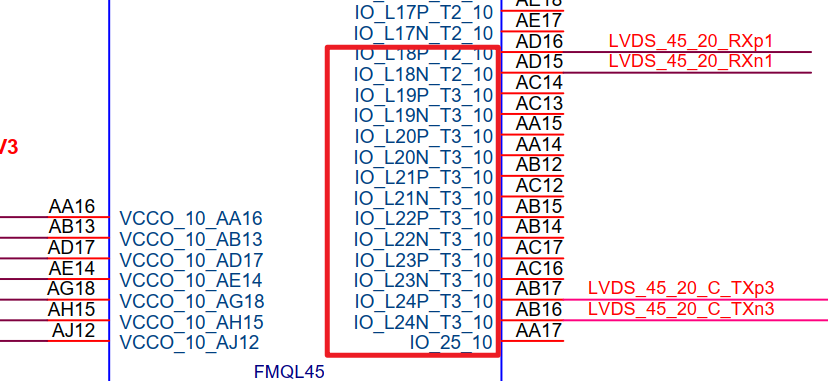
#### A1：
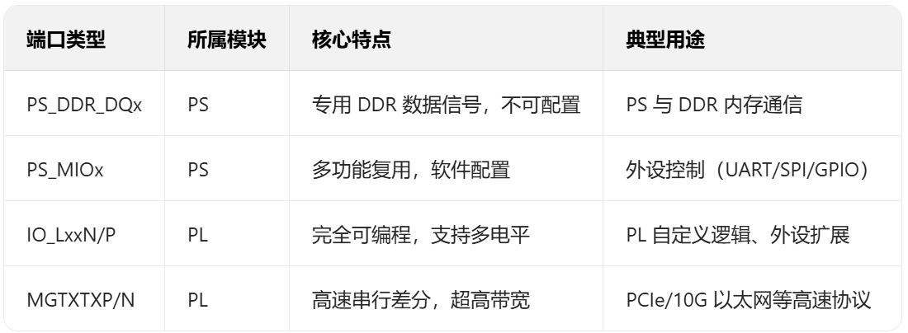


#### Q2：不知道方向的 全部设置成input可以吗
input不需要定义
output需要接线，或者幅值
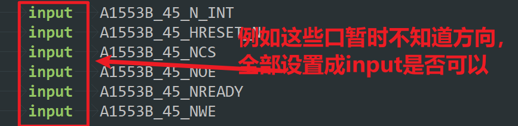
 

#### Q3：ps端的jtag为什么接在了pl上
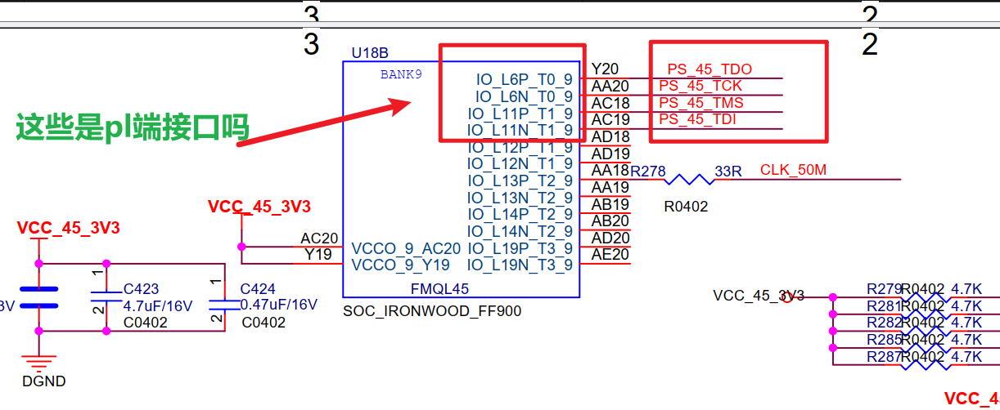


#### Q3：srio ip核创建方法
[【高速接口-RapidIO】Xilinx SRIO IP 核详解-CSDN博客](https://blog.csdn.net/u014586651/article/details/113988738)


#### Q4：分配引脚时有如下报错，可忽视
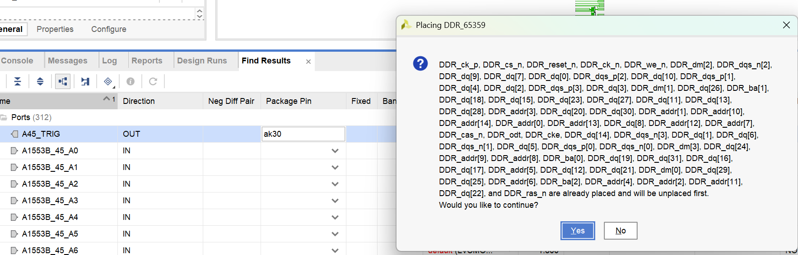


#### Q5：IO口管脚分配问题，分配管脚时遇到invalid placement site问题
是打开分配引脚的界面错误导致
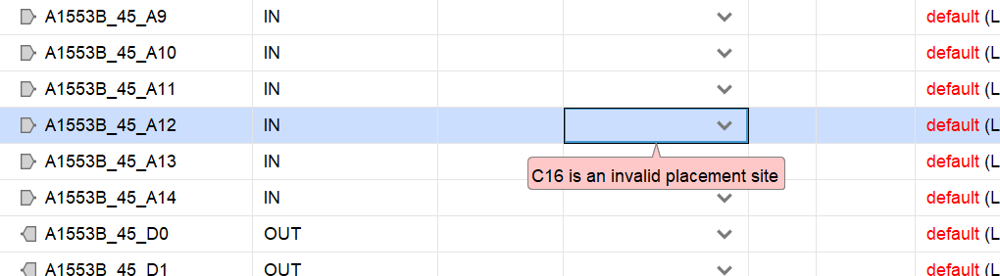
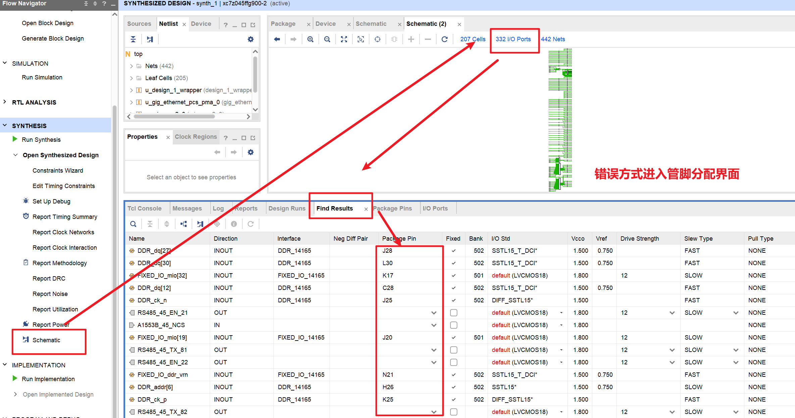
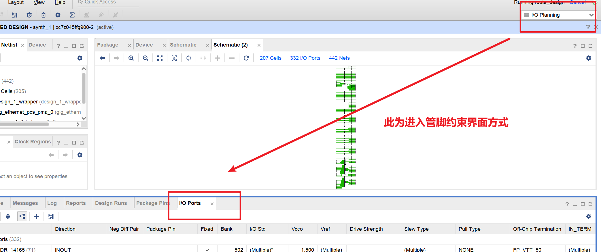

#### Q6：生成bit流失败，证书过期，加密ip核无法使用
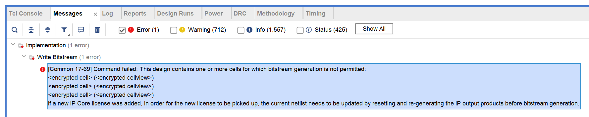
更新liscene以后还是没法使用，需要去官网申请，也无效
申请流程如下
[[Common 17-69] Command failed: This design contains one or more cells for which bitstream generation-CSDN博客](https://blog.csdn.net/u011565038/article/details/139621955)

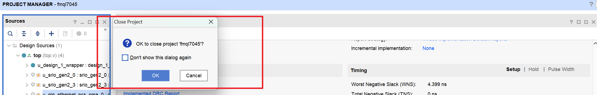
最后发现是补上加密的ip核的licence以后，<font color="#ff0000">需要再重新生成一下ip核才可以</font>
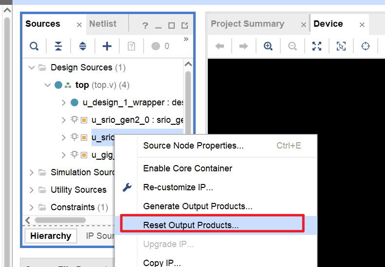


```c

`timescale 1ns / 1ps
//////////////////////////////////////////////////////////////////////////////////
// Company: 
// Engineer: 
// 
// Create Date: 2026/01/04 20:28:11
// Design Name: 
// Module Name: Top
// Project Name: 
// Target Devices: 
// Tool Versions: 
// Description: 
// 
// Dependencies: 
// 
// Revision:
// Revision 0.01 - File Created
// Additional Comments:
// 
//////////////////////////////////////////////////////////////////////////////////
module top(
	inout 	[14:0]	DDR_addr			,
	inout 	[2:0]	DDR_ba				,
	inout 			DDR_cas_n			,
	inout 			DDR_ck_n			,
	inout 			DDR_ck_p			,
	inout 			DDR_cke			    ,
	inout 			DDR_cs_n			,
	inout 	[3:0]	DDR_dm				,
	inout 	[31:0]	DDR_dq				,
	inout 	[3:0]	DDR_dqs_n			,
	inout 	[3:0]	DDR_dqs_p			,
	inout 			DDR_odt			    ,
	inout 			DDR_ras_n			,
	inout 			DDR_reset_n		    ,
	inout 			DDR_we_n			,
	inout 			FIXED_IO_ddr_vrn	,
	inout 			FIXED_IO_ddr_vrp	,
	inout 	[53:0]	FIXED_IO_mio		,
	inout 			FIXED_IO_ps_clk	    ,
	inout 			FIXED_IO_ps_porb	,
	inout 			FIXED_IO_ps_srstb	,

	output	QSFP3_INTL  		,
	output	QSFP3_RESETL		,
	output	QSFP3_SCL   		,
	output	QSFP3_SDA   		,
	output	MODSELL3    		,
	output	LPMOD3      		,
	output	MODPRSL3    		,
	
	output	LVDS_45_20_C_TXp1	,
	output	LVDS_45_20_C_TXn1	,
	output	LVDS_45_20_C_TXp2	,
	output	LVDS_45_20_C_TXn2	,
	output	LVDS_45_20_C_TXp3	,
	output	LVDS_45_20_C_TXn3	,
	
	input 	LVDS_45_20_RXp1		,
	input 	LVDS_45_20_RXn1		,
	input 	LVDS_45_20_RXp2		,
	input 	LVDS_45_20_RXn2		,
	input 	LVDS_45_20_RXp3		,
	input 	LVDS_45_20_RXn3		,

	output 	LVDS_45_100_C_TXp1	,
	output 	LVDS_45_100_C_TXn1	,
	output 	LVDS_45_100_C_TXp2	,
	output 	LVDS_45_100_C_TXn2	,
	output 	LVDS_45_100_C_TXp3	,
	output 	LVDS_45_100_C_TXn3	,
	
	input 	LVDS_45_100_RXp1	,
	input 	LVDS_45_100_RXn1	,
	input 	LVDS_45_100_RXp2	,
	input 	LVDS_45_100_RXn2	,
	input 	LVDS_45_100_RXp3	,
	input 	LVDS_45_100_RXn3	,
	
	
	output	UART_45_TX			,
	input	UART_45_RX			,
	output	A45_TRIG  			,
	
	
	output	A1553B_45_D0 		,
	output	A1553B_45_D1 		,
	output	A1553B_45_D2 		,
	output	A1553B_45_D3 		,
	output	A1553B_45_D4 		,
	output	A1553B_45_D5 		,
	output	A1553B_45_D6 		,
	output	A1553B_45_D7 		,
	output	A1553B_45_D8 		,
	output	A1553B_45_D9 		,
	output	A1553B_45_D10		,
	output	A1553B_45_D11		,
	output	A1553B_45_D12		,
	output	A1553B_45_D13		,
	output	A1553B_45_D14		,
	output	A1553B_45_D15		,
	
	input	A1553B_45_A0 		,
	input	A1553B_45_A1 		,
	input	A1553B_45_A2 		,
	input	A1553B_45_A3 		,
	input	A1553B_45_A4 		,
	input	A1553B_45_A5 		,
	input	A1553B_45_A6 		,
	input	A1553B_45_A7 		,
	input	A1553B_45_A8 		,
	input	A1553B_45_A9 		,
	input	A1553B_45_A10		,
	input	A1553B_45_A11		,
	output	A1553B_45_A12		,
	input	A1553B_45_A13		,
	input	A1553B_45_A14		,
	
	input	A1553B_45_N_INT   	,
	input	A1553B_45_HRESET_N	,
	input	A1553B_45_NCS     	,
	input	A1553B_45_NOE     	,
	input	A1553B_45_NREADY  	,
	input	A1553B_45_NWE     	,
	
	
	output 	RS485_45_TX_11 		,
    output 	RS485_45_EN_11 		,
    input  	RS485_45_RX_11 		,
    output 	RS485_45_TX_12 		,
    output 	RS485_45_EN_12 		,
    input  	RS485_45_RX_12 		,
    output 	RS485_45_TX_13 		,
    output 	RS485_45_EN_13 		,
    input  	RS485_45_RX_13 		,
    output 	RS485_45_TX_21 		,
    output 	RS485_45_EN_21 		,
    input  	RS485_45_RX_21 		,
    output 	RS485_45_TX_22 		,
    output 	RS485_45_EN_22 		,
    input  	RS485_45_RX_22 		,
    output 	RS485_45_TX_23 		,
    output 	RS485_45_EN_23 		,
    input  	RS485_45_RX_23 		,
    output 	RS485_45_TX_31 		,
    output 	RS485_45_EN_31 		,
    input  	RS485_45_RX_31 		,
    output 	RS485_45_TX_32 		,
    output 	RS485_45_EN_32 		,
    input  	RS485_45_RX_32 		,
    output 	RS485_45_TX_33 		,
    output 	RS485_45_EN_33 		,
    input  	RS485_45_RX_33 		,
    output 	RS485_45_TX_41 		,
    output 	RS485_45_EN_41 		,
    input  	RS485_45_RX_41 		,
    output 	RS485_45_TX_42 		,
    output 	RS485_45_EN_42 		,
    input  	RS485_45_RX_42 		,
    output 	RS485_45_TX_43 		,
    output 	RS485_45_EN_43 		,
    input  	RS485_45_RX_43 		,
	output 	RS485_45_TX_51 		,
    output 	RS485_45_EN_51 		,
    input  	RS485_45_RX_51 		,
    output 	RS485_45_TX_52 		,
    output 	RS485_45_EN_52 		,
    input  	RS485_45_RX_52 		,
    output 	RS485_45_TX_53 		,
    output 	RS485_45_EN_53 		,
    input  	RS485_45_RX_53 		,
	output 	RS485_45_TX_61 		,
    output 	RS485_45_EN_61 		,
    input  	RS485_45_RX_61 		,
    output 	RS485_45_TX_62 		,
    output 	RS485_45_EN_62 		,
    input  	RS485_45_RX_62 		,
    output 	RS485_45_TX_63 		,
    output 	RS485_45_EN_63 		,
    input  	RS485_45_RX_63 		,
	output 	RS485_45_TX_71 		,
    output 	RS485_45_EN_71 		,
    input  	RS485_45_RX_71 		,
    output 	RS485_45_TX_72 		,
    output 	RS485_45_EN_72 		,
    input  	RS485_45_RX_72 		,
    output 	RS485_45_TX_73 		,
    output 	RS485_45_EN_73 		,
    input  	RS485_45_RX_73 		,
	output 	RS485_45_TX_81 		,
    output 	RS485_45_EN_81 		,
    input  	RS485_45_RX_81 		,
    output 	RS485_45_TX_82 		,
    output 	RS485_45_EN_82 		,
    input  	RS485_45_RX_82 		,
    output 	RS485_45_TX_83 		,
    output 	RS485_45_EN_83 		,
    input  	RS485_45_RX_83 		,
	
	input  	RS422_45_RX_1		,
	output 	RS422_45_TX_1		,
	input  	RS422_45_RX_2		,
	output 	RS422_45_TX_2		,
	input  	RS422_45_RX_3		,
	output 	RS422_45_TX_3		,
	input  	RS422_45_RX_4		,
	output 	RS422_45_TX_4		,
	input  	RS422_45_RX_5		,
	output 	RS422_45_TX_5		,
	input  	RS422_45_RX_6		,
	output 	RS422_45_TX_6		,
	input  	RS422_45_RX_7		,
	output 	RS422_45_TX_7		,
	input  	RS422_45_RX_8		,
	output 	RS422_45_TX_8		,
	output	PUDC_B       		,
	
	
	output 	SRIO1_TXp_0  		,
	output 	SRIO1_TXn_0  		,
	input 	SRIO1_RXp_0  		,
	input 	SRIO1_RXn_0  		,
	output 	SRIO1_TXp_1  		,
	output 	SRIO1_TXn_1  		,
	input 	SRIO1_RXp_1  		,
	input 	SRIO1_RXn_1  		,
	output 	SRIO1_TXp_2  		,
	output 	SRIO1_TXn_2  		,
	input 	SRIO1_RXp_2  		,
	input 	SRIO1_RXn_2  		,
	output 	SRIO1_TXp_3  		,
	output 	SRIO1_TXn_3  		,
	input 	SRIO1_RXp_3  		,
	input 	SRIO1_RXn_3  		,
	input 	Y3_156_25M_P 		,
	input 	Y3_156_25M_N 		,
	
	output 	SRIO3_TXp_0 		,
	output 	SRIO3_TXn_0 		,
	input 	SRIO3_RXp_0 		,
	input 	SRIO3_RXn_0 		,
	output 	SRIO3_TXp_1 		,
	output 	SRIO3_TXn_1 		,
	input 	SRIO3_RXp_1 		,
	input 	SRIO3_RXn_1 		,
	output 	SRIO3_TXp_2 		,
	output 	SRIO3_TXn_2 		,
	input 	SRIO3_RXp_2 		,
	input 	SRIO3_RXn_2 		,
	output 	SRIO3_TXp_3 		,
	output 	SRIO3_TXn_3 		,
	input 	SRIO3_RXp_3 		,
	input 	SRIO3_RXn_3 		,
	input 	Y2_156_25M_P		,
	input 	Y2_156_25M_N		,	  

	output 	SGMII_TXP_2 		,
	output 	SGMII_TXN_2 		,
	input 	SGMII_RXP_2 		,
	input 	SGMII_RXN_2 		,
	input 	Y5_125M_P   		,
	input 	Y5_125M_N			
);

	assign	QSFP3_INTL  		=	'b0					;
	assign	QSFP3_RESETL		=	'b0					;
	assign	QSFP3_SCL   		=	'b0					;
	assign	QSFP3_SDA   		=	'b0					;
	assign	MODSELL3    		=	'b0					;
	assign	LPMOD3      		=	'b0					;
	assign	MODPRSL3    		=	'b0					;

	assign	LVDS_45_20_C_TXp1	=	LVDS_45_20_RXp1		;
	assign	LVDS_45_20_C_TXn1	=	LVDS_45_20_RXn1		;
	assign	LVDS_45_20_C_TXp2	=	LVDS_45_20_RXp2		;
	assign	LVDS_45_20_C_TXn2	=	LVDS_45_20_RXn2		;
	assign	LVDS_45_20_C_TXp3	=	LVDS_45_20_RXp3		;
	assign	LVDS_45_20_C_TXn3	=	LVDS_45_20_RXn3		;
	
	assign	LVDS_45_100_C_TXp1	=	LVDS_45_100_RXp1	;
	assign	LVDS_45_100_C_TXn1	=	LVDS_45_100_RXn1	;
	assign	LVDS_45_100_C_TXp2	=	LVDS_45_100_RXp2	;
	assign	LVDS_45_100_C_TXn2	=	LVDS_45_100_RXn2	;
	assign	LVDS_45_100_C_TXp3	=	LVDS_45_100_RXp3	;
	assign	LVDS_45_100_C_TXn3	=	LVDS_45_100_RXn3	;
	
	assign	UART_45_TX		=	UART_45_RX				;
	assign	A45_TRIG		=	'b0						;
	
	assign 	A1553B_45_D0	=	A1553B_45_A0            ;
	assign 	A1553B_45_D1	=	A1553B_45_A1            ;
	assign 	A1553B_45_D2	=	A1553B_45_A2            ;
	assign 	A1553B_45_D3	=	A1553B_45_A3            ;
	assign 	A1553B_45_D4	=	A1553B_45_A4            ;
	assign 	A1553B_45_D5	=	A1553B_45_A5            ;
	assign 	A1553B_45_D6	=	A1553B_45_A6            ;
	assign 	A1553B_45_D7	=	A1553B_45_A7            ;
	assign 	A1553B_45_D8	=	A1553B_45_A8            ;
	assign 	A1553B_45_D9	=	A1553B_45_A9            ;
	assign 	A1553B_45_D10	=	A1553B_45_A10           ;
	assign 	A1553B_45_D11	=	A1553B_45_A11           ;
	assign 	A1553B_45_D12	=	'b0						;
	assign	A1553B_45_A12	=	'b0						;
	assign 	A1553B_45_D13	=	A1553B_45_A13           ;
	assign 	A1553B_45_D14	=	A1553B_45_A14           ;
	assign 	A1553B_45_D15	=	A1553B_45_N_INT & A1553B_45_HRESET_N & A1553B_45_NCS & A1553B_45_NOE & A1553B_45_NREADY & A1553B_45_NWE	;


	assign	RS485_45_TX_11	=   RS485_45_RX_11          ;
	assign	RS485_45_TX_12	=   RS485_45_RX_12          ;
	assign	RS485_45_TX_13	=   RS485_45_RX_13          ;
	assign	RS485_45_TX_21	=   RS485_45_RX_21          ;
	assign	RS485_45_TX_22	=   RS485_45_RX_22          ;
	assign	RS485_45_TX_23	=   RS485_45_RX_23          ;
	assign	RS485_45_TX_31	=   RS485_45_RX_31          ;
	assign	RS485_45_TX_32	=   RS485_45_RX_32          ;
	assign	RS485_45_TX_33	=   RS485_45_RX_33          ;
	assign	RS485_45_TX_41	=   RS485_45_RX_41          ;
	assign	RS485_45_TX_42	=   RS485_45_RX_42          ;
	assign	RS485_45_TX_43	=   RS485_45_RX_43          ;

	assign	RS485_45_EN_11	=   RS485_45_RX_11          ;
	assign	RS485_45_EN_12	=   RS485_45_RX_12          ;
	assign	RS485_45_EN_13	=   RS485_45_RX_13          ;
	assign	RS485_45_EN_21	=   RS485_45_RX_21          ;
	assign	RS485_45_EN_22	=   RS485_45_RX_22          ;
	assign	RS485_45_EN_23	=   RS485_45_RX_23          ;
	assign	RS485_45_EN_31	=   RS485_45_RX_31          ;
	assign	RS485_45_EN_32	=   RS485_45_RX_32          ;
	assign	RS485_45_EN_33	=   RS485_45_RX_33          ;
	assign	RS485_45_EN_41	=   RS485_45_RX_41          ;
	assign	RS485_45_EN_42	=   RS485_45_RX_42          ;
	assign	RS485_45_EN_43	=   RS485_45_RX_43          ;

	assign	RS485_45_TX_51	=   RS485_45_RX_51          ;
	assign	RS485_45_TX_52	=   RS485_45_RX_52          ;
	assign	RS485_45_TX_53	=   RS485_45_RX_53          ;
	assign	RS485_45_TX_61	=   RS485_45_RX_61          ;
	assign	RS485_45_TX_62	=   RS485_45_RX_62          ;
	assign	RS485_45_TX_63	=   RS485_45_RX_63          ;
	assign	RS485_45_TX_71	=   RS485_45_RX_71          ;
	assign	RS485_45_TX_72	=   RS485_45_RX_72          ;
	assign	RS485_45_TX_73	=   RS485_45_RX_73          ;
	assign	RS485_45_TX_81	=   RS485_45_RX_81          ;
	assign	RS485_45_TX_82	=   RS485_45_RX_82          ;
	assign	RS485_45_TX_83	=   RS485_45_RX_83          ;

	assign	RS485_45_EN_51	=   RS485_45_RX_51          ;
	assign	RS485_45_EN_52	=   RS485_45_RX_52          ;
	assign	RS485_45_EN_53	=   RS485_45_RX_53          ;
	assign	RS485_45_EN_61	=   RS485_45_RX_61          ;
	assign	RS485_45_EN_62	=   RS485_45_RX_62          ;
	assign	RS485_45_EN_63	=   RS485_45_RX_63          ;
	assign	RS485_45_EN_71	=   RS485_45_RX_71          ;
	assign	RS485_45_EN_72	=   RS485_45_RX_72          ;
	assign	RS485_45_EN_73	=   RS485_45_RX_73          ;
	assign	RS485_45_EN_81	=   RS485_45_RX_81          ;
	assign	RS485_45_EN_82	=   RS485_45_RX_82          ;
	assign	RS485_45_EN_83	=   RS485_45_RX_83          ;
	
	
	assign	RS422_45_TX_1	=   RS422_45_RX_1           ;  
	assign	RS422_45_TX_2	=   RS422_45_RX_2           ;   
	assign	RS422_45_TX_3	=   RS422_45_RX_3           ;  
	assign	RS422_45_TX_4	=   RS422_45_RX_4           ; 
	assign	RS422_45_TX_5	=   RS422_45_RX_5           ;  
	assign	RS422_45_TX_6	=   RS422_45_RX_6           ;   
	assign	RS422_45_TX_7	=   RS422_45_RX_7           ;  
	assign	RS422_45_TX_8	=   RS422_45_RX_8           ; 
	
	assign 	PUDC_B			= 	'b0						;

design_1_wrapper u_design_1_wrapper(
	.DDR_addr				(DDR_addr			),
    .DDR_ba					(DDR_ba				),
    .DDR_cas_n				(DDR_cas_n			),
    .DDR_ck_n				(DDR_ck_n			),
    .DDR_ck_p				(DDR_ck_p			),
    .DDR_cke				(DDR_cke			),
    .DDR_cs_n				(DDR_cs_n			),
    .DDR_dm					(DDR_dm				),
    .DDR_dq					(DDR_dq				),
    .DDR_dqs_n				(DDR_dqs_n			),
    .DDR_dqs_p				(DDR_dqs_p			),
    .DDR_odt				(DDR_odt			),
    .DDR_ras_n				(DDR_ras_n			),
    .DDR_reset_n			(DDR_reset_n		),
    .DDR_we_n				(DDR_we_n			),
    .FIXED_IO_ddr_vrn		(FIXED_IO_ddr_vrn	),
    .FIXED_IO_ddr_vrp		(FIXED_IO_ddr_vrp	),
    .FIXED_IO_mio			(FIXED_IO_mio		),
    .FIXED_IO_ps_clk		(FIXED_IO_ps_clk	),
    .FIXED_IO_ps_porb		(FIXED_IO_ps_porb	),
    .FIXED_IO_ps_srstb		(FIXED_IO_ps_srstb	)
);


srio_gen2_0  u_srio_gen2_0(
    // Clocks and Resets
    .sys_clkp  							(Y3_156_25M_P),       	// System reference clock
    .sys_clkn  							(Y3_156_25M_N),       	// MMCM reference clock
    .sys_rst   							(1'b1),       	// Global reset signal
    // all clocks as output
    .log_clk_out   						(),       	// LOG interface clock
    .phy_clk_out   						(),       	// PHY interface clock
    .gt_clk_out    						(),	
    .gt_pcs_clk_out						(),       	// GT fabric interface clock
    .drpclk_out    						(),
    .refclk_out    						(),
    .clk_lock_out  						(),
    // all resets as output
    .cfg_rst_out   						(),
    .log_rst_out   						(),          	// Reset for LOG clock Domain
    .buf_rst_out   						(),	
    .phy_rst_out   						(),          	// Reset for PHY clock Domain
    .gt_pcs_rst_out						(),
    // QPLL outputs
    .gt0_qpll_clk_out       				(),
    .gt0_qpll_out_refclk_out				(),
//---------------------------------------------
    // Serial IO Interface
    .srio_rxn0							(SRIO1_RXn_0),        	// Serial Receive Data
    .srio_rxp0							(SRIO1_RXp_0),        	// Serial Receive Data
    .srio_rxn1							(SRIO1_RXn_1),        	// Serial Receive Data
    .srio_rxp1							(SRIO1_RXp_1),        	// Serial Receive Data
    .srio_rxn2							(SRIO1_RXn_2),        	// Serial Receive Data
    .srio_rxp2							(SRIO1_RXp_2),        	// Serial Receive Data
    .srio_rxn3							(SRIO1_RXn_3),        	// Serial Receive Data
    .srio_rxp3							(SRIO1_RXp_3),        	// Serial Receive Data
	
    .srio_txn0							(SRIO1_TXn_0),        	// Serial Transmit Data
    .srio_txp0							(SRIO1_TXp_0),        	// Serial Transmit Data
    .srio_txn1							(SRIO1_TXn_1),        	// Serial Transmit Data
    .srio_txp1							(SRIO1_TXp_1),        	// Serial Transmit Data
    .srio_txn2							(SRIO1_TXn_2),        	// Serial Transmit Data
    .srio_txp2							(SRIO1_TXp_2),        	// Serial Transmit Data
    .srio_txn3							(SRIO1_TXn_3),        	// Serial Transmit Data
    .srio_txp3							(SRIO1_TXp_3),        	// Serial Transmit Data
    // LOG User I/O Interface
    .s_axis_ireq_tvalid					('b0	),          	// Indicates Valid Input on the Request Channel
    .s_axis_ireq_tready					(		),          	// Beat has been accepted
    .s_axis_ireq_tlast					('b0	),         	// Indicates last beat
    .s_axis_ireq_tdata					('b0	),         	// Req Data Bus
    .s_axis_ireq_tkeep					('b0	),         	// Req Keep Bus
    .s_axis_ireq_tuser					('b0	),         	// Req User Bus

    .m_axis_iresp_tvalid				(),         	// Indicates Valid Output on the Response Channel
    .m_axis_iresp_tready				('b0),         	// Beat has been accepted
    .m_axis_iresp_tlast					(),         	// Indicates last beat
    .m_axis_iresp_tdata					(),         	// Resp Data Bus
    .m_axis_iresp_tkeep					(),         	// Resp Keep Bus
    .m_axis_iresp_tuser					(),         	// Resp User Bus

    .m_axis_treq_tvalid					(),         	// Indicates Valid Output on the Response Channel
    .m_axis_treq_tready					('b0),         	// Beat has been accepted
    .m_axis_treq_tlast					(),          	// Indicates last beat
    .m_axis_treq_tdata					(),          	// Resp Data Bus
    .m_axis_treq_tkeep					(),          	// Resp Keep Bus
    .m_axis_treq_tuser					(),          	// Resp User Bus

    .s_axis_tresp_tvalid				('b0),         	// Indicates Valid Input on the Request Channel
    .s_axis_tresp_tready				(),         	// Beat has been accepted
    .s_axis_tresp_tlast					('b0),       	// Indicates last beat
    .s_axis_tresp_tdata					('b0),       	// Req Data Bus
    .s_axis_tresp_tkeep					('b0),       	// Req Keep Bus
    .s_axis_tresp_tuser					('b0),       	// Req User Bus

    .s_axi_maintr_rst					('b0),        	// Reset for maintr interface, on LOG clk domain

    // Maintenance Port Interface
    .s_axi_maintr_awvalid				('b0),      		// Write Command Valid
    .s_axi_maintr_awready				(),       	// Write Port Ready
    .s_axi_maintr_awaddr				('b0),           // Write Address
    .s_axi_maintr_wvalid				('b0),           // Write Data Valid
    .s_axi_maintr_wready				(),           // Write Port Ready
    .s_axi_maintr_wdata					('b0),         	// Write Data
    .s_axi_maintr_bvalid				(),           // Write Response Valid
    .s_axi_maintr_bready				('b0),           // Write Response Fabric Ready
    .s_axi_maintr_bresp					(),        	// Write Response

    .s_axi_maintr_arvalid				('b0),        	// Read Command Valid
    .s_axi_maintr_arready				(),        	// Read Port Ready
    .s_axi_maintr_araddr				('b0),           // Read Address
    .s_axi_maintr_rvalid				(),           // Read Response Valid
    .s_axi_maintr_rready				('b0),           // Read Response Fabric Ready
    .s_axi_maintr_rdata					(),          	// Read Data
    .s_axi_maintr_rresp					(),         	// Read Response
    // PHY control signals
    .sim_train_en						('b0),       	// Reduce timers for inialization for simulation
    .force_reinit						('b0),       	// Force reinitialization
    .phy_mce							('b0),        	// Send MCE control symbol
    .phy_link_reset						('b0),          	// Send link reset control symbols
    // core debug signals
    .phy_rcvd_mce       				(),       	// MCE control symbol received
    .phy_rcvd_link_reset				(),     		// Received 4 consecutive reset symbols
    .phy_debug          				(),         	// Useful debug signals
    .gtrx_disperr_or    				(),         	// GT disparity error (reduce ORed)
    .gtrx_notintable_or 				(),     		// GT not in table error (reduce ORed)
	// side band signals
    .port_error							(),          	// In Port Error State
    .port_timeout						(),        	// Timeout value from Port Response Timeout CSR
    .srio_host							(),        	// Endpoint is the system host
    // LOG Informational signals
    .port_decode_error					(),       	// Received transaction did not match a valid port
    .deviceid         					(),       	// Device ID
    .idle2_selected						(),          	// The PHY is operating in IDLE2 mode
    .phy_lcl_master_enable_out    		(),
    .buf_lcl_response_only_out    		(),
    .buf_lcl_tx_flow_control_out  		(),
    .buf_lcl_phy_buf_stat_out     		(),
    .phy_lcl_phy_next_fm_out      		(),
    .phy_lcl_phy_last_ack_out     		(),
    .phy_lcl_phy_rewind_out       		(),
    .phy_lcl_phy_rcvd_buf_stat_out		(),
    .phy_lcl_maint_only_out       		(),
    // PHY Informational signals
    .port_initialized					(),        	// Port is intialized
    .link_initialized					(),        	// Ready to transmit data
    .idle_selected						(),        	// The IDLE sequence has been selected
    .mode_1x                  			()			// Link is trained down to 1x mode
);


srio_gen2_3  u_srio_gen2_3(
    // Clocks and Resets
    .sys_clkp  							(Y2_156_25M_P),       	// System reference clock
    .sys_clkn  							(Y2_156_25M_N),       	// MMCM reference clock
    .sys_rst   							(1'b1),       	// Global reset signal
    // all clocks as output
    .log_clk_out   						(),       	// LOG interface clock
    .phy_clk_out   						(),       	// PHY interface clock
    .gt_clk_out    						(),	
    .gt_pcs_clk_out						(),       	// GT fabric interface clock
    .drpclk_out    						(),
    .refclk_out    						(),
    .clk_lock_out  						(),
    // all resets as output
    .cfg_rst_out   						(),
    .log_rst_out   						(),          	// Reset for LOG clock Domain
    .buf_rst_out   						(),	
    .phy_rst_out   						(),          	// Reset for PHY clock Domain
    .gt_pcs_rst_out						(),
    // QPLL outputs
    .gt0_qpll_clk_out       				(),
    .gt0_qpll_out_refclk_out				(),
//---------------------------------------------
    // Serial IO Interface
    .srio_rxn0							(SRIO3_RXn_0),        	// Serial Receive Data
    .srio_rxp0							(SRIO3_RXp_0),        	// Serial Receive Data
    .srio_rxn1							(SRIO3_RXn_1),        	// Serial Receive Data
    .srio_rxp1							(SRIO3_RXp_1),        	// Serial Receive Data
    .srio_rxn2							(SRIO3_RXn_2),        	// Serial Receive Data
    .srio_rxp2							(SRIO3_RXp_2),        	// Serial Receive Data
    .srio_rxn3							(SRIO3_RXn_3),        	// Serial Receive Data
    .srio_rxp3							(SRIO3_RXp_3),        	// Serial Receive Data
	
    .srio_txn0							(SRIO3_TXn_0),        	// Serial Transmit Data
    .srio_txp0							(SRIO3_TXp_0),        	// Serial Transmit Data
    .srio_txn1							(SRIO3_TXn_1),        	// Serial Transmit Data
    .srio_txp1							(SRIO3_TXp_1),        	// Serial Transmit Data
    .srio_txn2							(SRIO3_TXn_2),        	// Serial Transmit Data
    .srio_txp2							(SRIO3_TXp_2),        	// Serial Transmit Data
    .srio_txn3							(SRIO3_TXn_3),        	// Serial Transmit Data
    .srio_txp3							(SRIO3_TXp_3),        	// Serial Transmit Data

    // LOG User I/O Interface
    .s_axis_ireq_tvalid					('b0),          	// Indicates Valid Input on the Request Channel
    .s_axis_ireq_tready					(),          	// Beat has been accepted
    .s_axis_ireq_tlast					('b0),         	// Indicates last beat
    .s_axis_ireq_tdata					('b0),         	// Req Data Bus
    .s_axis_ireq_tkeep					('b0),         	// Req Keep Bus
    .s_axis_ireq_tuser					('b0),         	// Req User Bus

    .m_axis_iresp_tvalid				(),         	// Indicates Valid Output on the Response Channel
    .m_axis_iresp_tready				('b0),         	// Beat has been accepted
    .m_axis_iresp_tlast					(),         	// Indicates last beat
    .m_axis_iresp_tdata					(),         	// Resp Data Bus
    .m_axis_iresp_tkeep					(),         	// Resp Keep Bus
    .m_axis_iresp_tuser					(),         	// Resp User Bus

    .m_axis_treq_tvalid					(),         	// Indicates Valid Output on the Response Channel
    .m_axis_treq_tready					('b0),         	// Beat has been accepted
    .m_axis_treq_tlast					(),          	// Indicates last beat
    .m_axis_treq_tdata					(),          	// Resp Data Bus
    .m_axis_treq_tkeep					(),          	// Resp Keep Bus
    .m_axis_treq_tuser					(),          	// Resp User Bus

    .s_axis_tresp_tvalid				('b0),         	// Indicates Valid Input on the Request Channel
    .s_axis_tresp_tready				(),         	// Beat has been accepted
    .s_axis_tresp_tlast					('b0),       	// Indicates last beat
    .s_axis_tresp_tdata					('b0),       	// Req Data Bus
    .s_axis_tresp_tkeep					('b0),       	// Req Keep Bus
    .s_axis_tresp_tuser					('b0),       	// Req User Bus

    .s_axi_maintr_rst					('b0),        	// Reset for maintr interface, on LOG clk domain

    // Maintenance Port Interface
    .s_axi_maintr_awvalid				('b0),      		// Write Command Valid
    .s_axi_maintr_awready				(),       	// Write Port Ready
    .s_axi_maintr_awaddr				('b0),           // Write Address
    .s_axi_maintr_wvalid				('b0),           // Write Data Valid
    .s_axi_maintr_wready				(),           // Write Port Ready
    .s_axi_maintr_wdata					('b0),         	// Write Data
    .s_axi_maintr_bvalid				(),           // Write Response Valid
    .s_axi_maintr_bready				('b0),           // Write Response Fabric Ready
    .s_axi_maintr_bresp					(),        	// Write Response

    .s_axi_maintr_arvalid				('b0),        	// Read Command Valid
    .s_axi_maintr_arready				(),        	// Read Port Ready
    .s_axi_maintr_araddr				('b0),           // Read Address
    .s_axi_maintr_rvalid				(),           // Read Response Valid
    .s_axi_maintr_rready				('b0),           // Read Response Fabric Ready
    .s_axi_maintr_rdata					(),          	// Read Data
    .s_axi_maintr_rresp					(),         	// Read Response
    // PHY control signals
    .sim_train_en						('b0),       	// Reduce timers for inialization for simulation
    .force_reinit						('b0),       	// Force reinitialization
    .phy_mce							('b0),        	// Send MCE control symbol
    .phy_link_reset						('b0),          	// Send link reset control symbols
    // core debug signals
    .phy_rcvd_mce       				(),       	// MCE control symbol received
    .phy_rcvd_link_reset				(),     		// Received 4 consecutive reset symbols
    .phy_debug          				(),         	// Useful debug signals
    .gtrx_disperr_or    				(),         	// GT disparity error (reduce ORed)
    .gtrx_notintable_or 				(),     		// GT not in table error (reduce ORed)
	// side band signals
    .port_error							(),          	// In Port Error State
    .port_timeout						(),        	// Timeout value from Port Response Timeout CSR
    .srio_host							(),        	// Endpoint is the system host
    // LOG Informational signals
    .port_decode_error					(),       	// Received transaction did not match a valid port
    .deviceid         					(),       	// Device ID
    .idle2_selected						(),          	// The PHY is operating in IDLE2 mode
    .phy_lcl_master_enable_out    		(),
    .buf_lcl_response_only_out    		(),
    .buf_lcl_tx_flow_control_out  		(),
    .buf_lcl_phy_buf_stat_out     		(),
    .phy_lcl_phy_next_fm_out      		(),
    .phy_lcl_phy_last_ack_out     		(),
    .phy_lcl_phy_rewind_out       		(),
    .phy_lcl_phy_rcvd_buf_stat_out		(),
    .phy_lcl_maint_only_out       		(),
    // PHY Informational signals
    .port_initialized					(),        	// Port is intialized
    .link_initialized					(),        	// Ready to transmit data
    .idle_selected						(),        	// The IDLE sequence has been selected
    .mode_1x                  			()			// Link is trained down to 1x mode
);


gig_ethernet_pcs_pma_0 u_gig_ethernet_pcs_pma_0(
	// Transceiver Interface
	//----------------------
	.gtrefclk_p						(Y5_125M_P),               
	.gtrefclk_n						(Y5_125M_N),               
	.gtrefclk_out					(),           
	.gtrefclk_bufg_out				(),	
	.txp							(SGMII_TXP_2),                   // Differential +ve of serial transmission from PMA to PMD.
	.txn							(SGMII_TXN_2),                   // Differential -ve of serial transmission from PMA to PMD.
	.rxp							(SGMII_RXP_2),                   // Differential +ve for serial reception from PMD to PMA.
	.rxn							(SGMII_RXN_2),                   // Differential -ve for serial reception from PMD to PMA.
	.resetdone						(),                 // The GT transceiver has completed its reset cycle
	.userclk_out					(),           
	.userclk2_out					(),          
	.rxuserclk_out					(),         
	.rxuserclk2_out					(),        
	.independent_clock_bufg			('b0),
	.pma_reset_out					(),             // transceiver PMA reset signal
	.mmcm_locked_out				(),           // MMCM Locked
	// GMII Interface		
	//---------------		
	.sgmii_clk_r					(),           
	.sgmii_clk_f					(),           
	.sgmii_clk_en					(),          // Clock enable for client MAC
	.gmii_txd						('b0),              // Transmit data from client MAC.
	.gmii_tx_en						('b0),            // Transmit control signal from client MAC.
	.gmii_tx_er						('b0),            // Transmit control signal from client MAC.
	.gmii_rxd						(),              // Received Data to client MAC.
	.gmii_rx_dv						(),            // Received control signal to client MAC.
	.gmii_rx_er						(),            // Received control signal to client MAC.
	.gmii_isolate					(),          // Tristate control to electrically isolate GMII.
	// Management: Alternative to MDIO Interface
	//------------------------------------------
	.configuration_vector			('b0),  // Alternative to MDIO interface.
	.an_interrupt					(),          // Interrupt to processor to signal that Auto-Negotiation has completed
	.an_adv_config_vector			('b0),  // Alternate interface to program REG4 (AN ADV)
	.an_restart_config				('b0),     // Alternate signal to modify AN restart bit in REG0
	// Speed Control		
	//--------------		
	.speed_is_10_100				('b0),       // Core should operate at either 10Mbps or 100Mbps speeds
	.speed_is_100					('b0),          // Core should operate at 100Mbps speed
	// General IO's		
	//-------------		
	.status_vector					(	),         // Core status.
	.reset							('b0),                 // Asynchronous reset for entire core
	.signal_detect					('b0),          // Input from PMD to indicate presence of optical input.
	.gt0_qplloutclk_out				(),
	.gt0_qplloutrefclk_out         	()
);

endmodule


```

