- [IBERT 测试实操笔记（FPGA 高速收发器调试）](08_IBERT%20测试实操笔记（FPGA%20高速收发器调试）.md#IBERT%20测试实操笔记（FPGA%20高速收发器调试）)
- [一、IBERT 核心定义](08_IBERT%20测试实操笔记（FPGA%20高速收发器调试）.md#一、IBERT%20核心定义)
- [二、IBERT IP 核配置](08_IBERT%20测试实操笔记（FPGA%20高速收发器调试）.md#二、IBERT%20IP%20核配置)
- [三、眼图测试基础流程](08_IBERT%20测试实操笔记（FPGA%20高速收发器调试）.md#三、眼图测试基础流程)
- [3.1 前期准备](08_IBERT%20测试实操笔记（FPGA%20高速收发器调试）.md#三、眼图测试基础流程#3.1%20前期准备)
- [3.2 硬件端操作](08_IBERT%20测试实操笔记（FPGA%20高速收发器调试）.md#三、眼图测试基础流程#3.2%20硬件端操作)
- [四、环回模式设置（核心测试步骤）](08_IBERT%20测试实操笔记（FPGA%20高速收发器调试）.md#四、环回模式设置（核心测试步骤）)
- [4.1 近端环回（单端硬件验证，最常用）](08_IBERT%20测试实操笔记（FPGA%20高速收发器调试）.md#四、环回模式设置（核心测试步骤）#4.1%20近端环回（单端硬件验证，最常用）)
	- [4.1.1 链路连接规则](08_IBERT%20测试实操笔记（FPGA%20高速收发器调试）.md#4.1%20近端环回（单端硬件验证，最常用）#4.1.1%20链路连接规则)
	- [4.1.2 配置与测试步骤](08_IBERT%20测试实操笔记（FPGA%20高速收发器调试）.md#4.1%20近端环回（单端硬件验证，最常用）#4.1.2%20配置与测试步骤)
	- [4.1.3 近端回环模式选择（PCS、PMA）](08_IBERT%20测试实操笔记（FPGA%20高速收发器调试）.md#4.1%20近端环回（单端硬件验证，最常用）#4.1.3%20近端回环模式选择（PCS、PMA）)
- [4.2 眼图查看与分析（核心硬件评估依据）](08_IBERT%20测试实操笔记（FPGA%20高速收发器调试）.md#四、环回模式设置（核心测试步骤）#4.2%20眼图查看与分析（核心硬件评估依据）)
	- [4.2.1 眼图创建](08_IBERT%20测试实操笔记（FPGA%20高速收发器调试）.md#4.2%20眼图查看与分析（核心硬件评估依据）#4.2.1%20眼图创建)
	- [4.2.2 眼图颜色含义](08_IBERT%20测试实操笔记（FPGA%20高速收发器调试）.md#4.2%20眼图查看与分析（核心硬件评估依据）#4.2.2%20眼图颜色含义)
	- [4.2.3 眼图核心指标（信号质量判断）](08_IBERT%20测试实操笔记（FPGA%20高速收发器调试）.md#4.2%20眼图查看与分析（核心硬件评估依据）#4.2.3%20眼图核心指标（信号质量判断）)
	- [4.2.4 眼图闭合常见原因（硬件问题定位）](08_IBERT%20测试实操笔记（FPGA%20高速收发器调试）.md#4.2%20眼图查看与分析（核心硬件评估依据）#4.2.4%20眼图闭合常见原因（硬件问题定位）)
- [4.3 远端环回（两端链路互通验证）](08_IBERT%20测试实操笔记（FPGA%20高速收发器调试）.md#四、环回模式设置（核心测试步骤）#4.3%20远端环回（两端链路互通验证）)
	- [4.3.1 链路连接规则](08_IBERT%20测试实操笔记（FPGA%20高速收发器调试）.md#4.3%20远端环回（两端链路互通验证）#4.3.1%20链路连接规则)
	- [4.3.2 配置与测试步骤](08_IBERT%20测试实操笔记（FPGA%20高速收发器调试）.md#4.3%20远端环回（两端链路互通验证）#4.3.2%20配置与测试步骤)
- [五、实际项目上板测试](08_IBERT%20测试实操笔记（FPGA%20高速收发器调试）.md#五、实际项目上板测试)
- [5.1 SRIO 4X 接口测试](08_IBERT%20测试实操笔记（FPGA%20高速收发器调试）.md#五、实际项目上板测试#5.1%20SRIO%204X%20接口测试)
- [5.2 SGMII 接口测试](08_IBERT%20测试实操笔记（FPGA%20高速收发器调试）.md#五、实际项目上板测试#5.2%20SGMII%20接口测试)
- [5.3 测试过程中遇到的问题](08_IBERT%20测试实操笔记（FPGA%20高速收发器调试）.md#五、实际项目上板测试#5.3%20测试过程中遇到的问题)

### IBERT 测试实操笔记（FPGA 高速收发器调试）

**适用平台**：Xilinx FPGA/ZYNQ 7 系列

**测试对象**：GTX 高速收发器、SRIO 4X、SGMII 接口

**核心用途**：验证高速串行收发器通断、通信性能及硬件信号质量

## 一、IBERT 核心定义

IBERT（Integrated Bit Error Ratio Tester）是 Xilinx 官方提供的**集成比特误码率测试仪**，可利用 FPGA 内部资源，快速测试板卡上高速串行收发器的工作状态，判断高速接口设计的硬件问题。

核心能力：

- 检测 FPGA 中 GTX 收发器的通断、链路协商状态
- 评估通信性能，误码率检测精度可达**10⁻¹²**级别
- 生成眼图、查看实时误码率，定位硬件信号质量问题

## 二、IBERT IP 核配置

IP 核配置为基础步骤，按工具默认参 数即可完成基础测试，无需额外修改（配置界面关键截图如下）：

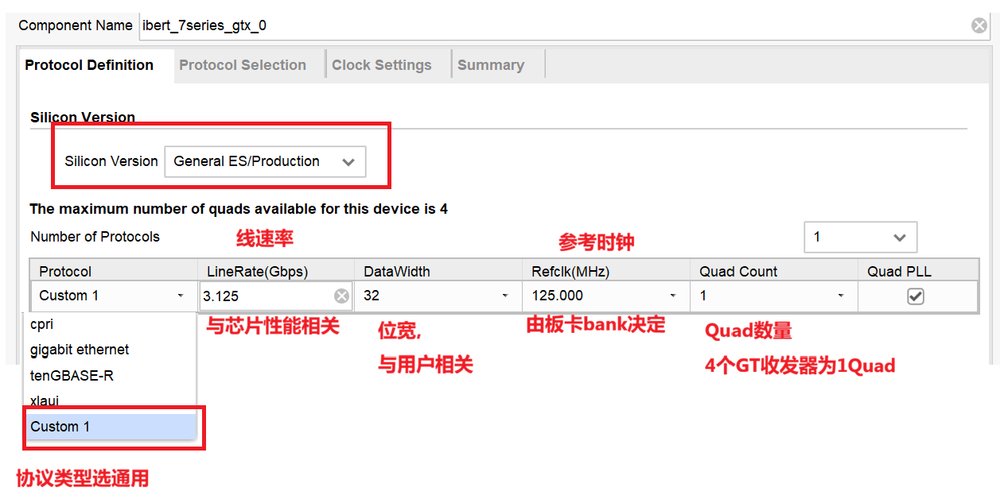

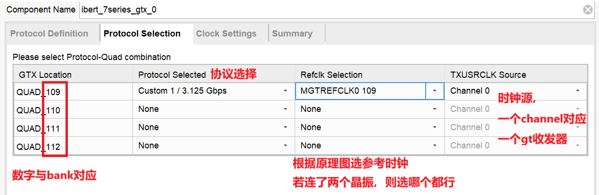

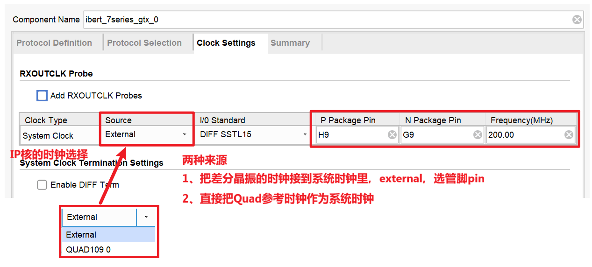

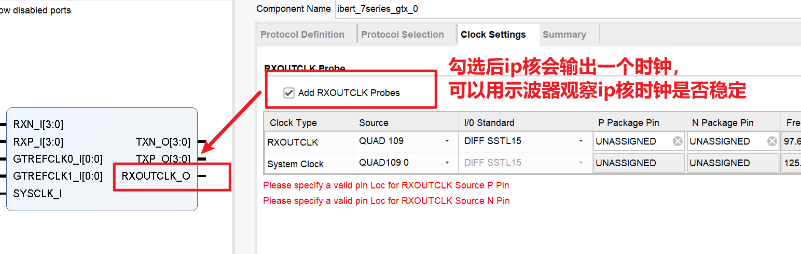

## 三、眼图测试基础流程

### 3.1 前期准备

1. IP 核配置完成后，**保持 example 参数默认**，直接生成比特流并下载至开发板
2. 将需要测试的高速信号引脚映射至 example 模块，添加对应的引脚约束

### 3.2 硬件端操作

1. 开发板上电，打开 Vivado **硬件管理器**，下载生成的比特流程序
2. 硬件连接成功后，已完成 link 协商的收发器，会在界面中**显示实际工作速率**
    
    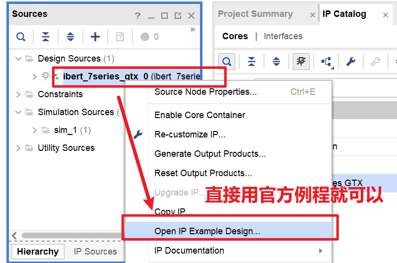
    
    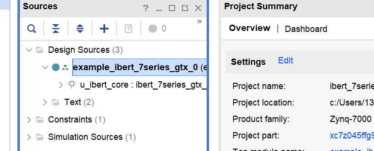
    
    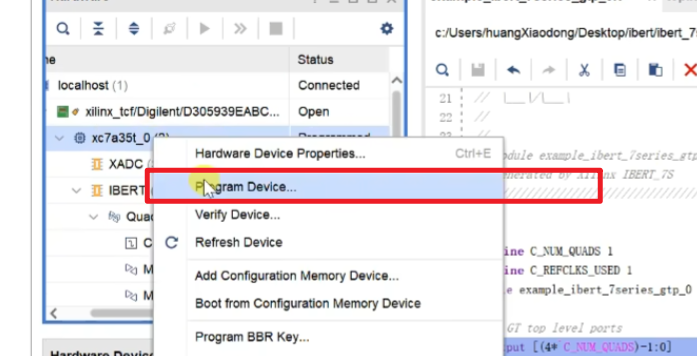
    
    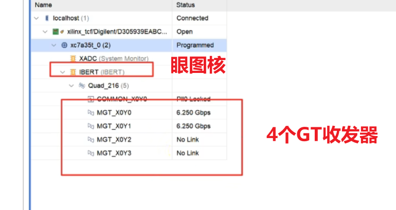

## 四、环回模式设置（核心测试步骤）

IBERT 支持**近端环回**和**远端环回**两种模式，分别适用于单端硬件验证、两端链路互通验证，需在链路配置界面选择对应模式：

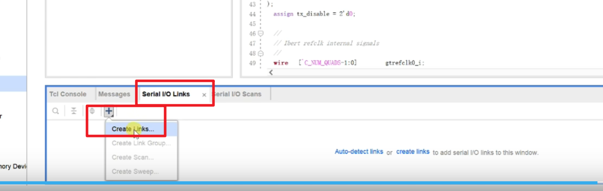

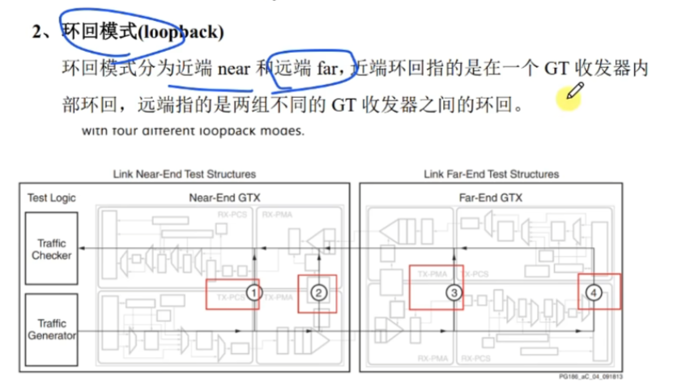

### 4.1 近端环回（单端硬件验证，最常用）

#### 4.1.1 链路连接规则

同一路收发器的发送端与接收端直接连接：

- 0 通道：发送 0 → 接收 0
- 1 通道：发送 1 → 接收 1

#### 4.1.2 配置与测试步骤

1. 按上述规则连接链路，界面将实时显示当前**误码率**
2. 在`lookbake mode`中选择近端环回模式（Near），近端包含**PCS 层**和**PMA 层**两种细分模式
3. 模式设置完成后，**重新复位链路**，消除初始误码率，即可开始正式测试
    
    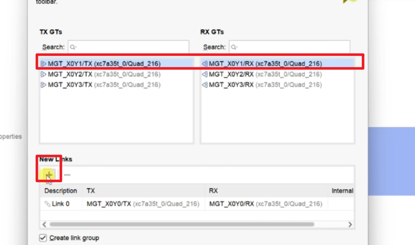
    
    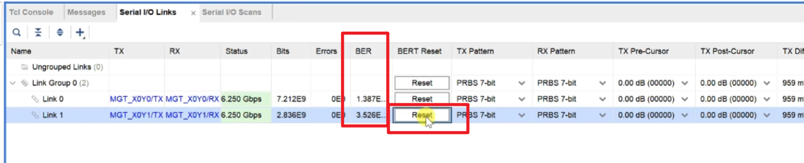
    
    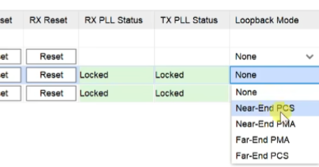

#### 4.1.3 近端回环模式选择（PCS、PMA）

**环回点**：PCS 层编码后、串并转换前（纯数字域，不经过高速物理层）

**信号路径**：`用户数据 → PCS层编码 → 环回开关 → PCS层解码 → 接收端`

**特点**：仅验证 PCS 层数字逻辑，无法反映硬件信号质量，眼图为纯红色（无有效高速信号）

**结论**：所以在此次测试中要选择PMA测试才会有效

### 4.2 眼图查看与分析（核心硬件评估依据）

#### 4.2.1 眼图创建

在 Vivado IBERT 界面中，**选中已 link 的链路**，右键选择「创建眼图」，即可生成实时信号眼图

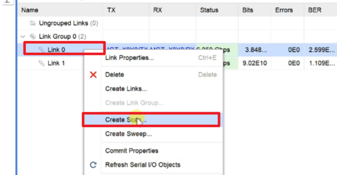

#### 4.2.2 眼图颜色含义

- **蓝色区域**：无错码，代表该时段信号传输正常
- **红色区域**：存在错码，代表信号传输异常

> ✅ 核心结论：**蓝色区域占比越大，硬件信号质量越好；红色区域过多，说明硬件存在明显问题**

#### 4.2.3 眼图核心指标（信号质量判断）

眼图是叠加多个比特周期的信号波形形成的图形，因形似 “眼睛” 得名，核心反映 4 个关键信息：

1. **眼高**：垂直方向开口高度 → 代表噪声容限，开口越大，抗噪声能力越强
2. **眼宽**：水平方向开口宽度 → 代表时序容限，宽度越大，对时钟抖动的容忍度越高
3. **抖动**：眼图边缘的模糊程度 → 分随机抖动 / 确定性抖动，抖动越大，误码率越高
4. **噪声**：眼图整体闭合程度 → 由电源噪声、信号串扰等因素引起，噪声越大，眼图越容易闭合

#### 4.2.4 眼图闭合常见原因（硬件问题定位）

1. 阻抗不匹配 → 信号反射，眼图出现重影
2. 高频损耗 → PCB 走线过长 / 板材损耗，信号边沿变缓
3. 时钟抖动 → 时钟源不稳定，眼图水平方向收缩
4. 串扰 / 噪声 → 相邻高速信号干扰，眼图垂直方向闭合
    
    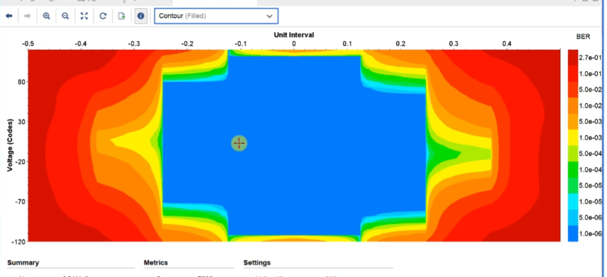
    
    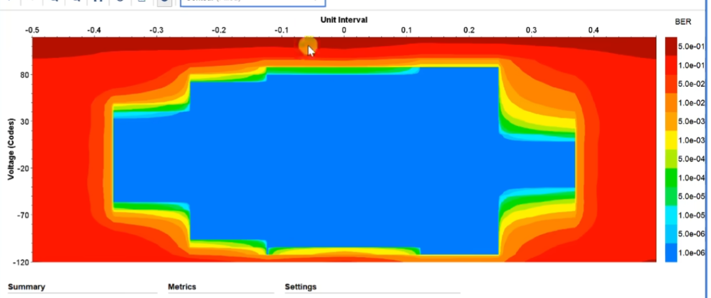

### 4.3 远端环回（两端链路互通验证）

#### 4.3.1 链路连接规则

两个通道交叉收发，实现双向链路验证：

- 0 通道发送 → 1 通道接收
- 1 通道发送 → 0 通道接收

#### 4.3.2 配置与测试步骤

1. 按交叉规则连接两个链路，作为双向测试通道
2. **关键配置**：一个链路设为`none`，另一个链路设为**远端环回模式**（同时设远端会导致链路冲突）
3. 模式设置完成后，**复位链路**消除初始误码率，即可开始测试
    
    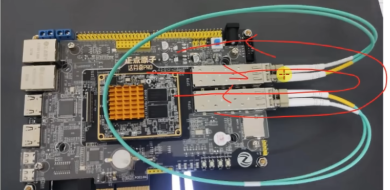
    
    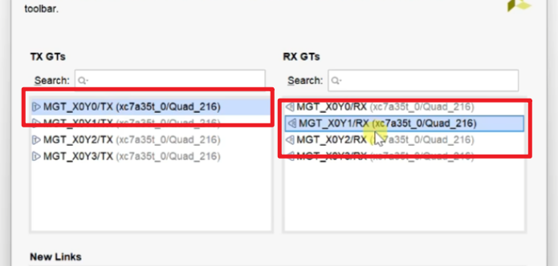
    
    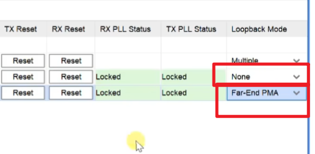

## 五、实际项目上板测试

### 5.1 SRIO 4X 接口测试

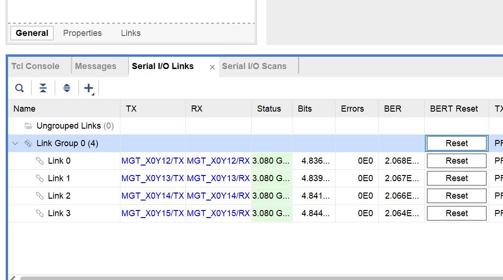

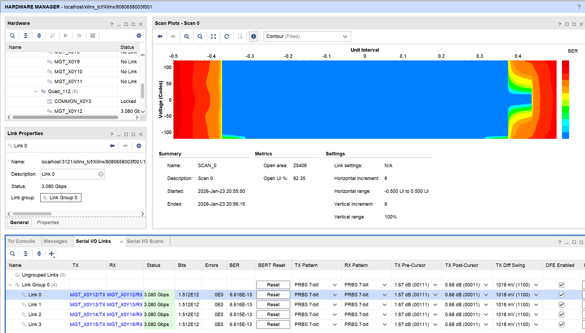

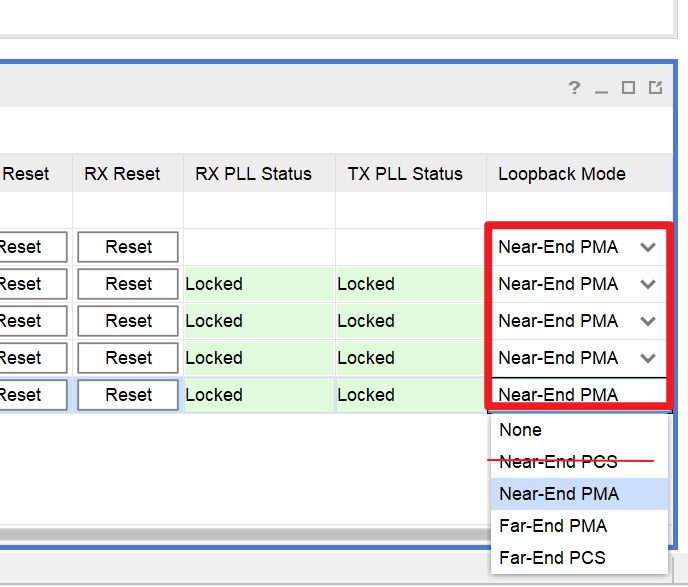

### 5.2 SGMII 接口测试

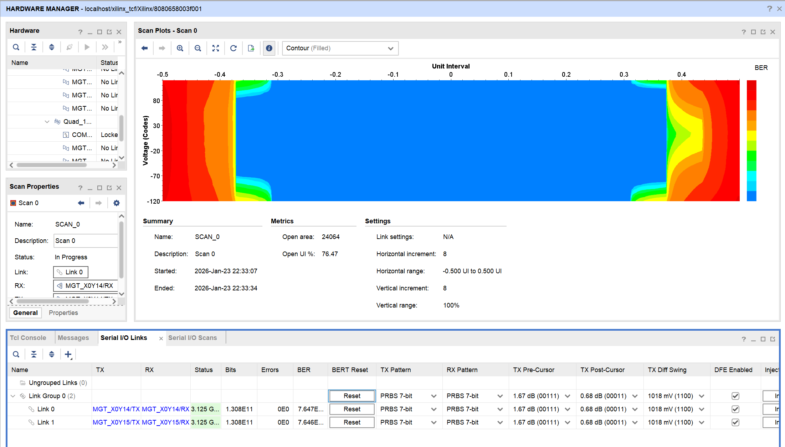

### 5.3 测试过程中遇到的问题

我想同时测试两个SGMII和一个SRIO 4X
所以这个数量应该选 2（见红框）
与此相对应的参考时钟要跟硬件原理图上的时钟一致。

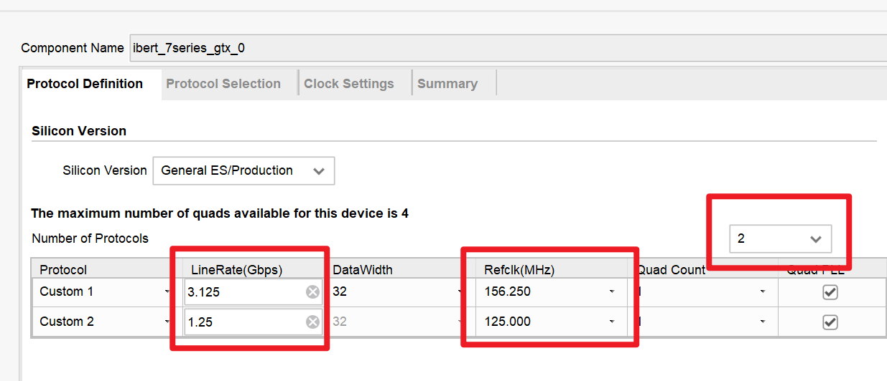
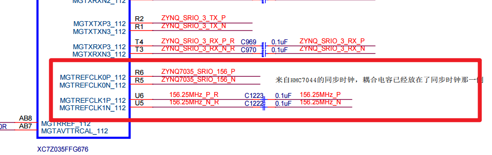
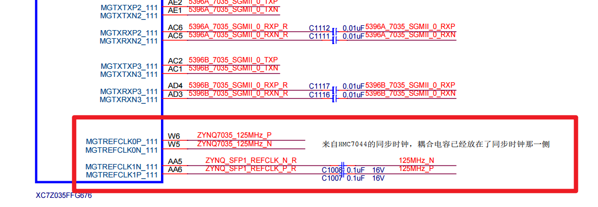

上面两张图框住的部分是可以选择的时钟
上面两排是7044给的时钟，下面两排是外部晶振的，选择protocol selection的时候要选对
再有就是如果7044给的时钟没配好的情况下，可以用外部晶振的测试
（若7044配好，最好用7044的时钟）
测试过程中bank112的7044时钟是工作的。但是bank111的7044好像没调好
所以bank111的眼图是用外部晶振时钟测出来的

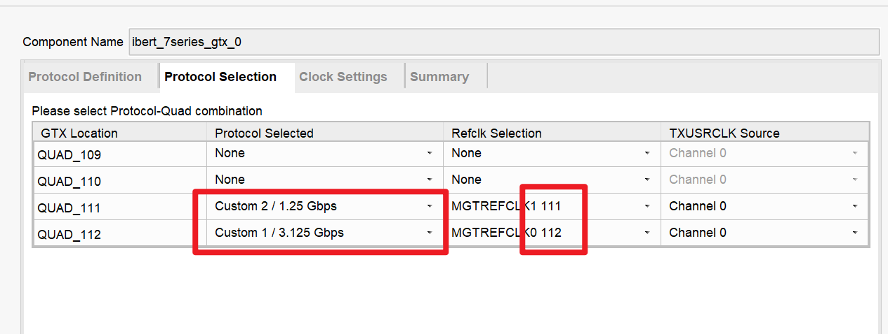

这个系统时钟源一定要选，选哪个都行，
应该是驱动眼图ip核工作的时钟，所以选一个就ok，选哪个都可以
如果不选的话，导入bit文件后运行的时候可能ibert核不工作，不显示，出不来

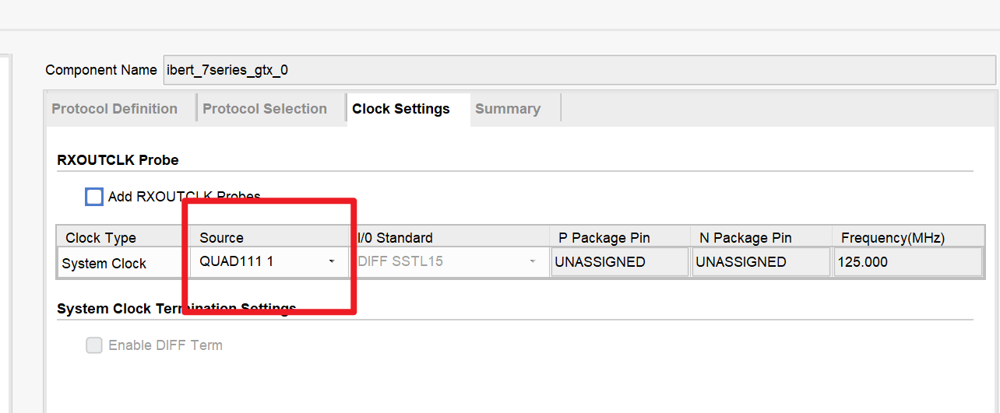

