## 概述

Serial RapidIO（SRIO） 特指 RapidIO 标准的**串行**物理层实现。
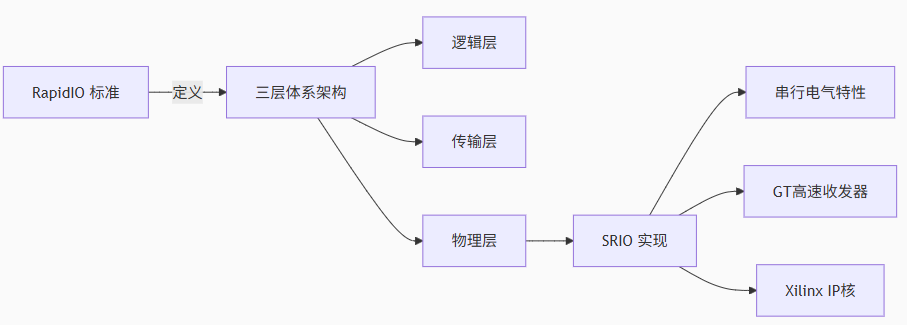

RapidIO 标准定义为三层：
	1. **逻辑层**：定义总体协议和包格式，包含设备发起和完成事务的必要信息。
	2. **传输层**：提供包传输的路由信息，对顶层不可见。
	3. **物理层**：描述设备级接口细节（包传输机制、流控、电气特性、低级错误管理）。

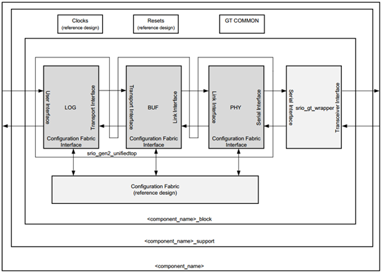

### 逻辑层（LOG）

逻辑层划分为以下模块控制并解析数据包，提供三类接口：
	1. **用户接口（User Interface）**
	2. **传输接口（Transport Interface）**（相当于缓存 Buffer，对顶层不可见）
	3. **配置接口（Configuration Fabric Interface）**（用于读写本地配置空间及逻辑/传输层寄存器）
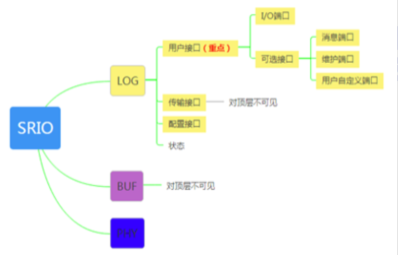

#### 用户接口（重点关注）

包含 **I/O 端口集** 和三个可选端口：
	1. **I/O 端口集**：
	    - **支持事务**：NWRITEs、NWRITE_Rs、SWRITEs、NREADs、RESPONSEs（不含维护事务响应）、门铃事务。
	    - **消息事务**（取决于配置是否分离 I/O 与 Message 端口）。
	2. **消息端口**：专用于消息事务。
	3. **维护端口**：专用于维护事务。
	4. **用户自定义端口**：支持自定义类型（未使能时丢弃包）

##### I/O 端口类型
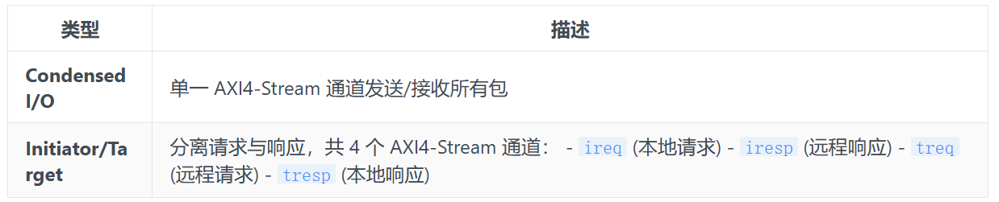
**顶层信号映射**
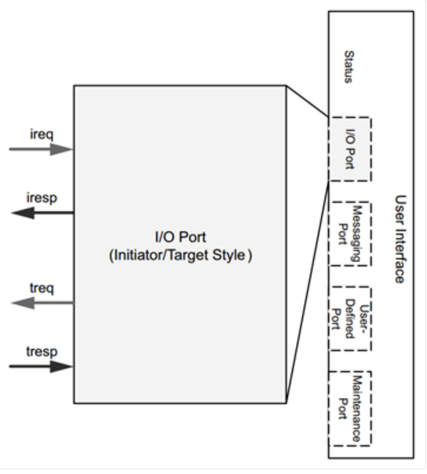

### 物理层（PHY）
**功能：**
	1. 处理链路训练（Link Training）、初始化、协议
	2. 插入 CRC 与应答标识符
	3. 连接高速串行收发器（外部例化模块）

**接口**：
	1. 2 个 AXI4-Stream 通道连接传输层
	2. 1 个 AXI4-Lite 接口连接配置层
	3. 1 个串行接口连接收发器（FPGA 使用 GT 接口实现）

#### 寄存器空间
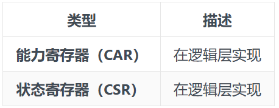

### HELLO 包格式
标准化包头域，包头与数据分离传输：
- **Size 域**：值 = 传输字节总数 - 1（有效范围 0~255 → 实际传输 1~256 字节）
- **限制**：必须与 RapidIO 包中的 size/address/wdptr 域匹配，IP 核不会修正非法值。
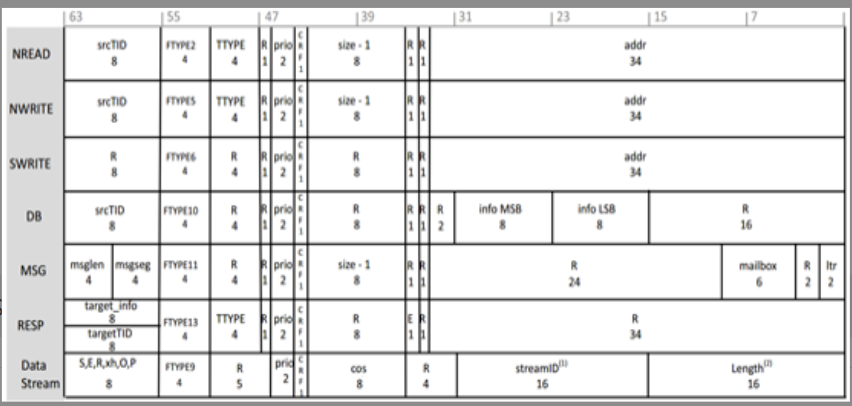

### SRIO 事务类型及关系

#### 1. 直接 I/O（DMA）事务
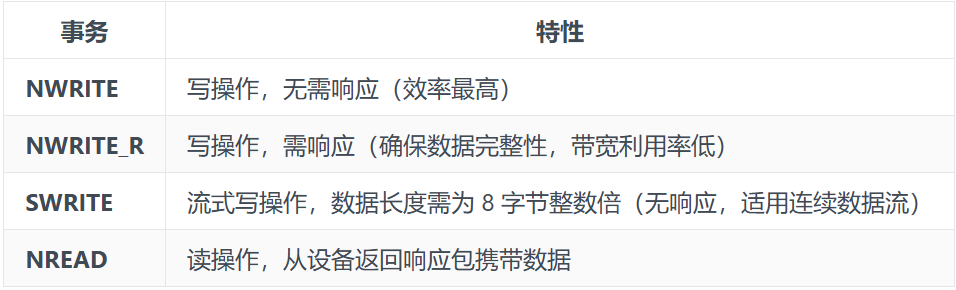

#### 2. 消息传递事务
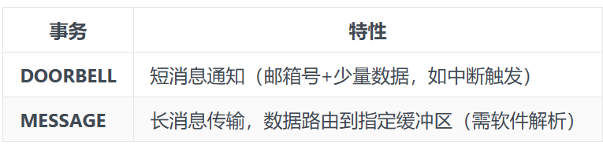

#### 3. 维护事务
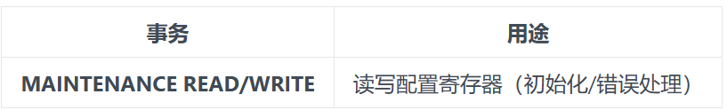

#### 事务对比
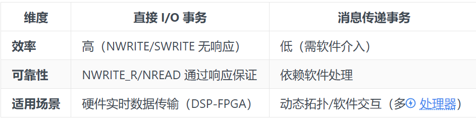

