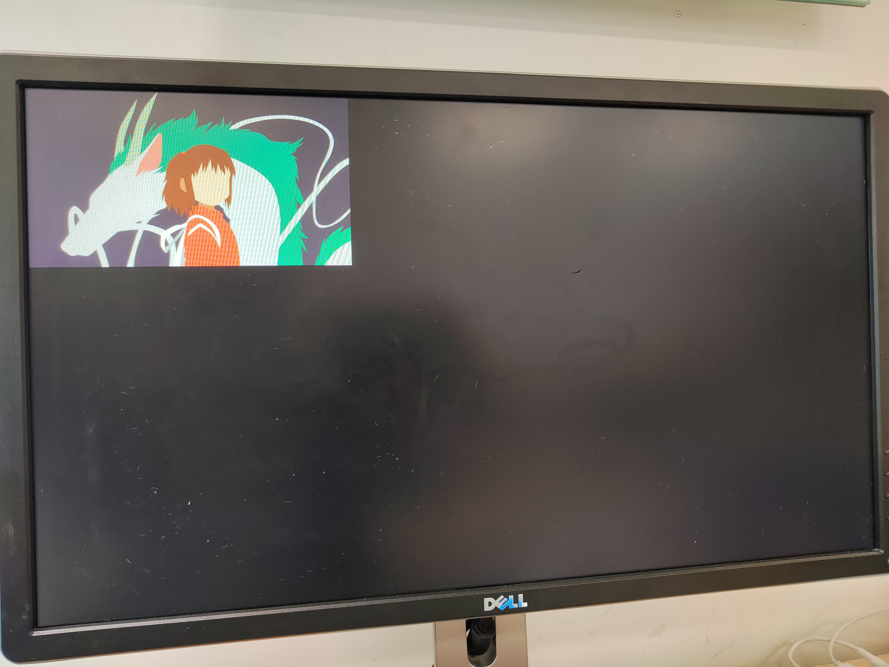

实验工程名：vdma_hdmi_out
参考资料：
[AX7010_2023.1/RSTdocxs/7010_S2_RSTdocument_CN/14_使用VDMA驱动HDMI显示_CN.rst at master · alinxalinx/AX7010_2023.1 · GitHub](https://github.com/alinxalinx/AX7010_2023.1/blob/master/RSTdocxs/7010_S2_RSTdocument_CN/14_%E4%BD%BF%E7%94%A8VDMA%E9%A9%B1%E5%8A%A8HDMI%E6%98%BE%E7%A4%BA_CN.rst)

板子上有Hdmi接口，在PL端，但是现在得用PS控制hdmi的内容
由于PS没有集成显示控制系统，所以需要PS-PL的HP交互来实现

HP口的最大数据宽度为64位，如果频率跑到150Mhz，带宽可达9.6Gbps
可以满足图像数据传输。

为降低CPU开销，使用VDMA将显示数据从DDR3读出到显示器显示
显示数据是PS生成，然后PL通过VDMA送给HDMI接口。


---
## 一、硬件部分
### vivado工程搭建
基于VDMA显示是一个很重要的内容，本文档将详细记录VDMA的vivado搭建过程
###### 1.创建工程，打开HP0接口。
因为要从DDR3中读出数据，采用高性能HP接口进行PS与PL之间的数据交互。

###### 2.配置IIC的EMIO。
使能IIC，使用EMIO将IIC连接到PL端，用于连接HDMI DDC。

###### 3.配置时钟。
FCLK_CLK0配置为100Mhz，FCLK_CLK1配置为142Mhz，这个时钟用于VDMA读取数据。
由于1080p 60帧的频率为148.5MHz，但包含同步和消隐时间，而VDMA传输的都是有效数据，
因此设置为142MHz就可以满足要求。

###### 4.配置中断。
使能IRQ_F2P，接收PL端的中断。

###### 5.配置VDMA
添加VDMA IP

配置VDMA基本参数
这里主要牵涉到两个接口：
1. Memory Map接口，采用AXI4接口，与ZYNQ HP口进行数据交互，读取PS端DDR中的图像数据。ZYNQ HP接口为64位接口，在这里我们也设置成64位接口，当然也可以设置大一些，经过交叉互联模块可以进行数据宽度自动转换。
2. Stream接口，也就是AXI4 stream流接口，在这里主要是用来传输图像数据到HDMI接口，由于RGB数据是24位的，因此这里的Stream Data Width也设置成24。Frame Buffers为帧缓存数，可以储存多帧图像，本实验中只使能1帧图像缓存。Line Buffer Depth类似于fifo缓存，以Stream Data Width为单位，设置大些，可以缓存的数据越多。

配置VDMA高级参数
在这里使能Allow Unaligned Transfers。如果不使能，在软件中就要对数据按照Memory Map Data Width对齐，比如我们设置的是64，也就是要64位对齐。但这里使能了，就可以进行不对齐的数据传输。
GenLock用于避免读和写通道同时访问同一个frame，而使图像显示不正常。由于我们只有一个读通道，设置它的意义并不是很大，需要与写通道配置才有用处。
组合方式比较多，具体可以参考VDMA的手册PG020。

###### 6.添加视频时序控制器VTC
用来产生图像的时序

配置视频时序控制器参数（简称VTC）
Enable Generation是产生输出时序的使能，选择之后会出现vtiming_out总线信号。
Enable Detetion是用于检测输入时序信号的使能，如果使能，会出现vtiming_in总线，由于本实验为图像输出，因此不使能。

###### 7.添加AXI流转视频输出控制器

配置AXI流转视频输出控制器参数
Clock Mode选择Independent，指的是AXI4-Stream和Video的时钟是独立的，异步的，而common是同步的。在本实验中两者是异步的。
Timing Mode的Slave mode是指VTC是时序的Slave，由Video Out模块通过clock enable控制时序的输出。Master Mode指VTC是时序的master，不由Video Out控制。
详情参考模块用户手册pg044。

###### 8.添加自定义IP
由于视频有很多分辨率，各种分辨率不相同，需要一个动态时钟控制器，使用黑金例程里的my_ip目录，复制到自己的工程目录下。

添加ip仓库


###### 9.添加动态时钟控制器
这个模块主要功能是根据不同的分辨率配置出不同的时钟输出，本质上是调用了锁相环，
但要注意的是，此模块的==参考时钟必须设置为100MHz==

###### 10.添加HDMI编码器，用于将RGB数据转换为TMDS信号。


###### 11.手动连接时钟信号

###### 12.手动连接关键信号

###### 13.连接中断信号
添加Concat IP，连接中断信号


###### 14.使用vivado自动连线

###### 15.导出IIC_0端口

###### 16.导出编码器端口TMDS和oen

###### 17.保存设计后按F6 检查设计，添加HDMI输出的xdc文件，约束管脚
```
#系统时钟和复位
set_property -dict {PACKAGE_PIN U18 IOSTANDARD LVCMOS33} [get_ports sys_clk]
set_property -dict {PACKAGE_PIN N16 IOSTANDARD LVCMOS33} [get_ports sys_rst_n]

#HDMI 
set_property PACKAGE_PIN J18 	[get_ports TMDS_clk_p]
set_property IOSTANDARD TMDS_33 [get_ports TMDS_clk_p]
set_property IOSTANDARD TMDS_33 [get_ports TMDS_clk_n]
set_property PACKAGE_PIN G19 	[get_ports {TMDS_data_p[0]}]
set_property IOSTANDARD TMDS_33 [get_ports {TMDS_data_p[0]}]
set_property IOSTANDARD TMDS_33 [get_ports {TMDS_data_n[0]}]
set_property PACKAGE_PIN K19 	[get_ports {TMDS_data_p[1]}]
set_property IOSTANDARD TMDS_33 [get_ports {TMDS_data_p[1]}]
set_property IOSTANDARD TMDS_33 [get_ports {TMDS_data_n[1]}]
set_property PACKAGE_PIN J20 	[get_ports {TMDS_data_p[2]}]
set_property IOSTANDARD TMDS_33 [get_ports {TMDS_data_p[2]}]
set_property IOSTANDARD TMDS_33 [get_ports {TMDS_data_n[2]}]

set_property PACKAGE_PIN U20	 [get_ports hdmi_oen]
set_property IOSTANDARD LVCMOS33 [get_ports hdmi_oen]
set_property PACKAGE_PIN R19 	 [get_ports hdmi_ddc_scl_io]
set_property IOSTANDARD LVCMOS33 [get_ports hdmi_ddc_scl_io]
set_property PACKAGE_PIN P20 	 [get_ports hdmi_ddc_sda_io]
set_property IOSTANDARD LVCMOS33 [get_ports hdmi_ddc_sda_io]
```
###### 18.编译生成bit文件，导出硬件

## 二、软件部分

vitis软件编写

在display_ctrl文件夹中，diplay_ctrl.c主要是显示的控制，vga_mode.h中加入了一些显示分辨率的时序参数。
在display_ctrl.c中，可以修改displayPtr->vMode，改变显示的分辨率。

Dynclk文件中，主要功能是根据不同的分辨率配置锁相环的时钟输出，产生像素时钟。

有个概念注意要弄清楚，一般我们知道，图像有行和列的概念，在VDMA的寄存器中，即HSIZE和VSIZE，这里多了一个STRIDE寄存器，可以理解为一行存储的最大字节数，大于等于HSIZE。注意HSIZE和STRIDE都是以字节为单位。

举例说明：如果显示分辨率为1920*1080，24位深度，也就是3个字节，那么HSIZE就可以设置成1920*3，VSIZE为1080，STRIDE为1920*3；如果显示分辨率改为1280*720，那么HSIZE设置为1280*3，VSIZE为720，STRIDE可以不用变，仍然为1920*3。


将图片用Img2Lcd.exe转成二进制，存到pic_800_600.h中（后续优化，可存到DDR中）

连接HDMI输出端口到显示器，编译运行
显示一张图



