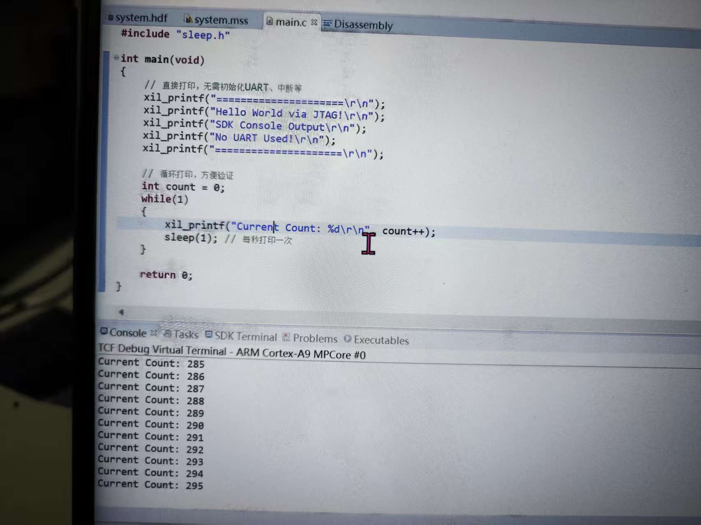
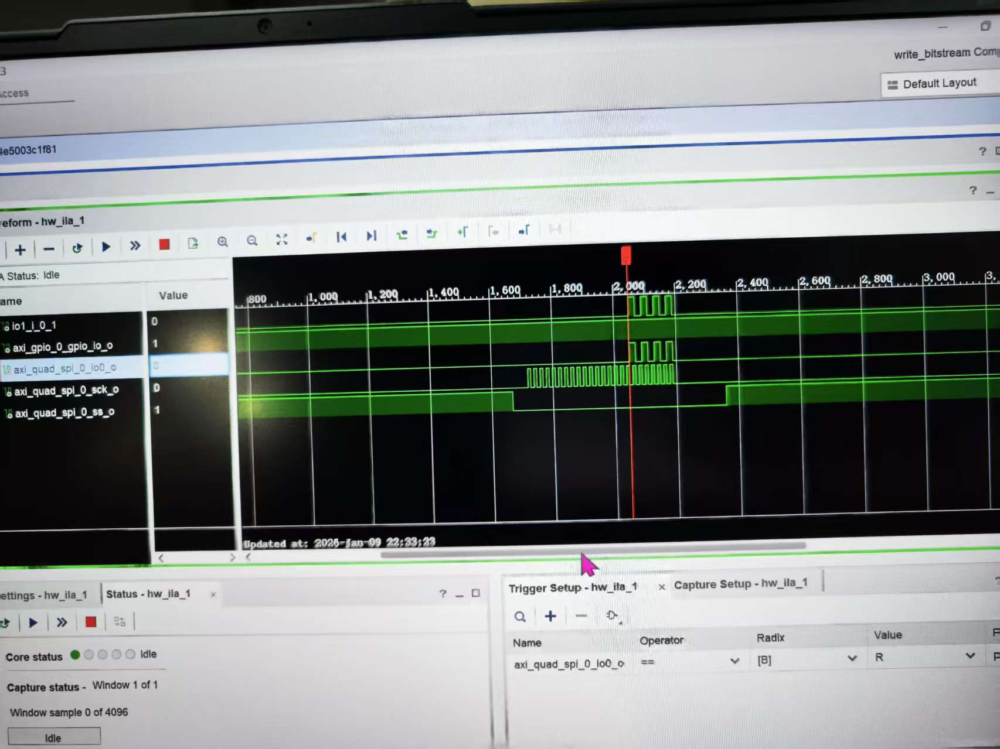
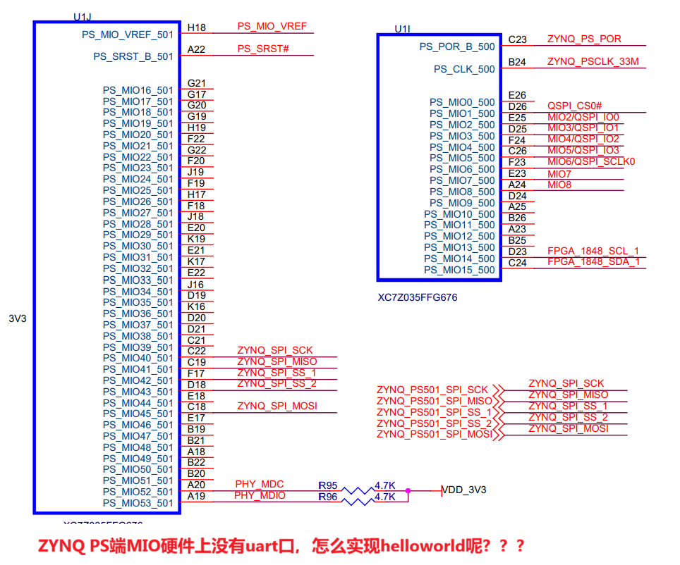

# 一、SPI接口概述

## 1、概述
SPI接口简单，时钟可达100M以上，用于串行通信。存储器，温度传感器，压力传感器，模拟转换器，实时时钟，显示器以及任何支持串行模式的 SD 卡。 一些 ADC 比如 AD7606 也可以用 SPI 接口实现通信。
<font color="#ff0000">主从模式：</font>

<font color="#ff0000">环路测试的系统框图：</font>


## 2、SPI总线协议介绍

##### 2.1 技术性能
SPI，全双工三线同步串行外围解耦，主从模式，支持单主多从。Master控制时钟，高位在前，低位在后。两根单向数据线，全双工，实际应用速率可达机Mbps。

##### 2.2 接口定义：
1. MOSI：串行输出数据线，主器件数据输出，从器件数据输入
2. MISO：串行输入数据线，主器件数据输入，从器件数据输出
3. SCLK：时钟线，由主器件产生
4. /SS：片选，从器件使能信号，由主器件控制

##### 2.3 时钟极性和时钟相位：
SPI数据传输在串行同步时钟信号（Serial Clock,SCK）控制下进行。一边控制主机位移寄存器，一边通过从机的SCK控制从机的移位寄存器，保证主机与从机的数据交换是同步进行的。

###### SCK可设置为不同极性（Clock Polarity ， CPOL）和相位（Clock Phase ， CPHA）
1. CPOL：为0，SCK空闲时为低；为1，SCK空闲时为高。
2. CPHA：为1，在SCK的二个跳变沿采样，CPOL为0，取下降沿，CPOL为1，取上升沿；为0，第一个跳变沿采样，CPOL为0，取下降沿，CPOL为1，取上升沿。


##### 2.4 数据传输
一个 SPI 时钟周期内：
1. 主机通过 MOSI 线发送 1 位数据，从机通过该线读取这 1 位数据 
2. 从机通过 MISO 线发送 1 位数据，主机通过该线读取这 1 位数据


主机内的时钟发生器，同时影响主机和从机。


# 二、首先先连上PS，内部打印helloworld


先关闭所有功能，包括中断、uart都关了

sdk里debug as，run
```c

#include "xil_printf.h"
#include "sleep.h"

int main(void)
{
    // 直接打印，无需初始化UART、中断等
    xil_printf("=====================\r\n");
    xil_printf("Hello World via JTAG!\r\n");
    xil_printf("SDK Console Output\r\n");
    xil_printf("No UART Used!\r\n");
    xil_printf("=====================\r\n");

    // 循环打印，方便验证
    int count = 0;
    while(1)
    {
        xil_printf("Current Count: %d\r\n", count++);
        sleep(1); // 每秒打印一次
    }

    return 0;
}
```



# 三、用AXI-SPI进行测试


### 3.1 PL部分
搭建soc
中断设置

设置 GP Master 接口

设置复位输出

设置 PL 时钟

AXI-SPI IP

最终形态

为了满足三态，顶层应该这样修改


引脚分配对应关系

### 3.2 PS部分
下面代码为不断往SPI里写入0x55的程序
运行时遇到问题，打断点定位到这个地方

大致错误是因为写入了一遍以后读了一边，此时寄存器里已经没有了。
但是下面又对空的寄存器读了一遍，所以导致程序报错
把下面的红框部分注释掉以后，就不在报错了，程序正常运行
最后用过lia抓波形成功写入0x55



```c
/***************************** Include Files **********************************/
#include <stdio.h>
#include <stdbool.h>
//#include "HMC7044_SPI.h"
#include "hmc7044.h"						// HMC7044芯片的驱动头文件
#include "xparameters.h"					// SDK自动生成的硬件参数（SPI/GPIO设备ID、基地址等）
#include "xspi_l.h"							// Xilinx SPI底层驱动
#include "xspi.h"							// Xilinx SPI高层驱动
/************************** Constant Definitions ******************************/

/*
 * The following constants map to the XPAR parameters created in the
 * xparameters.h file. They are defined here such that a user can easily
 * change all the needed parameters in one place.
 */


/**************************** Type Definitions ********************************/


/***************** Macros (Inline Functions) Definitions **********************/


struct hmc7044_dev* hmc7044_device;			// HMC7044设备实例指针

struct hmc7044_chan_spec chan_spec[14] = {
	/* OUTPUT0 */
	{
		.disable = 0,						//disable：0 = 启用通道，1 = 禁用通道
		.num = 0,
		.divider = 16,						//divider：分频系数（比如 OUTPUT1 的 256 表示输入时钟分频 256 后输出）
		.driver_mode = 2,					//输出驱动模式（2 是芯片指定的模式值）
		.coarse_delay = 16					//粗延时配置（调整输出时钟相位）
		//.driver_impedance = 1
	},
	/* OUTPUT1 */
	{
		.disable = 0,
		.num = 1,
		.divider = 256,
		.driver_mode = 2,
		.start_up_mode_dynamic_enable = true,
		.high_performance_mode_dis = true,
		.output_control0_rb4_enable = true,
		.force_mute_enable = true,
		//.driver_impedance = 1
	},
	/* OUTPUT2 */
	{
		.disable = 0,
		.num = 2,
		.divider = 16,
		.driver_mode = 2,
		.coarse_delay = 15
		//.driver_impedance = 1
	},
	/* OUTPUT3 */
	{
		.disable = 0,
		.num =3,
		.divider = 256,
		.driver_mode = 2,
		.start_up_mode_dynamic_enable = true,
		.high_performance_mode_dis = true,
		.output_control0_rb4_enable = true,
		.force_mute_enable = true,
		//.driver_impedance = 1
	},
	/* OUTPUT4 */
	{
		.disable = 1,
		.num = 4,
		.divider = 16,
		.driver_mode = 2,
		.coarse_delay = 15
	},
	/* OUTPUT5 */
	{
		.disable = 1,
		.num = 5,
		.divider = 256,
		.driver_mode = 2,
		.start_up_mode_dynamic_enable = true,
		.high_performance_mode_dis = true,
		.output_control0_rb4_enable = true,
		.force_mute_enable = true,
		//.driver_impedance = 1
	},
	/* OUTPUT6 */
	{
		.disable = 1,
		.num = 6,
		.divider = 16,
		.driver_mode = 2,
		.coarse_delay = 16
	},
	/* OUTPUT7 */
	{
		.disable = 1,
		.num = 7,
		.divider = 128,
		.driver_mode = 2,
		.start_up_mode_dynamic_enable = true,
		.high_performance_mode_dis = true,
		.output_control0_rb4_enable = true,
		.force_mute_enable = true,
		//.driver_impedance = 1
	},
	/* OUTPUT8 */
	{
		.disable = 0,
		.num = 8,
		.divider = 16,
		.driver_mode = 2,
		.coarse_delay = 16
	},
	/* OUTPUT9 */
	{
		.disable = 0,
		.num = 9,
		.divider = 16,
		.driver_mode = 2,
		.coarse_delay = 16
		//.driver_impedance = 1
	},
	/* OUTPUT10 */
	{
		.disable = 1,
		.num = 10,
		.divider = 16,
		.driver_mode = 2,
		.coarse_delay = 15
	},
	/* OUTPUT11 */
	{
		.disable = 1,
		.num = 11,
		.divider = 128,
		.driver_mode = 2,
		.start_up_mode_dynamic_enable = true,
		.high_performance_mode_dis = true,
		.output_control0_rb4_enable = true,
		.force_mute_enable = true,
		//.driver_impedance = 1
	},
	/* OUTPUT12 */
	{
		.disable = 0,
		.num = 12,
		.divider = 16,
		.driver_mode = 2,
		.coarse_delay = 16
	},
	/* OUTPUT13 */
	{
		.disable = 0,
		.num = 13,
		.divider = 256,
		.driver_mode = 2,
		.start_up_mode_dynamic_enable = true,
		.high_performance_mode_dis = true,
		.output_control0_rb4_enable = true,
		.force_mute_enable = true,
	}
	};


struct hmc7044_init_param example_hmc7044_param = {						//HMC7044 的核心初始化配置，决定了芯片的时钟输出频率、GPIO 行为、PLL 参数等，必须和硬件手册匹配。
		//.spi_init = &example_spi_init_param,
		.clkin_freq = {163680000, 163680000, 163680000, 163680000},		// 输入时钟频率（4路参考时钟，均为163.68MHz）
		.vcxo_freq = 163680000,											// VCXO晶振频率
		.pll2_freq = 2618880000,										// PLL2输出频率（2.61888GHz）
		//.pll1_loop_bw = 50,
		.pll1_loop_bw = 20,												// PLL1环路带宽（20Hz）
		.sysref_timer_div = 3840,
		.in_buf_mode = {0x07, 0x07, 0x07, 0x07, 0x07},
		.gpi_ctrl = {0x00, 0x00, 0x00, 0x11},							// GPI引脚控制配置
		.gpo_ctrl = {0x1f, 0x2b, 0x00, 0x00},							// GPO引脚控制配置
		.num_channels = 14, 											// 通道总数（对应上面的14路）
		.pll1_ref_prio_ctrl = 0x93,
		.sync_pin_mode = 0x1,
		.high_performance_mode_clock_dist_en = true,
		.high_performance_mode_pll_vco_en = true,
		.pulse_gen_mode = 0x0,
		.channels = chan_spec											// 关联通道参数数组
};

/************************** Function Prototypes *******************************/
int SPI_Write_Test(u32 base_addr, u8 reg_addr, u8 data);


/************************** Variable Definitions ******************************/
int main(void)
{
	int Status;
	int a=1;

	// 1. 定义寄存器读写缓冲区
/*
	u8  ReadReg_0x7D[3]={0X80 , 0X7d ,0x00};			// 读0x7D寄存器的指令（SPI帧格式）
	u8  ReadReg_0x70[3]={0x80 , 0x70 ,0x00};
	u8  WriteReg_0x70[3]={0x00 , 0x70 , 0xff};			// 写0x70寄存器（值0xff）
	u8  WriteReg_0x71[3]={0x00 , 0x71 , 0x1f};
	u8  ReadReg_0x71[3]={0x80 , 0x71 , 0x1f};
	u8  ReadReg_0x7C[3]={0X80 , 0X7C ,0x00};

	u8  ReadBuffer=0;									// 存储寄存器读取结果
*/

	// 2. 初始化HMC7044的SPI接口
	XSpi_Init_HMC7044();								// 自定义SPI初始化函数


	// 3. 初始化HMC7044芯片（传入配置参数）
	Status = hmc7044_init(&hmc7044_device, &example_hmc7044_param);
    if(Status != 0) { 									// 检查初始化结果，方便调试
        while(1); 										// 初始化失败则卡死，便于定位
    }
	usleep(55000);										// 等待55ms，让芯片完成初始化（PLL锁定、配置生效）


 	// 4. 死循环：持续读写HMC7044寄存器
	while(a==1)
	{
        // 写测试：往TEST_REG_ADDR寄存器写入0x55
        SPI_Write_Test(SPI_BASEADDR, 0x00, 0x55);
        // 延时50ms（1ms=1000微秒，50ms=50000微秒）
        usleep(50000);


/*
		XSpi_HMC7044_RoW(1,SPI_BASEADDR ,ReadReg_0x70 ,&ReadBuffer);	// 读0x70寄存器 → 写0x70寄存器（值0xff）→ 再读0x70寄存器（验证写入）
		usleep(5000);
		XSpi_HMC7044_RoW(0,SPI_BASEADDR ,WriteReg_0x70 ,&ReadBuffer);
		usleep(5000);
		XSpi_HMC7044_RoW(0,SPI_BASEADDR ,WriteReg_0x70 ,&ReadBuffer);
		usleep(5000);
		XSpi_HMC7044_RoW(1,SPI_BASEADDR ,ReadReg_0x70 ,&ReadBuffer);
		usleep(5000);

		XSpi_HMC7044_RoW(1,SPI_BASEADDR ,ReadReg_0x71 ,&ReadBuffer);
		usleep(5000);
		XSpi_HMC7044_RoW(0,SPI_BASEADDR ,WriteReg_0x71 ,&ReadBuffer);
		usleep(5000);
		XSpi_HMC7044_RoW(0,SPI_BASEADDR ,WriteReg_0x71 ,&ReadBuffer);
		usleep(5000);
		XSpi_HMC7044_RoW(1,SPI_BASEADDR ,ReadReg_0x71 ,&ReadBuffer);
		usleep(5000);

		XSpi_HMC7044_RoW(1,SPI_BASEADDR ,ReadReg_0x7D ,&ReadBuffer);
		usleep(50000);
		XSpi_HMC7044_RoW(1,SPI_BASEADDR ,ReadReg_0x7C ,&ReadBuffer);
		usleep(50000);
*/


	}

	while(1);
}


int SPI_Write_Test(u32 base_addr, u8 reg_addr, u8 data)
{
    // HMC7044的SPI写帧格式（示例：3字节帧，需和芯片手册匹配）
    // 第1字节：写标志（0x00=写，0x80=读）
    // 第2字节：寄存器地址
    // 第3字节：要写入的数据
    u8 spi_tx_buf[3] = {0x00, reg_addr, data};
    u8 spi_rx_buf[3] = {0}; // 接收缓冲区（写操作时可忽略）

    // 调用你原有的SPI读写函数（核心：写操作）
    // 第1个参数：0=写，1=读；base_addr=SPI基地址；tx_buf=发送数据；rx_buf=接收数据
    XSpi_HMC7044_RoW(0, base_addr, spi_tx_buf, spi_rx_buf);

    // 可选：打印调试信息（若SDK启用了xil_printf）
    xil_printf("SPI写完成：地址0x%02X，数据0x%02X\r\n", reg_addr, data);

    return 0;
}
```


问题：
1、7035-几在哪核实

2、



3、
在ps内部打印helloworld
```c
#include "xil_printf.h"   // Xilinx专用打印函数，支持JTAG输出
#include "xil_types.h"
#include "xil_exception.h"
#include "xscugic.h"
#include "sleep.h"

// 主函数
int main(void)
{
    // 初始化异常处理（ZYNQ PS必备）
    Xil_ExceptionInit();
    
    // 打印HelloWorld（核心：用xil_printf而非printf）
    xil_printf("=================================\n");
    xil_printf("Hello World from ZYNQ PS (JTAG)\n");
    xil_printf("No UART is used!\n");
    xil_printf("=================================\n");

    // 循环打印，方便验证
    u32 count = 0;
    while(1)
    {
        xil_printf("Loop count: %d\n", count++);
        sleep(1);  // 每秒打印一次
    }

    return 0;
}
```


spi时钟设置成10M有什么讲究么
