## 一、创建 axi4-full-slave 总线接口 IP

使用 vivado 自带的 AXI 总线模板创建一个 AXI4-FULL 接口 IP
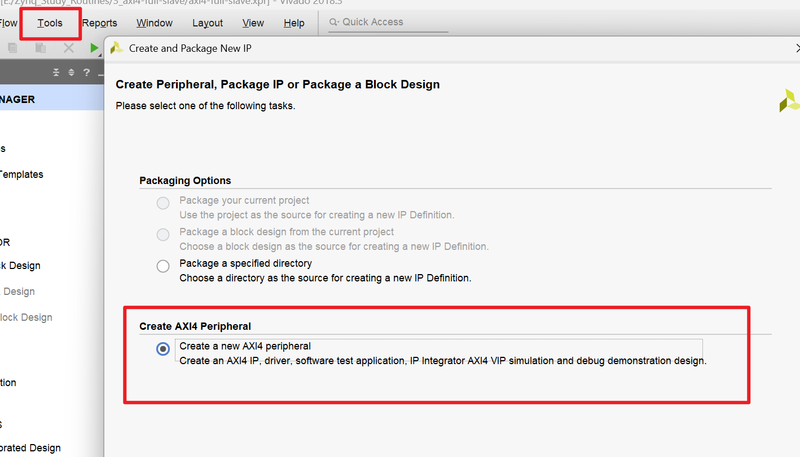

设置 IP 的名字为 saxi_full
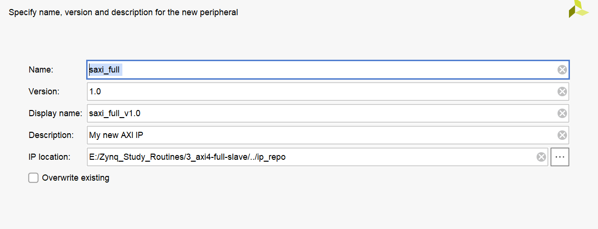

选择Full、 Slave 模式
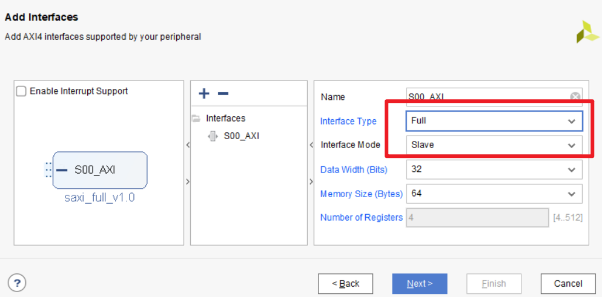

打开快速验证
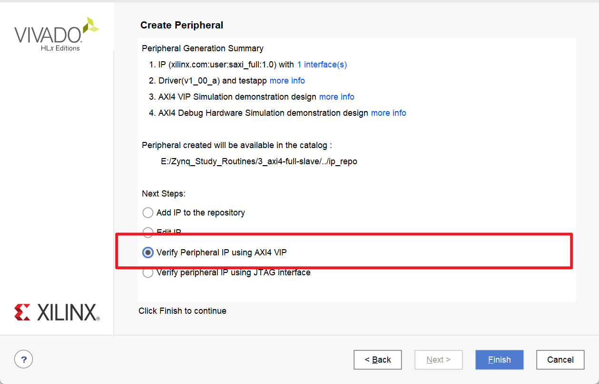

saxi_full_0就是我们自定义的 IP，
master_0 是用来读写我们自定义的 saxi_full_0，以此验证我们的 IP 正确性。
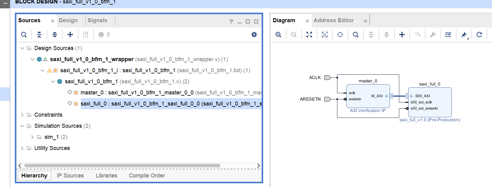

采用默认地址分配即可
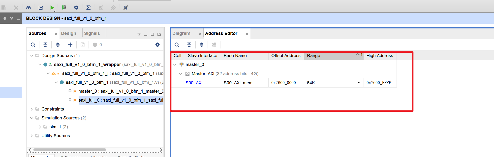

## 二、代码分析

**Generate Output Products以后就能看到代码了**
#### 1:axi-full-slave 的 axi_awready

当满足条件 (~axi_awready  &&  S_AXI_AWVALID  && ~axi_awv_awr_flag && ~axi_arv_arr_flag )=1 的时候表示可以进行一次 AXI-FULL 的 burst 写操作了，这个时候 AXI-FULL-SLAVE 设置 axi_awready <= 1'b1 和 axi_awv_awr_flag <= 1'b1

**AXI4 协议中写地址通道（AW Channel）的 awready 信号生成逻辑**，核心功能是控制从机何时可以接收主机发来的写地址和写控制信号。

- 复位时，`axi_awready`置 0，禁止接收写地址；
- 只有当主机的写地址有效（`S_AXI_AWVALID`）、写数据通道就绪，且当前无读 / 写地址处理冲突时，`axi_awready`才置 1（持续 1 个时钟周期），表示从机准备好接收写地址；
- 当一次写突发传输完成（`S_AXI_WLAST`表示最后一个写数据）后，重置标志位，为下一次写地址接收做准备；
- 其他情况`axi_awready`置 0，不接收写地址。
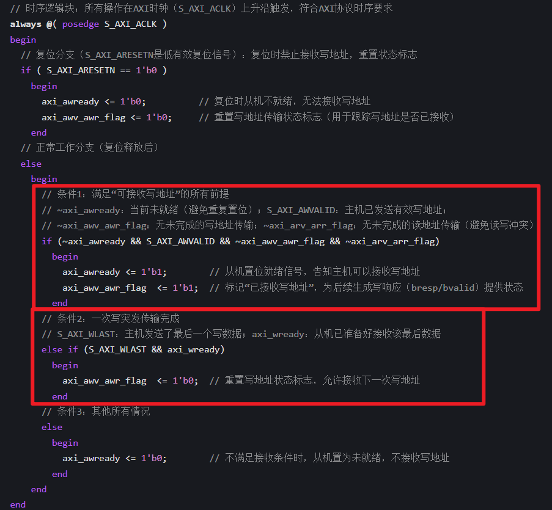

#### 2:axi-full-slave 的 axi_awaddr

AXI 的 burst 模式包括 3 种：
1. fixed burst 这种模式下地址都是相同的
2. incremental burst 这种模式下地址递增
3. Wrapping burst 这只模式下地址达到设置的最大地址边界后返回原来的地址。
本文 demo 种以下三种模式的具体代码如下：

- 复位时初始化所有读地址 / 突发相关寄存器；
- 当主机发起有效读地址传输时，锁存读地址、突发类型（`arburst`）、突发长度（`arlen`）等关键参数；
- 在读数据传输阶段，根据不同的 AXI 突发类型（固定 / 递增 / 环绕）自动计算下一个读地址，并在突发传输最后一个数据时置位`axi_rlast`标志。

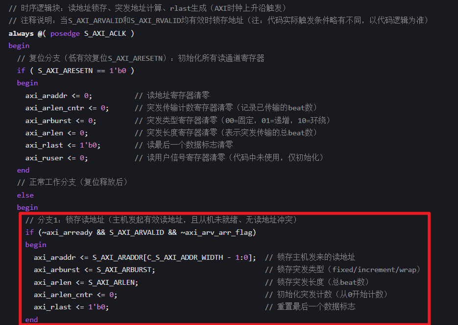
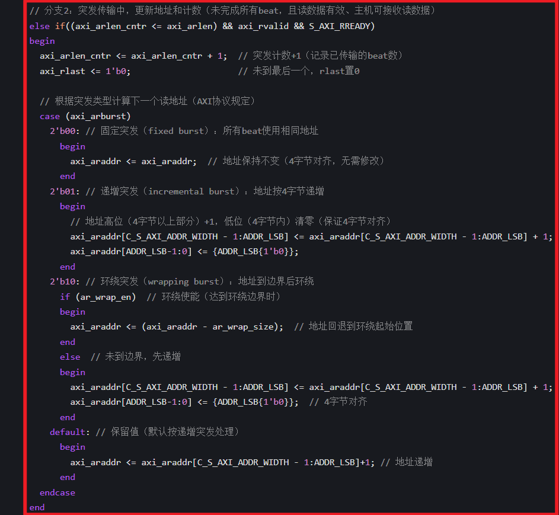
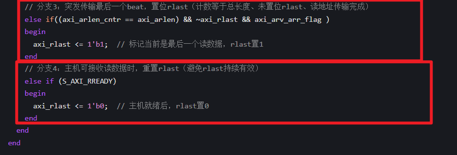

#### 3:axi-full-slave 的 axi_wready

当满足条件( ~axi_wready && S_AXI_WVALID && axi_awv_awr_flag) == 1 设置 axi_wready 为 1.这里可以看出，S_AXI_WVALID 必须在一次 burst 种持续有效，直到满足条件(S_AXI_WLAST && axi_wready)，否则 AXI-FULL￾SLAVE 会出错，这一点有别于 AXI-LITE-SLAVE 每次只读写一个数据。

**AXI4 协议写数据通道（W Channel）中`axi_wready`信号的生成逻辑**，核心作用是控制从机何时可以接收主机发来的写数据，严格遵循 “地址就绪后才接收数据” 的 AXI 协议规则。

- 复位时`axi_wready`置 0，从机不接收任何写数据；
- 仅当主机写数据有效（`S_AXI_WVALID`）、从机未就绪（`~axi_wready`）且写地址已完成握手（`axi_awv_awr_flag`置 1）时，`axi_wready`置 1，表示从机准备好接收写数据；
- 当接收到写突发传输的最后一个数据（`S_AXI_WLAST`）且当前`axi_wready`为 1 时，`axi_wready`置 0，结束本次写数据传输；
- 无其他额外逻辑，保证`axi_wready`仅在 “地址已握手、数据有效” 时置 1，且在最后一个数据接收后立即置 0。
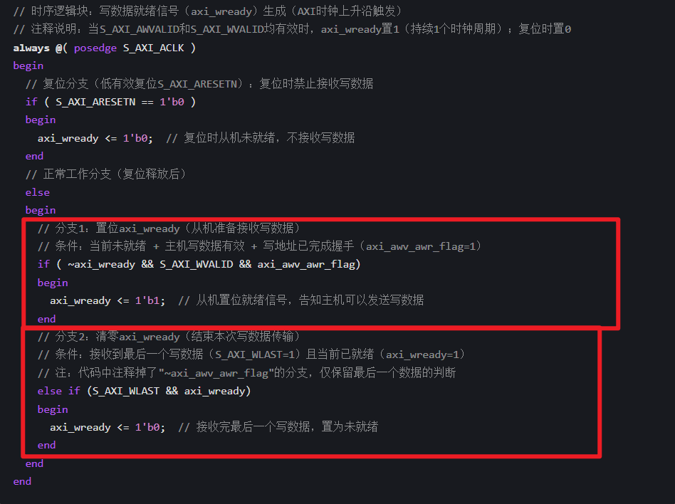

#### 4:axi-full-slave 的 axi_bvalid 信号

axi_bvalid 用于告知 axi master axi-slave 端已经完成数据接收了
给出 ACK，写操作 LAST 信号的下一个时钟，AXI-SLAVE 给出 ACK 信号

**AXI4 协议写响应通道（B Channel）的核心逻辑**，主要实现写响应有效信号（`axi_bvalid`）和响应类型（`axi_bresp`）的生成，核心作用是在写地址 + 写数据传输完成后，向主机返回 “写成功” 的响应，遵循 AXI 协议的写响应规则。

- 复位时清空所有写响应相关寄存器，`axi_bvalid`置 0（无响应）、`axi_bresp`置 0（默认 OKAY）；
- 当一次写突发传输完全完成（地址握手完成 + 最后一个写数据接收完成）且无未完成的写响应时，置位`axi_bvalid`，并返回 “OKAY” 响应（`axi_bresp=2'b0`）；
- 当主机准备好接收写响应（`S_AXI_BREADY`）且当前响应有效（`axi_bvalid`）时，清零`axi_bvalid`，结束本次写响应传输；
- 全程返回 “OKAY” 响应，无错误 / 异常响应处理（简化版实现）。

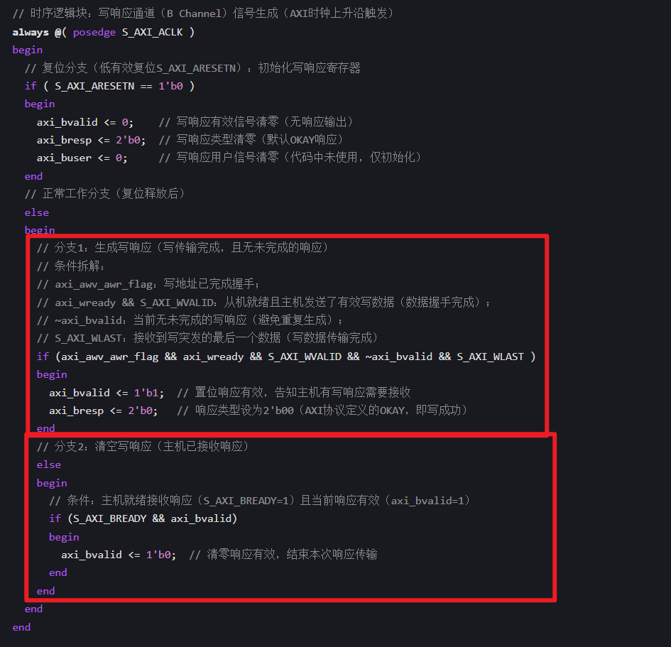

#### 5:axi-full-slave 的 axi_arready 信号

当满足条件(~axi_arready && S_AXI_ARVALID && ~axi_awv_awr_flag && ~axi_arv_arr_flag) =1  的时候表示可以进行一次 AXI-FULL 的 burst 读操作了，这个时候 AXI -FULL-SLAVE 设置 axi_arready <= 1'b1 和 axi_arv_arr_flag <= 1'b1

**AXI4 协议读地址通道（AR Channel）的`axi_arready`信号生成逻辑**，核心作用是控制从机何时接收主机发来的读地址 / 控制信号，同时通过标志位管理读地址传输的状态，保证读写通道互斥、读传输完整收尾。
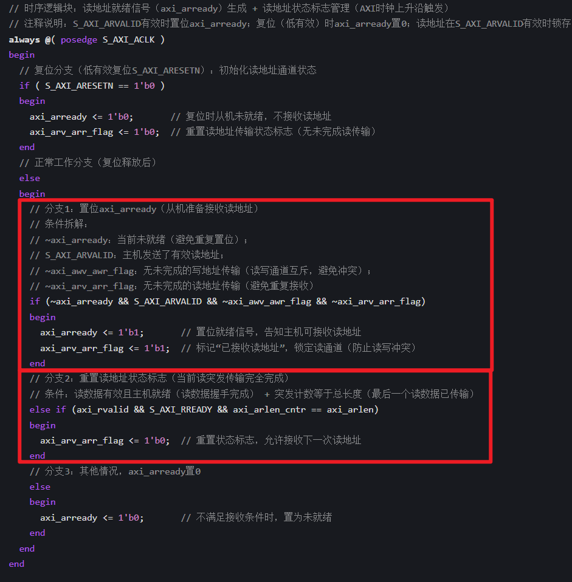

#### 6:axi-full-slave 的 axi_araddr 信号

AXI-的读写操作几乎是相对的代码，AXI 的 burst 模式包括 3 种：
1. fixed burst 这种模式下地址都是相同的
2. incremental burst 这种模式下地址递增
3. Wrapping burst 这只模式下地址达到设置的最大地址边界后返回原来的地址。
本文 demo 种以下三种模式的具体代码如下：

**AXI4 协议读通道（AR/R Channel）的核心状态机逻辑**，完整实现了 “读地址锁存→突发传输中地址自动更新→最后一个读数据标志（axi_rlast）生成” 的全流程，是 AXI 从机读操作的核心模块。

- **复位初始化**：清空所有读地址、突发计数、突发类型、rlast 等寄存器，保证复位后状态干净；
- **读地址锁存**：主机发起有效读地址传输且无冲突时，锁存读地址、突发类型（fixed/increment/wrap）、突发长度等关键参数；
- **突发地址更新**：在读数据传输阶段，根据 AXI 协议规定的 3 种突发类型（固定 / 递增 / 环绕）自动计算下一个读地址，并通过计数器跟踪传输进度；
- **rlast 生成**：在突发传输最后一个数据时置位`axi_rlast`，告知主机 “本次读突发传输结束”，主机就绪后清零该标志。

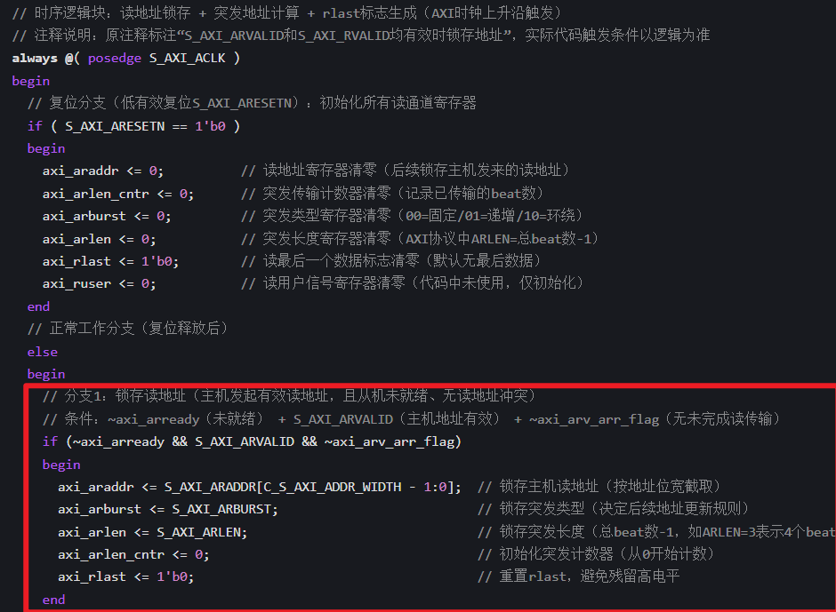
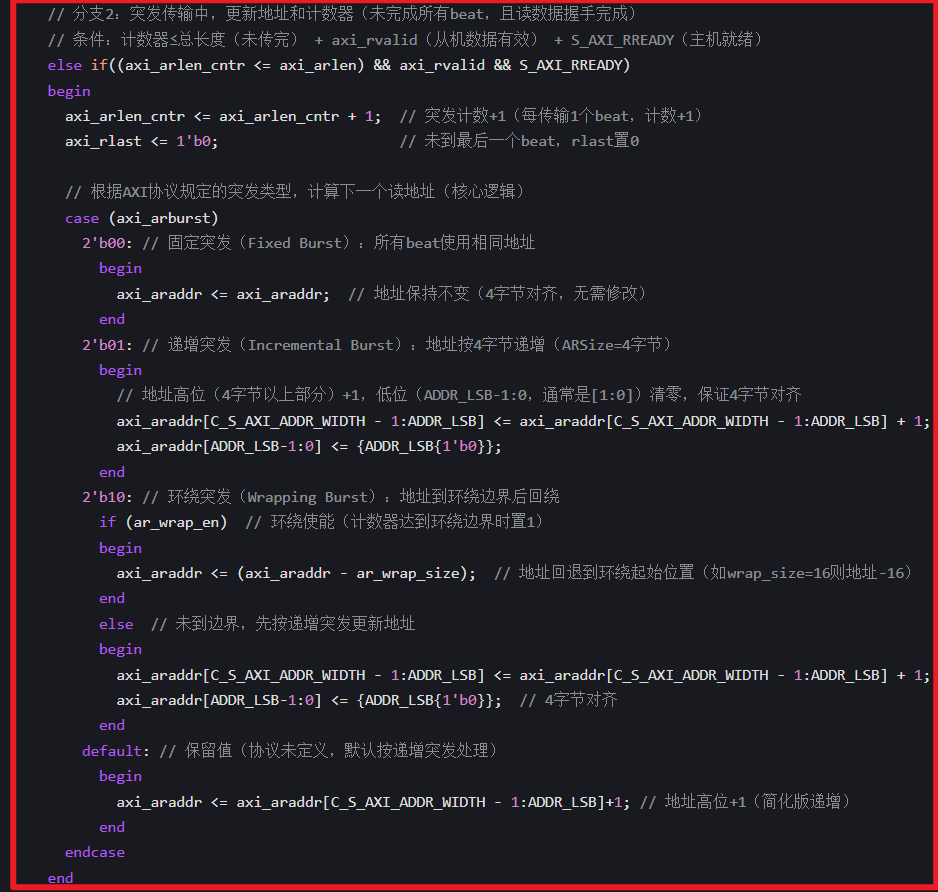
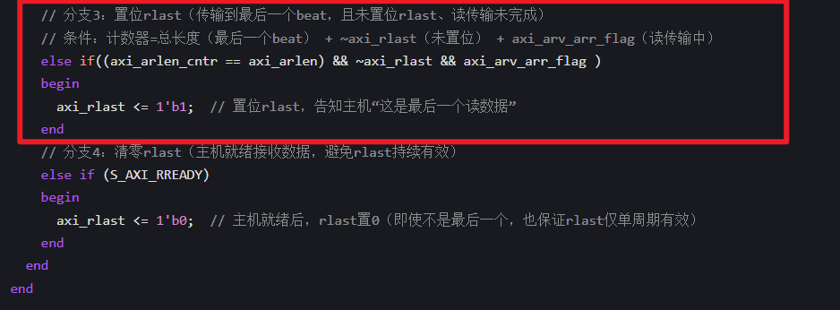

#### 7:axi-full-slave 的 axi_rvalid 信号

在用 VIVADO 模板产生的 demo 中，读操作数据不是连续读的，通过 axi_rvalid 设置 AXI-SLAVE FULL 读数据有效。

**AXI4 协议读响应通道（R Channel）的核心逻辑**，主要实现读数据有效信号（`axi_rvalid`）和读响应类型（`axi_rresp`）的生成，核心作用是在从机完成读地址接收后，向主机输出有效的读数据响应（固定返回 “OKAY”），遵循 AXI 协议的读响应握手机制。

- 复位时清空读响应相关寄存器，`axi_rvalid`置 0（无读数据 / 响应输出）、`axi_rresp`置 0（默认 OKAY 响应）；
- 当读地址传输完成（`axi_arv_arr_flag`置 1）且当前无未完成的读响应时，置位`axi_rvalid`，并固定返回 “OKAY” 响应（`axi_rresp=2'b0`）；
- 当主机准备好接收读响应（`S_AXI_RREADY`）且当前读响应有效（`axi_rvalid`）时，清零`axi_rvalid`，结束本次读响应传输；
- 代码为简化版实现：仅支持单次读传输（无突发），且全程返回 “OKAY” 响应，无错误 / 异常处理。

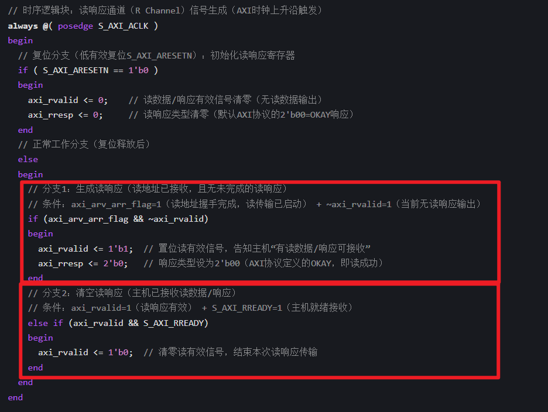

#### 8:数据保存到 bock ram

以下是利用 block ram 完成数据的保存和回读

**基于 AXI4 协议的块 RAM（BRAM）实现逻辑**，核心是通过生成语句（generate）创建多组按字节拆分的 RAM 阵列，实现 AXI 写数据的字节掩码写入、读数据的字节拼接输出，是 AXI 从机中 “存储层” 的核心实现。

- **外层循环（USER_NUM_MEM 次）**：创建多组独立的 BRAM 模块（数量由`USER_NUM_MEM`定义），支持多通道存储；
- **内层循环（数据位宽 / 8 次）**：将 AXI 32/64 位宽的数据拆分为 8 位字节 RAM（如 32 位数据拆为 4 个 8 位 RAM），支持按字节掩码（WSTRB）写入；
- **写操作**：当 AXI 写数据握手完成且对应字节掩码有效时，将写数据的对应字节写入字节 RAM；
- **读操作**：当读地址传输完成时，从字节 RAM 中读取数据，拼接后输出到`mem_data_out`。

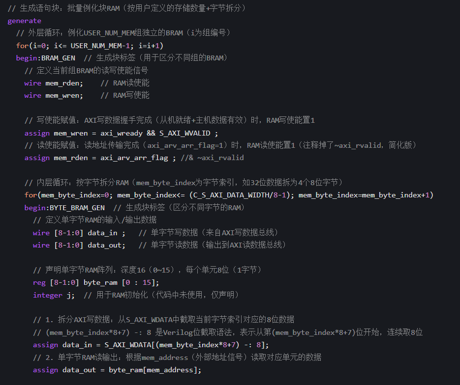
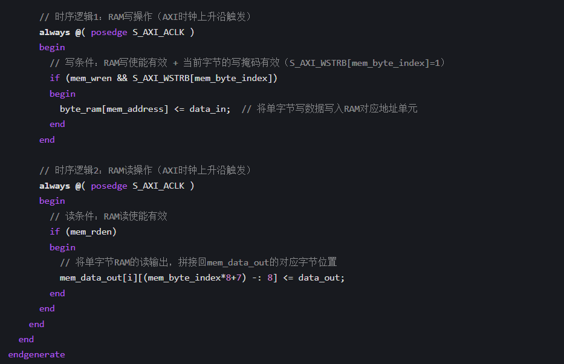

## 三、仿真结果

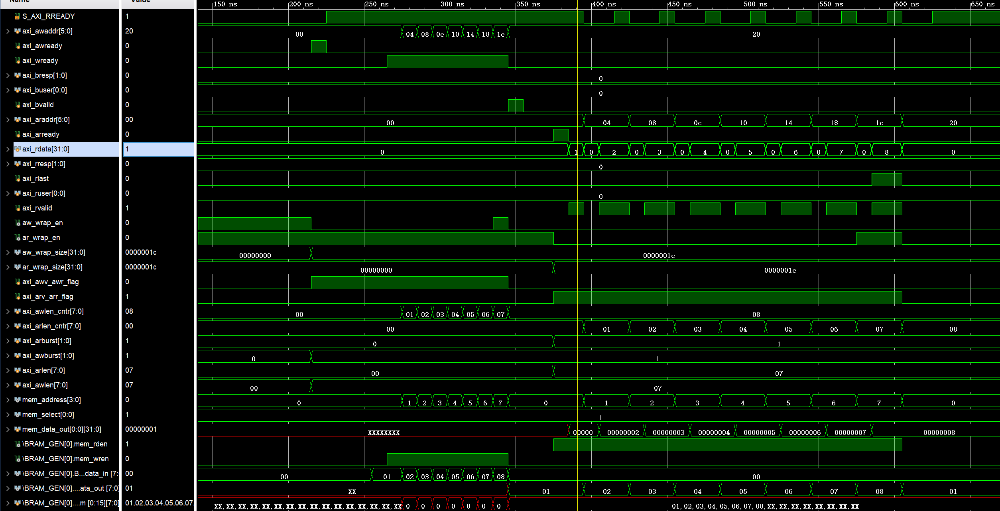

