## 一、概述

AXI4-Stream 去掉了地址，允许无限制的数据突发传输规模，AXI4-Stream 接口在数据流传输中应用非常方便，本来首先介绍了 AXI4-Stream 协议的型号定义，并且给出了一些 Stream 接口的时序方案图。之后通过 VIVADO 自带的 AXI4 模板，创建 axi-stream-master 和 axi-stream-slave ip。通过图形设计连线，添加仿真激励完成验证。


## 二、AXI4-Stream 协议介绍

### 2.1 信号定义
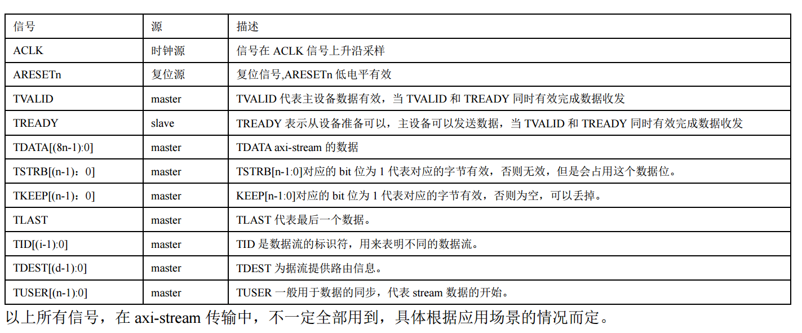

### 2.2 axi-stream 方案展示

下图中除了 ACLK 外，axi-stream 的信号用到了，TVALID、TREADY、TLAST、TDATA。
其中 TDATA 虽然是 12bit但是实际上会占用 16bit 的物理总线。
并且数据是循环发送，用 TLAST 标识了一次循环的最后一个数据。
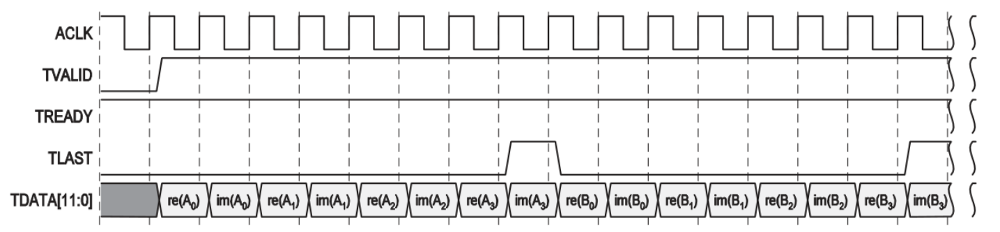

下图中截图来自 AXI-DMA mm2s 接口的时序图，
除了 ACLK 外，axi-stream 的信号用到了，TVALID、TREADY、TLAST、TDATA、TKEEP。
用 TLAST 标识了一次循环的最后一个数据。
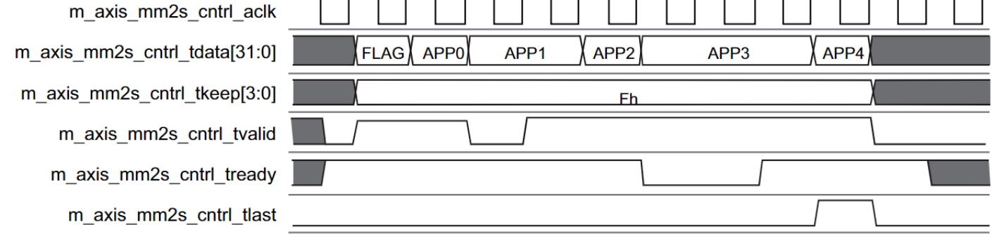

下图中是来自于 xilinx vivado 自带的 axis_vid_out ip 的视频输出时序。
EOL 就是 tlast ,SOF 就是 tuser 初次外还包括了 VALID、READY、DATA 信号。
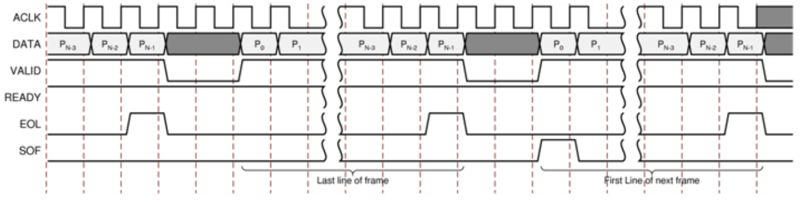


## 三、创建 axi-stream-master 总线接口 IP


创建例程
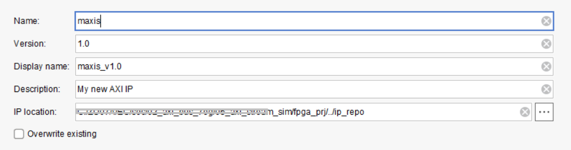
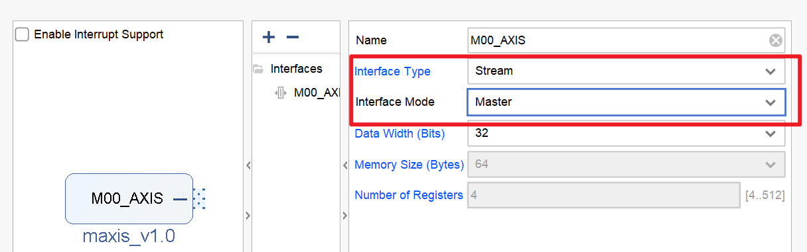
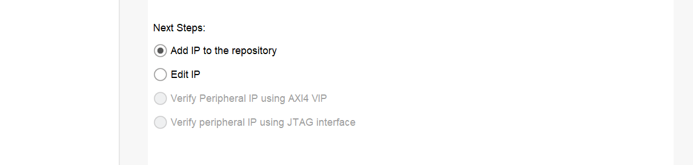

## 四、创建 axi-stream-slave 总线接口 IP

用于完成 axi-steam 协议的验证
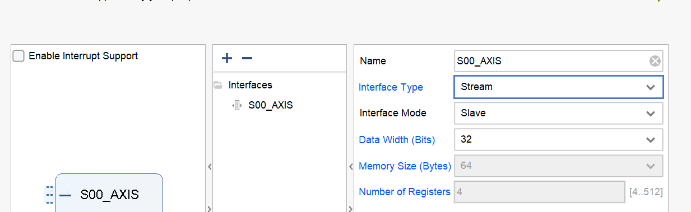
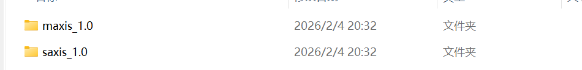

## 五、创建 FPGA 图像化设计

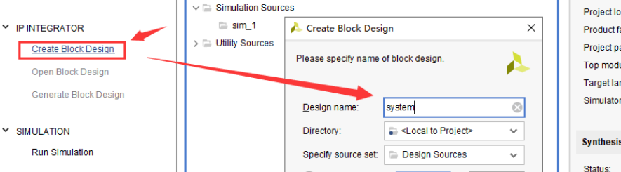
设置 IP 路径
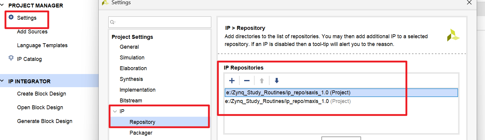
添加已经创建好的 IP，并连线
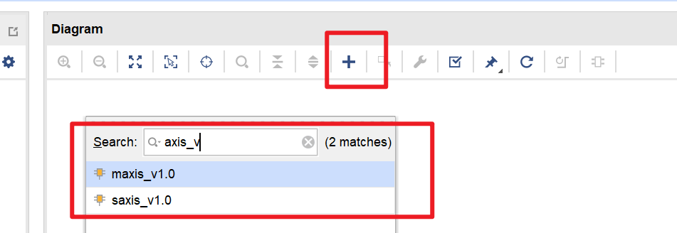
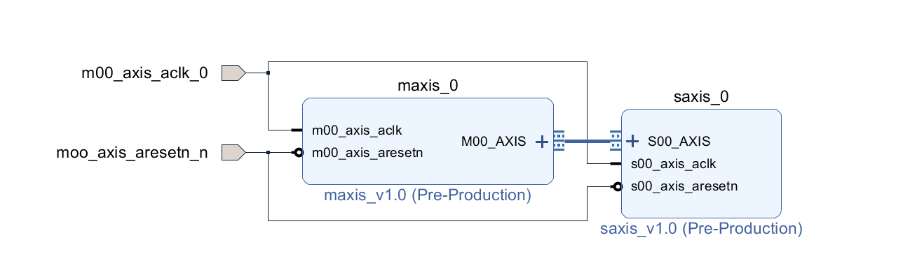
maxis 的 ip 参数设置
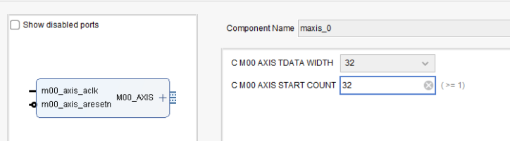
saxis 的 ip 参数设置
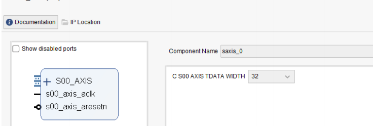
自动创建顶层文件
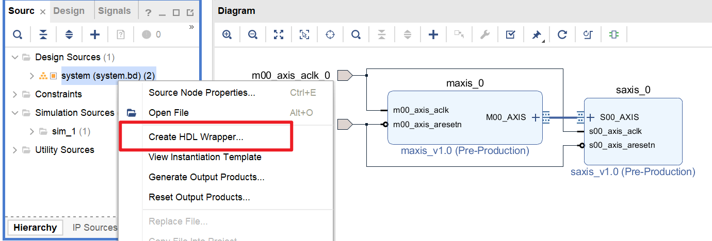


## 六、创建仿真文件
写个仿真程序
提供时钟和复位信号即可
把这个仿真文件添加到sim里

```c
`timescale 1ns / 1ns

// AXI-Stream顶层模块仿真测试文件
// 功能：给system_wrapper模块提供时钟和复位激励
module axis_top_sim();

    // 时钟信号（100MHz，周期10ns）
    reg         m00_axis_aclk_0;
    // 复位信号（低电平有效）
    reg         m00_axis_aresetn_0;

    // 例化system_wrapper顶层模块
    system_wrappertem    system_wrapper_inst
    (
        .m00_axis_aclk_0      (m00_axis_aclk_0),      // 输入时钟
        .m00_axis_aresetn_0   (m00_axis_aresetn_0)    // 输入复位（低有效）
    );

    // 初始化时钟和复位
    initial begin
        m00_axis_aclk_0      = 1'b0;   // 时钟初始化为低
        m00_axis_aresetn_0   = 1'b0;   // 复位初始化为有效（低电平）
        
        #100;                          // 复位持续100ns
        m00_axis_aresetn_0   = 1'b1;   // 释放复位
    end

    // 生成100MHz时钟（周期10ns，高低电平各5ns）
    always begin
        #5 m00_axis_aclk_0 = ~m00_axis_aclk_0;
    end

endmodule
```


## 七、程序分析

默认的 maxis 模板的代码有 bug，我们对其进行修改.
### 1:maxis 代码分析
#### 1 把以下代码替换默认的代码并且保存

```verilog
`timescale 1 ns / 1 ps

module maxis_v1_0_M00_AXIS #
(
    // AXI-Stream数据位宽（默认32位）
    parameter integer C_M_AXIS_TDATA_WIDTH = 32,
    // 发送数据前的等待时钟周期数
    parameter integer C_M_START_COUNT     = 32
)
(
    // 全局时钟
    input  wire                                          M_AXIS_ACLK,
    // 同步复位（低有效）
    input  wire                                          M_AXIS_ARESETN,
    // AXI-Stream有效数据标志（主设备输出）
    output wire                                          M_AXIS_TVALID,
    // AXI-Stream数据总线
    output wire [C_M_AXIS_TDATA_WIDTH-1 : 0]             M_AXIS_TDATA,
    // AXI-Stream字节有效标志（全1表示所有字节有效）
    output wire [(C_M_AXIS_TDATA_WIDTH/8)-1 : 0]         M_AXIS_TSTRB,
    // AXI-Stream包结束标志
    output wire                                          M_AXIS_TLAST,
    // AXI-Stream从设备就绪标志（主设备输入）
    input  wire                                          M_AXIS_TREADY
);

// 配置：需要发送的总数据个数
localparam NUMBER_OF_OUTPUT_WORDS = 8; 

// 计算二进制位数（向上取整对数）
function integer clogb2 (input integer bit_depth); 
begin
    for(clogb2=0; bit_depth>0; clogb2=clogb2+1) 
        bit_depth = bit_depth >> 1; 
end
endfunction

// 等待计数器位宽（匹配C_M_START_COUNT）
localparam integer WAIT_COUNT_BITS = clogb2(C_M_START_COUNT-1); 
// 读指针位宽（匹配需要发送的数据个数）
localparam bit_num = clogb2(NUMBER_OF_OUTPUT_WORDS); 

// 状态机定义
parameter [1:0] 
    IDLE         = 2'b00,  // 初始/空闲状态
    INIT_COUNTER = 2'b01,  // 等待计数器初始化状态
    SEND_STREAM  = 2'b10;  // 发送数据流状态

// 状态机寄存器
reg [1:0] mst_exec_state; 
// 数据发送计数指针（记录已发送的数据个数）
reg [bit_num-1:0] read_pointer; 

// 内部信号定义
reg [WAIT_COUNT_BITS-1 : 0] count;       // 等待计数器
wire axis_tvalid;                        // 内部有效数据标志
wire axis_tlast;                         // 内部包结束标志
wire tx_en;                              // 数据传输使能（TREADY & TVALID）
wire tx_done;                            // 数据发送完成标志

// AXI-Stream信号映射（直接连接内部信号，无延迟）
assign M_AXIS_TVALID = axis_tvalid;
assign M_AXIS_TDATA  = read_pointer;     // 发送数据为当前计数指针值
assign M_AXIS_TLAST  = axis_tlast;
// TSTRB全1，表示所有字节有效
assign M_AXIS_TSTRB  = {(C_M_AXIS_TDATA_WIDTH/8){1'b1}};

// 状态机逻辑（核心控制）
always @(posedge M_AXIS_ACLK) 
begin
    if (!M_AXIS_ARESETN) begin  // 复位
        mst_exec_state <= IDLE;
        count          <= 0; 
    end
    else begin
        case (mst_exec_state) 
            IDLE: begin
                // 空闲状态直接进入等待计数状态
                mst_exec_state <= INIT_COUNTER; 
            end
            
            INIT_COUNTER: begin
                // 等待计数器达到设定值，进入发送状态
                if (count == C_M_START_COUNT - 1) begin
                    mst_exec_state <= SEND_STREAM; 
                end
                else begin
                    count          <= count + 1;  // 计数器递增
                    mst_exec_state <= INIT_COUNTER;
                end
            end
            
            SEND_STREAM: begin
                // 数据发送完成，回到空闲状态
                if (tx_done) begin
                    mst_exec_state <= IDLE; 
                end
                else begin
                    mst_exec_state <= SEND_STREAM;  // 持续发送
                end
            end
        endcase
    end
end

// 有效数据标志生成：发送状态且未发完所有数据
assign axis_tvalid = ((mst_exec_state == SEND_STREAM) && (read_pointer < NUMBER_OF_OUTPUT_WORDS));

// 包结束标志生成：发送最后一个数据且传输使能有效（符合AXI协议）
assign axis_tlast  = (read_pointer == NUMBER_OF_OUTPUT_WORDS - 1'b1) && tx_en;

// 发送完成标志：包结束标志置位即表示所有数据发送完成
assign tx_done     = axis_tlast;

// 传输使能：从设备就绪 + 主设备有有效数据（AXI-Stream传输条件）
assign tx_en       = M_AXIS_TREADY && axis_tvalid; 

// 数据发送指针更新逻辑
always @(posedge M_AXIS_ACLK) 
begin
    if(!M_AXIS_ARESETN) begin
        read_pointer <= 0;  // 复位后指针清零
    end
    else if (tx_en) begin
        read_pointer <= read_pointer + 32'b1;  // 传输成功则指针递增
    end
end

endmodule
```

#### 2:Tcl Console 中输入reset_project 对工程 IP 复位
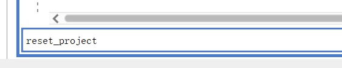

#### 3:之后单击 Refresh IP Catalog

<font color="#ff0000">这里注意，修改的并不是vivado里的.v文件，修改vivado里的.v文件是无效的</font>
<font color="#ff0000">因为 Vivado 会在重新生成 IP 产物时覆盖你的修改。</font>
<font color="#ff0000">正确的流程应该是修改 IP 的源文件，然后重新生成输出产物</font>
<font color="#ff0000">再IP源里修改</font>

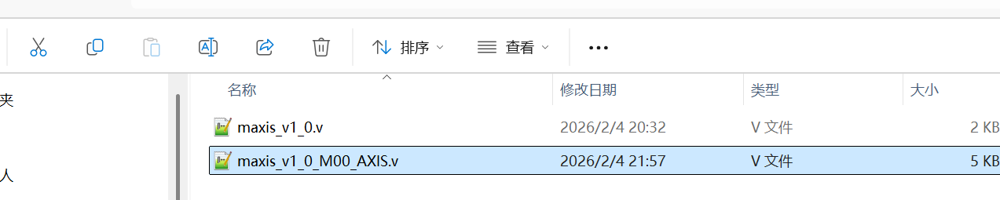
然后再操作

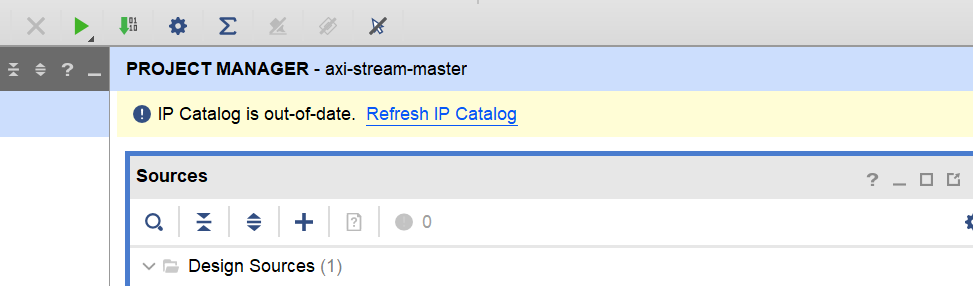

最后单击 upgrade Selected 完成更新
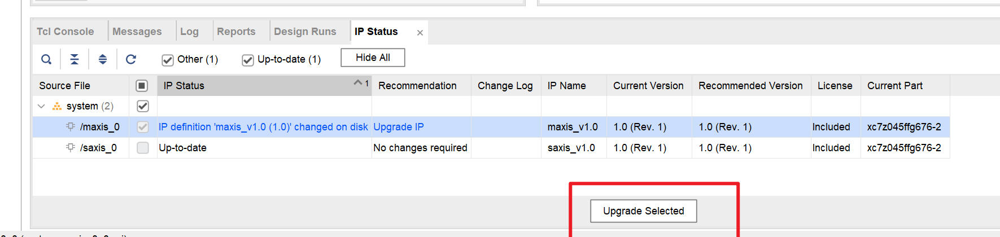


### 2:saxis 代码分析


```verilog
`timescale 1 ns / 1 ps

module saxis_v1_0_S00_AXIS #
(
    // AXI-Stream从设备数据位宽（默认32位）
    parameter integer C_S_AXIS_TDATA_WIDTH = 32
)
(
    // 全局时钟
    input  wire                                          S_AXIS_ACLK,
    // 同步复位（低有效）
    input  wire                                          S_AXIS_ARESETN,
    // 从设备就绪标志（告诉主设备：可以发数据了）
    output wire                                          S_AXIS_TREADY,
    // 从设备接收的数据总线
    input  wire [C_S_AXIS_TDATA_WIDTH-1 : 0]             S_AXIS_TDATA,
    // 字节有效标志（指示哪些字节是有效数据）
    input  wire [(C_S_AXIS_TDATA_WIDTH/8)-1 : 0]         S_AXIS_TSTRB,
    // 包结束标志（主设备告知：这是最后一个数据）
    input  wire                                          S_AXIS_TLAST,
    // 主设备有效数据标志（主设备告知：当前TDATA有有效数据）
    input  wire                                          S_AXIS_TVALID
);

// 计算二进制位数（向上取整对数，用于计算地址位宽）
function integer clogb2 (input integer bit_depth);
begin
    for(clogb2=0; bit_depth>0; clogb2=clogb2+1)
        bit_depth = bit_depth >> 1;
end
endfunction

// 配置：最多接收8个输入数据
localparam NUMBER_OF_INPUT_WORDS = 8;
// 写指针位宽（8个数据需要3位地址：0-7）
localparam bit_num = clogb2(NUMBER_OF_INPUT_WORDS-1);

// 状态机定义
parameter [1:0] 
    IDLE       = 1'b0,  // 空闲状态（未开始接收数据）
    WRITE_FIFO = 1'b1;  // 写FIFO状态（正在接收并存储数据）

// 内部信号定义
wire  axis_tready;       // 内部就绪标志（驱动S_AXIS_TREADY）
reg   mst_exec_state;    // 状态机寄存器
wire  fifo_wren;         // FIFO写使能（数据有效且从设备就绪）
reg   [bit_num-1:0] write_pointer;  // 数据接收计数指针（记录已存多少个数据）
reg   writes_done;       // 数据接收完成标志（已存8个数据或收到TLAST）

// 外部端口映射（内部就绪标志直接输出）
assign S_AXIS_TREADY = axis_tready;

// 状态机核心逻辑（控制接收流程）
always @(posedge S_AXIS_ACLK) 
begin  
    if (!S_AXIS_ARESETN) begin  // 复位：回到空闲状态
        mst_exec_state <= IDLE;
    end  
    else begin
        case (mst_exec_state)
            IDLE: begin
                // 主设备有有效数据（TVALID=1），开始接收数据
                if (S_AXIS_TVALID) begin
                    mst_exec_state <= WRITE_FIFO;
                end else begin
                    mst_exec_state <= IDLE;
                end
            end
            WRITE_FIFO: begin
                // 数据接收完成（存满8个或收到TLAST），回到空闲
                if (writes_done) begin
                    mst_exec_state <= IDLE;
                end else begin
                    mst_exec_state <= WRITE_FIFO;  // 持续接收
                end
            end
        endcase
    end
end

// 从设备就绪标志生成：写FIFO状态 + 未存满8个数据
assign axis_tready = ((mst_exec_state == WRITE_FIFO) && (write_pointer <= NUMBER_OF_INPUT_WORDS-1));

// 接收指针+完成标志更新逻辑
always@(posedge S_AXIS_ACLK) begin
    if(!S_AXIS_ARESETN) begin  // 复位：指针清零，完成标志置0
        write_pointer <= 0;
        writes_done <= 1'b0;
    end  
    else if (write_pointer <= NUMBER_OF_INPUT_WORDS-1) begin
        if (fifo_wren) begin  // 数据成功写入：指针+1
            write_pointer <= write_pointer + 1;
            writes_done <= 1'b0;
        end
        // 存满8个数据 或 收到主设备的TLAST：标记接收完成
        if ((write_pointer == NUMBER_OF_INPUT_WORDS-1) || S_AXIS_TLAST) begin
            writes_done <= 1'b1;
        end
    end  
end

// FIFO写使能：主设备有有效数据（TVALID=1）+ 从设备就绪（TREADY=1）
assign fifo_wren = S_AXIS_TVALID && axis_tready;

// FIFO实现（存储接收的数据）：按字节拆分存储，最多存8个32位数据
generate 
    for(byte_index=0; byte_index<= (C_S_AXIS_TDATA_WIDTH/8-1); byte_index=byte_index+1) begin:FIFO_GEN
        // 定义FIFO存储数组：每个元素存8位（1字节），共8个数据位置
        reg  [7:0] stream_data_fifo [0 : NUMBER_OF_INPUT_WORDS-1];

        // 数据写入FIFO：写使能有效时，将TDATA的对应字节存入FIFO
        always @( posedge S_AXIS_ACLK ) begin
            if (fifo_wren) begin
                stream_data_fifo[write_pointer] <= S_AXIS_TDATA[(byte_index*8+7) -: 8];
            end  
        end  
    end		
endgenerate

// 可添加用户自定义逻辑（比如读取FIFO数据、处理数据等）
// User logic ends

endmodule
```


## 八、仿真结果
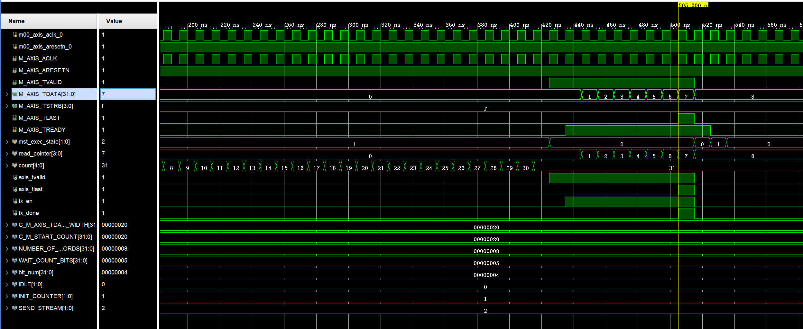


## 九、技术细节及问题

### 1、AXI-Stream没有地址线，是如何确保存入相应的地址的。

虽然协议本身无地址，但实际应用中会通过以下方式间接 “标识数据”：

1. **按 “包” 传输 + 上层协议约定（比如DMA、视频流、音频流）**
    
    用`TLAST`把数据分成 “包”，比如：
    
    - 第一包传 “数据长度”，第二包传 “实际数据”；
    - 约定前 4 个 Beat 是 “帧头 / 地址信息”，后续是 “有效数据”（相当于自定义地址）。
    
2. **结合 DMA / 寄存器配置**
    
    <font color="#ff0000">比如 Zynq 中，CPU 先通过 AXI4 配置 DMA 的 “源地址 / 目的地址”，DMA 再通过 AXI-Stream 传输数据（地址由 DMA 提前配置，不在 AXIS 总线上传输</font>）。
    
1. **固定数据流映射**
    
    比如主设备只给从设备传 “传感器数据”，从设备直接存储到本地 FIFO，无需地址（数据顺序就是逻辑地址）。


### 2、DMA + AXI-Stream 的完整传输逻辑

- **CPU（用户）给 DMA 下指令**（配置地址）：
    
    - CPU 通过 AXI4（有地址的内存映射协议）写 DMA 的寄存器，配置：
        
        - 「源地址」：比如 DDR 里存放待传输数据的起始地址；
        - 「目的地址」：比如 FPGA 内部 BRAM 的起始地址；
        - 「传输长度」：要传多少个数据（比如你代码里的 8 个 32 位数据）；
        - 「传输方向」：DDR→FPGA（读 DMA）或 FPGA→DDR（写 DMA）。
        
    
- **DMA 启动后，驱动 AXI-Stream 传输**（无地址）：
    
    - DMA 从配置的「源地址」开始，逐字读取数据，通过 AXI-Stream 的`TDATA`总线连续发送；
    - AXI-Stream 只负责通过`TVALID/TREADY`握手把数据传给接收端，全程不关心 “数据原本存在哪个地址”；
    - 接收端（比如你写的 AXIS 从设备）按顺序接收数据，要么存在本地 FIFO，要么由 DMA 写入配置的「目的地址」。
    
- **传输完成**：
    - 传输长度达标后，DMA 触发中断告知 CPU “传输完成”，整个过程中 AXI-Stream 始终没有地址参与。


### 3、AXI-Lite 配置 DMA 的典型寄存器

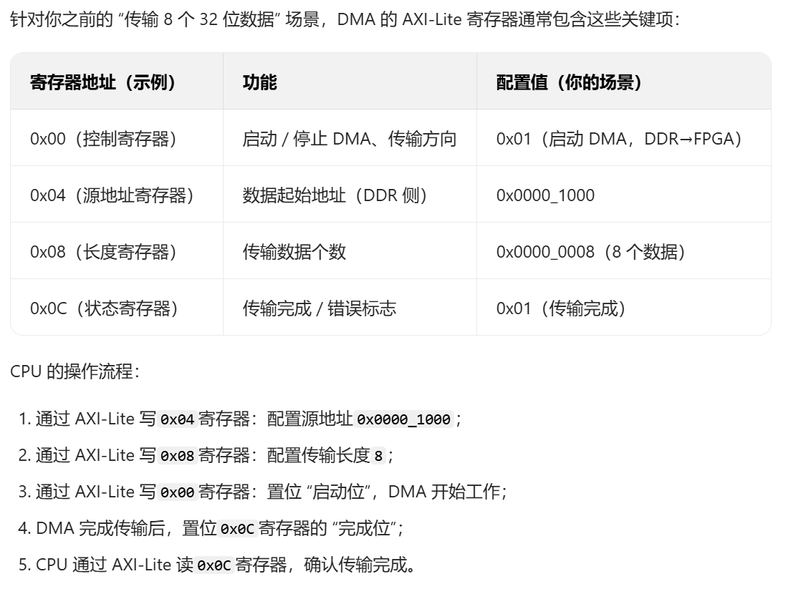


### 4、为什么Stream传输之前要有等待32个时钟周期呢

**模板自带的 “上电稳定期”**，作用是：

1. 让时钟、复位、上下游模块**完全稳定**再开始传输；
2. 避免复位释放瞬间的**亚稳态、时序违规**；
3. 给 IP 内部状态机、FIFO、时钟域交叉电路**留恢复时间**。

	完全可以改成 0/1/8/16 拍，甚至**直接去掉等待**，只要你的系统时序收敛、上下游能正常握手。

**可以使用等待周期配合lite，等待周期 + AXI-Lite 配置**
	你代码里的 32 个时钟等待，本质是 “主设备还没开始发 AXI-Stream 数据的空闲窗口”，正好用来做低速的 AXI-Lite 配置

**对应你代码的具体实现思路（极简版）**

1. **等待周期保留 32 拍**（或根据配置耗时调整为 16/64 拍），足够 CPU 完成 DMA 寄存器配置；
2. **DMA 增加 “配置完成” 标志**：
    
    - CPU 通过 AXI-Lite 写完所有寄存器后，置位一个 “配置完成” 寄存器（比如 0x10 地址）；
    - AXI-Stream 主设备的状态机，除了等 32 拍，还可以判断 “配置完成” 标志，确保两者都满足后再发数；
    
3. **可选：让等待周期 “自适应”**：
    
    不用固定 32 拍，而是等 “32 拍超时” 或 “配置完成”（哪个先到等哪个），更灵活。


