# 一、概述

编写一个自定义的 AXI-Lite-Slave GPIO IP,并且用编写的 AXI-Lite-Master IP 对齐进行仿真验证和上板验证。

**实验目的：**

1:修改 VIVADO 产生的 saxi-lite- gpio 模板，增加 GPIO 的定义
2:修改 VIVADO 产生的 maxi-lite-gpio 模板，增加对 saxi-lite- gpio 寄存器的读写操作。
3:进一步掌握基于 vivado 实现的 ip 的封装


# 二、基于 VIVADO 的 IP 封装


## 2.1、封装 maxi_lite_gpio IP

放好代码
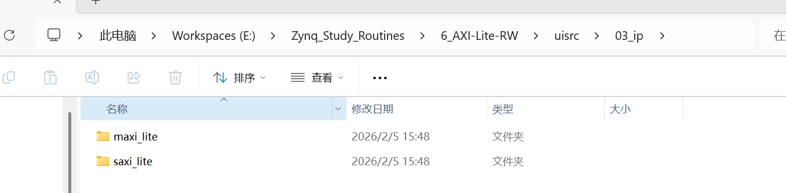
创建空工程
添加ip源码，maxi_lite_gpio 
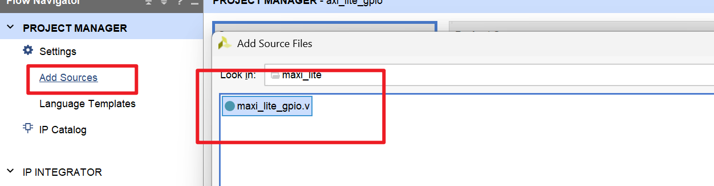
创建ip
 tools 菜单中找到 Create and Package New IP。
 这次选package your current project！！！
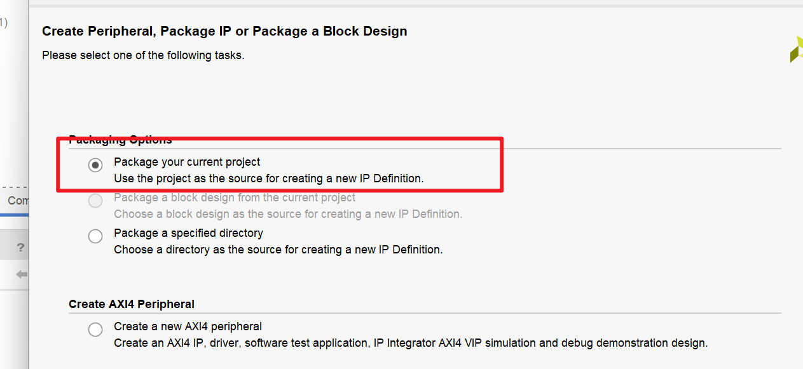

新增 IP 编辑窗口
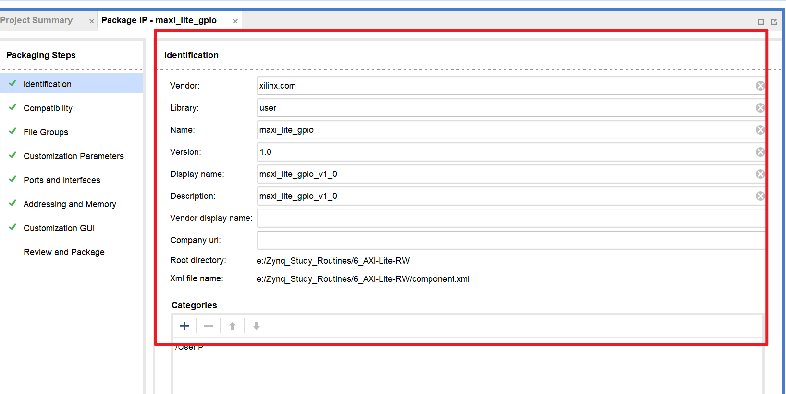

参数接口
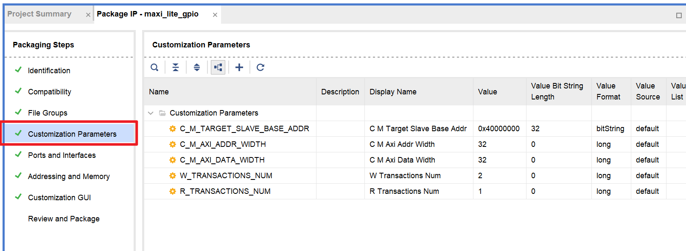

信号接口
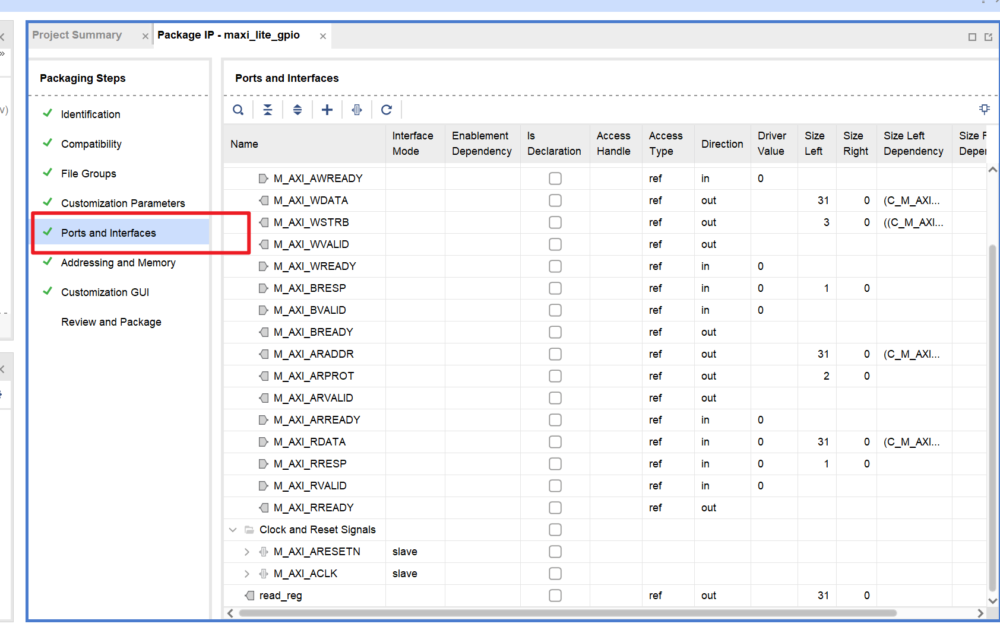

完成ip打包
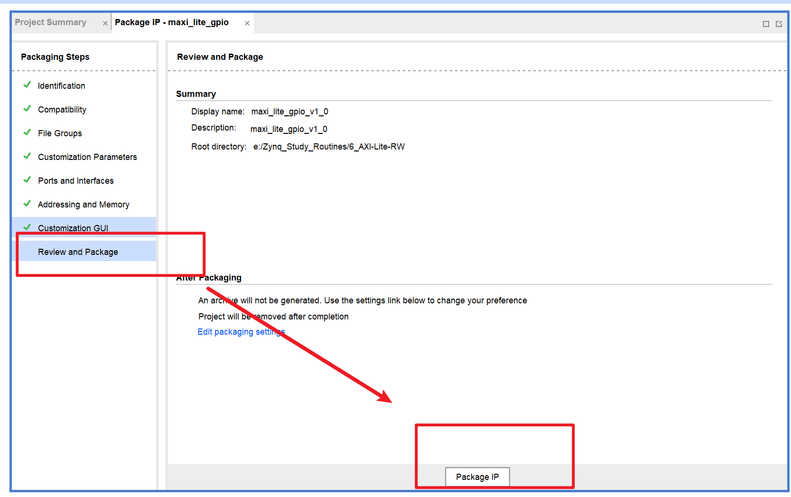
打包完的文件如下


## 2.1、封装 saxi_lite_gpio  IP

同上（略）
两个ip核已经就绪
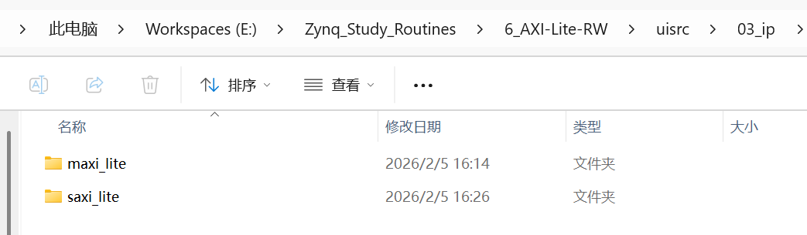


# 三、FPGA 图形化编程


设置 IP 路径
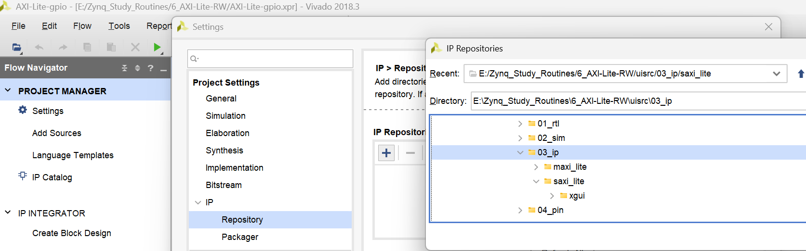

创建 BD 工程
添加以上完成的 maxi_lite_gpio 和 saxi_lite_gpio 两个 IP，
添加虚拟 IO 用于观察数据
完成连线
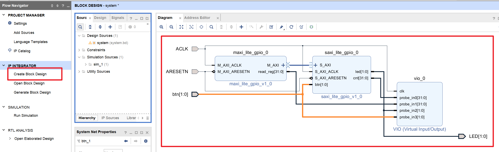


编写顶层代码，给个复位信号
```verilog
module system_wrapper
(
    input           sysclk,          // 系统时钟
    input   [1:0]   btn,             // 按键输入
    output  [1:0]   led              // LED输出
);

// 异步复位释放信号
wire            ARESETN;
// 复位计数器，初始值0
reg     [7:0]   rstn_cnt = 8'd0;

// 复位计数器逻辑：计数至最高位为1时停止
always @(posedge sysclk) begin
    if (rstn_cnt[7] == 1'b0) begin
        rstn_cnt <= rstn_cnt + 1'b1;
    end
end

// 复位释放信号赋值
assign ARESETN = rstn_cnt[7];

// 例化系统核心模块
system system_i
(
    .sysclk     (sysclk),
    .ARESETN    (rstn_cnt[7]),
    .btn        (btn),
    .led        (led)
);

endmodule
```

添加个仿真代码
```verilog
module axi_top_sim();

reg         sysclk;
wire  [1:0] btn = 2'b01;
wire  [1:0] led;

system_wrapper system_wrapper_inst
(
    .sysclk(sysclk),
    .btn(btn),
    .led(led)
);

initial begin
    sysclk = 1'b0;
    #100;
end

always begin
    #5 sysclk = ~sysclk;
end

endmodule
```


# 四、代码分析


## maxi_lite_gpio 代码注释 + 整体分析

```verilog

`timescale 1 ns / 1 ps
module maxi_lite_gpio #
(
    // 从设备基地址（需与硬件中Slave地址匹配）
	parameter  C_M_TARGET_SLAVE_BASE_ADDR	= 32'h40000000,
	parameter integer C_M_AXI_ADDR_WIDTH	= 32,  // AXI地址位宽
	parameter integer C_M_AXI_DATA_WIDTH	= 32,  // AXI数据位宽
	parameter integer W_TRANSACTIONS_NUM	= 2,   // 单次写事务数：连续写2个地址
	parameter integer R_TRANSACTIONS_NUM	= 1    // 单次读事务数：连续读1个地址
)
(
    // 全局时钟/复位（低电平有效，匹配AXI标准）
	input  wire  M_AXI_ACLK,
	input  wire  M_AXI_ARESETN,
	// AXI-Lite 写地址通道信号
	output wire [C_M_AXI_ADDR_WIDTH-1 : 0] M_AXI_AWADDR,
	output wire [2 : 0] M_AXI_AWPROT,
	output wire  M_AXI_AWVALID,
	input  wire  M_AXI_AWREADY,
	// AXI-Lite 写数据通道信号
	output wire [C_M_AXI_DATA_WIDTH-1 : 0] M_AXI_WDATA,
	output wire [C_M_AXI_DATA_WIDTH/8-1 : 0] M_AXI_WSTRB,
	output wire  M_AXI_WVALID,
	input  wire  M_AXI_WREADY,
	// AXI-Lite 写响应通道信号
	input  wire [1 : 0] M_AXI_BRESP,
	input  wire  M_AXI_BVALID,
	output wire  M_AXI_BREADY,
	// AXI-Lite 读地址通道信号
	output wire [C_M_AXI_ADDR_WIDTH-1 : 0] M_AXI_ARADDR,
	output wire [2 : 0] M_AXI_ARPROT,
	output wire  M_AXI_ARVALID,
	input  wire  M_AXI_ARREADY,
	// AXI-Lite 读数据/响应通道信号
	input  wire [C_M_AXI_DATA_WIDTH-1 : 0] M_AXI_RDATA,
	input  wire [1 : 0] M_AXI_RRESP,
	input  wire  M_AXI_RVALID,
	output wire  M_AXI_RREADY,
	// 读数据缓存寄存器（输出到外部，可观测从设备数据）
	output reg  [31:0]read_reg
);

// 定时计数器阈值：实际硬件99999999（约500ms，依时钟频率），仿真可改小
localparam TIME_SET = 99999999;
//localparam TIME_SET = 99;//for simulation
// 状态机定义：IDLE(空闲)、START1/2(复位内部信号)、DATA(读写事务执行)
localparam S_IDLE   = 0;
localparam S_START1 = 1;
localparam S_START2 = 2;
localparam S_DATA   = 3;
reg [31:0]	 time_cnt;	// 全局定时计数器：达到阈值触发一次读写事务

// 1. 全局定时计数器：循环计数，达到TIME_SET触发读写
always @ ( posedge M_AXI_ACLK)begin                                                                             
    if (M_AXI_ARESETN == 1'b0)                                                                                
          time_cnt <= 0;
    else if(time_cnt < TIME_SET)
          time_cnt <= time_cnt + 1'b1; 
    else 
          time_cnt <= 0;  
end     

// 辅助函数：计算位宽（用于生成读写索引的位宽，避免冗余）
function integer clogb2 (input integer bit_depth);begin
	 for(clogb2=0; bit_depth>0; clogb2=clogb2+1)
		 bit_depth = bit_depth >> 1;
end
endfunction

// 写事务内部寄存器定义
localparam integer WRITE_NUM_BITS = clogb2(W_TRANSACTIONS_NUM-1);
reg  	axi_awvalid;  // 内部写地址有效信号
reg [C_M_AXI_ADDR_WIDTH-1 : 0] 	axi_awaddr;  // 内部写地址（偏移量）
reg  	axi_wvalid;   // 内部写数据有效信号
reg [C_M_AXI_DATA_WIDTH-1 : 0] 	axi_wdata;   // 内部写数据
reg  	axi_bready;   // 内部写响应准备信号
reg  	start_single_write;  // 单次写事务启动信号
wire  	write_resp_error;    // 写响应错误标志
reg  	writes_done;         // 单次所有写事务完成标志
reg [WRITE_NUM_BITS : 0] 	    write_index; // 写事务索引（0~1，对应2次写）
reg     wstart;        // 写状态机启动标志（复位内部写信号）
reg     [31:0] wcnt_reg; // 写次数计数器（记录已完成的写事务总次数）
reg     [1 :0] led_reg;  // LED控制寄存器（生成2位翻转数据，写入从设备控制LED）

// AXI-Lite 写通道信号映射到外部端口
assign M_AXI_AWADDR	= C_M_TARGET_SLAVE_BASE_ADDR + axi_awaddr; // 实际写地址=基地址+偏移
assign M_AXI_WDATA	= axi_wdata;
assign M_AXI_AWPROT	= 3'b000;  // 保护信号：普通访问（AXI标准，无特殊保护）
assign M_AXI_AWVALID	= axi_awvalid;
assign M_AXI_WVALID	= axi_wvalid;
assign M_AXI_WSTRB	= 4'b1111; // 写选通：32位全写（1位对应1字节，4字节=32位）
assign M_AXI_BREADY	= axi_bready;
assign write_resp_error = (axi_bready & M_AXI_BVALID & M_AXI_BRESP[1]); // 写错误：响应位1为1

// 2. AXI-Lite 写地址通道控制：生成AWVALID，与Slave的AWREADY握手
always @(posedge M_AXI_ACLK)begin                                                                        
    if (M_AXI_ARESETN == 0 || wstart == 1)begin                                                                     
        axi_awvalid <= 1'b0;                                                   
    end else begin                                                                    
        if (start_single_write)begin                                                             
            axi_awvalid <= 1'b1;                                               
        end else if (M_AXI_AWREADY && axi_awvalid)begin  // 握手成功，拉低有效信号                                               
            axi_awvalid <= 1'b0;                                               
        end                                                                  
    end                                                                      
end

// 写事务锁定信号：防止单次写事务中重复启动
reg axi_wlocked ;  
always @(posedge M_AXI_ACLK)begin                                                                        
    if (M_AXI_ARESETN == 0 || wstart == 1)begin                                                                      
        axi_wlocked <= 1'b0;                                                   
    end else begin                                                                    
        if (start_single_write)begin 
            axi_wlocked <= 1'b1;                                                                                   
        end else if (axi_bready & M_AXI_BVALID)begin  // 写响应完成，解锁                                               
            axi_wlocked <= 1'b0;                                               
        end                                                                  
    end                                                                      
end   	

// 写地址偏移量控制：每次写握手成功，地址+4（32位对齐，AXI标准）
always @(posedge M_AXI_ACLK)begin                                                     
    if (M_AXI_ARESETN == 0 || wstart == 1)begin                                                  
        axi_awaddr <= 0;                                    
    end else if (M_AXI_AWREADY && axi_awvalid)begin                                               
        axi_awaddr <= axi_awaddr + 32'h00000004;                                                                 
    end                                                   
end  

// 3. AXI-Lite 写数据通道控制：生成WVALID，与Slave的WREADY握手
always @(posedge M_AXI_ACLK)begin                                                                         
    if (M_AXI_ARESETN == 0 || wstart == 1)begin                                                                      
        axi_wvalid <= 1'b0;                                                     
    end else if (start_single_write)begin                                                                     
        axi_wvalid <= 1'b1;                                                     
    end else if (M_AXI_WREADY && axi_wvalid) begin  // 握手成功，拉低有效信号                                                                
        axi_wvalid <= 1'b0;                                                      
    end                                                                       
end                  

// LED数据生成：定时计数器达到阈值，2位数据翻转（用于控制LED闪烁）
always @(posedge M_AXI_ACLK) begin                                                     
    if (M_AXI_ARESETN == 0)begin                                                  
        led_reg <= 2'b01;                  
    end else if (time_cnt== TIME_SET)begin                                       
        led_reg <= {led_reg[0],led_reg[1]}; // 位翻转：01→10→01...
    end                                                   
end   	

// 写数据生成：根据写索引生成不同数据
always @(posedge M_AXI_ACLK) begin                                                     
    if (M_AXI_ARESETN == 0 || wstart == 1)begin                                                  
        axi_wdata <= 0;                  
    end else if (start_single_write)begin                                       
        if(write_index == 0)                                            
           axi_wdata <= {30'd0,led_reg};   // 第1次写：低2位是LED控制数据，高30位0
        else if(write_index == 1) 
           axi_wdata <= wcnt_reg;          // 第2次写：写事务总次数
    end                                                   
end       

// 写索引控制：每次写数据握手成功，索引+1（记录当前是第几次写）
always @(posedge M_AXI_ACLK)begin                                                                            
    if (M_AXI_ARESETN == 0 || wstart == 1)begin                                                                           
        write_index <= 0;                                                           
    end else if (M_AXI_WREADY && axi_wvalid)begin                                                                        
        write_index <= write_index + 1;                                              
    end                                                                          
end  

// 写响应通道控制：生成BREADY，与Slave的BVALID握手
always @(posedge M_AXI_ACLK)begin                                                                
    if (M_AXI_ARESETN == 0 || wstart == 1)begin                                                           
        axi_bready <= 1'b0;                                            
    end else if (M_AXI_BVALID && ~axi_bready)begin  // 收到响应，置1准备接收                                                          
        axi_bready <= 1'b1;                                            
    end else if (axi_bready)begin // 握手完成，置0                                                           
        axi_bready <= 1'b0;                                            
    end else                                                               
      axi_bready <= axi_bready;                                        
end                                                                  

// 单次写事务完成标志：所有写次数完成且收到最后一个写响应
always @(posedge M_AXI_ACLK)begin                                                                             
    if (M_AXI_ARESETN == 0 || wstart == 1)                                                         
      writes_done <= 1'b0;                                                                                                                            
    else if (M_AXI_BVALID && axi_bready && write_index == W_TRANSACTIONS_NUM)                              
      writes_done <= 1'b1;                                                          
    else                                                                            
      writes_done <= writes_done;                                                   
end  

// 写完成标志打拍（消除亚稳态，工程常用技巧）
reg writes_done_r;
always @ ( posedge M_AXI_ACLK)
   writes_done_r <= writes_done;

// 写总次数计数器：每完成一次单次写事务（2次写），计数+1
always @ ( posedge M_AXI_ACLK)
	if (M_AXI_ARESETN == 1'b0)begin 
		wcnt_reg <= 0;  
	end else if(writes_done_r == 0 && writes_done == 1) // 检测上升沿，避免重复计数
	    wcnt_reg <= wcnt_reg + 1'b1;     

// 4. 写事务状态机：控制单次写事务的启动、执行、完成
reg [1:0] AXI_WS;	  
always @ ( posedge M_AXI_ACLK)begin                                                                             
    if (M_AXI_ARESETN == 1'b0)begin                                                                                 
          AXI_WS <= S_IDLE;
		  wstart <= 1'b0;
		  start_single_write <= 1'b0;
    end else begin                                                                         
        case (AXI_WS)                                                                                                                          
          S_IDLE:begin  // 空闲：定时计数器达到阈值，启动写事务
		  	start_single_write <= 1'b0;                                                           
            if ( time_cnt == TIME_SET ) begin                                                                
                AXI_WS  <= S_START1;                                      
            end else begin                                                                 
                AXI_WS  <= S_IDLE;                                    
            end  
		end     
         S_START1:begin // 启动1：置位wstart，复位内部写信号
            wstart  <= 1'b1;
            AXI_WS  <= S_START2;    
         end      
         S_START2:begin // 启动2：拉低wstart，进入数据写阶段
            wstart <= 1'b0;
            AXI_WS  <= S_DATA;    
         end   																 
          S_DATA:  // 数据写：循环执行指定次数写事务，完成后回到空闲
		  	if(write_index < W_TRANSACTIONS_NUM ) begin
 				if (~axi_wlocked && ~start_single_write)begin                                                           
                      start_single_write <= 1'b1;  // 启动单次写（地址+数据）                                                                         
                end else  begin                                                           
                    start_single_write <= 1'b0; // 拉低生成脉冲，避免重复启动      
                end     				  	
			end else if (writes_done)begin                                                                 
                AXI_WS <= S_IDLE;                                      
            end                                                                                                                           
           default :begin                                                                  
               AXI_WS  <= S_IDLE;                                     
           end                                                                    
        endcase                                                                     
    end                                                                             
end 

// ------------------- AXI-Lite 读事务逻辑（与写事务结构完全对称）-------------------
localparam integer READ_NUM_BITS = clogb2(R_TRANSACTIONS_NUM-1);
reg  	axi_arvalid;  // 内部读地址有效信号
reg [C_M_AXI_ADDR_WIDTH-1 : 0] 	axi_araddr;  // 内部读地址（偏移量）
reg  	axi_rready;   // 内部读数据准备信号
reg  	start_single_read;  // 单次读事务启动信号
reg     reads_done;         // 单次所有读事务完成标志
reg [READ_NUM_BITS : 0] 	    read_index;  // 读事务索引（0，对应1次读）
reg rstart;                  // 读状态机启动标志（复位内部读信号）

// AXI-Lite 读通道信号映射到外部端口
assign M_AXI_ARADDR	= C_M_TARGET_SLAVE_BASE_ADDR + axi_araddr; // 实际读地址=基地址+偏移
assign M_AXI_ARVALID	= axi_arvalid;
assign M_AXI_ARPROT	= 3'b001;  // 保护信号：普通读访问
assign M_AXI_RREADY	= axi_rready;
assign read_resp_error = (axi_rready & M_AXI_RVALID & M_AXI_RRESP[1]); // 读响应错误标志

// 5. AXI-Lite 读地址通道控制：生成ARVALID，与Slave的ARREADY握手
always @(posedge M_AXI_ACLK)begin                                                                            
    if (M_AXI_ARESETN == 0 || rstart == 1'b1)begin                                                                        
        axi_arvalid <= 1'b0;                                                       
    end else if (start_single_read)begin                                                                        
        axi_arvalid <= 1'b1;                                                       
    end else if (M_AXI_ARREADY && axi_arvalid)begin // 握手成功，拉低有效信号                                                                            
        axi_arvalid <= 1'b0;                                                       
    end                                                                                                                       
end      

// 读事务锁定信号：防止单次读事务中重复启动
reg axi_rlocked ;  
always @(posedge M_AXI_ACLK)begin                                                                        
    if (M_AXI_ARESETN == 0 || rstart == 1)begin                                                                      
        axi_rlocked <= 1'b0;                                                   
    end else begin                                                                    
        if (start_single_read)begin 
            axi_rlocked <= 1'b1;                                                                                   
        end else if (M_AXI_RVALID && axi_rready)begin  // 读数据完成，解锁                                                            
            axi_rlocked <= 1'b0;                                               
        end                                                                  
    end                                                                      
end   	

// 读地址偏移量控制：每次读握手成功，地址+4（32位对齐）
always @(posedge M_AXI_ACLK)begin                                                     
    if (M_AXI_ARESETN == 0  || rstart == 1'b1)begin                                                 
        axi_araddr <= 0;                                    
    end else if (M_AXI_ARREADY && axi_arvalid)begin                                              
        axi_araddr <= axi_araddr + 32'h00000004;            
    end                                                   
end      	

// 读数据/响应通道控制：生成RREADY，与Slave的RVALID握手
always @(posedge M_AXI_ACLK)begin                                                                 
    if (M_AXI_ARESETN == 0 || rstart == 1'b1)begin                                                             
        axi_rready <= 1'b0;                                             
    end else if (M_AXI_RVALID && ~axi_rready)begin                                                             
        axi_rready <= 1'b1;                                             
    end else if (axi_rready)begin                                                             
        axi_rready <= 1'b0;                                             
    end                                                                                                      
end                                                                   

// 6. 读数据缓存：将从设备返回的RDATA存入read_reg（外部可观测）
always @(posedge M_AXI_ACLK) begin                                                                             
    if (M_AXI_ARESETN == 0  || rstart == 1'b1)                                                    
      read_reg <= 0;                                                       
    else if (M_AXI_RVALID && axi_rready)        // 读握手成功，锁存数据                                                                                               
      read_reg <= M_AXI_RDATA;                                                                                                   
end                                         

// 读索引控制：每次读数据握手成功，索引+1
always @(posedge M_AXI_ACLK)begin                                                                            
    if (M_AXI_ARESETN == 0 || rstart == 1'b1)begin                                                                        
        read_index <= 0;                                                           
    end else if (M_AXI_RVALID && axi_rready)begin                                                                        
        read_index <= read_index + 1;                                              
    end                                                                          
end       

// 单次读事务完成标志：所有读次数完成且收到最后一个读响应
// 【注：原代码笔误，write_index→应改为read_index，不影响当前1次读，多此读需修改】
always @(posedge M_AXI_ACLK)begin                                                                             
    if (M_AXI_ARESETN == 0 || rstart == 1)                                                         
      reads_done <= 1'b0;                                                                                                                            
    else if (M_AXI_RVALID && axi_rready && write_index == R_TRANSACTIONS_NUM)                              
      reads_done <= 1'b1;                                                          
    else                                                                            
      reads_done <= reads_done;                                                   
end  

// 7. 读事务状态机：控制单次读事务的启动、执行、完成（与写状态机逻辑完全一致）
reg [1:0] AXI_RS;	  
always @ ( posedge M_AXI_ACLK)begin                                                                             
    if (M_AXI_ARESETN == 1'b0)begin                                                                                 
          AXI_RS <= S_IDLE;
		  rstart <= 1'b0;
		  start_single_read <= 1'b0;
    end else begin                                                                         
        case (AXI_RS)                                                                                                                          
          S_IDLE:begin    
		  start_single_read <= 1'b0;                                                        
            if ( time_cnt == TIME_SET ) begin    // 定时计数器达到阈值，启动读事务                                                          
                AXI_RS  <= S_START1;                                      
            end else begin                                                                 
                AXI_RS  <= S_IDLE;                                    
            end    
		end  
         S_START1:begin
            rstart  <= 1'b1;
            AXI_RS  <= S_START2;    
         end      
         S_START2:begin
            rstart <= 1'b0;
            AXI_RS  <= S_DATA;    
         end   																 
          S_DATA:                                                                                                                               
            if(read_index < R_TRANSACTIONS_NUM) begin                                                                                                                                                             
                  if (~axi_rlocked && ~start_single_read)begin                                                           
                      start_single_read <= 1'b1;                                                                          
                  end else  begin                                                           
                      start_single_read <= 1'b0; // 拉低生成脉冲，避免重复启动      
                  end                                                             
            end else if (reads_done)begin                                                                 
                AXI_RS <= S_IDLE;                                      
            end                                                                                                                                                                          
           default :begin                                                                  
               AXI_RS  <= S_IDLE;                                     
           end                                                                    
        endcase                                                                     
    end                                                                             
end                                                    	

endmodule

```


## saxi_lite_gpio 代码注释 + 整体分析

```verilog
`timescale 1 ns / 1 ps
module saxi_lite_gpio #
(
    parameter integer C_S_AXI_DATA_WIDTH	= 32,  // AXI-Lite数据位宽（固定32位）
    parameter integer C_S_AXI_ADDR_WIDTH	= 4     // AXI-Lite地址位宽（4位，寻址16字节）
)
(
    // 全局时钟/复位（低电平有效，AXI标准，与主设备一致）
    input  wire                                 S_AXI_ACLK,
    input  wire                                 S_AXI_ARESETN,
    // AXI-Lite 写地址通道（主→从）
    input  wire [C_S_AXI_ADDR_WIDTH-1 : 0]      S_AXI_AWADDR,  // 写地址
    input  wire [2 : 0]                         S_AXI_AWPROT,  // 保护信号（从设备忽略，仅做接口）
    input  wire                                 S_AXI_AWVALID, // 写地址有效
    output wire                                 S_AXI_AWREADY, // 写地址准备好（从→主，握手信号）
    // AXI-Lite 写数据通道（主→从）
    input  wire [C_S_AXI_DATA_WIDTH-1 : 0]      S_AXI_WDATA,   // 写数据
    input  wire [(C_S_AXI_DATA_WIDTH/8)-1 : 0]  S_AXI_WSTRB,   // 写字节选通（4位，对应32位4字节）
    input  wire                                 S_AXI_WVALID,  // 写数据有效
    output wire                                 S_AXI_WREADY,  // 写数据准备好（从→主，握手信号）
    // AXI-Lite 写响应通道（从→主）
    output wire [1 : 0]                         S_AXI_BRESP,   // 写响应（00=成功，其他=错误）
    output wire                                 S_AXI_BVALID,  // 写响应有效
    input  wire                                 S_AXI_BREADY,  // 主设备准备接收响应
    // AXI-Lite 读地址通道（主→从）
    input  wire [C_S_AXI_ADDR_WIDTH-1 : 0]      S_AXI_ARADDR,  // 读地址
    input  wire [2 : 0]                         S_AXI_ARPROT,  // 保护信号（从设备忽略）
    input  wire                                 S_AXI_ARVALID, // 读地址有效
    output wire                                 S_AXI_ARREADY, // 读地址准备好（从→主，握手信号）
    // AXI-Lite 读数据/响应通道（从→主）
    output wire [C_S_AXI_DATA_WIDTH-1 : 0]      S_AXI_RDATA,   // 读数据
    output wire [1 : 0]                         S_AXI_RRESP,   // 读响应（00=成功）
    output wire                                 S_AXI_RVALID,  // 读数据有效
    input  wire                                 S_AXI_RREADY,  // 主设备准备接收读数据
    // GPIO实际外设接口（与硬件/外部模块交互）
    input  wire [1 : 0]                         btn,           // 2位按键输入（外部硬件）
    output wire [1 : 0]                         led,           // 2位LED输出（外部硬件）
    output wire [31: 0]                         cnt            // 32位计数器数据输出（可接外部计数模块）
);

// 内部寄存器：映射AXI-Lite外部端口信号，方便时序控制
reg [C_S_AXI_ADDR_WIDTH-1 : 0] 	axi_awaddr;  // 锁存写地址
reg  	axi_awready;       // 内部写地址准备好
reg  	axi_wready;        // 内部写数据准备好
reg [1 : 0] 	axi_bresp;        // 内部写响应
reg  	axi_bvalid;        // 内部写响应有效
reg [C_S_AXI_ADDR_WIDTH-1 : 0] 	axi_araddr;  // 锁存读地址
reg  	axi_arready;       // 内部读地址准备好
reg [C_S_AXI_DATA_WIDTH-1 : 0] 	axi_rdata;   // 内部读数据
reg [1 : 0] 	axi_rresp;        // 内部读响应
reg  	axi_rvalid;        // 内部读数据有效

// 地址解析参数：32位数据位宽，地址按4字节对齐，计算地址最低有效位
localparam integer ADDR_LSB = (C_S_AXI_DATA_WIDTH/32) + 1;
localparam integer OPT_MEM_ADDR_BITS = 1;
// 核心：4个32位从设备寄存器（AXI-Lite地址映射的核心，共16字节，匹配4位地址）
// 寄存器地址映射：slv_reg0→0x00, slv_reg1→0x04, slv_reg2→0x08, slv_reg3→0x0C
reg [C_S_AXI_DATA_WIDTH-1:0]	slv_reg0; // 控制寄存器：低2位→LED输出
reg [C_S_AXI_DATA_WIDTH-1:0]	slv_reg1; // 数据寄存器：映射cnt输出，可主设备读写
reg [C_S_AXI_DATA_WIDTH-1:0]	slv_reg2; // 备用寄存器：主设备可自由读写
reg [C_S_AXI_DATA_WIDTH-1:0]	slv_reg3; // 备用寄存器：主设备可自由读写
wire	 slv_reg_rden;    // 寄存器读使能（地址握手成功后置1）
wire	 slv_reg_wren;    // 寄存器写使能（地址+数据握手成功后置1）
reg [C_S_AXI_DATA_WIDTH-1:0]	 reg_data_out; // 读数据临时缓存
integer	 byte_index;     // 字节索引（用于按字节写寄存器，匹配WSTRB）
reg	 aw_en;           // 写地址使能（防止重复写地址，握手控制）

// 内部寄存器映射到AXI-Lite外部输出端口
assign S_AXI_AWREADY	= axi_awready;
assign S_AXI_WREADY	= axi_wready;
assign S_AXI_BRESP	= axi_bresp;
assign S_AXI_BVALID	= axi_bvalid;
assign S_AXI_ARREADY	= axi_arready;
assign S_AXI_RDATA	= axi_rdata;
assign S_AXI_RRESP	= axi_rresp;
assign S_AXI_RVALID	= axi_rvalid;

// 1. AXI-Lite 写地址通道握手控制：生成AWREADY，与主设备AWVALID握手
always @( posedge S_AXI_ACLK )begin
  if ( S_AXI_ARESETN == 1'b0 )begin
      axi_awready <= 1'b0;
      aw_en <= 1'b1; // 复位后允许写地址
  end 
  else begin    
      // 未握手+主设备地址/数据都有效+允许写地址 → 置1AWREADY，完成握手，禁止重复写
      if (~axi_awready && S_AXI_AWVALID && S_AXI_WVALID && aw_en)begin
          axi_awready <= 1'b1;
          aw_en <= 1'b0;
      end
      // 写响应握手完成 → 重新允许写地址，拉低AWREADY
      else if (S_AXI_BREADY && axi_bvalid)begin
          aw_en <= 1'b1;
          axi_awready <= 1'b0;
      end
      else begin
          axi_awready <= 1'b0;
      end
    end 
end       

// 2. 写地址锁存：握手成功时，将主设备的AWADDR锁存到内部寄存器
always @( posedge S_AXI_ACLK )begin
  if ( S_AXI_ARESETN == 1'b0 )begin
      axi_awaddr <= 0;
  end 
  else begin    
      if(~axi_awready && S_AXI_AWVALID && S_AXI_WVALID && aw_en)begin
          axi_awaddr <= S_AXI_AWADDR;
      end
  end 
end  

// 3. AXI-Lite 写数据通道握手控制：生成WREADY，与主设备WVALID握手
always @( posedge S_AXI_ACLK )begin
  if ( S_AXI_ARESETN == 1'b0 )begin
      axi_wready <= 1'b0;
  end 
  else begin    
      // 未握手+主设备地址/数据都有效+允许写地址 → 置1WREADY，完成数据握手
      if (~axi_wready && S_AXI_WVALID && S_AXI_AWVALID && aw_en )begin
          axi_wready <= 1'b1;
      end
      else begin
          axi_wready <= 1'b0;
      end
  end 
end       

// 写使能生成：地址+数据都握手成功 → 置1，触发寄存器写操作
assign slv_reg_wren = axi_wready && S_AXI_WVALID && axi_awready && S_AXI_AWVALID;

// 4. 从设备寄存器写操作：根据写地址+写字节选通，将主设备WDATA写入对应寄存器
// 支持按字节写（WSTRB哪位置1，对应字节就写入），32位时默认全写（WSTRB=4'b1111）
always @( posedge S_AXI_ACLK )begin
  if ( S_AXI_ARESETN == 1'b0 )begin // 复位时寄存器清0
      slv_reg0 <= 0;
      slv_reg1 <= 0;
      slv_reg2 <= 0;
      slv_reg3 <= 0;
  end 
  else begin
    if (slv_reg_wren)begin // 写使能有效时，按地址解码写入对应寄存器
        case ( axi_awaddr[ADDR_LSB+OPT_MEM_ADDR_BITS:ADDR_LSB] )
          2'h0: // 写slv_reg0（LED控制寄存器）
            for ( byte_index = 0; byte_index <= (C_S_AXI_DATA_WIDTH/8)-1; byte_index = byte_index+1 )
              if ( S_AXI_WSTRB[byte_index] == 1 ) begin
                slv_reg0[(byte_index*8) +: 8] <= S_AXI_WDATA[(byte_index*8) +: 8];
              end  
          2'h1: // 写slv_reg1（计数器数据寄存器）
            for ( byte_index = 0; byte_index <= (C_S_AXI_DATA_WIDTH/8)-1; byte_index = byte_index+1 )
              if ( S_AXI_WSTRB[byte_index] == 1 ) begin
                slv_reg1[(byte_index*8) +: 8] <= S_AXI_WDATA[(byte_index*8) +: 8];
              end  
          2'h2: // 写slv_reg2（备用寄存器）
            for ( byte_index = 0; byte_index <= (C_S_AXI_DATA_WIDTH/8)-1; byte_index = byte_index+1 )
              if ( S_AXI_WSTRB[byte_index] == 1 ) begin
                slv_reg2[(byte_index*8) +: 8] <= S_AXI_WDATA[(byte_index*8) +: 8];
              end  
          2'h3: // 写slv_reg3（备用寄存器）
            for ( byte_index = 0; byte_index <= (C_S_AXI_DATA_WIDTH/8)-1; byte_index = byte_index+1 )
              if ( S_AXI_WSTRB[byte_index] == 1 ) begin
                slv_reg3[(byte_index*8) +: 8] <= S_AXI_WDATA[(byte_index*8) +: 8];
              end  
          default : begin // 无效地址，寄存器保持不变
                      slv_reg0 <= slv_reg0;
                      slv_reg1 <= slv_reg1;
                      slv_reg2 <= slv_reg2;
                      slv_reg3 <= slv_reg3;
                    end
        endcase
      end
  end
end    

// 5. AXI-Lite 写响应通道控制：生成BVALID+BRESP，向主设备返回写结果
always @( posedge S_AXI_ACLK )begin
  if ( S_AXI_ARESETN == 1'b0 )begin
      axi_bvalid  <= 0;
      axi_bresp   <= 2'b0; // 00=AXI标准OKAY，写成功
  end 
  else begin    
      // 地址+数据都握手成功 → 置1BVALID，返回成功响应
      if (axi_awready && S_AXI_AWVALID && ~axi_bvalid && axi_wready && S_AXI_WVALID)begin
          axi_bvalid <= 1'b1;
          axi_bresp  <= 2'b0;
        end                  
      else begin
          // 主设备接收响应（BREADY=1）→ 拉低BVALID
          if (S_AXI_BREADY && axi_bvalid) begin
              axi_bvalid <= 1'b0; 
          end  
      end
    end
end   

// 6. AXI-Lite 读地址通道握手控制：生成ARREADY，与主设备ARVALID握手
always @( posedge S_AXI_ACLK )begin
  if ( S_AXI_ARESETN == 1'b0 )begin
      axi_arready <= 1'b0;
      axi_araddr  <= 32'b0;
  end 
  else begin    
      // 未握手+主设备读地址有效 → 置1ARREADY，完成握手，锁存读地址
      if (~axi_arready && S_AXI_ARVALID)begin
          axi_arready <= 1'b1;
          axi_araddr  <= S_AXI_ARADDR;
        end
      else begin
          axi_arready <= 1'b0;
        end
    end 
end       

// 7. AXI-Lite 读数据/响应通道控制：生成RVALID+RRESP，准备读数据
always @( posedge S_AXI_ACLK )begin
  if ( S_AXI_ARESETN == 1'b0 )begin
      axi_rvalid <= 0;
      axi_rresp  <= 0;
  end 
  else begin    
      // 读地址握手成功+读数据未有效 → 置1RVALID，返回成功响应
      if (axi_arready && S_AXI_ARVALID && ~axi_rvalid)begin
          axi_rvalid <= 1'b1;
          axi_rresp  <= 2'b0; // 00=AXI标准OKAY，读成功
      end   
      // 主设备接收读数据（RREADY=1）→ 拉低RVALID
      else if (axi_rvalid && S_AXI_RREADY)begin
          axi_rvalid <= 0;
      end                
    end
end   

// 读使能生成：读地址握手成功 → 置1，触发寄存器读操作
assign slv_reg_rden = axi_arready & S_AXI_ARVALID & ~axi_rvalid;

// 8. 从设备寄存器读操作：根据读地址解码，选择要返回给主设备的数据
// 地址映射：0x00→btn（按键输入，只读）、0x04→slv_reg1、0x08→slv_reg2、0x0C→slv_reg3
always @(*)
begin
      case ( axi_araddr[ADDR_LSB+OPT_MEM_ADDR_BITS:ADDR_LSB] )
        2'h0   : reg_data_out <= {30'd0,btn}; // 0x00地址：返回2位按键值，高30位补0
        2'h1   : reg_data_out <= slv_reg1;    // 0x04地址：返回计数器寄存器数据
        2'h2   : reg_data_out <= slv_reg2;    // 0x08地址：返回备用寄存器2
        2'h3   : reg_data_out <= slv_reg3;    // 0x0C地址：返回备用寄存器3
        default : reg_data_out <= 0;          // 无效地址，返回0
      endcase
end

// 9. 读数据锁存：将解析后的寄存器数据锁存到RDATA，返回给主设备
always @( posedge S_AXI_ACLK )begin
  if ( S_AXI_ARESETN == 1'b0 )begin
      axi_rdata  <= 0;
  end 
  else begin    
      if (slv_reg_rden)begin
          axi_rdata <= reg_data_out;     // 读使能有效，将数据写入RDATA
      end   
  end
end    

// GPIO外设接口映射：从设备寄存器→实际硬件信号
assign led = slv_reg0[1:0]; // slv_reg0低2位直接映射为LED输出
assign cnt = slv_reg1;     // slv_reg1直接映射为32位计数器输出

endmodule


```


# 五、模拟仿真

加快仿真，可以把 maxi_lite_gpio 的 IP 源码中读写的间隔时间减少，如下图所示：
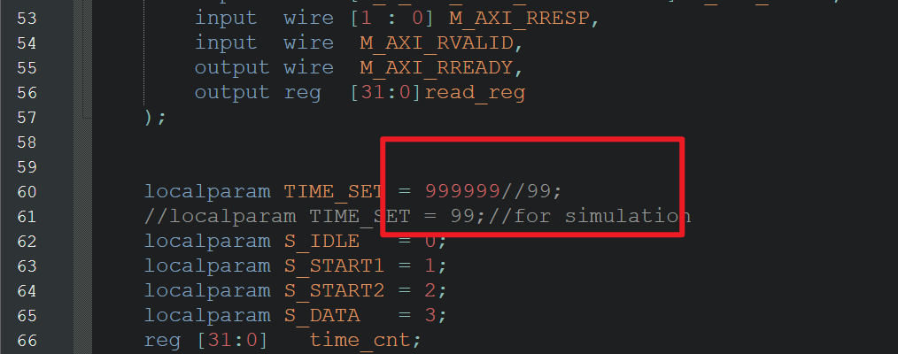
每次更改 ip 源码后，在 Tcl Console 中输入 reset_project 对 fpga 工程进行复位
单击 Refresh IP Catalog 更新 IP 状态
再单击 Upgrade Selected

仿真

主机仿真信号
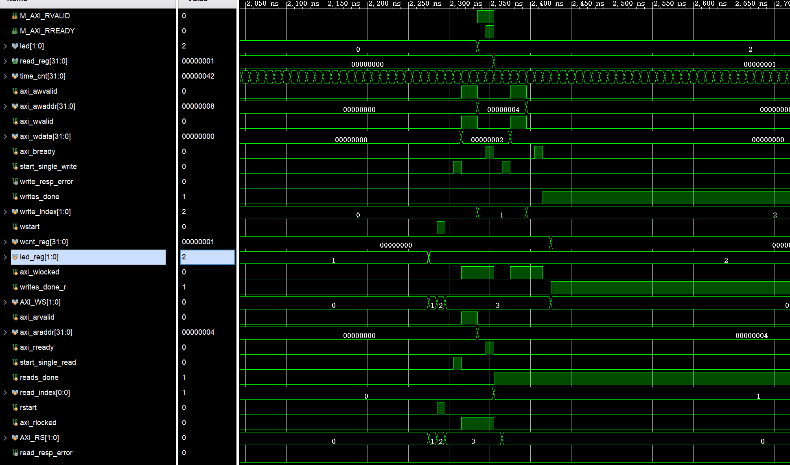

从机仿真信号
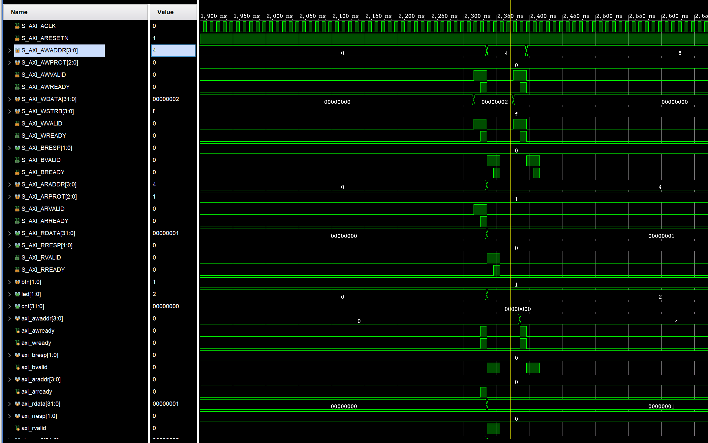

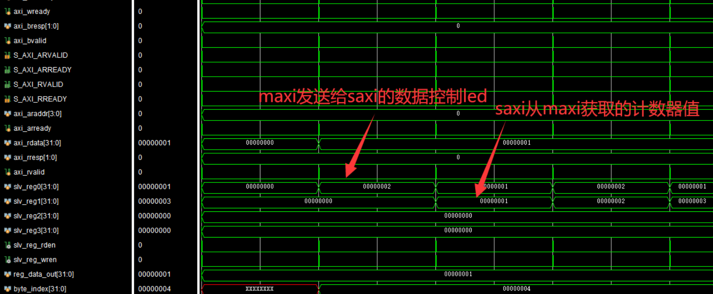


# 六、遇到的问题

## 1 自己打包的IP核有问题
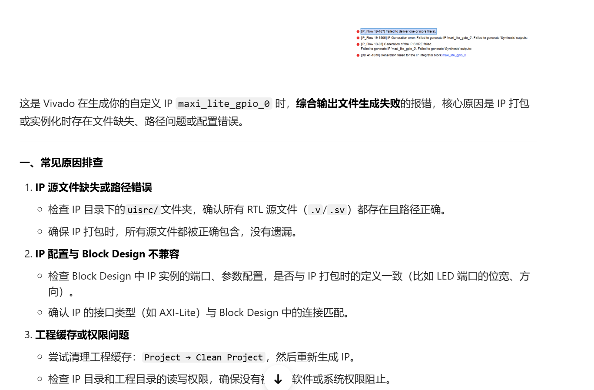

<font color="#ff0000">不知道啥原因，反正全删了重新生成一边重新弄一遍就好了</font>


