FDMA是米联客自制的DMA总线，通过学习FDMA来熟悉DMA工作过程

AXI 的总线概述、总线信号功能、数据有效情况、突发读写时序图见笔记：
[01_AXI4 总线概述](01_AXI4%20总线概述.md)


# 一、AXI4 数据路由及缓存机制

### 1.1 什么是ARCACHE[3:0]/AWCACHE[3:0]
这两个信号**不是直接控制某一个物理缓存**，而是给 AXI 总线上的所有模块（主设备、互联、从设备、缓存控制器）传递 “缓存属性指令”
真正的缓存物理位置主要有 3 处：
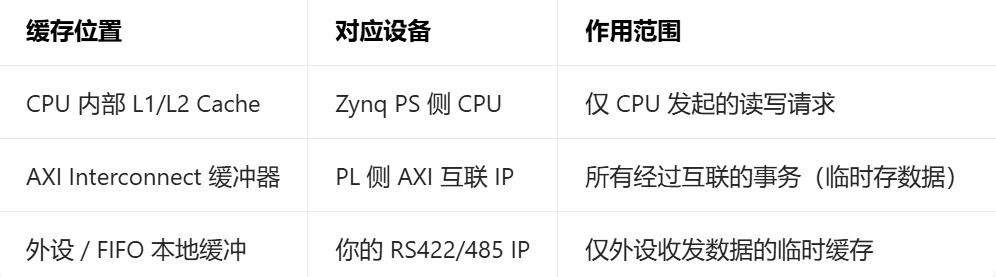
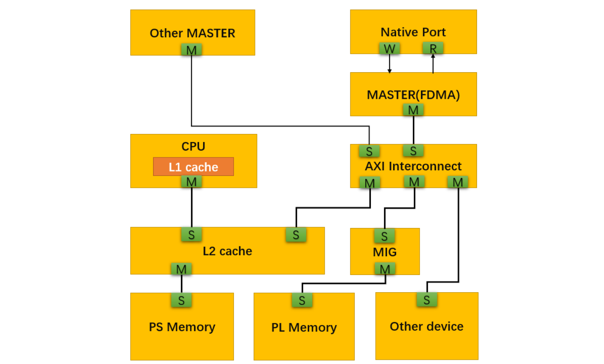

### 1.2 ARCACHE/AWCACHE 的三个核心作用
这 4 位信号的本质是 **“事务属性标签”**，核心作用不是 “实现缓存”，而是 “指导总线如何处理事务”，具体落地到 3 个关键场景：
###### 1. 决定 “是否允许缓存”（最核心）
- 设为 `0001/0010`（Non-cacheable）：
    告诉缓存控制器 “跳过缓存，直接访问物理设备 / 内存”，比如 CPU 读你的 RS422 状态寄存器 —— 必须读实时值，不能用缓存里的旧值。
- 设为 `1111`（Cacheable）：
    告诉缓存控制器 “优先用缓存，提升速度”，比如 DMA 写 DDR 数据 —— 缓存会先存一批数据，再一次性写进 DDR，减少总线开销。
###### 2. 决定 “是否允许事务优化”（对应你之前问的 Modifiable）
- `CACHE[1]=0`（Non-modifiable）：禁止拆分 / 合并事务，保证指令精准（比如写通道切换命令）；
- `CACHE[1]=1`（Modifiable）：允许拆分 / 合并，提升传输效率（比如批量传串口数据）。
###### 3. 决定 “写数据的刷新方式”（Cache [2]/Cache [3]）
- Write-back（写回，Cache [2]=1）：数据先存缓存，等缓存满了再写回物理内存（效率高，用于 DDR）；
- Write-through（写透，Cache [3]=1）：数据同时写缓存 + 物理内存（实时性高，几乎不用在工程里）。
### 1.3工程中 “必用的 4 种配置”

| 应用场景                         | ARCACHE/AWCACHE | 关键位含义                                 | 为什么这么设？                        |
| ---------------------------- | --------------- | ------------------------------------- | ------------------------------ |
| RS422/485 控制寄存器读写（AXI4-Lite） | 4'b0001         | Cache [1]=0（不可修改）<br>Cache [0]=1（可缓冲） | 控制指令必须精准，不能被缓存 / 拆分，保证通道切换实时生效 |
| RS422/485 状态寄存器读取            | 4'b0001         | 同上面                                   | 读实时状态，不能用缓存里的旧值                |
| 片上内存（OCM）读写                  | 4'b0011         | Cache [1]=1（可修改）<br>Non-cacheable     | 不用 CPU 缓存，但允许互联合并写事务，提升速度      |
| DMA 搬运数据到 DDR                | 4'b1111         | Cacheable + Write-back + 可修改          | 最大化 DDR 传输效率，缓存批量写，减少总线占用      |
注意：`ARCACHE` 和 `AWCACHE` 通常设为相同
### 1.4 在 Vivado 里 “怎么设”（实操步骤）
你不用手动改信号值，工具会帮你配置，核心步骤：
1. 打开 Vivado Block Design，找到你的 AXI 接口（比如 AXI4-Lite 接 RS422 控制寄存器）；
2. 双击 AXI 互联 IP（AXI Interconnect），进入配置界面；
3. 在「Address Map」标签页，找到对应外设的地址段，设置「Cacheable」为「Non-cacheable」；
4. 对于 DDR 相关的 AXI 接口，设置「Cacheable」为「Cacheable (Write-back)」；
5. 保存后，工具会自动生成 `ARCACHE/AWCACHE` 的值，无需手动写代码。
### 1.5 Modifiable 和 Non-modifiable transaction 
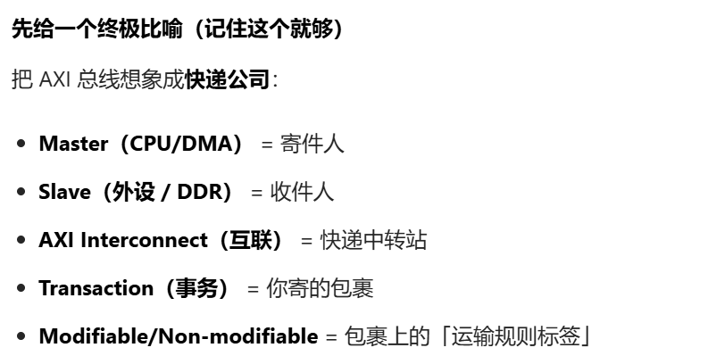
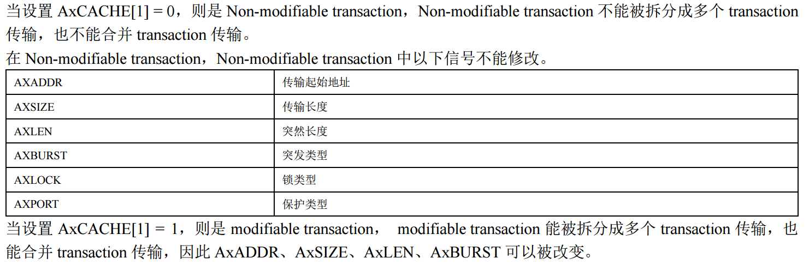
速查表（工程版）

|**CACHE[3:0]**|**Memory Type**|**Modifiable?**|**典型场景**|**核心行为**|
|---|---|---|---|---|
|`0000`|Device Non-bufferable|❌ No|强序设备、安全 / 中断寄存器|读写响应必须从最终 Slave 返回；不可预取 / 合并；事务不可修改；必须严格顺序执行|
|`0001`|Device Bufferable|❌ No|**AXI4-Lite 控制寄存器（如 RS422/485 控制口）**|写响应可从中间节点返回；读必须从 Slave 返回；不可预取 / 合并；事务不可修改|
|`0010`|Normal Non-cacheable Non-bufferable|✅ Yes|片上 ROM、只读内存区域|读写响应必须从 Slave 返回；可合并写；事务可修改|
|`0011`|Normal Non-cacheable Bufferable|✅ Yes|**片上内存（OCM）、共享 RAM**|写响应可缓冲；读可从正在写入的事务取最新值；可合并写；事务可修改|
|`1111`|Normal Cacheable Write-back (RW-allocate)|✅ Yes|**DDR 内存、DMA 数据搬运**|可缓存、写回模式；读写均分配缓存行；事务可修改；最大化带宽|
|`0110`/`1010`|Write-through No-allocate|✅ Yes|几乎不用（现代系统优先 Write-back）|写透模式，写同时更新缓存和内存；读不分配缓存行|
工程配置口诀
- **外设控制寄存器**：`0001`（精准优先，不可修改）
- **片上内存（OCM）**：`0011`（效率优先，可缓冲）
- **DDR 内存 / DMA**：`1111`（性能优先，可缓存）


# 二、FDMA 源码分析
由于 AXI4 总线协议直接操作起来相对复杂一些，容易出错
封装一个简单的用户接口，间接操作 AXI4总线会带来很多方便性
### 1:FDMA 的写时序
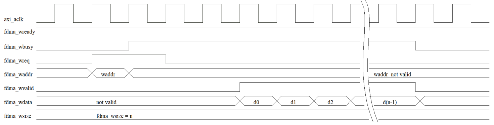
fdma_wready 设置为 1，当 fdma_wbusy=0 的时候代表 FDMA 的总线非忙，可以进行一次新的 FDMA 传输，这个时候可以设置 fdma_wreq=1，同时设置 fdma burst 的起始地址和 fdma_wsize 本次需要传输的数据大小(以 bytes 为单位)。当 fdma_wvalid=1 的时候需要给出有效的数据，写入 AXI 总线。当最后一个数写完后，fdma_wvalid 和fdma_wbusy 变为 0。
AXI4 总线最大的 burst lenth 是 256，而经过封装后，用户接口的 fdma_size 可以任意大小的，fdma ip 内部代码控制每次 AXI4 总线的 Burst 长度，这样极大简化了 AXI4 总线协议的使用。
### 2:FDMA 的读时序
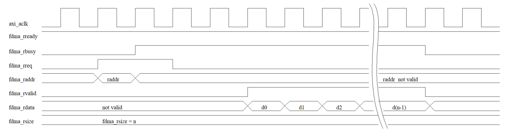
fdma_rready 设置为 1，当 fdma_rbusy=0 的时候代表 FDMA 的总线非忙，可以进行一次新的 FDMA 传输，这个时候可以设置 fdma_rreq=1，同时设置 fdma burst 的起始地址和 fdma_rsize 本次需要传输的数据大小(以 bytes 为单位)。当 fdma_rvalid=1 的时候需要给出有效的数据，写入 AXI 总线。当最后一个数写完后，fdma_rvalid 和 fdma_rbusy变为 0。
同样对于 AXI4 总线的读操作，AXI4 总线最大的 burst lenth 是 256，而经过封装后，用户接口的 fdma_size 可以任意大小的，fdma ip 内部代码控制每次 AXI4 总线的 Burst 长度，这样极大简化了 AXI4 总线协议的使用。
### 3:FDMA 的 AXI4-Master 写操作
```verilog
//fdma axi write----------------------------------------------
reg [M_AXI_ADDR_WIDTH-1 : 0] axi_awaddr = 0;  // AXI4 写地址
reg axi_awvalid = 1'b0;                       // AXI4 写地址有效
wire [M_AXI_DATA_WIDTH-1 : 0] axi_wdata;      // AXI4 写数据
wire axi_wlast;                               // AXI4 写 LAST 信号
reg axi_wvalid = 1'b0;                        // AXI4 写数据有效

// 当 valid ready 信号都有效，代表 AXI4 数据传输有效
wire w_next = (M_AXI_WVALID & M_AXI_WREADY);

reg [8:0] wburst_len = 1;   // 写传输的 axi burst 长度，代码会自动计算每次 axi 传输的 burst 长度
reg [8:0] wburst_cnt = 0;   // 每次 axi bust 的计数器
reg [15:0] wfdma_cnt = 0;   // fdma 的写数据计数器
reg axi_wstart_locked = 0;  // axi 传输进行中，lock 住，用于时序控制
wire [15:0] axi_wburst_size = wburst_len * AXI_BYTES;  // axi 传输的地址长度计算

// AXI4 写地址通道信号赋值
assign M_AXI_AWID     = M_AXI_ID;              // 写地址 ID，用来标志一组写信号, M_AXI_ID 是通过参数接口定义
assign M_AXI_AWADDR   = axi_awaddr;
assign M_AXI_AWLEN    = wburst_len - 1;        // AXI4 burst 的长度
assign M_AXI_AWSIZE   = clogb2(AXI_BYTES-1);
assign M_AXI_AWBURST  = 2'b01;                 // AXI4 的 busr 类型 INCR 模式，地址递增
assign M_AXI_AWLOCK   = 1'b0;
assign M_AXI_AWCACHE  = 4'b0010;               // 不使用 cache,不使用 buffer
assign M_AXI_AWPROT   = 3'h0;
assign M_AXI_AWQOS    = 4'h0;
assign M_AXI_AWVALID  = axi_awvalid;

// AXI4 写数据通道信号赋值
assign M_AXI_WDATA    = axi_wdata;
assign M_AXI_WSTRB    = {(AXI_BYTES){1'b1}};   // 设置所有的 WSTRB 为 1 代表传输的所有数据有效
assign M_AXI_WLAST    = axi_wlast;
assign M_AXI_WVALID   = axi_wvalid & fdma_wready;  // 写数据有效，这里必须设置 fdma_wready 有效
assign M_AXI_BREADY   = 1'b1;
//----------------------------------------------------------------------------

// AXI4 FULL Write
assign axi_wdata      = fdma_wdata;
assign fdma_wvalid    = w_next;
reg fdma_wstart_locked = 1'b0;
wire fdma_wend;
wire fdma_wstart;
assign fdma_wbusy     = fdma_wstart_locked;

// 在整个写过程中 fdma_wstart_locked 将保持有效，直到本次 FDMA 写结束
always @(posedge M_AXI_ACLK) begin
    if(M_AXI_ARESETN == 1'b0 || fdma_wend == 1'b1) begin
        fdma_wstart_locked <= 1'b0;
    end
    else if(fdma_wstart) begin
        fdma_wstart_locked <= 1'b1;
    end
end

// 产生 fdma_wstart 信号，整个信号保持 1 个 M_AXI_ACLK 时钟周期
assign fdma_wstart = (fdma_wstart_locked == 1'b0 && fdma_wareq == 1'b1);

//AXI4 write burst lenth busrt addr ------------------------------
// 当 fdma_wstart 信号有效，代表一次新的 FDMA 传输，首先把地址本次 fdma 的 burst 地址寄存到 axi_awaddr 作为第一次 axi burst 的地址。
// 如果 fdma 的数据长度大于 256，那么当 axi_wlast 有效的时候，自动计算下次 axi 的 burst 地址
always @(posedge M_AXI_ACLK) begin
    if(fdma_wstart) begin
        axi_awaddr <= fdma_waddr;
    end
    else if(axi_wlast == 1'b1) begin
        axi_awaddr <= axi_awaddr + axi_wburst_size;
    end
end

//AXI4 write cycle -----------------------------------------------
// axi_wstart_locked_r1, axi_wstart_locked_r2 信号是用于时序同步
reg axi_wstart_locked_r1 = 1'b0, axi_wstart_locked_r2 = 1'b0;
always @(posedge M_AXI_ACLK) begin
    axi_wstart_locked_r1 <= axi_wstart_locked;
    axi_wstart_locked_r2 <= axi_wstart_locked_r1;
end

// axi_wstart_locked 的作用代表一次 axi 写 burst 操作正在进行中。
always @(posedge M_AXI_ACLK) begin
    if((fdma_wstart_locked == 1'b1) && axi_wstart_locked == 1'b0) begin
        axi_wstart_locked <= 1'b1;
    end
    else if(axi_wlast == 1'b1 || fdma_wstart == 1'b1) begin
        axi_wstart_locked <= 1'b0;
    end
end

//AXI4 addr valid and write addr-----------------------------------
always @(posedge M_AXI_ACLK) begin
    if((axi_wstart_locked_r1 == 1'b1) && axi_wstart_locked_r2 == 1'b0) begin
        axi_awvalid <= 1'b1;
    end
    else if((axi_wstart_locked == 1'b1 && M_AXI_AWREADY == 1'b1) || axi_wstart_locked == 1'b0) begin
        axi_awvalid <= 1'b0;
    end
end

//AXI4 write data---------------------------------------------------
always @(posedge M_AXI_ACLK) begin
    if((axi_wstart_locked_r1 == 1'b1) && axi_wstart_locked_r2 == 1'b0) begin
        axi_wvalid <= 1'b1;
    end
    else if(axi_wlast == 1'b1 || axi_wstart_locked == 1'b0) begin
        axi_wvalid <= 1'b0;
    end
end

//AXI4 write data burst len counter----------------------------------
always @(posedge M_AXI_ACLK) begin
    if(axi_wstart_locked == 1'b0) begin
        wburst_cnt <= 'd0;
    end
    else if(w_next) begin
        wburst_cnt <= wburst_cnt + 1'b1;
    end
end

assign axi_wlast = (w_next == 1'b1) && (wburst_cnt == M_AXI_AWLEN);

//fdma write data burst len counter----------------------------------
reg wburst_len_req = 1'b0;
reg [15:0] fdma_wleft_cnt = 16'd0;

// wburst_len_req 信号是自动管理每次 axi 需要 burst 的长度
always @(posedge M_AXI_ACLK) begin
    wburst_len_req <= fdma_wstart | axi_wlast;
end

// fdma_wleft_cnt 用于记录一次 FDMA 剩余需要传输的数据数量
always @(posedge M_AXI_ACLK) begin
    if(fdma_wstart) begin
        wfdma_cnt <= 1'd0;
        fdma_wleft_cnt <= fdma_wsize;
    end
    else if(w_next) begin
        wfdma_cnt <= wfdma_cnt + 1'b1;
        fdma_wleft_cnt <= (fdma_wsize - 1'b1) - wfdma_cnt;
    end
end

// 当最后一个数据的时候，产生 fdma_wend 信号代表本次 fdma 传输结束
assign fdma_wend = w_next && (fdma_wleft_cnt == 1);

// 一次 axi 最大传输的长度是 256 因此当大于 256，自动拆分多次传输
always @(posedge M_AXI_ACLK) begin
    if(wburst_len_req) begin
        if(fdma_wleft_cnt[15:8] > 0) begin
            wburst_len <= 256;
        end
        else begin
            wburst_len <= fdma_wleft_cnt[7:0];
        end
    end
    else begin
        wburst_len <= wburst_len;
    end
end
```
以上代码我们进行了详细的注释性分析。以下给出 FDMA 写操作源码部分的时序图。下图中一次传输以传输 262 个长度的数据为例，需要 2 次 AXI4 BURST 才能完成，第一次传输 256 个长度数据，第二次传输 6 个长度的数据。
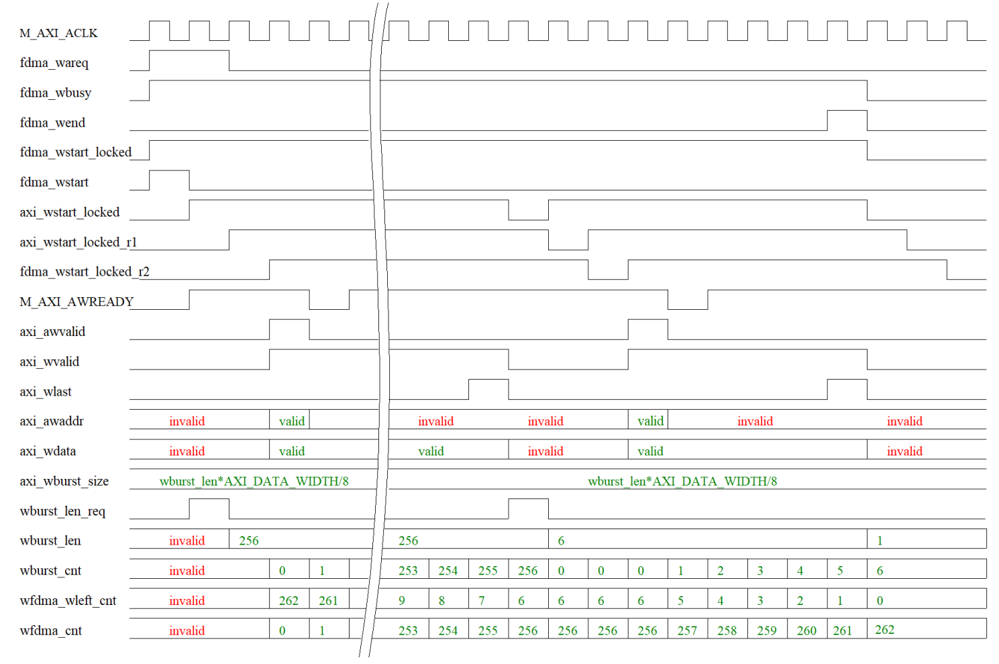
### 4:FDMA 的 AXI4-Master 读操作

```verilog
//fdma axi read----------------------------------------------
reg [M_AXI_ADDR_WIDTH-1 : 0] axi_araddr = 0;  // AXI4 读地址
reg axi_arvalid = 1'b0;                       // AXI4 读地址有效
wire axi_rlast;                               // AXI4 读 LAST 信号
reg axi_rready = 1'b0;                        // AXI4 读准备好

// 当 valid ready 信号都有效，代表 AXI4 数据传输有效
wire r_next = (M_AXI_RVALID && M_AXI_RREADY);

reg [8:0] rburst_len = 1;    // 读传输的 axi burst 长度，代码会自动计算每次 axi 传输的 burst 长度
reg [8:0] rburst_cnt = 0;    // 每次 axi bust 的计数器
reg [15:0] rfdma_cnt = 0;    // fdma 的读数据计数器
reg axi_rstart_locked = 0;   // axi 传输进行中，lock 住，用于时序控制
wire [15:0] axi_rburst_size = rburst_len * AXI_BYTES;  // axi 传输的地址长度计算

// AXI4 读地址通道信号赋值
assign M_AXI_ARID     = M_AXI_ID;              // 读地址 ID，用来标志一组写信号, M_AXI_ID 是通过参数接口定义
assign M_AXI_ARADDR   = axi_araddr;
assign M_AXI_ARLEN    = rburst_len - 1;        // AXI4 burst 的长度
assign M_AXI_ARSIZE   = clogb2((AXI_BYTES)-1);
assign M_AXI_ARBURST  = 2'b01;                 // AXI4 的 busr 类型 INCR 模式，地址递增
assign M_AXI_ARLOCK   = 1'b0;                  // 不使用 cache,不使用 buffer
assign M_AXI_ARCACHE  = 4'b0010;
assign M_AXI_ARPROT   = 3'h0;
assign M_AXI_ARQOS    = 4'h0;
assign M_AXI_ARVALID  = axi_arvalid;

// AXI4 读数据通道信号赋值
assign M_AXI_RREADY   = axi_rready && fdma_rready;  // 读数据准备好，这里必须设置 fdma_rready 有效
assign fdma_rdata     = M_AXI_RDATA;
assign fdma_rvalid    = r_next;

//AXI4 FULL Read-----------------------------------------
reg fdma_rstart_locked = 1'b0;
wire fdma_rend;
wire fdma_rstart;
assign fdma_rbusy = fdma_rstart_locked;

// 在整个读过程中 fdma_rstart_locked 将保持有效，直到本次 FDMA 写结束
always @(posedge M_AXI_ACLK) begin
    if(M_AXI_ARESETN == 1'b0 || fdma_rend == 1'b1) begin
        fdma_rstart_locked <= 1'b0;
    end
    else if(fdma_rstart) begin
        fdma_rstart_locked <= 1'b1;
    end
end

// 产生 fdma_rstart 信号，整个信号保持 1 个 M_AXI_ACLK 时钟周期
assign fdma_rstart = (fdma_rstart_locked == 1'b0 && fdma_rareq == 1'b1);

//AXI4 read burst lenth busrt addr ------------------------------
// 当 fdma_rstart 信号有效，代表一次新的 FDMA 传输，首先把地址本次 fdma 的 burst 地址寄存到 axi_araddr 作为第一次 axi burst 的地址。
// 如果 fdma 的数据长度大于 256，那么当 axi_rlast 有效的时候，自动计算下次 axi 的 burst 地址
always @(posedge M_AXI_ACLK) begin
    if(fdma_rstart == 1'b1) begin
        axi_araddr <= fdma_raddr;
    end
    else if(axi_rlast == 1'b1) begin
        axi_araddr <= axi_araddr + axi_rburst_size;
    end
end

//AXI4 r_cycle_flag-------------------------------------
// axi_rstart_locked_r1, axi_rstart_locked_r2 信号是用于时序同步
reg axi_rstart_locked_r1 = 1'b0, axi_rstart_locked_r2 = 1'b0;
always @(posedge M_AXI_ACLK) begin
    axi_rstart_locked_r1 <= axi_rstart_locked;
    axi_rstart_locked_r2 <= axi_rstart_locked_r1;
end

// axi_rstart_locked 的作用代表一次 axi 读 burst 操作正在进行中。
always @(posedge M_AXI_ACLK) begin
    if((fdma_rstart_locked == 1'b1) && axi_rstart_locked == 1'b0) begin
        axi_rstart_locked <= 1'b1;
    end
    else if(axi_rlast == 1'b1 || fdma_rstart == 1'b1) begin
        axi_rstart_locked <= 1'b0;
    end
end

//AXI4 addr valid and read addr-----------------------------------
always @(posedge M_AXI_ACLK) begin
    if((axi_rstart_locked_r1 == 1'b1) && axi_rstart_locked_r2 == 1'b0) begin
        axi_arvalid <= 1'b1;
    end
    else if((axi_rstart_locked == 1'b1 && M_AXI_ARREADY == 1'b1) || axi_rstart_locked == 1'b0) begin
        axi_arvalid <= 1'b0;
    end
end

//AXI4 read data---------------------------------------------------
always @(posedge M_AXI_ACLK) begin
    if((axi_rstart_locked_r1 == 1'b1) && axi_rstart_locked_r2 == 1'b0) begin
        axi_rready <= 1'b1;
    end
    else if(axi_rlast == 1'b1 || axi_rstart_locked == 1'b0) begin
        axi_rready <= 1'b0;
    end
end

//AXI4 read data burst len counter----------------------------------
always @(posedge M_AXI_ACLK) begin
    if(axi_rstart_locked == 1'b0) begin
        rburst_cnt <= 'd0;
    end
    else if(r_next) begin
        rburst_cnt <= rburst_cnt + 1'b1;
    end
end

assign axi_rlast = (r_next == 1'b1) && (rburst_cnt == M_AXI_ARLEN);

//fdma read data burst len counter----------------------------------
reg rburst_len_req = 1'b0;
reg [15:0] fdma_rleft_cnt = 16'd0;

// rburst_len_req 信号是自动管理每次 axi 需要 burst 的长度
always @(posedge M_AXI_ACLK) begin
    rburst_len_req <= fdma_rstart | axi_rlast;
end

// fdma_rleft_cnt 用于记录一次 FDMA 剩余需要传输的数据数量
always @(posedge M_AXI_ACLK) begin
    if(fdma_rstart) begin
        rfdma_cnt <= 1'd0;
        fdma_rleft_cnt <= fdma_rsize;
    end
    else if(r_next) begin
        rfdma_cnt <= rfdma_cnt + 1'b1;
        fdma_rleft_cnt <= (fdma_rsize - 1'b1) - rfdma_cnt;
    end
end

// 当最后一个数据的时候，产生 fdma_rend 信号代表本次 fdma 传输结束
assign fdma_rend = r_next && (fdma_rleft_cnt == 1);

//axi auto burst len caculate-----------------------------------------
// 一次 axi 最大传输的长度是 256 因此当大于 256，自动拆分多次传输
always @(posedge M_AXI_ACLK) begin
    if(rburst_len_req) begin
        if(fdma_rleft_cnt[15:8] > 0) begin
            rburst_len <= 256;
        end
        else begin
            rburst_len <= fdma_rleft_cnt[7:0];
        end
    end
    else begin
        rburst_len <= rburst_len;
    end
end
```
下图中一次传输以传输 262 个长度的数据为例，需要 2 次 AXI4 BURST 才能完成，第一次传输 256 个长度数据，第二次传输 6 个长度的数据。
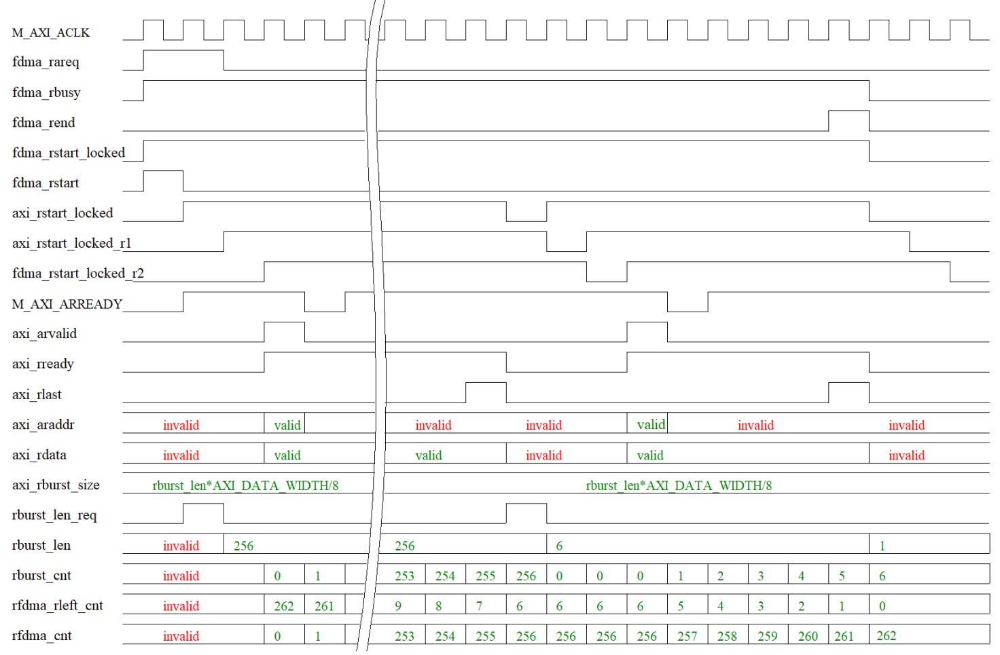


# 三、FDMA IP 的封装

创建工程，封装ip

按住 shift 全选后，右击弹出菜单后选择 Create Interface Definition
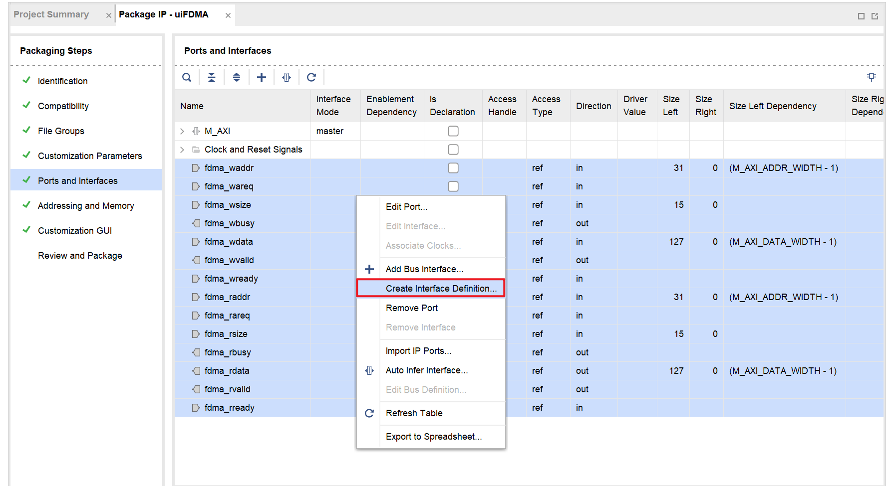
接口定义为 slave，命名为 FDMA_S
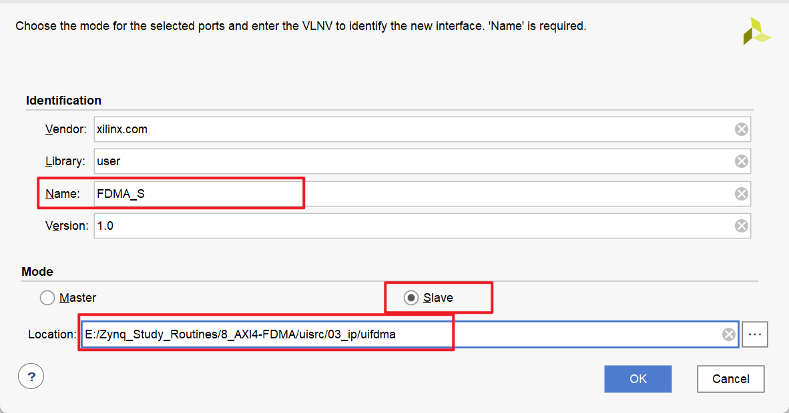
设置完成，uisrc/03_ip/uifdma 路径下多出 2 个文件，这个两个文件就是定义了自定义的总线接口
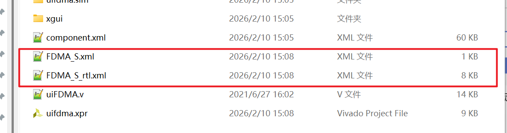
现在可以看到封装后的总线
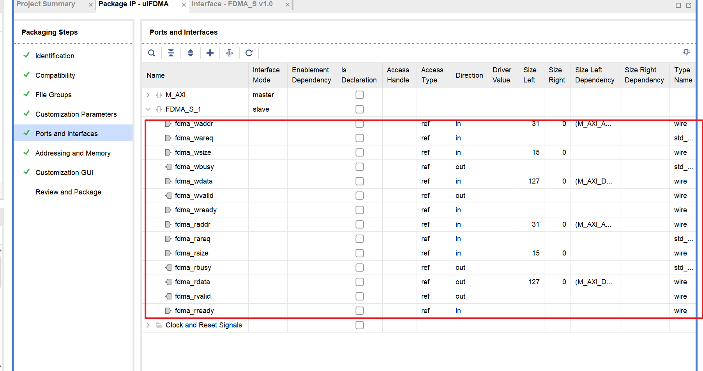
建议把名字改简洁一些
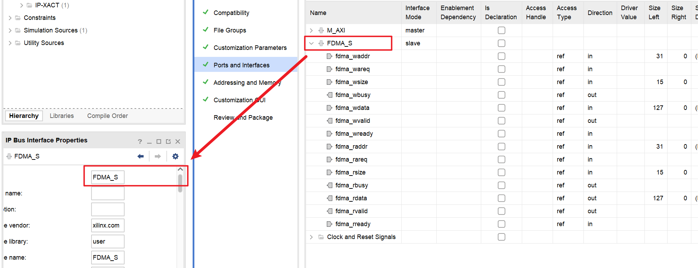
可以看到封装好的接口，更加美观

完成封装


# 四、saxi_full_mem IP


这个 IP 的源码可以基于 axi-full-slave 的模板简单修改就可以实现。
把修改后的代码命名为 saxi_full_mem.v 修改其中的部分代码，关键部分是 memory 部分定义。
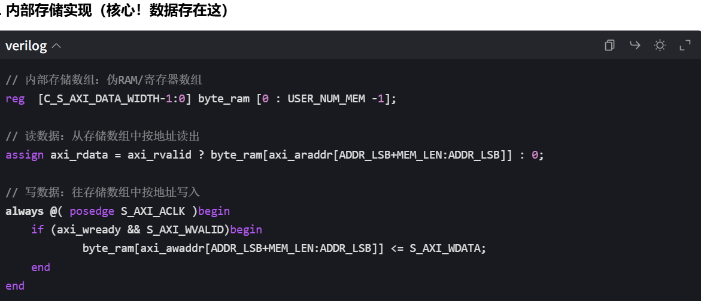
- `byte_ram` 是一个寄存器数组，就是这个模块的 “内存”；
- 写数据时：把主设备发来的 `S_AXI_WDATA` 存到 `byte_ram[地址]`；
- 读数据时：从 `byte_ram[地址]` 读出数据，赋值给 `axi_rdata` 返回给主设备。

修改的这部分代码支持 Memory 的任意长度设置(FPGA 内部 RAM 会消耗资源)，其中参数 USER_NUM_MEM 用于定义 RAM 的长度，我们一次 FDMA 的 burst 长度应该小于等于 USER_NUM_MEM 这个参数。
我们来看下 IP 的接口参数设置：这里我们计划 FDMA 的读写长度是 262，设置USER_NUM_MEM=300 完全够用。
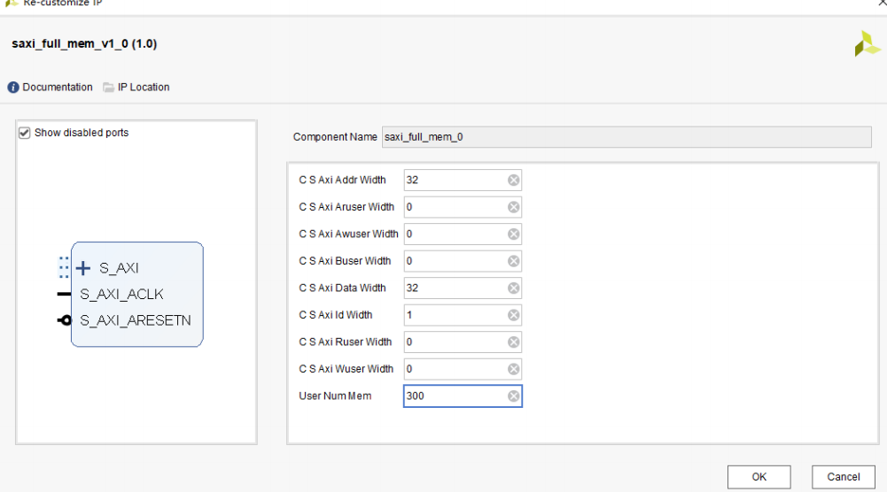


# 五、创建 FPGA 图像化设计
创建工程
创建BD
添加ip ： uiFDMA、saxi_full_men、axi_interconnect、clk_wiz
设置ip参数
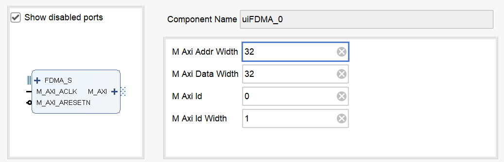
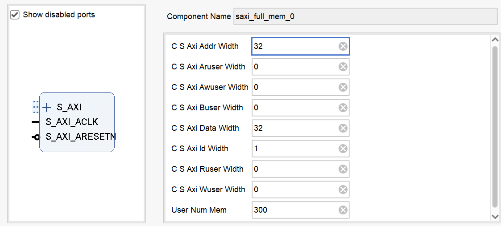
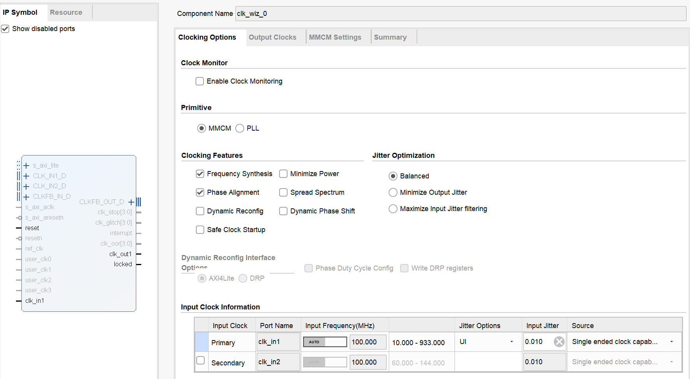
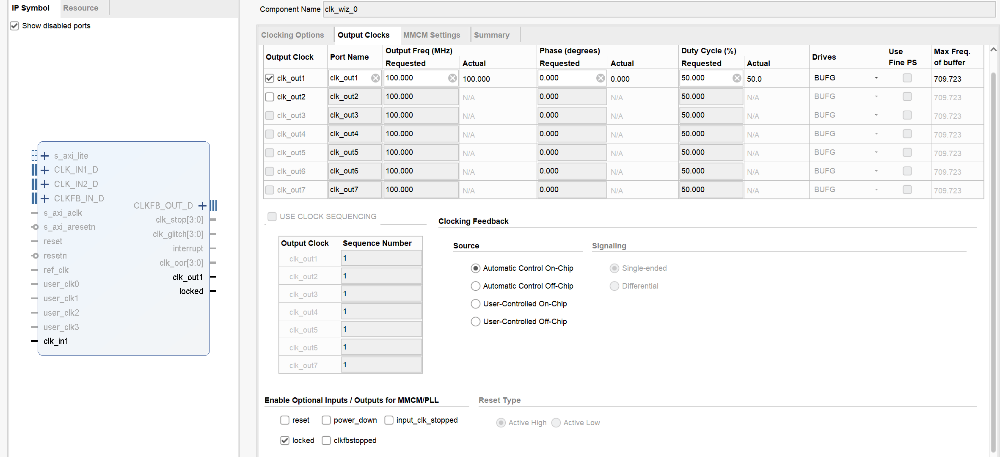

完成连线
**设置地址分配：**

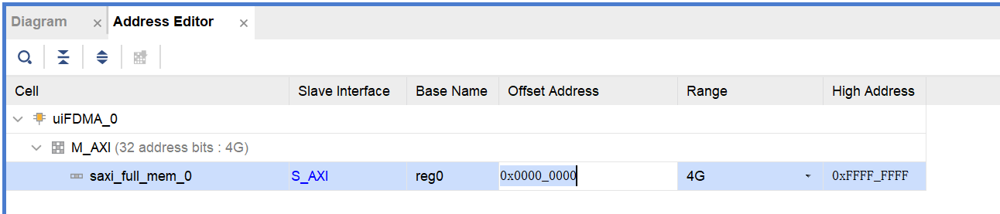


# 六、添加 FDMA 接口控制代码

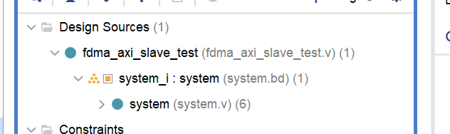

以上代码中调用的 system.bd 的图形代码接口。在状态机中，每次写 262 个长度 32bit 的数据，再读出来判断数据是否正确。


# 七、仿真文件
添加仿真文件


# 遇到问题
## 一、保证测试模块和FDM模块处于同一个时钟域

要把`ui_clk`引出到顶层，本质是让**测试逻辑和被测试的 FDMA 模块 “同频同步”**
要点：测试谁，就用谁的时钟

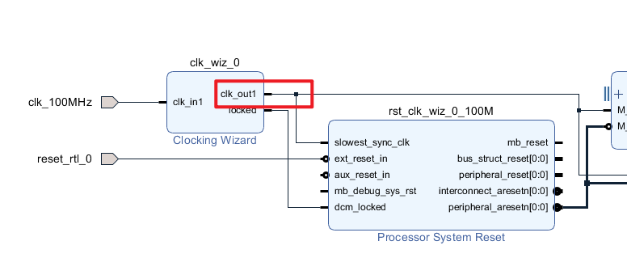
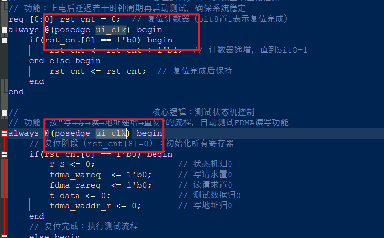
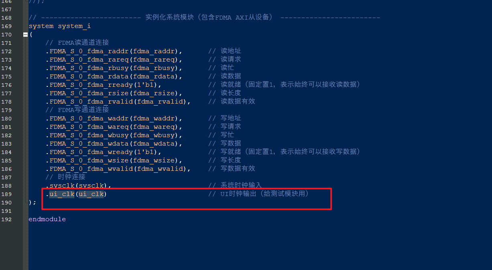
引出来
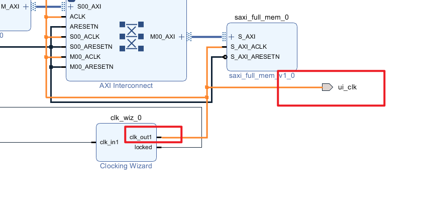


## 二、FDMA_S的端口要引出


