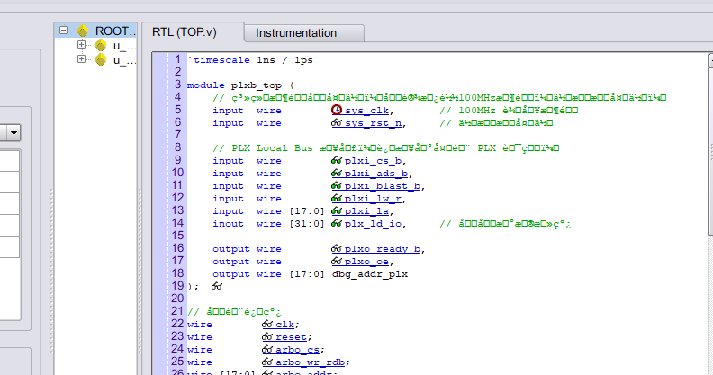
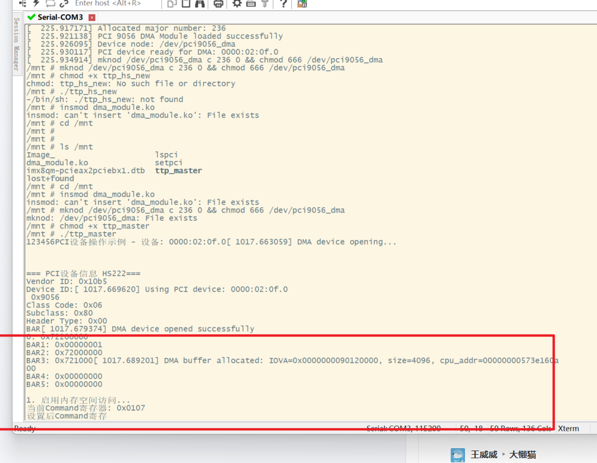
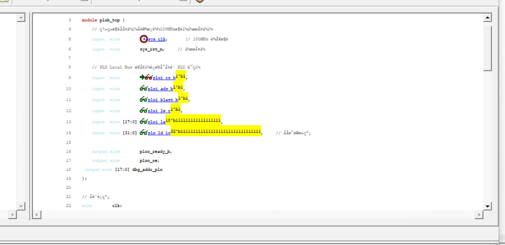
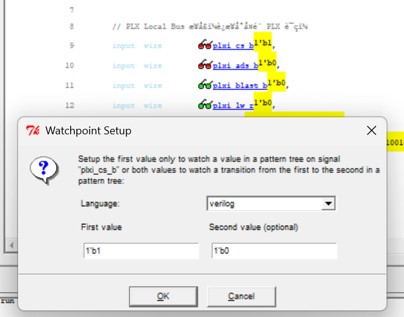

管脚分配时遇到地址线被优化
因为地址线在代码中未作逻辑运算，仅仅是打一拍以后透传
所以测试过程中需要在代码中加一点对地址线的逻辑
防止地址线被优化掉

加ila

程序死了以后，ila没抓到任何东西

可能的原因，一一排查：
1、**准备好有效的`LHOLD` 信号**：FPGA内部逻辑将LHOLD拉高，否则PCI芯片会一直等待

**硬件及FPGA逻辑部分**：确保FPGA的“肢体”动作配合正确。

- **确认`LHOLD`信号状态**：在ILA的硬件调试界面中，专门抓一下`LHOLD`信号，确认它在系统上电后是否被FPGA正常拉高。
    
- **编写最简逻辑**：把你的PLXB模块替换成一个极其简单的逻辑，其唯一功能就是拉高`LHOLD`，并对任何来自PCI9056的访问都立即返回`ready`信号。这样就能独立验证，是复杂的PLXB逻辑破坏了时序，还是板级或PCI9056配置本身有问题。

