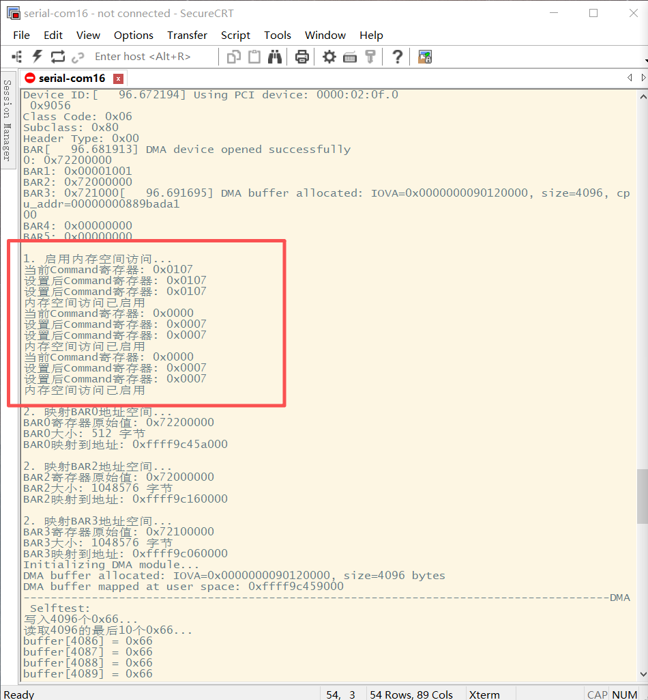
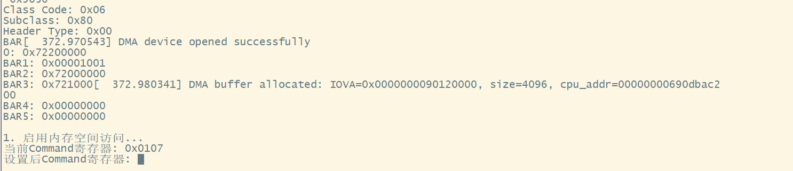
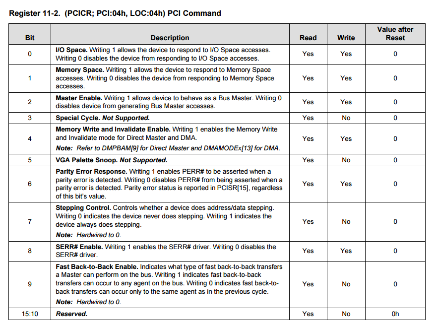

## 正常应该有的的打印：

## 目前的打印

`#define PCI_COMMAND_MEMORY 0x07 // 启用空间访问`

- **I/O Space Enable (位 0)**：启用I/O空间访问。
- **Memory Space Enable (位 1)**：启用内存空间访问。
- **Bus Master Enable (位 2)**：允许设备作为总线主控发起DMA传输。

