## **概述**
AS8202B 通信控制器是一款集成设备，支持符合 TTP 规范 1.1 版本的串行通信。它可在无需主机 CPU 干预的情况下，完成 TTP 集群中的消息接收与发送等所有通信任务。TTP 提供了一系列机制，使其能够部署在高可靠性分布式实时系统中。它提供以下服务：
- 具有最小抖动的可预测消息传输
- 容错分布式时钟同步
- 低延迟的一致性成员服务
- 单点故障掩蔽
## 关键特性
- 双通道控制器，支持冗余数据传输
- 专用控制器，支持 TTP（时间触发协议 C 类，SAE 6003 标准化）
- 适用于具有保证响应时间的高可靠性分布式实时系统
- 异步数据速率高达 4 Mbit/s（MFM / 曼彻斯特编码）
- 同步数据速率 20 至 25 Mbit/s
- 每个通道的总线接口（速率、编码）可独立选择
- 支持 40 MHz 晶振时钟
- 支持 16 MHz 总线监护时钟（可选用 16 MHz 晶振或振荡器）
- 单电源 3.3V，0.35µm CMOS 工艺
- 全汽车级温度范围（-40ºC 至 125ºC）
- 16k × 16 的 SRAM，用于消息、状态、控制区（通信网络接口 CNI）以及调度信息（MEDL）
- 4k × 16（加奇偶校验）的指令代码 RAM，用于存储协议执行代码
- 数据手册符合协议修订版 2.05
- 16k × 16 的指令代码 ROM，包含启动执行代码和过时的协议修订版 1.00
- 16 位非复用异步主机 CPU 接口
- 16 位 RISC 架构
- 提供软件工具、设计支持、开发板 – 访问 [www.tttech.com](https://www.tttech.com)
- 提供符合 RTCA/DO-254 DAL A 的认证支持包 – 访问 [www.tttech.com](https://www.tttech.com)
- 符合 RoHS 标准

## **3 应用领域**
该器件非常适用于以下应用领域：符合 DO-254 等级 A 的航空航天系统（例如飞行控制、电源分配、发动机控制），以及工业系统和铁路系统。

## 4 PIN
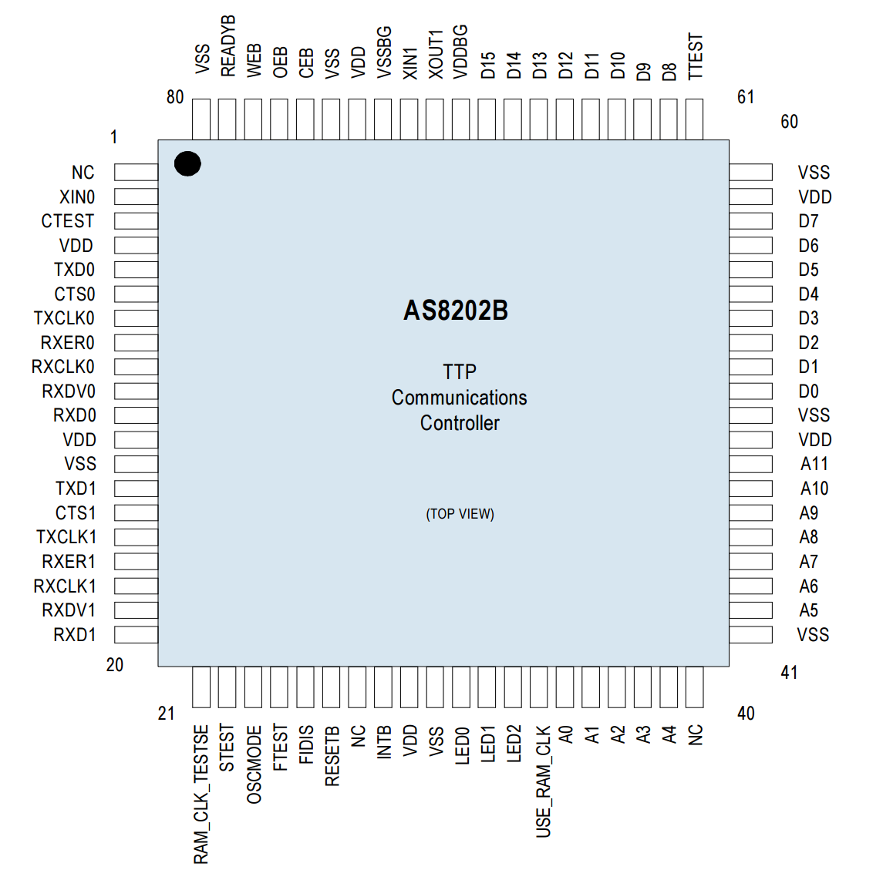
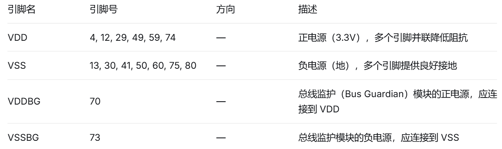
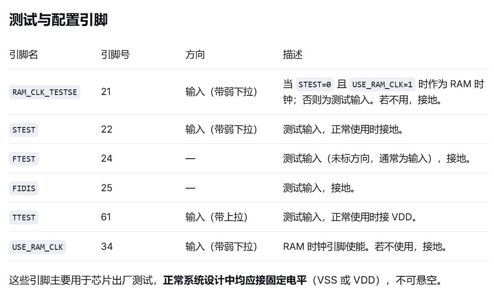
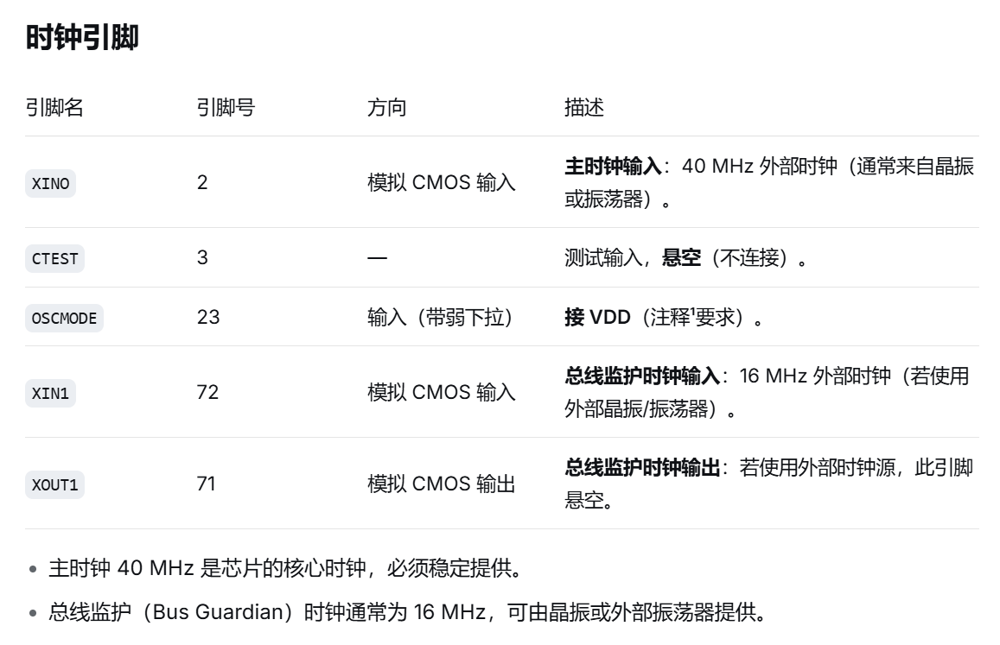

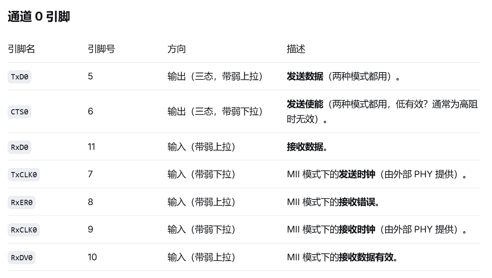
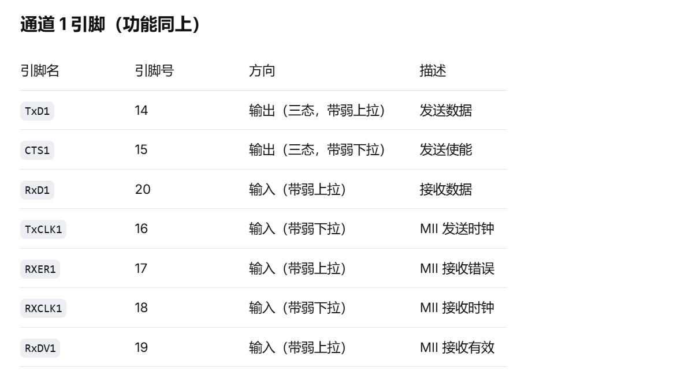
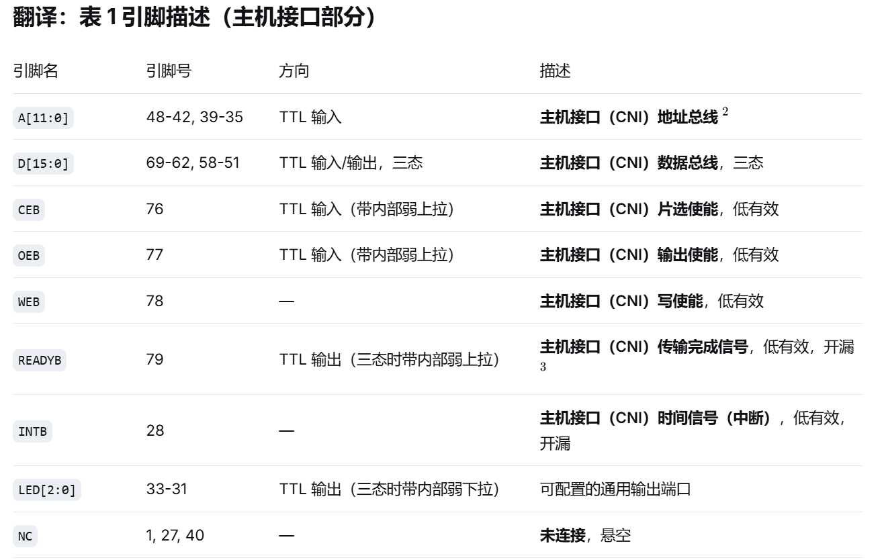
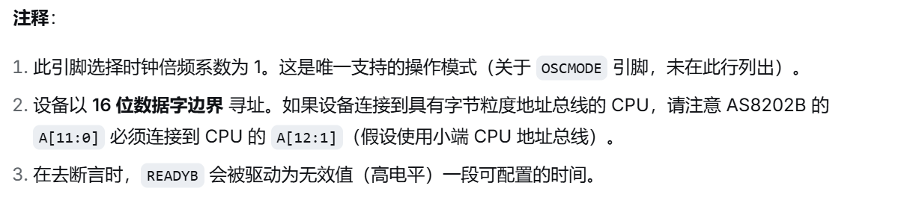
## 5 **AS8202B 绝对最大额定值**（略）
## 6 电气特性（略）
## 7 内部架构与运作原理（重要）

## 8 应用相关信息

### 8.1 主机 CPU 接口

主机 CPU 接口也被称作**通信网络接口（CNI）**，负责将应用电路与 AS8202NF 型 TTP 控制器建立连接。该接口的全部相关信号引脚，支持对 AS8202NF 内部**双口 RAM**执行异步读写操作，且接口信号不受微时钟（主时钟`CLK0`）的建立时间、保持时间约束。

所有读写操作**必须以 16 位（2 字节）为最小操作粒度**，本器件不支持单字节读写。器件的 A0 引脚（最低位）用于区分 16 位字地址的奇偶地址，该引脚通常对接**小端模式**主机 CPU 的 A1 引脚。主机 CPU 的 A0 引脚不接入本器件，同时主机端的应用程序与驱动程序需强制所有存储访问均为 16 位位宽。

为提升运行效率，主机 CPU 的应用或驱动程序可采用更宽位宽（例如 32 位）访问 AS8202NF 的部分存储区域；主机 CPU 总线接口会自动将这类宽位访问，拆分为两次连续的 16 位读写操作并下发至 TTP 控制器。需重点注意：在此类工作模式下，主机 CPU 接口的**所有时序参数都必须严格满足**，尤其是参数编号 16~19 所定义的总线空闲超时指标。

主机接口引出中断 / 定时信号`INTB`，用于向应用电路上报配置事件、协议专属事件，以及各类同步、异步事件。

借助主机 CPU 接口，还可访问器件内部的指令代码存储器。该功能主要用于：向内部指令代码 RAM 载入协议执行程序、对指令代码 RAM 开展全功能测试，以及校验指令代码 ROM 内的存储数据。

`INTB`为**开漏输出**：该引脚仅能被驱动为逻辑低电平（0），其余状态下均为弱上拉模式。因此根据实际应用场景，可能需要额外外接上拉电阻或上拉晶体管。

`READYB`引脚同样为开漏输出，但该引脚具备特殊功能：可通过寄存器配置，在切换为弱上拉状态前，维持一段自定义时长的逻辑高电平（1）输出。

LED 端口支持软件配置，能够自动展示各类协议相关状态与事件，LED 端口的详细配置方法见下文。

没有地址/数据复用，这里A0就是地址线的最低位
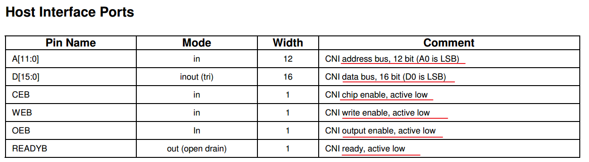
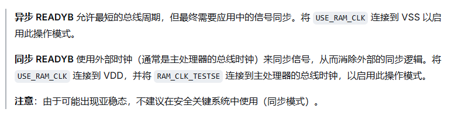
工作在同步还是异步，取决于硬件的USE_RAM_CLK。接地VSS工作在异步模式，接电源VDD工作在同步模式。

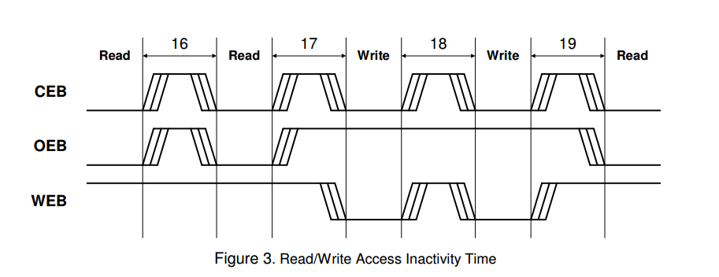
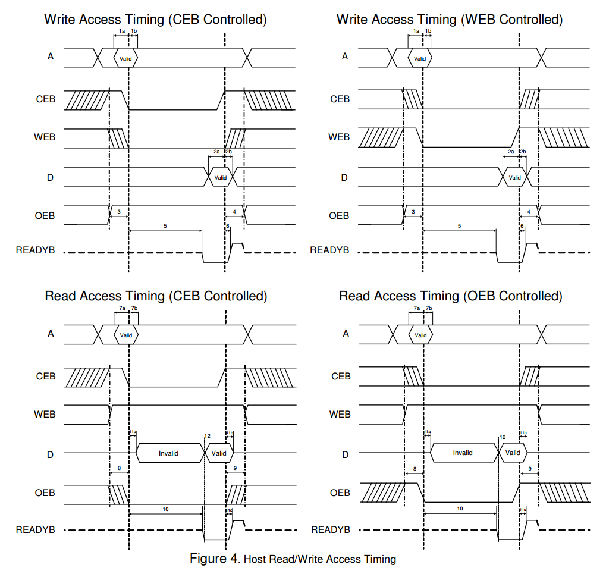
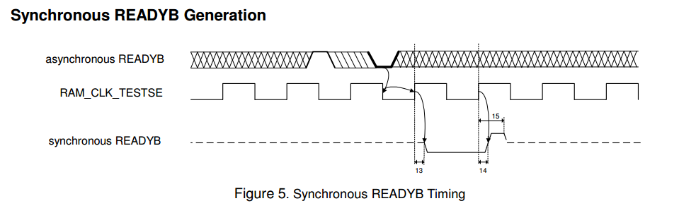
ready_b需要进行异步信号处理，打两拍，消除亚稳态

