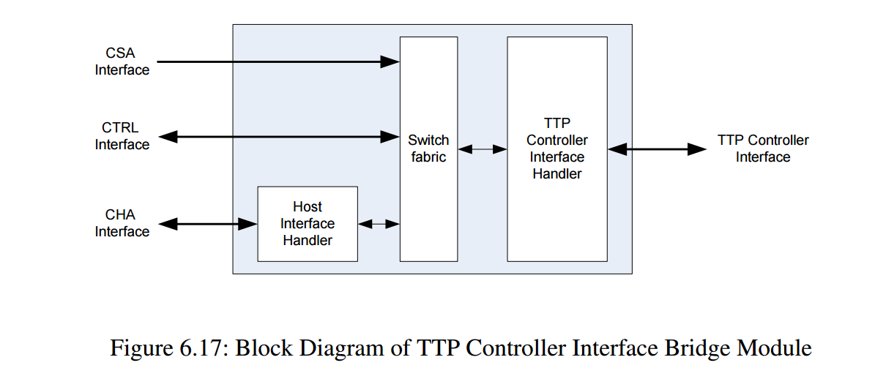


### 6.3.4.3 功能描述

TTP 控制器接口桥接模块有两个任务：

1. **交换 (Switch)**：交换功能必须处理两个访问 TTP 控制器接口的源。第一个源是通过 PLX（CHA）的主机，另一个是 HS-COM 状态机（CTRL）本身。交换功能按下述方式处理两个不同源的访问：
    
    - 当 HS-COM 使能时（STF 寄存器中 CEN 标志置位，地址 0x1250），主机不能访问 TTP 控制器接口。
        
    - 在关机序列期间，主机不能访问 TTP 控制器接口（关机过程中 CEN 标志也被置位）。
        
    - 当 HS-COM 禁用时，HS-COM 控制器不能访问 TTP 控制器接口。
        
2. **接口控制器 (Interface Controller)**：该控制器将从主机或 HS-COM 控制器模块内部接收的访问（读/写）转换为 TTP 控制器 CNI 访问。为了简化该接口的时序，异步 TTP 控制器 CNI 接口以相对于最大系统时钟 66.6666 MHz 的最坏情况时序进行处理。即使 TTP 控制器更早提供数据，接口控制器也会在预定的时间点获取有效数据，如图 6.18 和图 6.19 所示。
    

在设计中，有两个序列器，一个用于主机访问处理，另一个用于生成 TTP 控制器访问。

- **主机序列器**：由 `chai.cs` 置为高电平触发。该触发也将序列计数器复位为 0，计数器在每个时钟上升沿递增。该序列器的唯一功能是在 19 个时钟周期后驱动 `chao.ready` 信号一个时钟周期，并处理读数据输出 `chao.rd_data`。在该输出上提供的数据通过 `chao.read` 置为高来验证。`chao.read` 信号的发出独立于主机访问是否通过交换矩阵转发到 TTP 控制器，以终止传入的主机请求。如果在主机读访问开始时 HS-COM 被禁用，`chao.rd_data` 位被置为传入的 TTP 控制器数据（从 TTP 控制器接收的 16 位数据通过添加额外零扩展到 32 位）；否则，`chao.rd_data` 被驱动为“全零”。此功能由内部 `host_access_pending` 信号覆盖，该信号仅在访问开始时设置（如果主机访问被转发到 TTP 控制器）。
    
- **TTP 控制器访问序列器**：由主机访问（见上）或来自内部 HS-COM 控制器模块的 `ctrl.cs` 触发。触发源取决于 `ctrl.controlled_en` 信号的当前状态。如果使能信号有效，则选择内部控制器访问作为源，否则选择主机访问。所有访问数据（地址、数据、读、写）从选定的源透明地转发到 TTP 控制器接口，不作任何更改。
    

触发将序列计数器复位为 0，计数器在每个时钟上升沿递增。该序列器控制所有输出的 TTP 控制器信号。为了满足 TTP 控制器数据手册给出的 CNI 接口最坏情况时序，对 TTP 控制器的访问（读或写）需要 20 个时钟周期。该时钟周期数基于最大系统时钟 66.6666 MHz，其组成如下（另见图 3.6）：

**对于写访问**：

- 整个访问期间（时钟周期 1-20）：设置 12 位宽访问地址 `nfo.nfaddr`，设置 16 位宽 `nfo.nfwdata` 输出为所选源接口提供的数据，驱动 `nfo.nf_bus_en` 为高，驱动 `nfo.nfoeb` 为高。
    
- 时钟周期 1-3：设置 `nfo.nfweb` 为高（默认）。
    
- 时钟周期 4-17：驱动 `nfo.nfweb` 为低。
    
- 时钟周期 18-20：设置 `nfo.nfweb` 为高（默认）以完成访问。
    

**对于读访问**：

- 整个访问期间（时钟周期 1-20）：设置 12 位宽访问地址 `nfo.nfaddr` 为所选源接口提供的数据，驱动 `nfo.nf_bus_en` 为低，驱动 `nfo.nfweb` 为高。
    
- 时钟周期 1-3：设置 `nfo.nfweb` 为高（默认）。
    
- 时钟周期 4-17：驱动 `nfo.nfweb` 为低。
    
- 时钟周期 18 的上升沿：从输入 `nfi.nfrdata` 采样读数据。
    
- 时钟周期 18-20：设置 `nfo.nfweb` 为高（默认）以完成访问。
    

禁止同时将 `nfo.nfweb` 和 `nfo.nfweb` 驱动为低（注意：原文可能笔误，应为禁止同时将 `nfo.nfoeb` 和 `nfo.nfweb` 驱动为低）。

TTP 控制器以 WE/OE（写使能/输出使能）模式驱动，片选信号 `nfo.nfceb` 始终接为 0。

此外，TTP 控制器使用双向数据总线。因此，NI NF_x_DATA 输出（`_x_` 在“接口信号”列中需替换为相应的 HS-COM 标签 SB、DBA、DBB，以匹配定义的顶层信号）在 `nfo.nf_bus_en` 置为低电平时在顶层设计文件中呈三态。

在 IP 复位（reset 置为高）的情况下，输出信号复位为表 6.10 中所示的值。
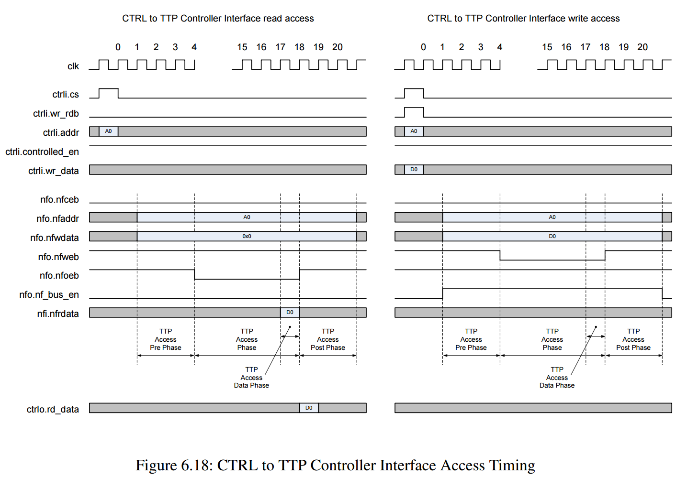

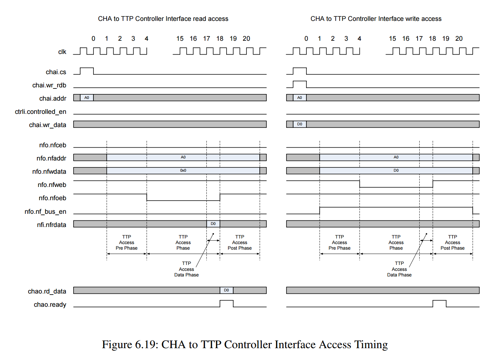


CHA文档里有写：
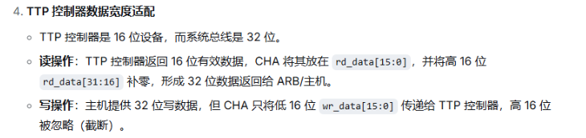


写仿真：满足文档描述时序
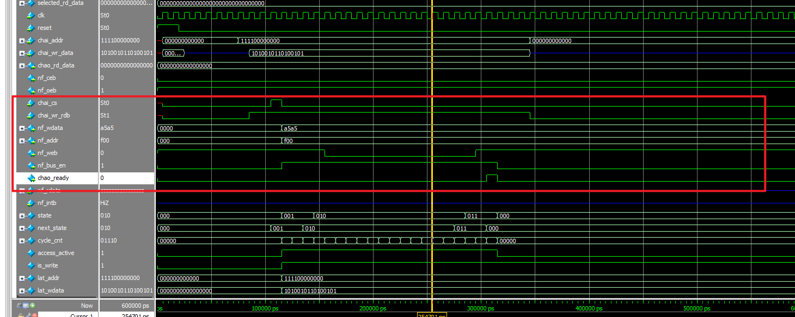

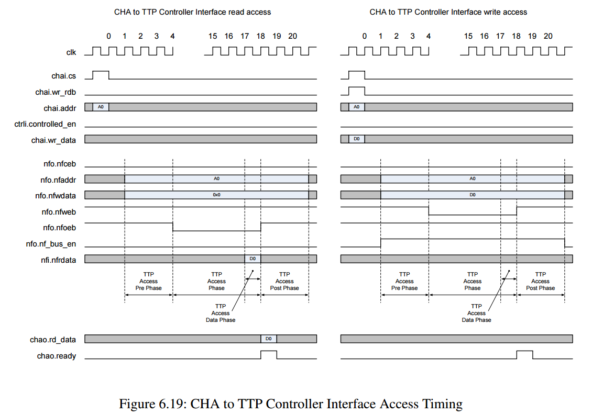


读仿真：

20260601
进行读操作，上板测试ttp，读取0x35看是否能读到ID号
创建一个上电100s以后自动驱动0x35地址的工程

引脚分配过程中遇到问题
引脚约束的时候，rst_n是ADLIB：CLKBUF，约束不到N7上面
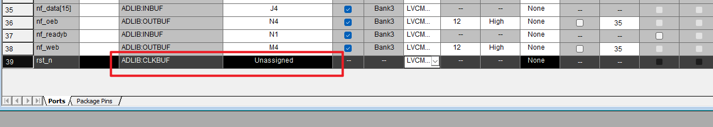
原因和解决方法：
软件认为rst_n信号需要连接到设计中的大量寄存器。意味着它需要驱动数量巨大的负载，即“高扇出”。
Global Network的驱动能力很强，信号延迟和便宜较小，为了处理rst_n的高扇出的问题，工具会自动将rst_n提升到全局网络。
解决办法，在代码中加入备注，可修改为普通布线
```verilog
input rst_n /* synthesis syn_noclockbuf = 1 */;
```
普通布局布线可引脚分配为N7
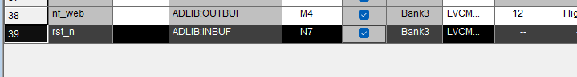

上板测试，启动程序100s以后读ttp芯片
时序问题很大，且读出来的数据0xFEFF，不是期望数据0x0003
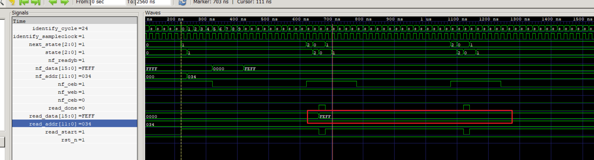

修改代码，优化时序，时序基本满足，继续测试读ttp寄存器：
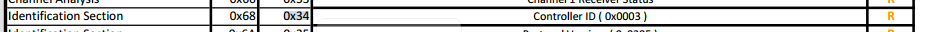
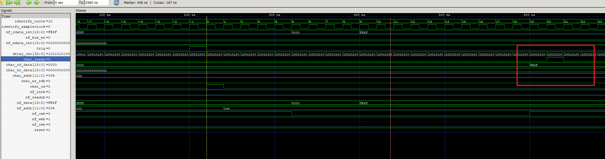
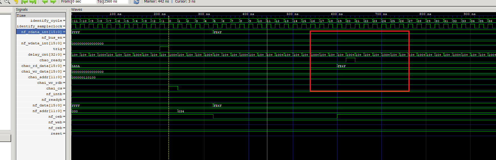
034地址抓到FE6F，预期应该是0x0003
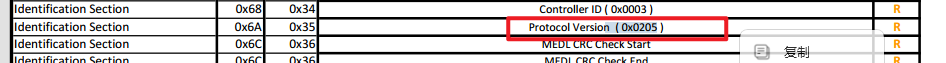
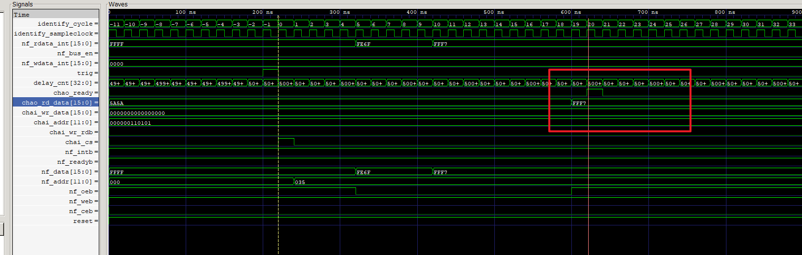
035地址抓到FFF7，预期应该是0x0205
这两个地址读到的数据不符合预期
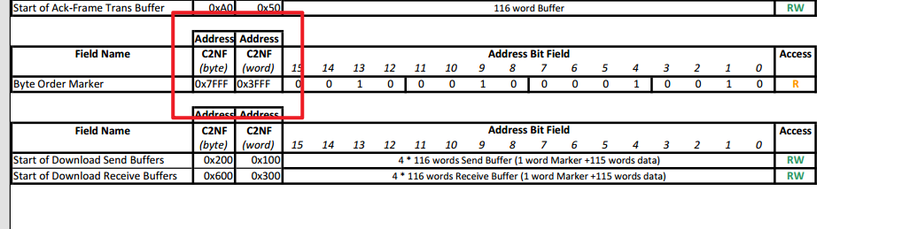
上图的地址不符合12位地址线，无法读到0x3FFFF

修改时序，与手册描述时序完全一致
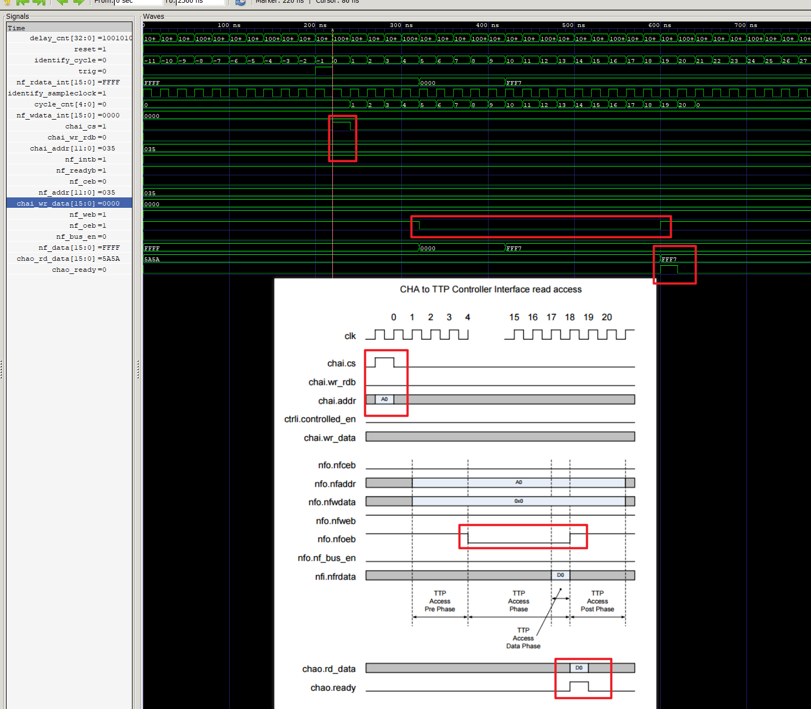

目前问题：
一、读034、035抓到的数不符合预期
二、0x3FFF读不了，地址线超过12位


大端小端，配置
地址引脚反着试一下
降低时钟，分频，让8202足够反应
8202时钟怎么调低
fpga时钟调低试一下
<font color="#ff0000">写进去再读出来0x06</font>
确认引脚分配正确，查，文档
耐心，防止低级错误
对外io管脚低触发器寄存，地址线
slew rate，运放压摆率 v/us
skew
为什么有的引脚io reg无法勾选（615）
量一下arm-8202的读写周期
工作模式是否先配对，工作模式不对片子可能未正常工作
软复位，工作模式，有几种工作模式，上电配啥才能正常工作。
看arm代码里有啥配置
看一下arm有没有复位8202

luojiziyuan