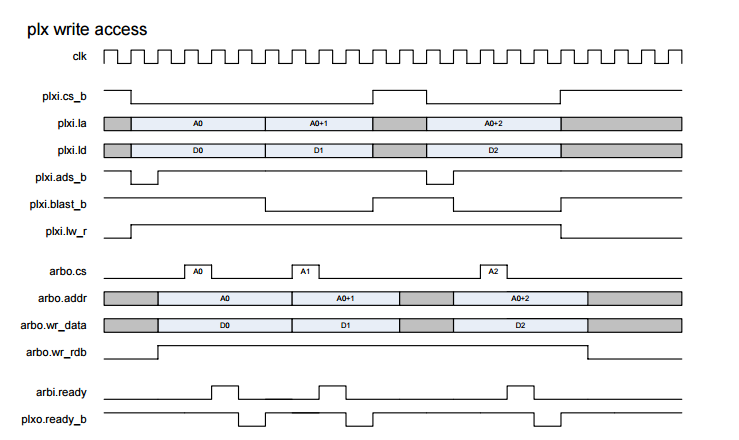
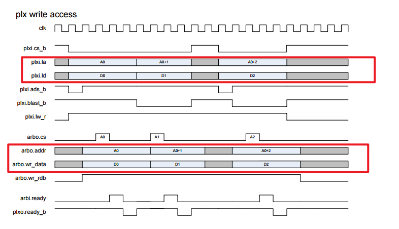
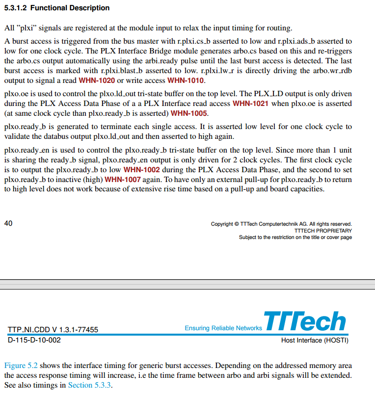
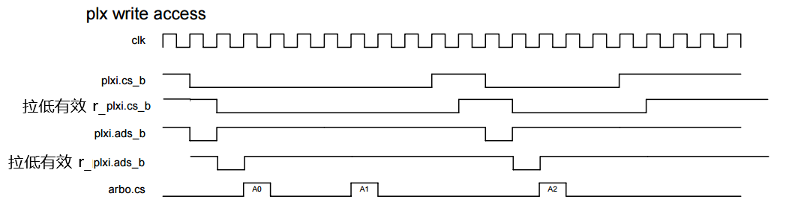

PLX Interface Bridge（PLXB）
这个模块本质是一个**双向协议桥**

左侧：是 **PLX Local Bus 的从设备**，接收 PLX 芯片（主设备）的读写请求。
右侧：**内部 ARB（仲裁 / 存储）模块的主设备**，把 PLX 的请求转发给 ARB，再把 ARB 的响应返回给 PLX。

观察时序图，时序图显示
PLXB的作用是，对数据、地址进行打拍；对cs、ready信号进行一些规整操作等

地址和数据打一拍

# 功能描述
根据文档的功能描述，去编写代码

All ”plxi” signals are registered at the module input to relax the input timing for routing

A burst access is triggered from the bus master with r.plxi.cs b asserted to low and r.plxi.ads b asserted to low for one clock cycle. The PLX Interface Bridge module generates arbo.cs based on this and re-triggers the arbo.cs output automatically using the arbi.ready pulse until the last burst access is detected. The last burst access is marked with r.plxi.blast b asserted to low. r.plxi.lw r is directly driving the arbo.wr rdb output to signal a read WHN-1020 or write access WHN-1010.

plxo.oe is used to control the plxo.ld out tri-state buffer on the top level. The PLX LD output is only driven during the PLX Access Data Phase of a a PLX Interface read access WHN-1021 when plxo.oe is asserted (at same clock cycle than plxo.ready b is asserted) WHN-1005

plxo.ready b is generated to terminate each single access. It is asserted low level for one clock cycle to validate the databus output plxo.ld out and then asserted to high again.

plxo.ready en is used to control the plxo.ready b tri-state buffer on the top level. Since more than 1 unit is sharing the ready b signal, plxo.ready en output is only driven for 2 clock cycles. The first clock cycle is to output the plxo.ready b to low WHN-1002 during the PLX Access Data Phase, and the second to set plxo.ready b to inactive (high) WHN-1007 again. To have only an external pull-up for plxo.ready b to return to high level does not work because of extensive rise time based on a pull-up and board capacities.

Figure 5.2 shows the interface timing for generic burst accesses. Depending on the addressed memory area the access response timing will increase, i.e the time frame between arbo and arbi signals will be extended. See also timings in Section 5.3.3

所有来自 PLX 侧的输入信号（`plxi_*`）均在模块输入端做**寄存器打拍寄存**，用以放宽布线时序、缓解输入时序压力。

总线主设备发起**突发传输**的条件：寄存后的片选信号 `r_plxi_cs_b` 与地址选通信号 `r_plxi_ads_b` 同时拉低，且仅维持**一个时钟周期**。

PLX 接口桥接模块（你的 PLXB）以此为触发条件，产生内部仲裁请求信号 `arbo_cs`；并依靠内部应答脉冲 `arbi_ready` 自动重复触发 `arbo_cs`，循环发起传输，直到识别到**突发传输最后一拍**为止。

一次突发传输的末尾，由 `r_plxi_blast_b` 拉低进行标记。

读写控制信号 `r_plxi_lw_r` 直接直通驱动 `arbo_wr_rdb`，向内部仲裁模块标识当前为**读操作**或**写操作**。

顶层模块中，`plxo_oe` 用于控制 PLX 侧数据输出 `plxo_ld_out` 的**三态缓冲器**。

仅在 PLX 接口**读操作的数据阶段**，`plxo_oe` 才会拉高有效；该信号与 `plxo_ready_b` 同步置位，用于 FPGA 向外驱动数据总线。

`plxo_ready_b` 用于结束每一次单次总线访问。

该信号**低电平有效**，仅拉低一个时钟周期，用来有效锁存外部数据总线输出 `plxo_ld_out`，随后立刻重新拉高恢复无效状态。

顶层电路中，`plxo_ready_en` 负责控制 `plxo_ready_b` 的三态缓冲器。

由于系统内多个功能模块会**共用同一条 ready_b 总线**，因此 `plxo_ready_en` 仅固定驱动**两个时钟周期**：

第一个时钟周期：在 PLX 访问数据阶段，强制拉低 `plxo_ready_b` 完成握手应答；

第二个时钟周期：再将 `plxo_ready_b` 重新置为高电平、退出有效。

如果仅依靠外部上拉电阻让 `ready_b` 自行恢复高电平，会受板级寄生电容影响，导致信号上升沿过慢、时序不满足，因此必须由 FPGA 主动两拍控制。

图 5.2 给出了通用突发访问的接口时序。

根据访问的存储区域不同，模块响应延时会变长，也就是内部 `arbo_*` 请求信号与 `arbi_*` 应答信号之间的间隔会加大；详细时序参数参考 5.3.3 章节。

