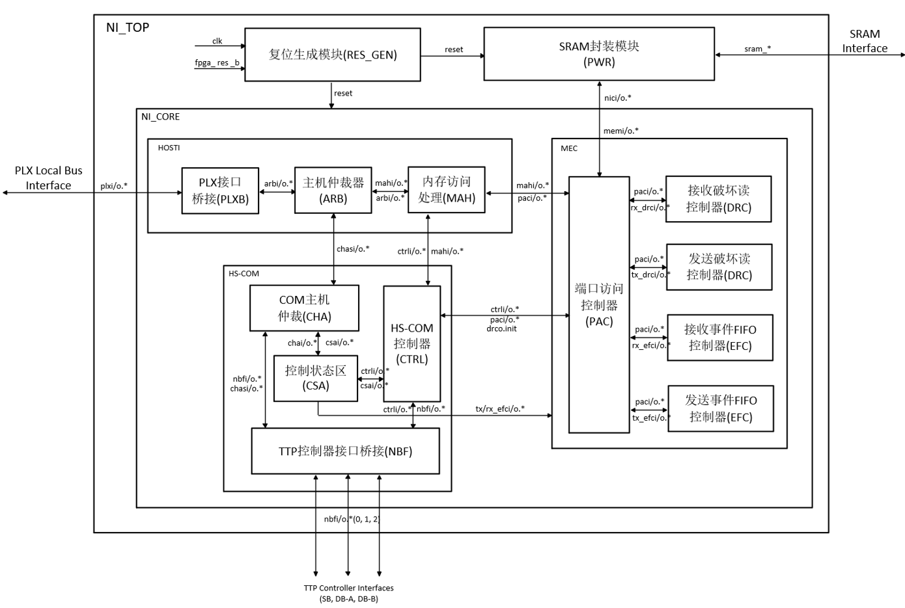
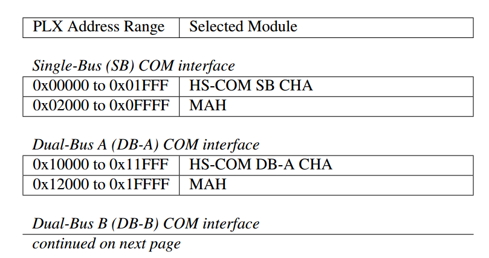
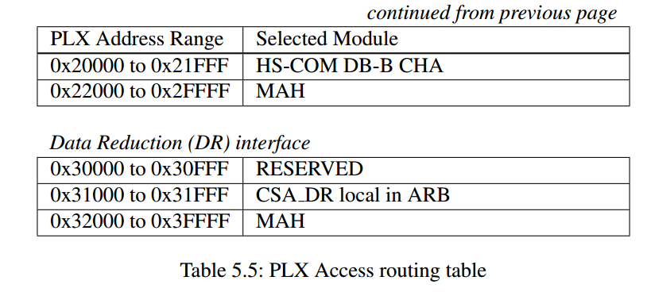

Host access arbitration
Based on the over-all address mapping, the arbiter has to route an access received from the PLX Interface Bridge (PLXB) module as listed in Table 5.5. All signals received from PLXB (plxi) are transparently routed to all outputs (maho, chaso) except the chip select (cs). This enable is asserted separately for each HS- COM separately based on Table 5.5 for the HS-COM ports, or according the bullet list below for the Data Reduction Control/Status Area handling. The plxbo.rd data and plxbo.ready signals are directly sourced from the addressed module inputs (mahi, chasi) WHN-1021.

Figure 5.3 shows the interface timing for read and write access to the Control/Status Area located in the HS-COM.
Figure 5.4 shows the interface timing for read and write access to the TTP Controller Interface. For MAH interface timing please refer to timing diagrams shown in Section 5.3.3.

主机访问仲裁（Host access arbitration）

根据整体地址映射规则，仲裁器（ARB）需将从 PLX 接口桥（PLXB）模块接收到的访问请求，按表 5.5 所示的规则进行路由分发。

除片选信号（`cs`）外，所有来自 PLXB 的输入信号（`plxi_*`系列）都会被透明地路由转发到所有输出端口（`MAHO`、`CHASO`）。而片选使能信号则需根据表 5.5 中 HS-COM 端口的规则，单独为每个 HS-COM 模块断言；若访问的是数据缩减控制 / 状态区域，则需按照下方要点列表的规则处理。

PLXB 模块的读数据输出（`plxbo_rd_data`）和就绪应答信号（`plxbo_ready`），直接来源于被寻址模块的输入信号（`MAHI`、`CHASI`）。

图 5.3 展示了对 HS-COM 中控制 / 状态区域进行读写访问的接口时序；图 5.4 展示了对 TTP 控制器接口进行读写访问的接口时序；MAH 接口的时序请参考第 5.3.3 节的时序图。

