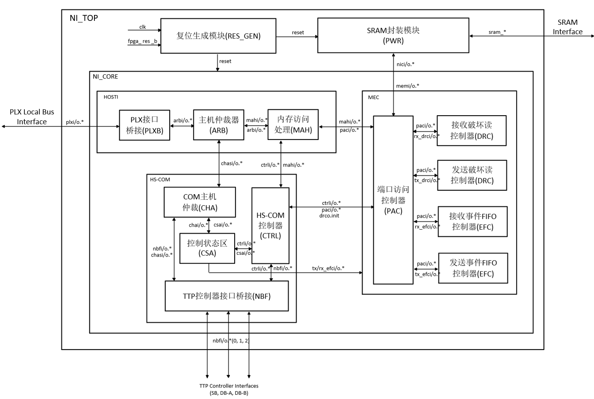
Host access arbitration
Based on the over-all address mapping, the arbiter has to route an access received from the PLX Interface Bridge (PLXB) module as listed in Table 5.5. All signals received from PLXB (plxi) are transparently routed to all outputs (maho, chaso) except the chip select (cs). This enable is asserted separately for each HS- COM separately based on Table 5.5 for the HS-COM ports, or according the bullet list below for the Data Reduction Control/Status Area handling. The plxbo.rd data and plxbo.ready signals are directly sourced from the addressed module inputs (mahi, chasi) WHN-1021.

Figure 5.3 shows the interface timing for read and write access to the Control/Status Area located in the HS-COM.
Figure 5.4 shows the interface timing for read and write access to the TTP Controller Interface. For MAH interface timing please refer to timing diagrams shown in Section 5.3.3.

主机访问仲裁（Host access arbitration）

根据整体地址映射规则，仲裁器（ARB）需将从 PLX 接口桥（PLXB）模块接收到的访问请求，按表 5.5 所示的规则进行路由分发。

除片选信号（`cs`）外，所有来自 PLXB 的输入信号（`plxi_*`系列）都会被透明地路由转发到所有输出端口（`MAHO`、`CHASO`）。而片选使能信号则需根据表 5.5 中 HS-COM 端口的规则，单独为每个 HS-COM 模块断言；若访问的是数据缩减控制 / 状态区域，则需按照下方要点列表的规则处理。

PLXB 模块的读数据输出（`plxbo_rd_data`）和就绪应答信号（`plxbo_ready`），直接来源于被寻址模块的输入信号（`MAHI`、`CHASI`）。

图 5.3 展示了对 HS-COM 中控制 / 状态区域进行读写访问的接口时序；图 5.4 展示了对 TTP 控制器接口进行读写访问的接口时序；MAH 接口的时序请参考第 5.3.3 节的时序图。
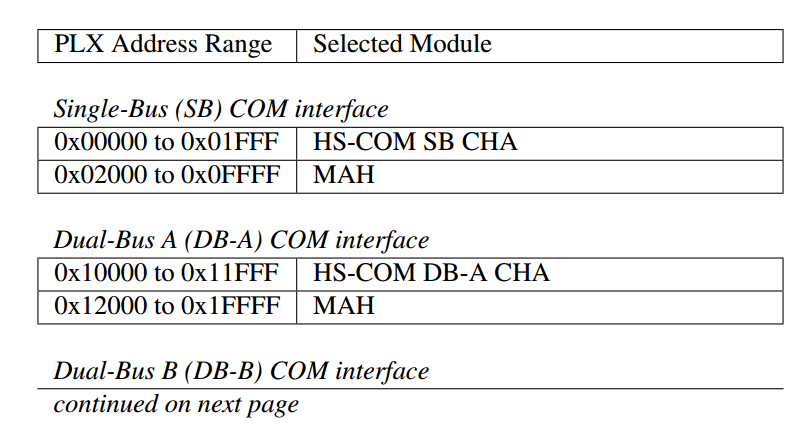
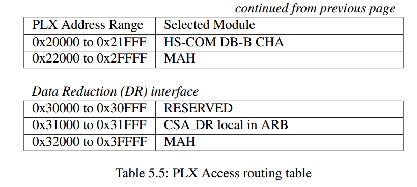
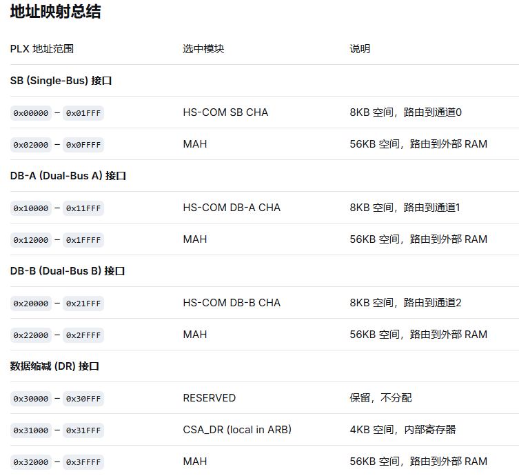
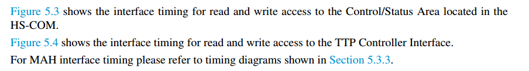
对于 **ARB 模块** 的设计，这些信息意味着：
- ARB **不需要自己产生任何时序**，只负责把 PLXB 来的信号（`wr_rdb`, `addr`, `wr_data`）同时广播出去，然后根据地址选通某个下游模块的 `cs`。
- 下游模块（HS-COM 中的 CSA、TTP 控制器、MAH）**必须按照各自的时序图**来响应 ARB 的请求（即当它们的 `cs` 和 `wr_rdb` 有效时，必须在合理的时钟周期内输出 `ready` 和 `rd_data`）。
- ARB 只是把这些 `ready` 和 `rd_data` 直接传回给 PLXB（`plxbo_ready`、`plxbo_rd_data`）。所以 ARB 本身是一个**纯粹的组合逻辑路由**（除了内部 CSA_DR 需要寄存器）。
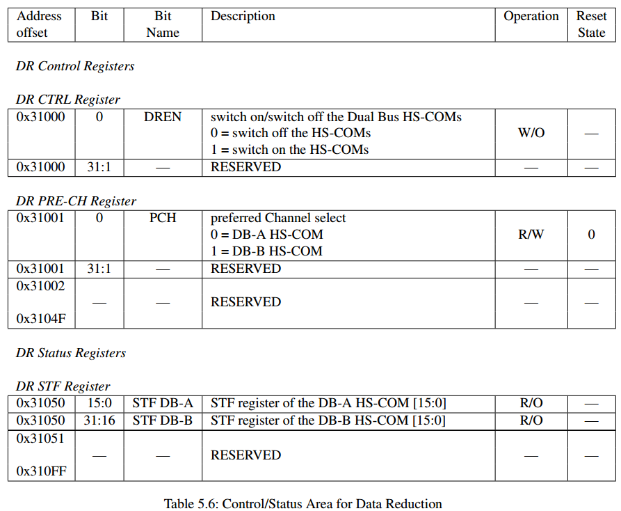
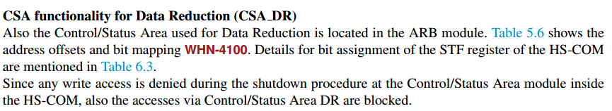
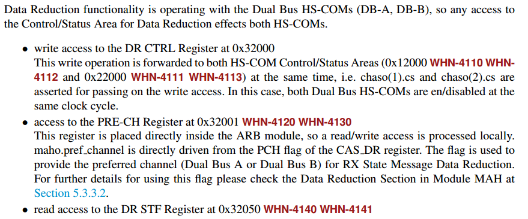
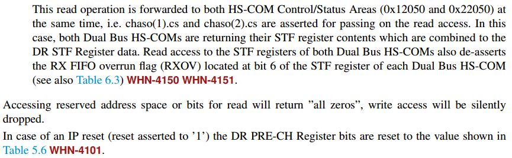
## 数据缩减的 CSA 功能（CSA_DR）

用于数据缩减的控制/状态区也位于 ARB 模块内部。**表 5.6** 给出了地址偏移和位映射 **WHN-4100**。HS-COM 的 STF 寄存器的位分配详情请参见**表 6.3**。

由于在 HS-COM 内部的控制/状态区模块执行关机流程时会拒绝任何写访问，因此通过 CSA_DR 进行的访问也同样会被阻止。

数据缩减功能是配合双总线 HS-COM（DB-A、DB-B）工作的，因此对数据缩减控制/状态区的任何访问都会同时影响两个 HS-COM。

- **对 0x32000 地址的 DR CTRL 寄存器的写访问**  
    该写操作会被同时转发到两个 HS-COM 的控制/状态区（地址 0x12000 **WHN-4110 WHN-4112** 和 0x22000 **WHN-4111 WHN-4113**），即在同一时钟周期内同时断言 `chaso(1).cs` 和 `chaso(2).cs`。这样，两个双总线 HS-COM 会在同一时钟周期被使能。
    
- **对 0x32001 地址的 PRE-CH 寄存器的访问** **WHN-4120 WHN-4130**  
    该寄存器直接位于 ARB 模块内部，因此读写访问在本地完成。`maho.pref.channel` 直接由 CSA_DR 寄存器的 PCH 标志驱动。该标志用于为接收状态消息数据缩减提供首选通道（双总线 A 或双总线 B）。关于该标志的更多使用细节，请参考 MAH 模块中的数据缩减部分，即**第 5.3.3.2 节**。
    
- **对 0x32050 地址的 DR STF 寄存器的读访问** **WHN-4140 WHN-4141**  
    该读操作被同时转发到两个 HS-COM 的控制/状态区（地址 0x12050 和 0x22050），即同时断言 `chaso(1).cs` 和 `chaso(2).cs`。在这种情况下，两个双总线 HS-COM 会返回它们各自的 STF 寄存器内容，这些内容被合并成 DR STF 寄存器的数据。对两个双总线 HS-COM 的 STF 寄存器的读访问还会清除每个双总线 HS-COM 的 STF 寄存器中位于第 6 位的 RX FIFO 溢出标志（RXOV）（另见**表 6.3**）**WHN-4150 WHN-4151**。
    

访问保留的地址空间或保留位时，读操作将返回“全零”，写操作将被静默丢弃。

在 IP 复位（reset 被置为高电平）的情况下，DR PRE-CH 寄存器的位将被复位为**表 5.6** **WHN-4101** 中所示的值。

 

## ARB仿真
修改PLXB代码，去除内部寄存数据和握手回应后仿真
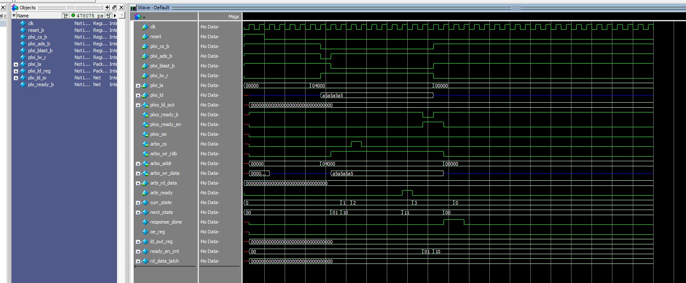
可以看到，ARB可以根据地址04000来将cs分配给mah
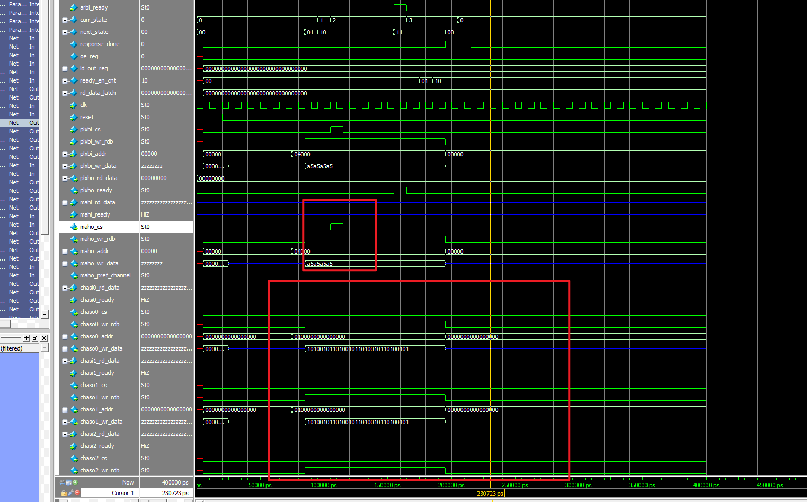
修改地址为HCSOM_SB，
修改地址为01000，
ARB成功将CS分配给了HCSOM_SB
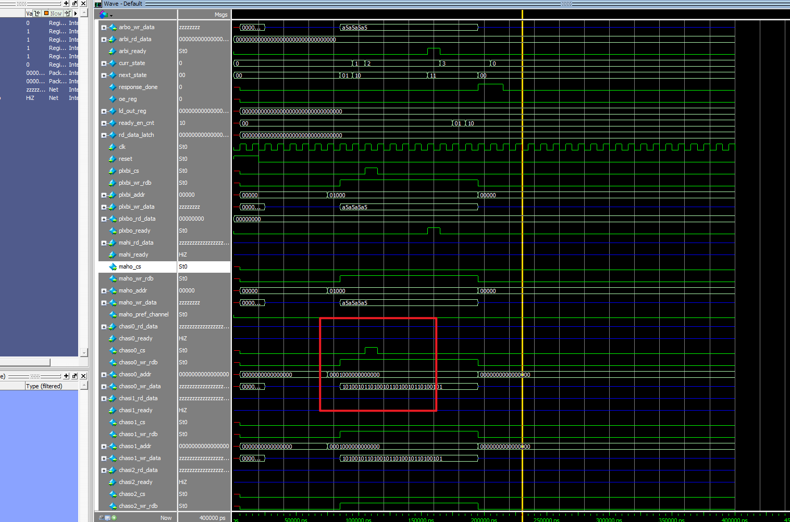
ARB模块仿真完成

