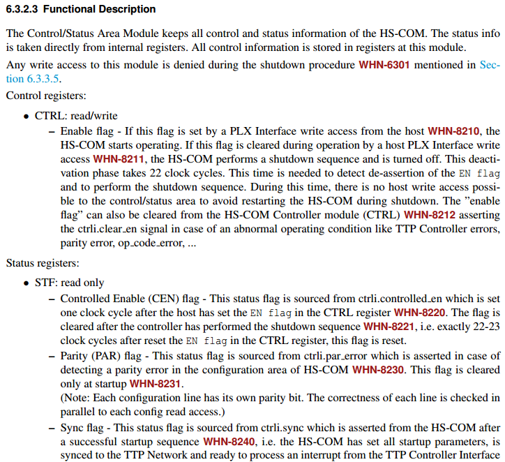
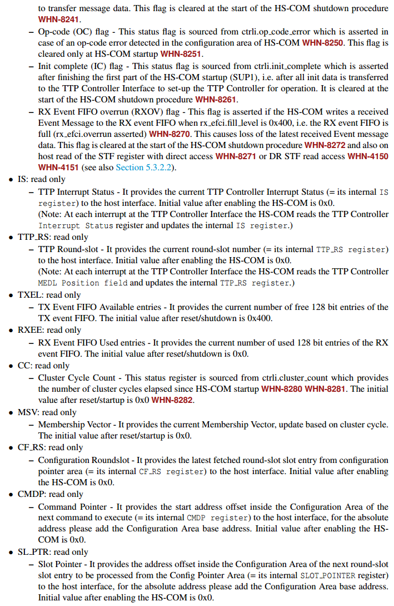
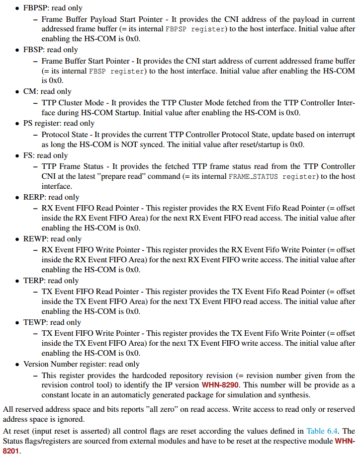

## 1. 控制寄存器（Control Registers）

|偏移|位|名称|作用|
|---|---|---|---|
|`0x000`|0|`EN`|**使能该 HS‑COM**。   写 `1` → 开启；写 `0` → 关闭。复位后为 `0`。|

- **用途**：上位机必须先向该位写 `1`，HS‑COM 才能开始工作（例如与 TTP 总线通信）。写 `0` 可以软复位或停止该通道。
    

---

## 2. 状态寄存器（Status Registers）

### `STF` 寄存器（`0x050`）– 综合状态

|位|名称|含义|
|---|---|---|
|0|`CEN`|**操作状态**：1 表示 HS‑COM 正在运行。|
|1|`PAR`|**配置奇偶校验错误**：1 表示之前写入配置区的数据奇偶校验失败。|
|2|`SYNC`|**同步状态**：1 表示该 HS‑COM 已与 TTP 集群同步（能正常收发消息）。|
|3|`OC`|**操作码错误**：1 表示 TTP 控制器收到了非法操作码。|
|4|`IC`|**TTP 控制器初始化完成**：1 表示初始化完毕。|
|6|`RXOV`|**RX FIFO 溢出**：1 表示接收 FIFO 已经溢出，数据丢失。|

- **用途**：上位机通过轮询或中断读取这些位，可以判断 HS‑COM 是否就绪、同步、有无错误。
    

### `IS` 寄存器（`0x051`）– TTP 中断状态

- 低 16 位对应 TTP 控制器的各种中断源（例如消息到达、时隙事件、错误等）。具体位意义需参考 TTP 控制器手册。
    

### `TTP_RS` 寄存器（`0x052`）– 当前轮次时隙

- 只读，给出当前 TTP 通信周期中的 **轮次‑时隙**（round‑slot）编号，可用于调试或时间同步。
    

### `TXEL` 寄存器（`0x053`）– TX 事件 FIFO 可用条目

- 只读，表示发送事件 FIFO 中还有多少空闲位置。上位机在准备发送新事件前可以检查该值，避免溢出。
    

### `RXEE` 寄存器（`0x054`）– RX 事件 FIFO 已用条目

- 只读，表示接收事件 FIFO 中已有多少条未读事件。上位机可以据此决定是否读 FIFO。
    

### `CC` 寄存器（`0x055`）– 集群周期计数

- 只读，当前 TTP 集群的周期计数器，每个周期加 1。可用于时间同步或记录。
    

### `MSV` 寄存器（`0x056`）– 成员向量

- 只读，当前 TTP 集群中哪些节点在线。每一位代表一个节点 ID。
    

---

## 3. 诊断寄存器（Diagnosis Registers，偏移 `0x0F0` – `0x0FF`）

这些寄存器大多只读，用于底层调试和监控 TTP 控制器的内部状态。

|偏移|名称|内容|
|---|---|---|
|`0x0F0`|`CF_RS`|**配置的轮次‑时隙**（只读）|
|`0x0F1`|`CMDP`|命令指针|
|`0x0F2`|`SL_PTR`|时隙指针|
|`0x0F3`|`FBPSP`|帧缓冲负载起始指针|
|`0x0F4`|`FBSP`|帧缓冲起始指针|
|`0x0F5`|`CM`|TTP 控制器集群模式|
|`0x0F6`|`PS`|TTP 控制器协议状态|
|`0x0F7`|`FS`|TTP 帧状态|
|`0x0F8`|`RERP`|RX 事件 FIFO 读指针|
|`0x0F9`|`REWP`|RX 事件 FIFO 写指针|
|`0x0FA`|`TERP`|TX 事件 FIFO 读指针|
|`0x0FB`|`TEWP`|TX 事件 FIFO 写指针|

- 这些通常只在开发调试或故障排查时读取，正常运行时上位机可能不会访问它们。
    

---

## 4. 版本号寄存器（`0xFF0`）

- 只读，返回该 HS-COM 模块的硬件版本号。
    

---

## 上位机通常如何配置？

典型的上电配置流程：

1. **使能 HS‑COM**：向 `CTRL` 寄存器的 `EN` 位写 `1`。
    
2. **等待初始化完成**：轮询 `STF` 寄存器的 `IC` 位（TTP 控制器初始化完成）或 `CEN` 位。
    
3. **检查同步**：读取 `SYNC` 位，等待 HS‑COM 与 TTP 集群同步。
    
4. **根据应用需要配置 TTP 控制器**：通过 **TTP 控制器接口**（地址 `0x0000` – `0x0FFF` 范围）设置消息 ID、时隙表、节点参数等。这部分配置由 TTP 控制器自己的寄存器完成，不在上述 CSA 表中。
    
5. **事件 FIFO 管理**：发送消息前查看 `TXEL`，接收消息后读取 `RXEE`，并通过专门的 **事件 FIFO 访问区**（偏移 `0xC000` – `0xCFFF` 写，`0xD000` – `0xDFFF` 读）读写事件数据。
    
6. **监控状态**：定期读取 `STF`、`CC`、`RXOV` 等，检测错误或同步丢失。

### 6.3.2.3 功能描述

控制/状态区（CSA）模块保存了 HS-COM 的所有控制和状态信息。状态信息直接取自内部寄存器。所有控制信息都存储在该模块的寄存器中。

在关机流程（见 6.3.5 节）期间，对该模块的任何写访问都会被拒绝 **WHN-6301**。

#### 控制寄存器：

- **CTRL**：读/写
    
    - **使能标志（Enable flag）**：当该标志被主机的 PLX 接口写访问置位时 **WHN-8210**，HS-COM 开始工作。如果在运行期间被主机 PLX 接口写访问清除 **WHN-8211**，HS-COM 将执行关机序列并关闭。这个去激活阶段需要 22 个时钟周期。这段时间用于检测 `EN` 标志的清除并执行关机序列。在此期间，无法对控制/状态区进行主机写访问，以避免在关机期间重启 HS-COM。该“使能标志”也可以由 HS-COM 控制器模块（CTRL）清除 **WHN-8212**（通过断言 `ctrl.clear_en` 信号），例如在出现 TTP 控制器错误、奇偶校验错误、操作码错误等异常工作条件下。
        

#### 状态寄存器：

- **STF**：只读
    
    - **受控使能（CEN）标志**：该状态标志来源于 `ctrl.controlled_en`，它在主机设置 `CTRL` 寄存器中的 `EN` 标志一个时钟周期后被置位 **WHN-8220**。在控制器执行完关机序列后该标志被清除 **WHN-8221**，即在复位 `CTRL` 寄存器中的 `EN` 标志后恰好 22-23 个时钟周期，该标志复位。
        
    - **奇偶校验（PAR）标志**：该状态标志来源于 `ctrl.par_error`，当在 HS-COM 的配置区检测到奇偶校验错误时被置位 **WHN-8230**。该标志仅在启动时被清除 **WHN-8231**。  
        （注：每个配置行都有自己的奇偶校验位。每次配置读访问时并行检查每行的正确性。）
        
    - **同步（Sync）标志**：该状态标志来源于 `ctrl.sync`，在 HS-COM 成功启动序列后被置位 **WHN-8240**，即 HS-COM 已设置所有启动参数、与 TTP 网络同步，并准备好处理来自 TTP 控制器接口的中断。
        
    - **操作码错误（OC）标志**：...（来自 `ctrl.op_code_error`）
        
    - **TTP 控制器初始化完成（IC）标志**：...（来自 `ctrl.init_complete`）
        
    - **RX FIFO 溢出（RXOV）标志**：...（来自 `rx_efci.overrun`）
        
- **IS**：只读，TTP 中断状态（来自 `ctrl.int_reg`）
    
- **TTP_RS**：只读，当前轮次‑时隙（来自 `ctrl.around_slot`）
    
- **TXEL**：只读，TX 事件 FIFO 可用条目（来自 `tx_efci.avail_entry`）
    
- **RXEE**：只读，RX 事件 FIFO 已用条目（来自 `rx_efci.fill_level`）
    
- **CC**：只读，集群周期计数（来自 `ctrl.cluster_count`）
    
- **MSV**：只读，成员向量（来自 `ctrl.membership`）
    
- **诊断寄存器**（所有只读，来自 CTRL 内部）：
    
    - **CF_RS**：配置的轮次‑时隙（来自 `ctrl.conf_round_slot`）
        
    - **CMDP**：命令指针（来自 `ctrl.cmdp`）
        
    - **SL_PTR**：时隙指针（来自 `ctrl.slot_pointer`）
        
    - **FBPSP**：帧缓冲负载起始指针（来自 `ctrl.fbpsp`）
        
    - **FBSP**：帧缓冲起始指针（来自 `ctrl.fbsp`）
        
    - **CM**：TTP 集群模式（来自 `ctrl.cluster_mode`）
        
    - **PS**：协议状态（来自 `ctrl.protocol_state`）
        
    - **FS**：TTP 帧状态（来自 `ctrl.frame_status`）
        
    - **RERP**：RX 事件 FIFO 读指针（来自 `rx_efci.rp_reg`）
        
    - **REWP**：RX 事件 FIFO 写指针（来自 `rx_efci.wp_reg`）
        
    - **TERP**：TX 事件 FIFO 读指针（来自 `tx_efci.rp_reg`）
        
    - **TEWP**：TX 事件 FIFO 写指针（来自 `tx_efci.wp_reg`）
        
- **版本号寄存器**：只读，提供硬编码的版本号，用于识别 IP 版本 **WHN-8290**。该数字由版本控制工具生成，作为常数放在自动生成的包中，用于仿真和综合。
    

所有保留的地址空间和位在读访问时返回“全零”。对只读或保留地址空间的写访问被忽略。

在复位（输入 `reset` 被置位）时，所有控制标志根据表 6.4 定义的值复位。状态标志/寄存器来源于外部模块，需要在各自的模块中复位 **WHN-8201**。

---

## 解释

### 1. CSA 模块的定位

CSA 是 HS-COM 内部的“寄存器文件”，集中保存：

- **控制信息**：如 `EN` 位，用于启动/停止 HS-COM。
    
- **状态信息**：如同步状态、错误标志、FIFO 填充水平、TTP 控制器内部指针等。
    

上位机通过 PLX → ARB → CHA → CSA 路径读写这些寄存器，从而监控和控制 HS-COM。

### 2. 关机保护

当 HS-COM 正在执行关机序列（shutdown procedure）时，CSA 会**拒绝所有写访问**（`chai.cs` 有效但写操作被忽略）。这是为了防止在关机过程中意外重启或破坏状态。关机序列持续 22 个时钟周期，由 CTRL 模块控制。

### 3. 使能标志（`EN`）与受控使能（`CEN`）的区别

- **`EN`**（CTRL 寄存器 bit 0）：主机可读可写。
    
    - 写 `1` → 启动 HS-COM；写 `0` → 启动关机序列。
        
    - 也可被 CTRL 模块通过 `ctrl.clear_en` 强制清除（例如发生严重错误）。
        
- **`CEN`**（STF 寄存器 bit 0）：只读，由 CTRL 模块驱动。
    
    - 当 `EN` 被主机置位后，再过 1 个时钟周期，`CEN` 变为 `1`，表示 HS-COM 真正开始工作。
        
    - 当关机序列完成后，`CEN` 自动清 `0`。
        
    - 软件通常读取 `CEN` 来判断 HS-COM 是否真正处于运行状态。
        

### 4. 错误标志

- **`PAR`**：配置区奇偶校验错误。一旦出现，会一直保持，直到下次 HS-COM 启动时才会清除。主机可以读取该位判断配置是否正确。
    
- **`OC`**：操作码错误。来自 TTP 控制器，表示命令执行错误。
    
- **`RXOV`**：RX 事件 FIFO 溢出。主机应定期读取事件，避免溢出。
    

### 5. 只读诊断寄存器

这些寄存器直接映射自 CTRL 和 EFC 模块的内部信号，通常只在调试或监控时使用。例如：

- `FBPSP` / `FBSP`：用于指示当前帧缓冲的地址范围，帮助主机定位消息数据在 TTP 控制器 CNI 中的位置。
    
- `RERP` / `REWP`：允许主机查询 RX 事件 FIFO 的读写指针，用于同步或调试。
    
- `Version Number`：固定值，用于软件识别 FPGA 版本。
    

### 6. 保留空间处理

所有未使用的地址或未使用的位：

- **读**：返回 0
    
- **写**：无效果（被忽略）
    

这简化了硬件实现，并保证软件访问不会出错。

### 7. 复位行为

- **控制寄存器**（如 `CTRL` 中的 `EN`）在 `reset` 有效时被清零（表 6.4 中的复位值）。
    
- **状态寄存器**（如 `STF` 中的 `CEN`, `PAR` 等）不在 CSA 内部复位，而是由源模块（CTRL, EFC）在各自范围内复位。CSA 只是将这些信号直接引出或寄存。

## 总结

CSA 模块是一个**被动寄存器集合**，它：

- 接收主机的读写请求（`chai_*` 信号），访问内部寄存器。
    
- 汇集来自 CTRL 和 EFC 的状态信号，供主机读取。
    
- 输出 `ctrl.com_enable` 来控制 HS-COM 的启停。
    
- 在关机期间禁止写操作。
    

实现 CSA 时，只需要一个地址译码器、一组寄存器（用于 `CTRL` 等可写寄存器），以及一组只读信号的多路选择器即可。所有寄存器的读写都可以在一个时钟周期内完成（零等待），因此 `chao.ready` 可以固定为 `1`（组合输出）或寄存一拍。

