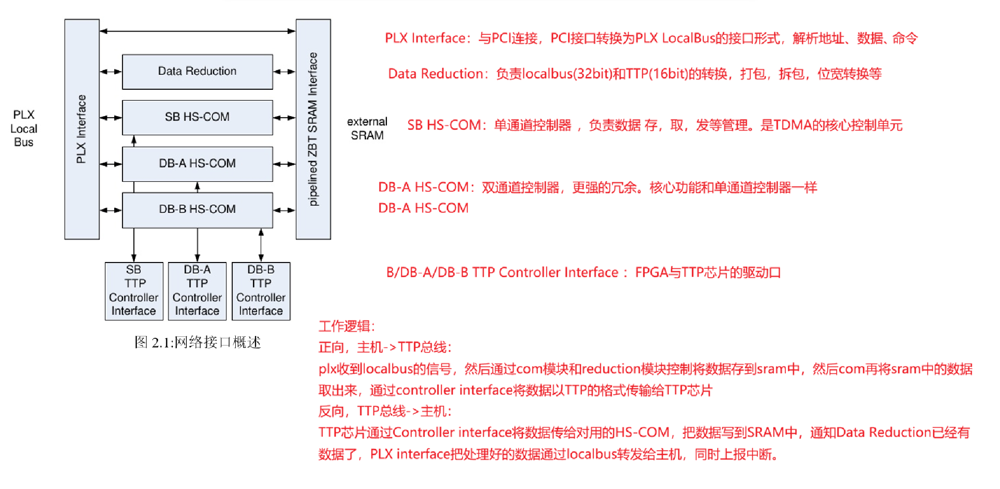
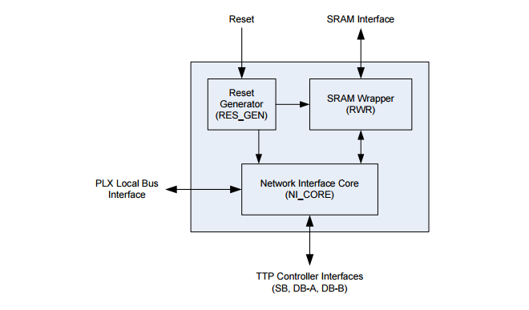
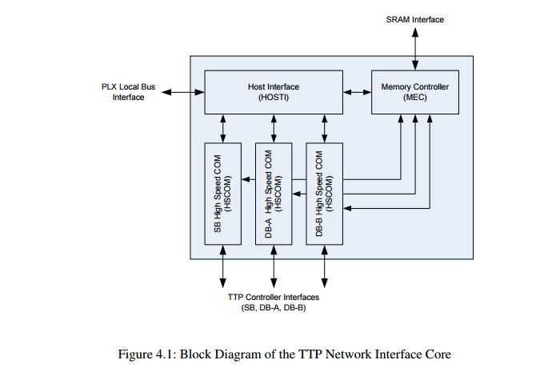
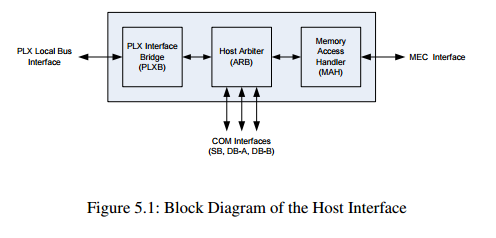
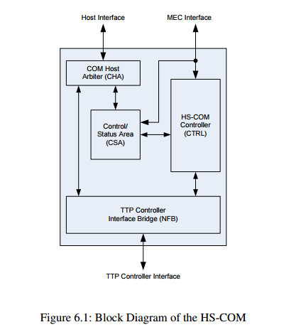
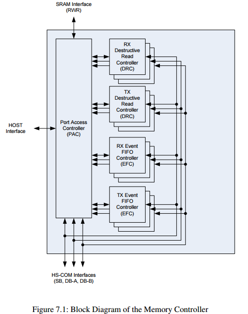
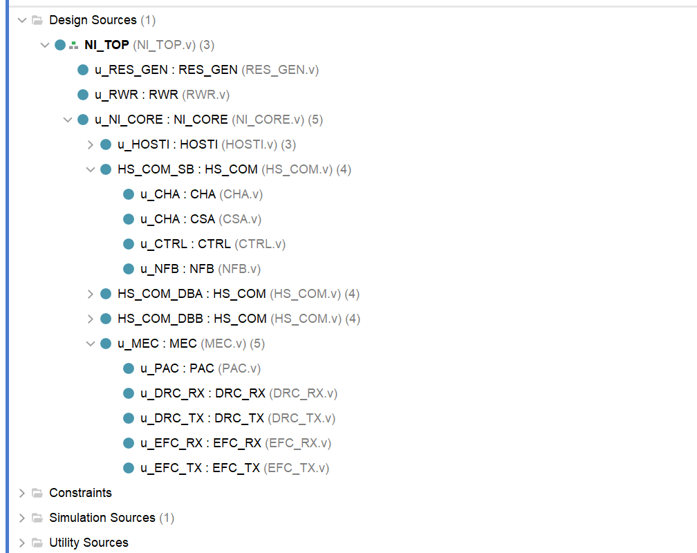

# 一、概述：网络接口的工作逻辑

# 二、顶层模块 总览

顶层下的一级子模块
	RES_GEN：复位生成
	SRAM Wrapper ：外部Sram的驱动层
	NI_CORE ：网络接口核心业务功能

# 三、NI_CORE（TTP 网络接口核心）

其中：
	Host Interface：与PCI通信的接口，主机接口
	MEC：统一管理外部SRAM的控制器，内存控制器
	三个HS-COM：高速通信控制器，对接TTP芯片，实现时序的调度

# 四、HOSTI主机接口的框架

三个二级子模块
	PLXB：与PCI连接，解析PCI的localbus信号，把复杂的PCI本地总线时序转换成FPGA内部的地址、数据、控制信号。处理localbus握手、读写时序等，
	ARB：主机仲裁器，命令分发：状态汇总、访问仲裁。将PLXB传来的请求，分别转发给对应的模块（例如对HSCOM的控制命令、读写SRAM等）。状态汇总，将，COM三个通道的状态，中断信号，通过PLXB转发给主机。同时处理多通道同时发中断的优先级仲裁，避免冲突。
	MAH：内存访问处理器，连接MEC与HOST

# 五、HS-COM高速通信控制器

连接TTP的核心调度器。
	CHA：通道主机仲裁器，HOST连通HSCOM的入口，负责接收host的命令，比如读TTP芯片状态or写数据发送缓存等命令。同时处理CSA控制状态区发来的反馈信号。
	CSA：控制状态区。核心寄存器，状态机。存储了TTP芯片的配置信息，运行状态，错误标志等。主要控制器，控制TTP芯片，将TTP芯片状态返回给CHA→主机
	HS-COM Controller（CTRL），hs com控制器。时序调度模块，根据CSA的逻辑生成复杂的读写时序，控制TTP芯片的寄存器和数据口。翻译
	NFB：TTP控制器接口桥。与外部TTP芯片之间的物理层接口。只做信号转换，确保信号电平时序正确。物理接口

# 六、MEC内存控制器

解决**主机（HOST）** 和 **高速通信层（HS-COM）** 同时访问内存时的 “打架” 问题。
内部四个模块详解。
	PAC：端口访问控制器，连接HOSTinterface主机接口。总仲裁，主机访问SRAM的唯一入口。同时接收来自四个通道的SRAM请求。负责优先级仲裁 ，管理SRAM的使用。
	DRC：破坏性读控制器。当hscom要把数据发送给TTP芯片时，它从SRAM里把数据读取出来，发送给hscom。当hscom从TTP芯片收到数据时，把数据写入到SRAM。为什么是破坏性读，因为读完就删除。
	EFC：事件FIFO控制器。中断，状态管理。发送事件fifo，主机往SRAM里写数据时，通过EFC同时hscom：SRAM里有数据了。接收事件fifo，hscom从TTP芯片收到数据后存入SRAM，通过EFC通知PAC：SRAM里有数据了。用EFC产生中断和握手信号，确保信号不卡顿阻塞。

# 七、按照整体架构编写工程架构

