## 一、USB概念
Universal Serial Bus，简称 USB。
中文翻译称为通用串行总线，是一种串口总线的标准，也是一种输入输出接口的技术规范

## 二、USB接口外形分辨

主要类型：
Type-A
Type-B
Type-C
Micro
Mini

### （一）Type-A
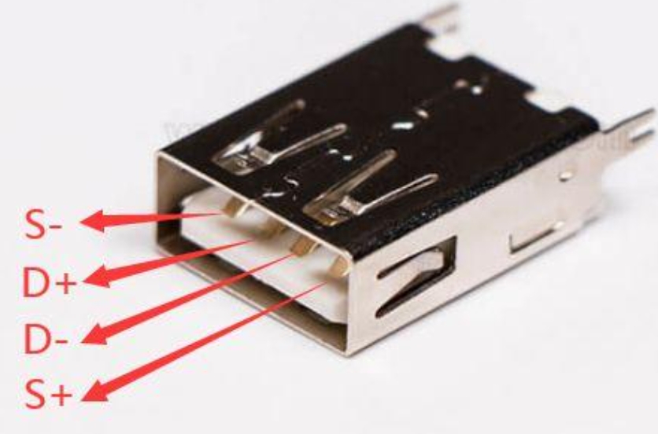
### （二）Type-B
通常在打印机设备使用，另一端使用 USB-A 连接电脑
（一些单片机程序下载接口也采用TypeB）
比如FPGA的下载器的一个端口用的就是Type-B
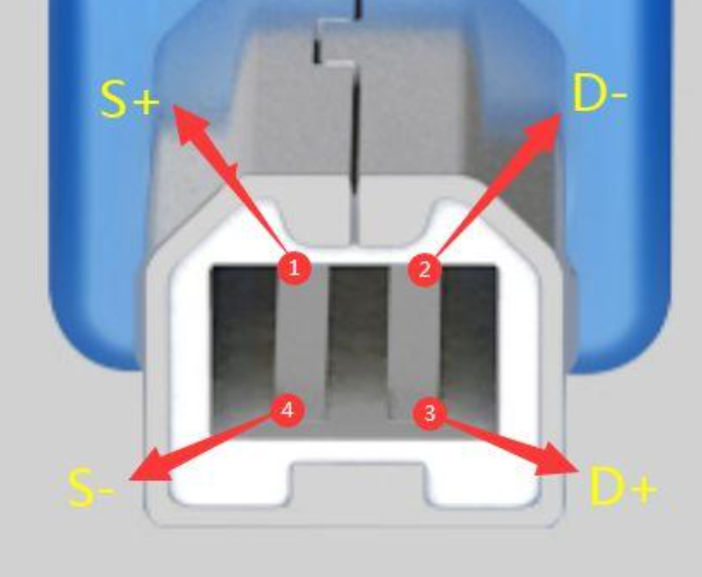
### （三）Type-C
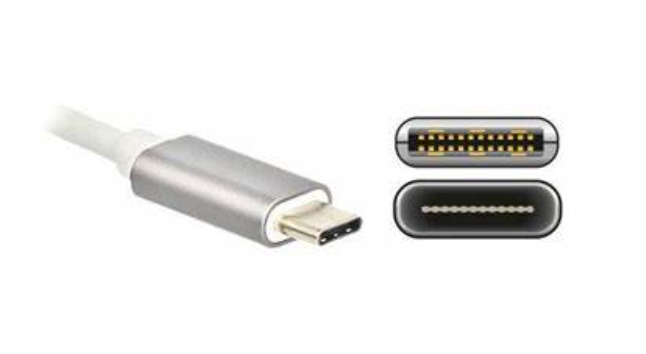
### （四）Micro
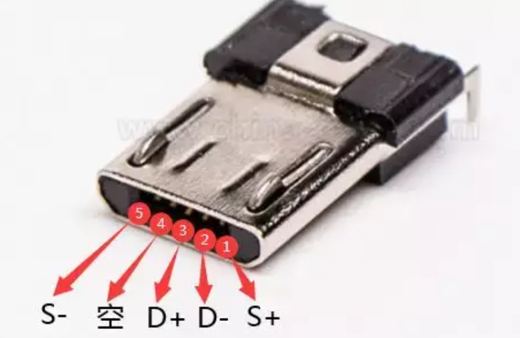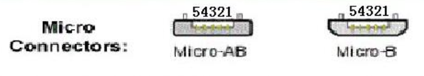
### （五）Mini
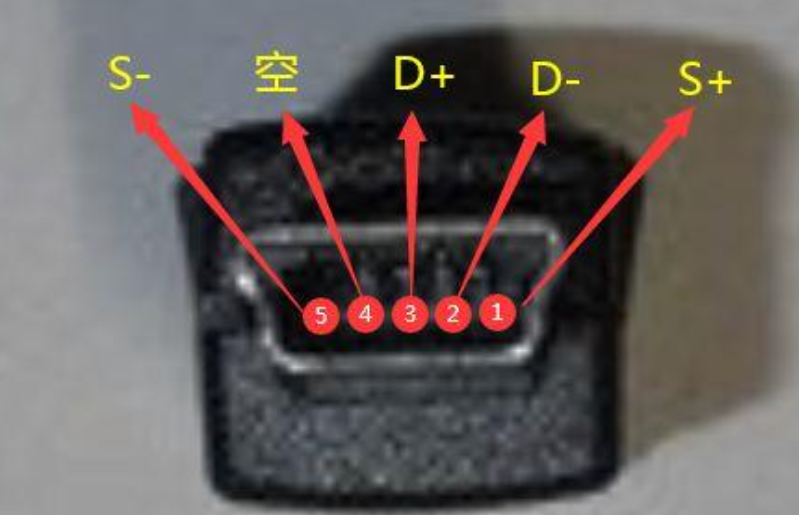
（六）Lighting
苹果的私有接口，绝大多数工程不用
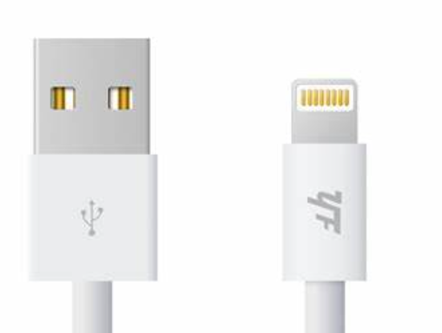

## 三、USB口的引脚定义

### （一）USB2.0
前面的图片展示的均为USB2.0协议下的接口，下面具体介绍每一个引脚的作用
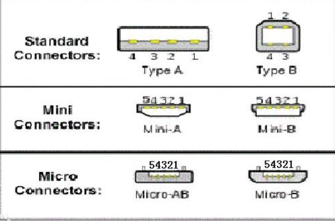
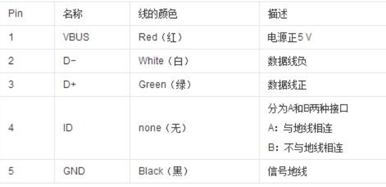

### （二）USB3.0

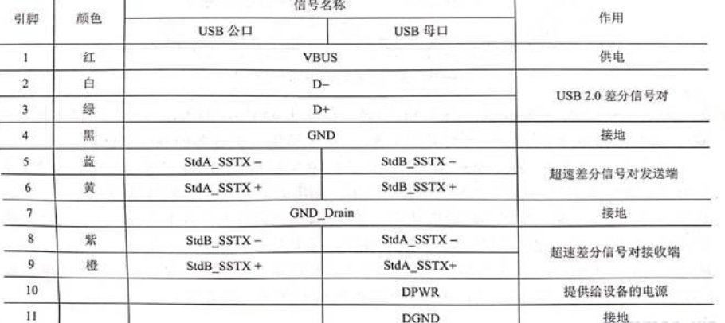

GND-Drain 一般用于屏蔽层连接，它通常需要与地（GND）相连，以保证屏蔽效果，防止电磁干扰
可见USB3.0相比USB2.0多出5条特殊引脚,用于实现全双工超速差分信号传输,USB2.0使用D+和D-实现半双工通信，而USB3.0新增差分信号发射对和差分信号接收对来实现全双工通信，目前许多支持USB3.0协议的接口同时还留有USB2.0定义的数据引脚(D+和D-），用于支持USB2.0通信。
下面以Type-A、Type-B、Type-C为例稍微讲一下引脚分布，其他类型的接口也是同理。
#### 1、type-a
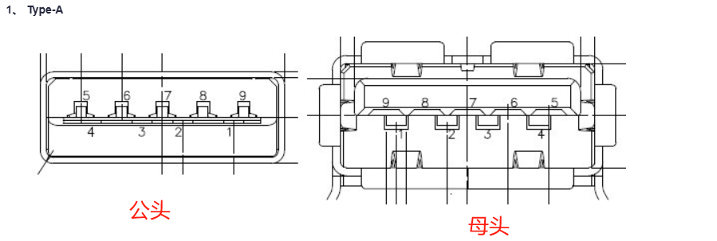
到这里你应该学会了如何区分Type-A的2.0接口和3.0接口，应该去看他的接口内的引脚数量（而不是去看那块塑料的颜色），如果引脚数量为4，那么肯定是2.0；如果可以看到引脚的数量为9，那么它**可能**是3.0接口，为什么是只是可能？因为有些不良商家，虽然用的是支持3.0的接口，但是在接线的时候只连接了2.0的引脚，其他的引脚甚至都没焊上，所以买的时候要小心
#### 2、type-b
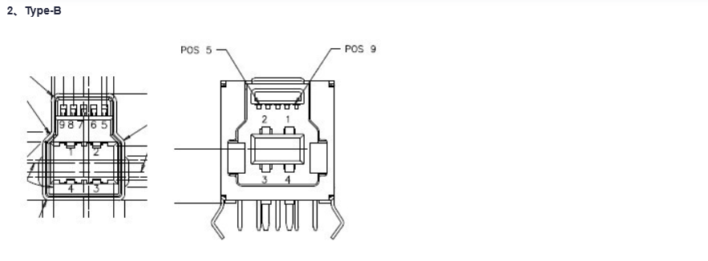
#### 3、type-c-24pin
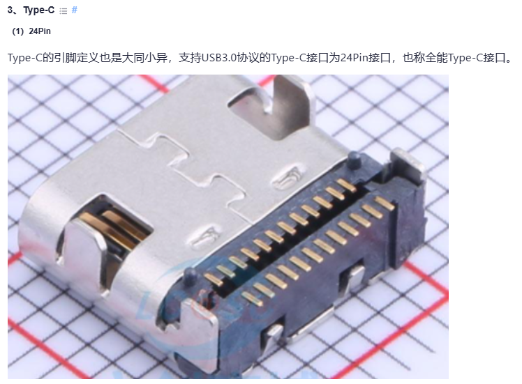
 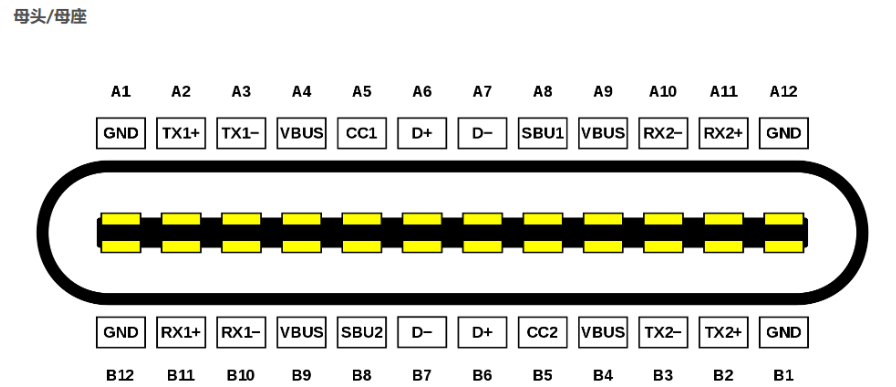
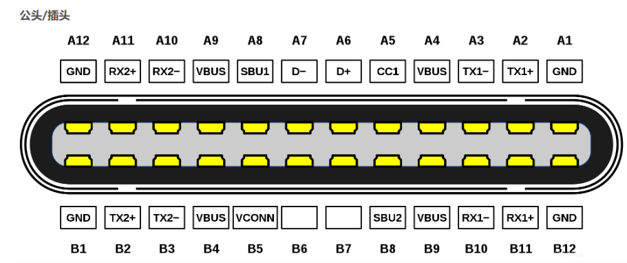
巧妙的引脚设计使得Type-C在接口时无需辨别正反，正插反插都能达到同样的效果。
下面是每个引脚的具体定义:
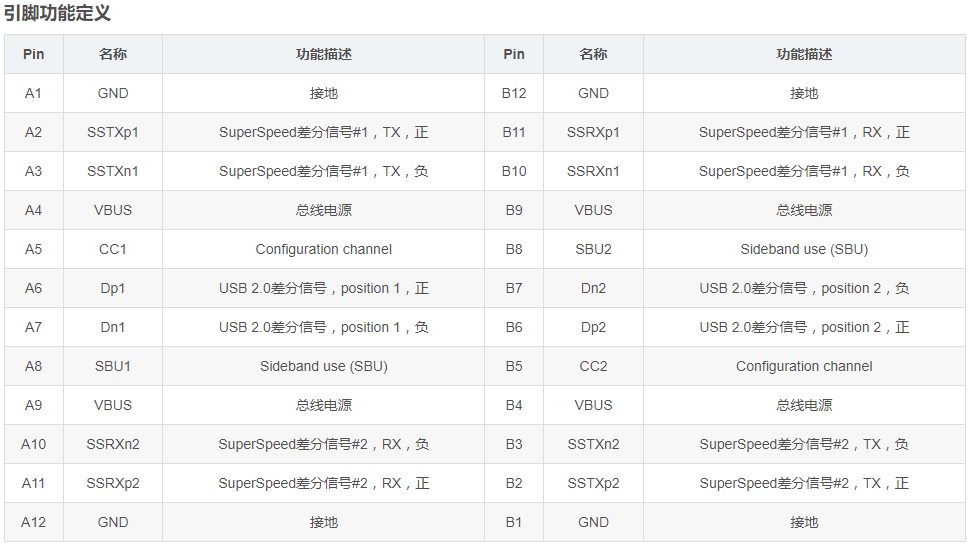
可见24pin接口具备USB3.0协议中的所有针脚，但是同时还多出CC和SBU等引脚，这主要是用于实现新型的PD(PowerDelivery)快充协议，至于这些接口的协议，后面会说

#### 3、type-c-16、12pin
除了24pin的Type-C接口，其实它还有16pin、12pin和6pin的引脚，下面具体来看
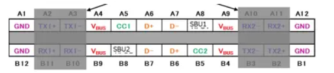
一些普通的设备不支持USB3.0，只有USB2.0，使用24Pin的TypeC很浪费，于是就有了16Pin的TypeC，相比24Pin,就是少了下图中阴影部分遮盖的超高速全双工信号传输通道，除了没有USB3.0高速传输外，其他别无二致，同样支持PD快充（后面协议部分会说）。
 16Pin一般为接口厂家、封装的正式名称，而日常生活中习惯称呼为12Pin。这是因为接口设计时，将TypeC母座两端的两个Vbus和GND出线都并拢了起来，虽然从口那里看是16条出线，但座子后面的焊盘只有12个

#### 4、type-c-6pin
对于玩具、牙刷等生活用品，产品定位上没有USB通信的需求，只需要USB取电充电。那么连USB2.0都可以省掉了。  
6Pin TypeC正式出道。6Pin TypeC仅仅保留Vbus、GND、CC1、CC2。接口两侧对称分布着两组GND、Vbus，使得防反插功能保留，粗线也让其更为方便的传输大电流,CC1、CC2用于PD设备识别，承载PD协议，以向供电端请求电源供给(可见6pin的TypeC尽管没有了USB2.0通信协议，但仍能支持PD协议)
看到这里再会过头想想，对于Type-B、Mirco、Mini接口，如果我们仅仅使用它的供电功能，那D+和D-也没有存在的必要，但通常这些接口都带有这些引脚，对于仅仅需要供电而不需要通信的电路，D+和D-悬空即可。

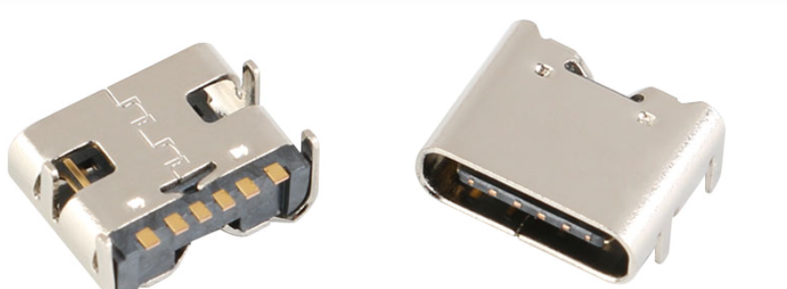
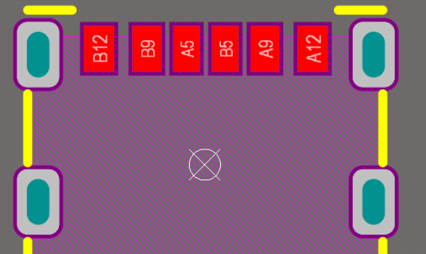
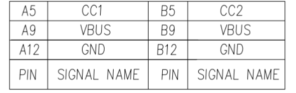

## 四、OTG技术
### （一）概念
OTG即**On-The-Go**的英文缩写，是由USB标准化组织公布的一项用于USB设备连接或数据交换的**技术**。

